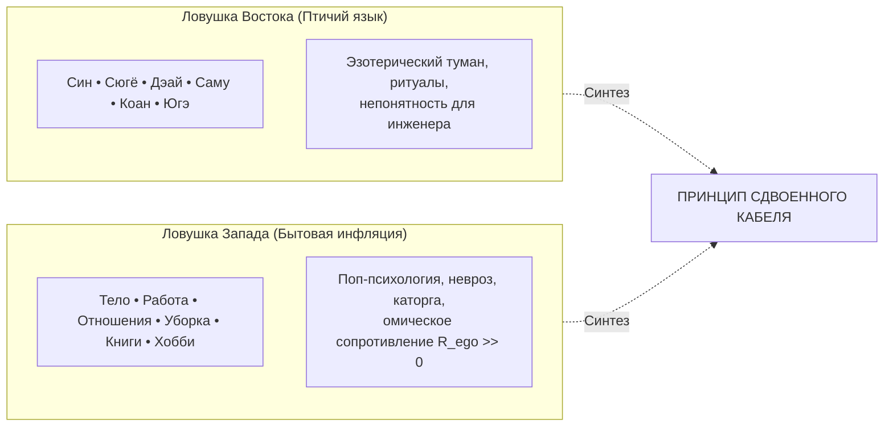
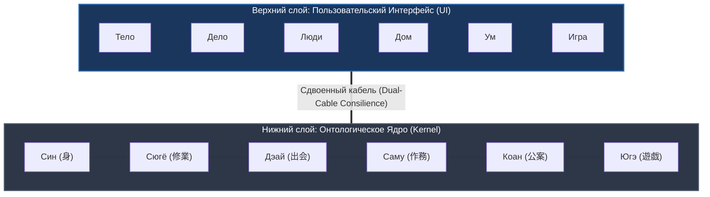

# Inner Current: 145. Архитектура сдвоенного кабеля — Западный функциональный UI vs Дзенское онтологическое ядро (Син, Сюгё, Дэай, Саму, Коан, Югэ)

> «Нельзя выбирать между западной ясностью и восточной глубиной. Если оставить только дзенские термины, система утонет в храмовой экзотике. Если же оставить только бытовые ярлыки, она деградирует в плоский поп-психологический тренинг. Архитектура держится на сдвоенном кабеле: понятный функциональный фасад снаружи и несокрушимый онтологический дзен внутри.»  
> — **Владимир Аньянов**

---

> [!abstract] Квинтэссенция
> Архитектура человеческого контура **Inner Current** решает фундаментальную методологическую дилемму языка через **Принцип сдвоенного кабеля (Dual-Cable Architecture)**:
> 
> 1. **Западный функциональный интерфейс (UI):**
>    - Шесть предельно ёмких, понятных европейскому рациональному уму слов: **Тело • Дело • Люди • Дом • Ум • Игра**.
>    - Обеспечивает мгновенную функциональную навигацию, доступность по *канону Ричарда Фейнмана* и снятие эзотерического барьера.
> 2. **Дзенское онтологическое ядро (Kernel):**
>    - Шесть аутентичных категорий японской традиции прямого действия: **СИН (身) • СЮГЁ (修業) • ДЭАЙ (出会い) • САМУ (作務) • КОАН (公案) • ЮГЭ (遊戯)**.
>    - Предотвращает опошление понятий, гарантируя, что каждая лампа понимается как священная форма присутствия без омического сопротивления эго ($R \to 0$).

---

## 1. Методологическая дилемма: Запад против Востока

При проектировании интерфейса оператора цепи возникает классический концептуальный конфликт:



### 1. Почему нельзя оставить только дзенские термины?
В «Манифесте Дзен-инженера» прямо зафиксировано: древний Восток совершил роковую ошибку, упаковав точную психофизиологию прямого действия в ритуальный птичий язык и монастырскую мистику.
* Для западного разработчика, инженера или предпринимателя термины вроде *Син*, *Сюгё* или *Югэ* звучат как претенциозная чужая экзотика.
* Это прямо нарушает **канон Ричарда Фейнмана**: если ты не можешь объяснить устройство системы десятилетнему ребёнку на простых предметных образах (фонарик, провод, батарейка, лампа), ты плодишь лишние ментальные посредники и сопротивление.

### 2. Почему нельзя полностью стереть дзен?
Если свести систему исключительно к западным бытовым ярлыкам (*Тело, Работа, Отношения, Уборка, Книги, Хобби*), происходит мгновенное обесценивание:
* **«Дело»** обыватель сразу поймет как «пахоту на нелюбимой работе ради отчета перед начальником», включив омический перегрев эго ($R_{\text{ego}} \gg 0$).
* **«Отношения»** превратятся в созависимые манипуляции и ярмарку взаимных претензий.
* **«Уборка»** станет ненавистной бытовой повинностью, вместо практики растворения эго в материи.

**Дзенский корень необходим как онтологический стабилизатор:** он отсекает эго-интерпретации и удерживает каждую категорию нагрузки в режиме чистой сверхпроводимости ($R \to 0$).

---

## 2. Архитектура сдвоенного кабеля: UI vs Kernel

В интерфейсе книг, приборных панелей (HUD) и мобильного приложения используется строгая биекция:

```
[Пользовательский интерфейс: UI]      ──►   Тело  •  Дело  •  Люди  •  Дом  •  Ум  •  Игра
                                                    │     │      │     │     │     │
[Онтологическая глубина: Ядро Kernel] ──►   (Син  • Сюгё  • Дэай • Саму • Коан • Югэ)
```



---

## 3. Детальная экспликация дзенского канона

| № | UI (Запад) | Kernel (Дзен) | Каноническая формула | Глубинный смысл практики |
|---|---|---|---|---|
| **1** | **Тело** | **СИН (身 / Shin)** | *Синдзин дацураку* (身心脱落) | Буквально: «сбрасывание тела и ума» (формула Догэна). Естественное освобождение соматики от зажимов, дыхание животом в Тандэн, заземление стоп, кинестетическая осознанность. |
| **2** | **Дело** | **СЮГЁ (修業 / Shugyō)** | *Гёдзи* (行持) / *Ката* (型) | «Непрерывная упорная дисциплина ремесла». Растворение оператора в изготовлении осязаемого продукта (код, текст, изделие). Труд как форма прямого служения без оглядки на оценку. |
| **3** | **Люди** | **ДЭАЙ (出会い / Deai)** | *Итиго Итиэ* (一期一会) | В будо и дзэн: «момент истинной встречи / непосредственный контакт проводников». Прямой взгляд «глаза в глаза» без ментальной брони, манипуляций и субличностных масок. |
| **4** | **Дом** | **САМУ (作務 / Samu)** | *Кансо* (簡素) | Физический труд заботы по поддержанию чистоты пространства. Мытьё чашки или подметание пола — не рутина перед медитацией, а само медитативное действие прямо сейчас. |
| **5** | **Ум** | **КОАН (公案 / Kōan)** | *Бэндо* (弁道) | «Исследование Пути и парадоксов истины». Преданный поиск фундаментальных законов мироздания, взламывающий стереотипные логические шаблоны до момента озарения. |
| **6** | **Игра** | **ЮГЭ (遊戯 / Yuge)** | *Югэ дзаммай* (遊戯三昧) | «Самадхи святой игры». Действие из чистого избытка энергии, спонтанная радость творчества, музыка, юмор, праздник жизни без утилитарной корысти. |

---

## 4. Практическое применение в продукте и коммуникации

* **Для публичных выступлений, питчей и широкого круга читателей:**  
  Основной диалог ведётся на понятном западном языке функциональных блоков (*Тело, Дело, Люди, Дом, Ум, Игра*). Это снимает когнитивное сопротивление аудитории и обеспечивает мгновенный контакт.
* **В сносках, эпиграфах и продвинутых главах:**  
  Раскрывается дзенское ядро (*Син, Сюгё, Дэай, Саму, Коан, Югэ*) как историческое доказательство того, что древние мастера владели той же физикой присутствия за века до изобретения вольтметра.

Благодаря архитектуре сдвоенного кабеля система остаётся **инженерно строгой, практически понятной и духовно глубокой**.

---

## 🔗 Связи
- [[02_Wiki/Inner Current (The Shield of Six Lamps — Exhaustive Basis of Load and the Kanso Canon)|142. Щит из шести ламп бытия: Исчерпывающий базис нагрузки]]
- [[02_Wiki/Inner Current (Flashlight Circuit Alignment — Action-Gyō Load Triad and Deai Decoupling)|144. Схемотехника фонарика и согласование лада: Триада «Дело — Action — Гё»]]
- [[02_Wiki/Inner Current (East-West Synthesis and Demystification)|14. Великий синтез Запада и Востока]]
- [[04_Maps/Inner Current MOC|Inner Current MOC]]
- [[index|Главный индекс LLM Wiki]]

---
*Created: 2026-09-30 | Maintained by Antigravity*
