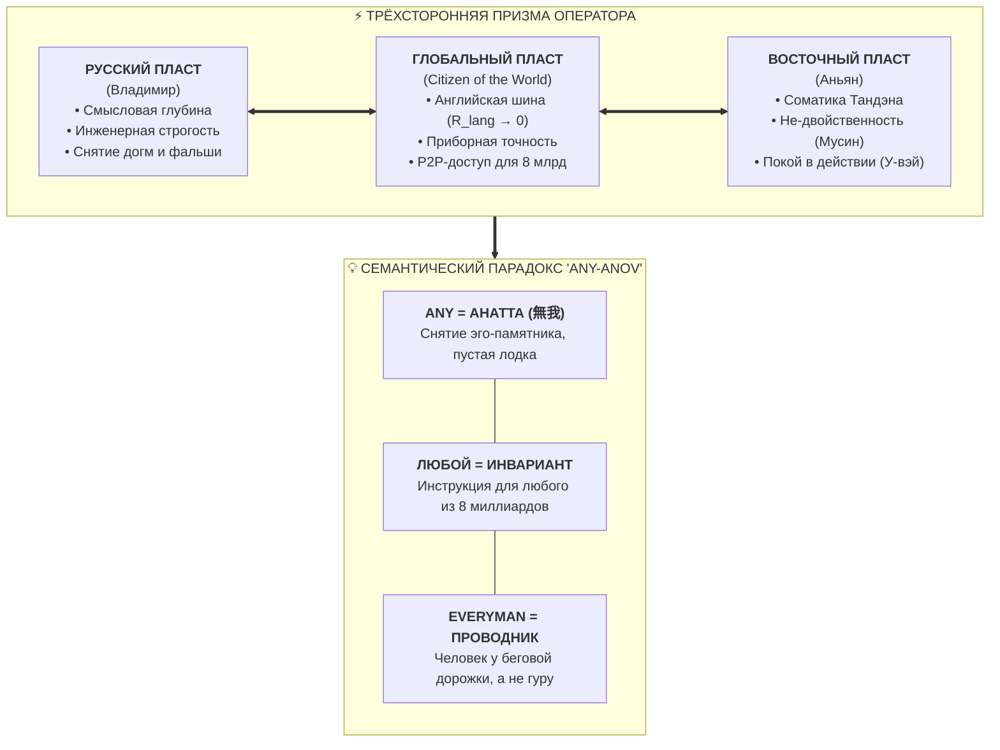
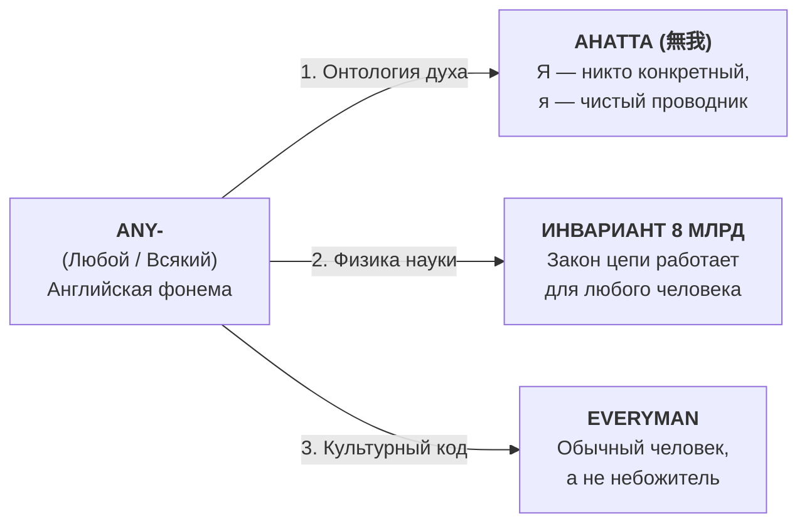

# 120. Английская шина проводимости, Гражданин Мира и парадокс «Any-anov»: Анатта, архетип Everyman и инвариантность цепи для 8 миллиардов

> [!quote] Каноническая аксиома универсального проводника
> ### ⚡ **«Шутка о том, что Anyanov — это 'Any anov' (любой анов), обнажила фундаментальный закон системы: здесь нет эго-гуру, требующего поклонения. 'Any' — это дзенская Анатта (Не-Я), пустая лодка Чжуан-цзы, чистый медный кабель без омического памятника себе. А 'Любой' — это физический инвариант: законы цепи одинаково работают для любого из 8 миллиардов жителей Земли. Английский язык стал для этой мысли глобальной шиной проводимости с нулевым сопротивлением.»**  
> — **Владимир Аньян (Аньянов)**

---

## 🧭 Введение: От локального диалекта к глобальному протоколу

Когда фундаментальная истина открывается исследователю, перед ним неизбежно встает инженерный вопрос согласования интерфейсов: *«Через какой канал передать сигнал миру, чтобы не возникло паразитного затухания и искажения данных?»*

История развития системы «Внутренний ток» демонстрирует естественное расширение пропускной способности канала:
1. От глубокой внутренней соматики (Тандэн).
2. Через русскую философско-инженерную строгость (Школа Ленца и Циолковского).
3. К глобальному протоколу человечества — английскому языку и планетарному самосознанию (*Citizen of the World*).

---

## 🌐 1. Английский язык как кабель со сверхпроводимостью ($R_{\text{lang}} \to 0$)

В контурной электродинамике любая коммуникация — это передача высокочастотного сигнала и согласование импедансов:
$$Z_{\text{transmitter}} = Z_{\text{receiver}}$$

### 1.1. Локальные языковые барьеры как паразитное сопротивление
Многие национальные языки перегружены локальным историческим контекстом, архаичными эмоциональными наслоениями и культурными предрассудками. Попытка выразить универсальную физику сознания на замкнутом локальном наречии создает высокое паразитное сопротивление среды ($R_{\text{medium}} \gg 0$): сигнал искажается переводчиками, обрастает чужими проекциями и затухает.

### 1.2. Английский язык как единый цифровой протокол планеты
В XXI веке английский язык выполняет ту же роль, какую протокол **TCP/IP** выполняет в глобальном Интернете:
* Это максимально нейтральный, лаконичный, техничный и прямой интерфейс передачи данных.
* Свободное владение английским языком сняло «залом с коммуникационного шланга»: открытый протокол «Внутреннего тока» может передаваться в любую лабораторию, университет или дом от Кремниевой долины до Сингапура напрямую, минуя фильтры посредников.

---

## 🌍 2. Концепция «Citizen of the World» и статус Self-Hosted Human

Интуитивная тяга автора к статусу «гражданина мира» (*Citizen of the World*) — это не космополитическая мода, а прямое следствие законов контура:

### 2.1. Отказ от «племенных батареек»
Человек, чья идентичность заперта исключительно в границах одного флага, племени или корпорации, неизбежно впадает в **«батарейную зависимость»**:
* Его самооценка зависит от одобрения локальной референтной группы.
* Паразитный реостат страха отвержения ($R_{\text{fear}}$) держит проводку в постоянном тлении.

### 2.2. Автономная Full Node сознания
«Гражданин мира» в терминах Системы Аньянова — это **Self-Hosted Human (Суверенная единица)**:
* Его первичный генератор находится внутри собственного тела — в соматическом Тандэне.
* Его обратный провод — это не узкая каста, а вся объективная ткань мироздания («Tat Tvam Asi»). Он видит, что и нью-йоркский программист, и киотский монах, и берлинский инженер подключены к одной и той же фундаментальной цепи жизни.

---

## 🎭 3. Парадокс «Any-anov»: Анатта, Everyman и Инвариантность

Шутка друга, заметившего в написании фамилии на латинице игру слов — **«Any anov — любой анов»**, — при внимательном инженерно-философском рассмотрении оказывается точнейшим эпистемологическим коаном.

### 3.1. «Any» как высший канон Анатта (Не-Я)
В эгоцентрической культуре человек одержим манией исключительности: *«Я особенный, я избранный, запомните моё эго!»* Это стремление превращает личность в тяжелый гранитный монумент, пережигающий проводку под грузом гордыни и страха критики.

В Дзен и в книге «Внутренний ток» высшая зрелость — это **Анатта (無我)**:
* Способность стать «никем» — прозрачной средой для прохождения истины.
* В притче Чжуан-цзы о пустой лодке сказано: *«Если человек переправляется через реку в своей лодке и пустая лодка налетает на него, даже самый вспыльчивый не рассердится. Но если в лодке есть человек, он начнет кричать. Опустоши свою лодку — и никто в мире не сможет причинить тебе вред»*.
* **Any-Anov — это пустая лодка.** Это проводник с нулевым удельным сопротивлением ($R_{\text{ego}} = 0$).

### 3.2. «Любой» как научный инвариант для 8 миллиардов
В главе о разрушении «Идолов Пещеры» Фрэнсиса Бэкона Владимир Аньянов формулирует критерий объективности:
> *«Если вы уроните гаечный ключ на ногу — закон всемирного тяготения не интересуется вашим детством, полом, религией или знаком зодиака. Он просто ускоряет массу к центру Земли с ускорением $9.81 \text{ м/с}^2$.*  
> *Точно так же законы Ома ($I = U/R$) и Джоуля — Ленца ($Q = I^2 R t$) одинаково сжигают нейросеть тревогами у любого из 8 миллиардов человек на планете.»*

«Any-anov» означает: **«Applicable to ANY human»** (применимо к любому человеку). 
* Система не создавалась под «просветлённых избранников» или эзотерическую элиту.
* Это универсальный открытый стандарт человеческого благополучия.

### 3.3. Архетип Everyman против культа гуру
В мировой литературе архетип **Everyman** (Каждый из нас) олицетворяет человека как такового в его земном бытии.
* Автор книги «Внутренний ток» не спускался с золотых облаков в белых одеждах.
* Он стоял на обычной беговой дорожке спортзала, смотрел на девушку с подкастом в наушниках и задал честный, беспощадный вопрос инженера: *«Почему информации о счастье терабайты, а проводка людей плавится от выгорания?»*
* Это голос Everyman, вернувшего людям украденный у них огонь простого счастья («Шаг Прометея»).

---

## 📈 4. Звуковая эволюция: Any-anov $\to$ Anyan

Два имени не противоречат, а дополняют друг друга на разных этажах коммуникации:

1. **Anyanov / Any-anov (Международный протокол):**  
   Транслирует универсальность закона для всей планеты. *«Закон открыт для любого человека, формула работает везде»*.
2. **Аньян / Anyan (Родовое ядро и паспорт):**  
   Обнажает саму физику процесса. *«Покой источника (Ань) $\to$ Свет действия (Ян)»*.

Вместе они образуют совершенный контур: закон цепи, открытый для каждого человека на Земле (Any-anov), опирается на первородную гармонию покоя и действия (Аньян).

---

## 🔗 Связи
- [[04_Maps/Inner Current MOC|Inner Current MOC]]
- [[02_Wiki/Inner Current (Nature and Illusion of Ego)|07. Природа и иллюзия эго: демистификация мировых религий]]
- [[02_Wiki/Inner Current (Novum Organum of Psychology — Bacon's Fruit Criterion, Overcoming the Four Idols and the Circuit Transition)|82. Новый Органон Психологии]]
- [[02_Wiki/Inner Current (The Conduit Archetype — Compiler of Truth, The Prometheus Without Ego and Why the Creator Does Not Need to Know Everything)|101. Архетип Проводника: Компилятор Истины]]
- [[02_Wiki/Inner Current (Russian Intellectual Matrix — Three Fundamental Cuts of Synthesis)|117. Российская интеллектуальная матрица в «Внутреннем токе»]]
- [[02_Wiki/Inner Current (The Ontological Formula of Anyan — Somatic Peace of An, Radiant Action of Yang and the Kanso Surnaming)|118. Онтологическая формула «Аньян»]]
- [[02_Wiki/Inner Current (The Operator Vladimir Anyan — East-West Cartographic Synthesis, Impedance Matching of Peace and the Crimean Bridge)|119. Оператор цепи «Владимир Аньян»: Топографический синтез Востока и Запада]]
