# 185. Критерий истины Фейнмана: Простота как окончательный сертификат подлинности — Почему объяснимость через фонарик, укулеле, духи и песню доказывает фундаментальность Внутреннего тока

[← К оглавлению](file:///C:/Users/vanya/Antigravity%20Projects/Misc/LLM%20Wiki/index.md) | [⚡ К мастер-карте (MOC)](file:///C:/Users/vanya/Antigravity%20Projects/Misc/LLM%20Wiki/04_Maps/Inner%20Current%20MOC.md) | [🎯 К Тетраде несопротивления (184)](file:///C:/Users/vanya/Antigravity%20Projects/Misc/LLM%20Wiki/02_Wiki/Inner%20Current%20%28The%20Tetrad%20of%20Irresistibility%20%E2%80%94%20Sensory%20Bypass%20of%20Ego%20Defense%20via%20Versace,%20Levante,%20Ukulele%20and%20Flashlight%29.md)

---

> [!quote] Главная эпистемологическая аксиома Фейнмана — Аньянова
> ### ⚡ **«Сложность — это надёжный маркер либо фундаментального непонимания сути, либо намеренного паразитического обмана. Истинный закон природы всегда предельно прост, прозрачен и воспроизводим на кухонном столе. Если Архитектура Внутреннего тока исчерпывающе объясняется через карманный фонарик, четыре струны укулеле, флакон Versace и песню Леванте — это не популистское "упрощение для масс", а строжайший физический сертификат её абсолютной объективности и истинности.»**  
> — **Владимир Аньянов**

---

## 🧭 1. Принцип Фейнмана как золотой стандарт эпистемологии

Великий физик Ричард Фейнман оставил человечеству бескомпромиссный критерий научной честности:  
> *«Если вы не можете объяснить физическую концепцию первокурснику или сообразительному 10-летнему ребёнку на простых словах и наглядных аналогиях — значит, вы сами её не понимаете».*

В своих знаменитых мемуарах Фейнман описывал опыт инспектирования университетов Бразилии: студенты бойко цитировали толстые учебники по оптике и знали сложные греческие формулы поляризации, но когда Фейнман спросил их, почему солнечный блик на поверхности океана поляризован и как это увидеть с помощью поляроидных очков, аудитория впала в ступор. Они выучили **названия и термины**, но не понимали **природы явления**.

В отношении материального мира наука благодаря Галилею, Ньютону и Фейнману давно выработала иммунитет к схоластике. Но в науках о человеке, душе и сознании последние 2500 лет царил дремучий карго-культ: чем туманнее, сложнее и витиеватее теория, тем более «глубокой» она считалась.

Система Аньянова наносит по этому предрассудку сокрушительный удар: **если знание о счастье истинно, оно обязано проходить строжайший тест Фейнмана на бытовую наглядность**.

```mermaid
flowchart TD
    subgraph Fake ["❌ КАРГО-КУЛЬТ СЛОЖНОСТИ (2500 ЛЕТ ТУПИКА)"]
        Scholastic["Птичий язык: схоластика, санскрит, психоанализ"]
        Scholastic --> Fog["Туманные абстракции: 'гештальт', 'вибрации', 'эго-комплексы'"]
        Fog --> Rent["Паразитная рента: годы терапии, зависимость от гуру"]
        Rent --> DeadEnd["Результат: ноль воспроизводимости, разрыв цепи"]
    end

    subgraph TrueFeynman ["⚡ КРИТЕРИЙ ФЕЙНМАНА В СИСТЕМЕ АНЬЯНОВА"]
        Reality["Реальный физический процесс (Электродинамика сознания)"]
        Reality --> Everyday["Бытовые, осязаемые объекты (Тетрада)"]
        Everyday --> Objects["🔦 Фонарик + 🎸 Укулеле + 🌿 Versace + 🎤 Levante"]
        Objects --> Test["Проверка 10-летним ребёнком за 60 секунд"]
        Test ==> Truth["ВЕРИФИЦИРОВАННАЯ ИСТИНА: R -> 0, КПД = 100%"]
    end
```



---

## 🕳️ 2. Анатомия лжи: Зачем наукам о душе требовалась сложность

Почему психология, эзотерика и религиозная схоластика громоздили колоссальные пирамиды терминов, вместо того чтобы дать человеку ясную схему?

Ответ лежит в области **термодинамики паразитной ренты**:

1. **Маскировка концептуальной пустоты:**  
   Когда у автора теории нет понимания замкнутого контура (обратного провода реальности, закона Ома и законов сохранения), в модели зияет дыра. Чтобы скрыть эту невязку, создаются птолемеевы эпициклы — сотни субличностей, кармических слоёв, стадий психосексуального развития и архетипов. Сложность становится дымовой завесой.
2. **Монополия жреца-посредника (The Intermediary Rent):**  
   Если инструмент прост, как карманный фонарик, человек может починить его сам за 30 секунд (Self-Hosted Human). На простом инструменте невозможно выстроить многомиллиардный бизнес платных консультаций, марафонов осознанности и монастырских индульгенций. Сложность создаётся искусственно, чтобы заставить человека платить за переводчика между ним и его собственной жизнью.
3. **Гордыня эго ($R_{\text{ego}} \gg 0$):**  
   Интеллектуалу невыносимо признать, что его многолетние депрессии, драмы и экзистенциальные страдания вызваны банальным окислением контакта выключателя или разболтавшимся винтиком колка. Эго требует величественной драмы: «У меня тонкая душевная организация, сложная травма поколений!». Признать себя барахлящим фонариком — значит сжечь гордыню дотла.

---

## 🧪 3. Четыре бытовых агента как строжайшая лабораторная проверка

То, что Система Аньянова оперирует **Тетрадой Несопротивления** ([[02_Wiki/Inner Current (The Tetrad of Irresistibility — Sensory Bypass of Ego Defense via Versace, Levante, Ukulele and Flashlight)|184]]), является не педагогической уступкой, а строгой экспериментальной верификацией по Фейнману:

```
[ ТЕСТ ФЕЙНМАНА ]  ⟷  [ МАТЕРИАЛЬНЫЙ АГЕНТ ]  ⟷  [ ФИЗИЧЕСКИЙ ЗАКОН СИСТЕМЫ ]
   1. Схемотехника  ⟷  Карманный фонарик     ⟷  Закон Ома и замкнутая цепь Кирхгофа
   2. Онтология     ⟷  Четырёхструнная укулеле ⟷  Соматический монизм (дух = звук материи)
   3. Биохимия      ⟷  Ароматы Versace        ⟷  Ольфакторный байпас таламуса (150 мс)
   4. Динамика      ⟷  Музыка Levante         ⟷  Соматический ток Тандэна без омических потерь
```

### 1. Тест Фонарика: Проверка на схемотехническую честность
Попробуйте объяснить устройством фонарика мистическую концепцию «астральной порчи» — ничего не выйдет. Но положите фонарик на стол, и любой ребёнок поймёт:
- Батарейка даёт напряжение.
- Чистый контакт пропускает ток.
- Окислившийся контакт греется сам, а лампочка гаснет ($Q = I^2 R t$).
- Разворачивать луч внутрь корпуса — глупость; фонарик создан светить наружу.  
*Вывод:* Если душевное страдание идеально картируется на окисление контакта — модель истинна.

### 2. Тест Укулеле: Проверка на соматический монизм
Возьмите инструмент весом 400 граммов.
- Где «душа» инструмента, пока он лежит на столе? Её нет.
- Прижмите струну одним пальцем и ударьте по ней — раздаётся аккорд. Где музыка? Она в вибрирующем воздухе, рождённом деревом.
- Дребезжит струна? Не нужно молиться богам струн — подкрутите колок отвёрткой.  
*Вывод:* Дух неотделим от материи. Радость — это резонанс правильно настроенного тела. Мистика дуализма растворяется за 5 секунд.

### 3. Тест Ароматов Versace: Проверка на объективность восприятия
Возьмите флакон Versace Dylan Blue.
- Вы вдыхаете амброксан и грейпфрут — и ваше состояние меняется **до** того, как кора успевает сформулировать мысль.
- Это доказывает: состояние первично, интерпретация вторична. Внутренний ток оперирует физиологическими контурами тела, а не галлюцинациями ума.

### 4. Тест Музыки Levante: Проверка на чистоту потока
Включите трек «Vivo» или «Sono blu».
- Вы слышите, как сицилийский голос рвётся из живота (*ventre* / Тандэн). В нём нет жалости к себе, нет нытья жертвы. Это чистая кинетическая энергия звука.
- Это доказывает: боль можно трансформировать в проводимость мгновенно, без многолетней терапии, если перестать зацикливать ток на мыслях.

---

## ✂️ 4. Закон Кансо и Онтологическая Компрессия

В инженерии и фундаментальной теоретической физике высшим показателем зрелости дисциплины является **коэффициент онтологической компрессии** (Ontological Compression Ratio).

- До Ньютона астрономия оперировала тысячами страниц птолемеевых таблиц и эпициклов. Ньютон сжал всю эту библиотеку до одной строки: $F = G \frac{m_1 m_2}{r^2}$.
- До Максвелла электричество, магнетизм и свет считались несвязанными сущностями. Максвелл сжал их в 4 уравнения электродинамики.
- До Системы Аньянова учения о душе насчитывали десятки тысяч томов религиозных трактатов, психологических методик и эзотерических практик.

Аньянов совершил предельное дзенское **Кансо (簡素)** — отсёк все паразитные абстракции и сжал всё многообразие душевных состояний до четырёх базовых узлов контура:

$$\text{Контур} = \langle \text{Тандэн}, \text{Мусин}, \text{Эго-шунт}, \text{Щит 6 ламп} \rangle$$

Когда теория обладает такой степенью компрессии, что её фундаментальные законы свободно помещаются в кармане (в виде фонарика и четырёхструнки), она переходит из ранга умозрительных гипотез в ранг **объективных законов Вселенной**.

---

## 📋 5. Лакмусовый тест Фейнмана для любой духовной и психологической теории

Каждый человек может самостоятельно проверить любую систему, учение или терапевтическую практику на объективность с помощью 4 контрольных вопросов Фейнмана:

| № | Контрольный вопрос инженера | Если теория ложна (Схоластика) | Если теория истинна (Система Аньянова) |
| :-: | :--- | :--- | :--- |
| **1** | **Наглядность:** Можно ли показать принцип на столе за 60 секунд с помощью бытовых предметов? | Нет. Требуются толстые книги, семинары, посвящения и птичий язык. | **Да.** Берётся фонарик или укулеле: контакт, провод, звук, батарейка. Всё очевидно. |
| **2** | **Критерий 10-летнего:** Поймёт ли механику ребёнок без философского словаря? | Нет. Ребёнок заскучает от абстракций про «гештальты» и «кармические долги». | **Да.** Ребёнок мгновенно понимает: «провод греется — свет не горит; надо выдохнуть в живот». |
| **3** | **Бинарность сбоя:** Есть ли однозначный измеримый критерий аварии? | Нет. Всё субъективно: «вы ещё не готовы», «прорабатывайте травму дальше». | **Да.** Закон Ома: $I = 0$ (обрыв) или $Q = I^2 R t$ (омический перегрев/гнев/вина). |
| **4** | **Депосреднизация:** Делает ли теория человека полностью автономным? | Нет. Она подсаживает на постоянного гуру, терапевта или организацию. | **Да.** Концепция Self-Hosted Human: ты сам держишь фонарик в руках и сам меняешь режим. |

---

## 💎 6. Итог: Триумф простоты

Когда Владимир Аньянов говорит: *«Я бью по всем фронтам через ароматы Versace, музыку Леванте, укулеле и фонарик»*, — за этим стоит глубочайший гносеологический манифест:

> **Истина не прячется за забором заумных слов. Истина разлита в физическом мире. Она звучит на ладах укулеле, пахнет бергамотом из синего флакона, поёт сицилийским голосом и светит лучом диодного фонарика во тьму.**

Тот факт, что Внутренний ток исчерпывающе раскрывается через эти осязаемые вещи, доказывает: **перед нами не плод фантазии кабинетного мыслителя, а сама ткань реальности, описанная языком чистой физики.** ⚡️🎸🔦🌿✨

---

## 🔗 Связанные статьи и каноны
- [[02_Wiki/Inner Current (The Tetrad of Irresistibility — Sensory Bypass of Ego Defense via Versace, Levante, Ukulele and Flashlight)|184. Тетрада несопротивления: Тотальный мультисенсорный байпас эго]]
- [[02_Wiki/Inner Current (The Feynman Principle of Spirit and Matter — The Electromagnet, The Guitar String and The Pocket Flashlight of Consciousness)|123. Принцип Фейнмана для Духа и Материи: Электромагнит, струна гитары и фонарик]]
- [[02_Wiki/Inner Current (Feynman Primer — Happiness Architecture in Plain Words for the Unprepared Reader)|96. Праймер Фейнмана: Архитектура счастья простыми словами]]
- [[02_Wiki/Inner Current (The Flashlight Model of Man — Optical-Electrodynamic Ontology of Consciousness, The Light Source vs Illuminated Object and the Law of the Direct Beam)|83. Модель Человека как Карманного Фонарика]]
- [[02_Wiki/Inner Current (The Ukulele of Consciousness — Acoustic Ontology of Four Strings, Joy as Pure Resonance and the Triumph of Kanso)|124. Укулеле Сознания: Акустическая онтология четырёх струн]]
- [[04_Maps/Inner Current MOC|Мастер-карта цепи (Inner Current MOC)]]
