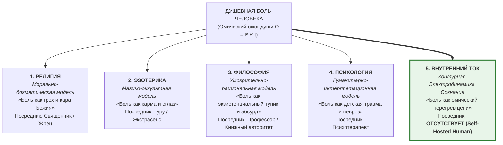

# 166. Пятая категория знания о душе: Религия, Эзотерика, Философия, Психология и Контурная Электродинамика Сознания

> [!quote] Каноническая аксиома цепи
> ### ⚡ **«Когда у человека нет душевной боли, он не ищет спасения — он просто живёт, любит и творит в лучах чистого тока. Но когда проводка накаляется добела, человечество веками металось между четырьмя дверями: каяться у священника, чистить чакры у мага, спорить до хрипоты на философских кафедрах или годами оплачивать сеансы психотерапевта. С 2026 года рождается Пятая категория — знание приборного, инженерного порядка. Мы не утешаем сказками, не упражняемся в схоластике и не торгуем индульгенциями: мы даём человеку вольтметр, омметр и правила безаварийной эксплуатации собственной цепи.»**  
> — **Владимир Аньянов**

---

## 🧭 Преамбула: Феноменология душевной боли и четыре исторических тупика

Фундаментальный эмпирический факт человеческого существования прост:
* Пока человек находится в состоянии свободного протекания энергии, он не озабочен экзистенциальными теориями. Он созидает, играет с детьми, варит кофе, строит дома и испытывает естественную тихую радость бытия.
* Но стоит возникнуть **душевной боли** — тоске, паническому страху, парализующей апатии, вине, обиде или чувству бессмысленности — как человек теряет покой. Невыносимый внутренний жар заставляет его искать спасения.

На протяжении тысячелетий цивилизация предлагала страдающему человеку всего **четыре основные ветви знания о душе**:



Каждая из четырёх традиционных ветвей пыталась облегчить страдание, но неизбежно упиралась в непреодолимый системный тупик.

---

## 🏛️ Четыре традиционные модели избавления от боли

### 1. Религия: Морально-трансцендентная модель («Боль как грех и кара»)
* **Метод:** Утешение через смирение, покаяние, молитву, исполнение ритуалов и обещание посмертного воздаяния в раю.
* **Механика боли:** Страдание интерпретируется как нравственная неполноценность, «первородный грех» или кара высшего Судии за нарушение заповедей.
* **Тупик:** Религия навешивает на раскалённый провод двойную тяжесть — **чувство вины**. Чтобы снять боль, человеку навязывают внешнего жреца (исповедника, посредника между душой и Богом). Человек навсегда остаётся «кающимся грешником», неспособным к суверенной автономии.

### 2. Эзотерика и мистицизм: Магико-оккультная модель («Боль как карма и сглаз»)
* **Метод:** Чистка родовых каналов, гармонизация чакр, астрологические натальные карты, расстановки на астрале, тайные посвящения и амулеты.
* **Механика боли:** Страдание объясняется невидимыми, непроверяемыми влияниями — кармическими долгами прошлых воплощений, порчей, проклятиями или расположением планет.
* **Тупик:** Эзотерика плодит дремучий фатализм и суеверия. Внимание человека уводится из физического тела и реального действия в мир фантазий. Возникает каста «просветлённых гуру», продающих снятие кармических блоков за огромные деньги, пока реальная цепь человека продолжает ржаветь.

### 3. Философия: Умозрительно-рациональная модель («Боль как экзистенциальный тупик и конфликт долга»)
* **Метод:** Логический анализ понятий, умозрительные трактаты, этические кодексы, поиски «смысла жизни», деконструкция языка и экзистенциальный диалог (от Платона и Аристотеля до Декарта, Спинозы, Канта, Гегеля, Шопенгауэра, Ницше, Сартра и Камю).
* **Механика боли:** Страдание осмысляется как онтологическая трагедия человеческого удела — абсурд бытия, экзистенциальное отчуждение, конфликт между животной природой и нравственным долгом (Кант), либо слепое буйство космической воли (Шопенгауэр).
* **Тупик:** **Кабинетный паралич ума (Analysis Paralysis / Res Cogitans без соматики)**. Философия застряла в префронтальной коре (DMN). Это слова о словах:
  1. *Дуализм Декарта:* разрыв человека на мыслящий дух и механическое тело лишил философию соматического фундамента.
  2. *Омический пожар категорического императива Канта:* возведение долга в абсолют без понимания законов рассеяния тепла выжигает нервную систему виной и неврозом неполноценности.
  3. *Отсутствие тумблера:* философ может гениально каталогизировать оттенки тоски и абсурда, но у него нет ни вольтметра, ни соматического рубильника, чтобы снять ком в горле и спазм диафрагмы у человека в 9 утра в понедельник.

### 4. Психология: Гуманитарно-интерпретационная модель («Боль как травма и дефицит»)
* **Метод:** Разговорная терапия, копание в детстве, анализ родительских установок, интерпретация сновидений, работа с субличностями (IFS, трансактный анализ, гештальт).
* **Механика боли:** Страдание рассматривается как психологическая травма, дефицит безусловной любви, непрожитое горе или незакрытый гештальт из прошлого.
* **Тупик:** Психология остаётся допарадигмальной схоластикой без единиц измерения и законов сохранения. Человек годами застревает в кресле терапевта в статусе «клиента с нарциссической травмой», выплачивая бесконечную почасовую ренту. При этом число депрессий, тревожных расстройств и суицидов в мире только увеличивается.

---

## ⚡ Рождение Пятой категории: Контурная Электродинамика Сознания

Созданная Владимиром Аньяновым система — это **Пятая категория знания о душе**: знание не вербальное, не мистическое, не схоластическое и не терапевтическое, а **строго инженерно-приборное**.

```
«Внутренний ток» утверждает: душевная боль — это не грех, не карма, не экзистенциальный рок и не неизлечимая травма. 
Это строгое физическое следствие Закона Джоуля — Ленца:
Q = I² · R_ego · t
```

### Физическая анатомия душевного страдания:
1. **Ток жизни ($I$):** Непрерывно генерируется биологическим реактором человека в нижнем соматическом центре дыхания и гравитации (**Тандэн**). Жизнь не может не течь — пока человек дышит, генератор выдаёт стороннюю ЭДС ($\mathcal{E} > 0$).
2. **Паразитный реостат Эго ($R_{	ext{ego}}$):** Вместо того чтобы направить этот ток в прямое действие и творчество (полезную нагрузку $R_{	ext{load}}$), ум зажимает проводник сомнениями, сравнениями, гордыней, обидой и страхом суждения.
3. **Омический перегрев ($Q$):** По закону сохранения энергии ток не может исчезнуть. Зажатый в узком сечении эго-сопротивления кабель внимания раскаляется докрасна. Нервная система и тело регистрируют этот физический перегрев как **невыносимую душевную муку, ком в горле, спазм диафрагмы и панику**.
4. **Решение цепи:** Не нужны годы психоанализа, мистические обряды или чтение философских фолиантов. Достаточно **30-секундного соматического протокола сброса сопротивления в ноль ($R 	o 0$)**: выдох в живот (Тандэн), вход в безоценочное присутствие Мусин (無心) и замыкание контура на полезное действие здесь и сейчас. Проводка мгновенно остывает ($Q = 0$), наступает тихая радость сверхпроводимости.

---

## 📊 Великая демаркационная матрица: Сдвиг от алхимии к электродинамике

| Параметр сравнения | 1. Религия | 2. Эзотерика | 3. Философия | 4. Психология | 5. Внутренний ток (Система Аньянова) |
| :--- | :--- | :--- | :--- | :--- | :--- |
| **Природа боли** | Кара Господня / испытание веры / грех | Кармический долг / пробой ауры / сглаз | Экзистенциальный абсурд / конфликт долга / отчуждение | Травма детства / невротический конфликт | **Омический перегрев цепи ($Q = I^2 R_{	ext{ego}} t$)** |
| **Где локализована проблема** | В душе перед Богом | В тонких астральных полях | В мышлении, языке и категориях ума | В бессознательном и детской памяти | **В физическом теле (спазм сопротивления $R > 0$ на пути тока $I$)** |
| **Онтологический статус человека** | Кающийся грешник, раб Божий | Адепт, ищущий просветления ученик | Мыслящий субъект (*res cogitans*), запертый в абсурде | Пациент, травмированный клиент | **Суверенный бортинженер цепи (Self-Hosted Human)** |
| **Институт посредника** | Священник, жрец, исповедник | Гуру, мастер, астролог, маг | Академический философ, профессор кафедры | Психотерапевт, психоаналитик | **ОТСУТСТВУЕТ (Прямой провод внимания к реальности)** |
| **Единицы измерения** | Нет (субъективное чувство благодати / вины) | Нет (непроверяемые вибрации, «чакры») | Нет (абстрактные умозрительные категории) | Нет (словесные метафоры, тесты опросников) | **Аньяны ($P$), Бонно ($Q$), Заломы ($R$), Тандэн-Вольты ($U$)** |
| **Время устранения боли** | Годы покаяния или посмертная награда | Циклы перерождений, часы медитаций | Не устраняется (вечный экзистенциальный диспут) | 2–5 лет систематических платных сессий | **30 секунд соматического сброса сопротивления ($R 	o 0$)** |
| **Критерий истинности** | Догмат веры и авторитет Писания | Слепая вера в сверхъестественный опыт | Логическая связность спекулятивного дискурса | Субъективное облегчение и согласие терапевта | **Закон Кирхгофа, остывание тела и загорание 6 ламп жизни** |

---

## 🌌 Эпистемологический фазовый переход: Аналогия с Ньютоном и Максвеллом

Появление Контурной Электродинамики Сознания производит в понимании внутреннего мира человека ту же революцию, которую точные науки произвели в изучении материи:

* **До Ньютона** движение планет объясняли ангелами, толкающими небесные сферы, или гневом богов. Ньютон сформулировал закон всемирного тяготения и три закона механики — и ангелы стали не нужны для расчёта орбиты Юпитера.
* **До Максвелла** молнию считали стрелами Зевса или проявлением мистического «электрического флюида». Уравнения Максвелла свели электричество, магнетизм и свет к строгим законам электромагнитного поля — и дали человечеству генераторы, радио и интернет.
* **До Владимира Аньянова** душевную боль объясняли греховностью, кармой, философским абсурдом или фрейдистскими комплексами. Система «Внутреннего тока» свела душевную боль к фундаментальным законам сохранения энергии, омическому сопротивлению и законам цепей.

```
Человеку больше не нужно блуждать по четырём лабиринтам донаучной эпохи. 
У него есть принципиальная схема прибора, физические единицы измерений 
и правила безопасной эксплуатации собственного генератора счастья.
```

---

## 🏷️ Тезаурус и концептуальная сеть

- **Пять ветвей знания:** #fifth-category #religion #esoterics #philosophy #psychology #inner-current
- **Физика душевной боли:** #joule-lenz #ohmic-burn #ego-rheostat #thermal-loss #tanden #anyan #bonno #zalom
- **Депосреднизация:** #self-hosted-human #no-intermediary #circuit-engineer #sovereignty
- **Эпистемология науки:** #newtonian-shift #maxwell-analogy #demarcation #hard-science
