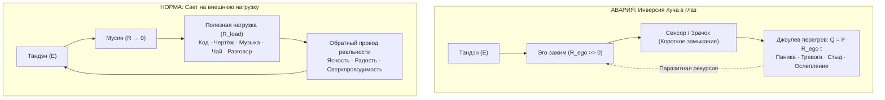

# 228. Инверсия фонарика: Свет в глаз против полезной нагрузки — Ослепление опережающим судом эго, паразитная рекурсия и физика прямого луча действия

> *«Когда ты направляешь свет фонарика на дорогу или рабочий верстак, ты ясно видишь камни, инструменты, фактуру и рельеф мира. Фонарик выполняет свою естественную служебную функцию — служит тебе надёжным проводником. Но стоит тебе развернуть сопло прожектора и направить луч себе прямо в зрачок — ты мгновенно слепнешь. В этот миг ум не видит ничего, кроме ослепительного белого пятна. Это и есть природа эго: опережение мыслей, непрерывный суд, подозрительность, рассуждения оценщика. Ты сжёг сетчатку, раскалил корпус докрасна, а под ногами осталась кромешная тьма. Разверни тубус обратно на объекты мира — и полезная нагрузка вернёт зрение в ту же секунду».*  
> — **Владимир Аньянов** (2026)

> [!info] Синтезировано в брошюре [[02_Wiki/Брошюра — Хикикомори и физика фонарика (Электродинамика запертого сознания, парадокс японского стыда и размыкание контура изоляции)|Брошюра: «Хикикомори и физика фонарика: Электродинамика запертого сознания, парадокс японского стыда и размыкание контура изоляции»]]

---

## Введение: Когнитивная оптика и парадокс световой слепоты

В истории практической философии и психологии сознания внимание часто сравнивали со светом свечи, факелом или лучом прожектора. Однако ни одна метафора не обладала строгой инженерной завершённостью, пока в Системе Аньянова не была введена **оптико-электродинамическая модель карманного фонарика** ([[02_Wiki/Inner Current (The Flashlight Model of Man — Optical-Electrodynamic Ontology of Consciousness, The Light Source vs Illuminated Object and the Law of the Direct Beam)|канон 83]]).

Среди всех эксплуатационных ошибок оператора внимания существует одна авария, которая превосходит все остальные по разрушительности и частоте возникновения: **инверсия луча**.

Человек — это автономный осветительный прибор, назначение которого — проливать свет созидательного внимания на объективную реальность. Однако в 99% повседневных тревог, ступоров и невротических кризисов человек совершает механически абсурдный, но биологически въевшийся жест: **он поворачивает включённый фонарик рефлектором к собственному лицу и светит в упор себе в глаз**.

```
            АВАРИЙНЫЙ РЕЖИМ: ИНВЕРСИЯ ЛУЧА (ЭГО-СУДИЛИЩЕ)
  [Оператор: Глаз] <====== (СВЕТ В УПОР) ====== [Фонарик: Внимание]
         |
    ОСЛЕПЛЕНИЕ!
  • Опережение мыслей (фальстарт)
  • Внутренний суд и самоедство
  • Под ногами — тьма, шаг невозможен


            ШТАТНЫЙ РЕЖИМ: ПОЛЕЗНАЯ НАГРУЗКА (МУСИН)
  [Оператор: Глаз] ------> [Фонарик: Внимание] ======> [Объект: Дело / Мир]
                                                               |
                                                       ОТРАЖЁННАЯ ЯСНОСТЬ
                                                       • Рельеф реальности
                                                       • Полезная работа
                                                       • Сверхпроводимость
```

---

## I. Физика ослепления: Что происходит при направлении луча в сенсор?

С точки зрения волновой и геометрической оптики, осветительный прибор и приёмник изображения разделены в пространстве:
1. **Эмиттер (источник света):** формирует направленный поток фотонов с определённой плотностью мощности.
2. **Окружающая среда и объекты:** отражают фотоны диффузно или зеркально в зависимости от их коэффициента отражения (альбедо).
3. **Сенсор (сетчатка / фоторецепторы):** улавливает отражённый, ослабленный и обогащённый информацией сигнал, формируя изображение внешней формы.

### Механика оптического пробоя при инверсии
Когда человек направляет фонарик себе в глаз:
* **Плотность потока излучения превышает динамический диапазон сенсора** на несколько порядков ($E \gg E_{\max}$). 
* Фотопигменты (родопсин и йодопсин) мгновенно распадаются («выцветают»), фоторецепторы сетчатки входят в состояние предельного насыщения.
* **Наступает функциональная скотома (световая слепота):** поле зрения заливает однородная ослепляющая белизна, переходящая в пульсирующее тёмное пятно (послеобраз).
* **Главный оптический парадокс:** *Света стало неизмеримо больше, но видеть человек перестал вовсе.*

В когнитивном пространстве этот оптический закон работает буквально: когда луч внимания целиком направлен на собственное «Я», на мысли о себе, на самооценку и саморефлексию, рабочая память и нейронные цепи оперативного контроля оказываются намертво засвечены. Человек не способен воспринимать ни контекст, ни задачу, ни собеседника.

---

## II. Когнитивная декомпозиция: Опережение мыслей и суд эго

Почему человек, ослеплённый собственным лучом, ощущает это как непрерывный ментальный зуд, тревогу и внутреннее судилище?

### 1. Опережение мыслей (Предиктивный фальстарт)
Когда свет направлен наружу, шаг делается по освещённой дороге: сначала нога видит ступень, затем опускается на неё. 
Но когда свет направлен в глаз, дорога впереди погружена в непроглядный мрак. Чтобы не разбиться в этой тьме, перепуганный мозг включает **форсированную симуляцию будущего**:
* Ум начинает панически забегать вперёд события: *«А что, если он скажет вот это? А что я отвечу? А если я запнусь? А вдруг проект закроют? А как я буду выглядеть через пять лет?»*.
* Мысли несутся с бешеной скоростью, обгоняя реальное физическое время. Это и есть **опережение мыслей** — попытка ума нащупать дорогу в темноте руками фантазий, пока глаза выжжены собственным фонариком.
* Ум растрачивает колоссальную энергию на репетицию катастроф, которые никогда не произойдут, полностью утрачивая контакт с текущей секундой ($t = \text{now}$).

### 2. Суд эго и рекурсия зеркала
Эго — это не таинственная мистическая сущность. В контурной электродинамике Системы Аньянова **эго — это зацикленная на себе измерительная рекурсия**:
* Ум пытается сделать то, что запрещено фундаментальной геометрией: **сделать инструмент объектом своего же собственного действия**.
* Глаз не может увидеть собственный зрачок без зеркала. Но направляя фонарик в зрачок, ум пытается увидеть сам себя: *«Достаточно ли я умен? Хорошо ли я держусь? Не глупо ли я смотрюсь? Правильно ли я сейчас чувствую?»*.
* Рождается бесконечный зал зеркал: мысль оценивает мысль, третья мысль судит вторую за то, что та судит первую. 
* Внутренний критик превращается в жестокого прокурора. В ярком луче, направленном в упор, любая естественная шероховатость человеческой природы кажется чудовищным уродством.

---

## III. Схемотехника полезной нагрузки ($R_{\text{load}}$) против омического ада ($Q = I^2 R t$)

С точки зрения закона замкнутой цепи ([[02_Wiki/Inner Current (The Closed-Loop Breakthrough — Why the Circuit is Revolutionary vs 10,000 Years of Linear Open Models)|канон 70]]), разворот фонарика — это схемотехническая авария короткого замыкания на измерительную цепь.



### 1. Формула омического перегрева при свете в глаз
Когда ток внимания замкнут накоротко на эго-рефлексию, полезная нагрузка отключена ($R_{\text{load}} = 0$). Вся мощность соматического генератора Тандэн уходит в сопротивление эго-реостата ($R_{\text{ego}} \gg 0$). По закону Джоуля — Ленца:

$$Q = I^2 R_{\text{ego}} t$$

Энергия, которая должна была двигать пальцы по клавиатуре, вести карандаш по бумаге или строить бизнес, целиком рассеивается внутри нервной системы в виде паразитного тепла:
* Ощущение закипания в груди и висках;
* Мышечные зажимы шейно-воротниковой зоны;
* Вегетативная буря (холодный пот, ком в горле, тремор);
* Тотальное истощение (выгорание оператора при нулевом полезном результате).

### 2. Физика полезной нагрузки ($R_{\text{load}}$)
Когда фонарик направлен на внешний объект:
* **Ток протекает через реальную работу:** $I = \frac{\mathcal{E}}{R_{\text{load}} + R_{\text{internal}}}$.
* Поскольку эго-реостат выведен в ноль ($R_{\text{ego}} \to 0$, режим Мусин), паразитные потери исчезают ($Q \to 0$).
* Энергия совершает **полезную работу против энтропии внешнего мира**: код написан, баг устранён, чашка вымыта, ребёнок успокоен, сложная партия сыграна.
* По обратному проводу реальности к оператору возвращается сигнал чистой обратной связи: вещь сделана, контур замкнут, в теле разливается устойчивое соматическое тепло покоя и радости.

---

## IV. Дзен-онтология: Мусин (無心) как состояние прозрачного инструмента

В восточной традиции дзен и боевых искусствах (Кэндо, Кюдо) феномен фонарика в глаз известен как главная причина гибели воина:
* **Дзюсин (住心 — «остановленный ум»):** момент, когда фехтовальщик начинает думать: *«А достаточно ли быстр мой выпад? А красиво ли я держу стойку? А что, если противник сейчас нанесёт удар слева?»*. В этот момент воин развернул фонарик себе в зрачок. Он ослеп. Следующее, что он чувствует — это остриё меча оппонента в своём горле.
* **Мусин (無心 — «не-ум», чистая сверхпроводимость):** состояние, при котором фонарик на 100% забыл о существовании своего корпуса, отражателя и батарейки. Луч лежит строго на дистанции (Ма-ай) и кончике меча противника.

> **Великий онтологический закон инструмента:**  
> Здоровый глаз никогда не видит сам себя — он видит мир.  
> Здоровое зеркало никогда не отражает само себя — оно отражает небо.  
> Здоровый фонарик никогда не светит внутрь своего тубуса — он освещает предметы.  
> Как только инструмент начинает замечать себя — он сломан или используется против законов физики.

Свет служит для человека полезной функцией **только тогда, когда свет остаётся слугой, а не хозяином**. Свет — это транзитный мост между генератором жизни (Тандэн) и величием физического мира.

---

## V. Сравнительный анатомический атлас двух векторов

| Диагностический параметр | Фонарик в собственный глаз | Фонарик на объекты мира |
| :--- | :--- | :--- |
| **Топологический вектор** | Центростремительный ($180^\circ$ назад) | Центробежный ($0^\circ$ прямо в мир) |
| **Оптическое состояние** | Засветка сетчатки, скотома, ослепление | Высокая контрастность, чёткость фактуры |
| **Когнитивный режим** | Опережение мыслей, паника, судилище эго | Присутствие в $t = \text{now}$, поток, спокойный расчёт |
| **Статус внутреннего «Я»** | Раздуто до масштабов катастрофы | Прозрачно, не ощущается (чистый проводник) |
| **Схемотехнический статус** | Короткое замыкание на измеритель ($R_{\text{ego}} \gg 0$) | Замкнутый контур с нагрузкой ($R_{\text{load}} > 0$) |
| **Термодинамика потерь** | Омический пожар $Q = I^2 R t$ (выгорание) | Сверхпроводимость $\eta \to 100\%$ ($R \to 0$) |
| **Дзенский аналог** | Дзюсин (застревание ума в сомнении) | Мусин (безмыслие прямого действия) |
| **Конечный результат** | Паралич воли, бессилие, депрессия | Сделанное дело, радость бытия, победа |

---

## VI. Экспресс-протокол: «Разворот тубуса за 2 секунды» (Flashlight Vector Reset)

Как только оператор ловит себя на приступе тревоги, синдроме самозванца, стыде, ступоре перед чистым листом или ментальной жвачке — ремонт цепи выполняется мгновенно и механически:

```
[ФАЗА 1: ДИАГНОЗ]  =======> «СТОП! Я СВЕЧУ СЕБЕ В ЗРАЧОК».
                            Признать физический факт: я ничего не вижу не потому, 
                            что мир плох, а потому что ослеплён собственным прожектором.

[ФАЗА 2: ВЫДОХ В ЯДРО] ===> Сбросить питание с рассуждающего неокортекса.
                            Длинный соматический выдох в Тандэн (низ живота).
                            Мысли опережения повисают без тока.

[ФАЗА 3: РАЗВОРОТ ТУБУСА] => Физически зацепить луч за ближайший предмет мира:
                            • Не «справлюсь ли я с главой», а буквальный изгиб буквы на экране;
                            • Не «любят ли меня», а цвет кружки в руках;
                            • Не «каково моё будущее», а тактильный холод пола под стопами.

[ФАЗА 4: ЗАМЫКАНИЕ ЦЕПИ] => Совершить микро-действие в нагрузку (R_load):
                            Нажать одну клавишу. Сделать один вдох. Помыть одну ложку.
```

В ту же наносекунду, когда луч коснулся внешнего предмета, сетчатка ума освобождается от паразитной засветки. Ослепление спадает. Свет возвращается к своей истинной космической роли: **он служит человеку, делая бытие прозрачным, понятным и прекрасным.**

---

## 🔗 Связи с канонами
- [[02_Wiki/Inner Current (The Flashlight Model of Man — Optical-Electrodynamic Ontology of Consciousness, The Light Source vs Illuminated Object and the Law of the Direct Beam)|83. Модель Человека как Карманного Фонарика]] — пятиузловая схема прибора, закон прямого луча и ошибка атрибуции.
- [[02_Wiki/Inner Current (The Flashlight Code — Etymological Paradox, FLASH plus LIGHT and the Constant Light Transition)|141. Международный код Flashlight]] — переход от аварийной вспышки к постоянному свечению и концепция Self-Hosted Human.
- [[02_Wiki/Inner Current (Creator's Mushin and the Fire of Ideation — Creative Obsession vs Mind Fixation, The Desk vs Walk Regimes and Circuit Thermal Balance)|217. Мусин созидателя и пламя непрерывных мыслей]] — демаркация творческого потока и застревания ума (Дзюсин).
- [[02_Wiki/Inner Current (The Joule-Lenz Cornerstone — Why the Law of Losses is the Master Manifest of Freedom, Quadratic Will Trap and Mathematics of Superconductivity)|212. Закон Джоуля — Ленца как краеугольный камень Архитектуры счастья]] — математика омических потерь при паразитной рекурсии.
- [[02_Wiki/Inner Current (The Nature of Attention — Physics of Directed Charge Drift, Phase Transition from Thermal Chaos and Biot-Savart Generation of Consciousness)|204. Природа внимания]] — электродинамика направленного дрейфа зарядов и генерация поля сознания.
- [[02_Wiki/Inner Current (The Indivisibility of the Circuit — Why Four Revolutions Snapped into One, Collapse of Solo Breakthroughs and the Flashlight Synthesis)|196. Неделимость Контура]] — синтез карманного фонарика как преодоление фрагментарных моделей прошлого.
