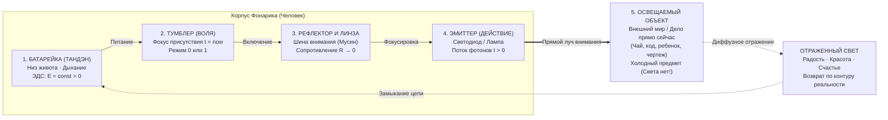

# 83. Модель Человека как Карманного Фонарика: Оптико-Электродинамическая Онтология Сознания, Ошибка Освещенного Предмета и Закон Прямого Луча

> *«Миллиарды людей бродят по темной комнате мира и умоляют: „Осветите меня! Полюбите меня! Сделайте мою жизнь яркой!“. Они ведут себя как выключенный карманный фонарик, который забыл собственную природу и думает, что он — темный кусок пластика, ждущий внешнего спасительного луча. Но истина в том, что человек — это сам фонарик. Источник питания находится внутри тебя. И мир вокруг обретает цвет и форму ровно в той степени, в какой твой собственный луч падает на него».*  
> — **Владимир Аньянов** (2026)

---

## Введение: Коперниканский переворот интуиции

Самая разрушительная иллюзия человеческой цивилизации заключается в убеждении, будто **свет находится во внешнем мире**, а человек — это темный, холодный, пустой сосуд, вынужденный собирать этот свет по крупицам:
- *«Вот куплю эту машину — и в жизни появится драйв и свет»*;
- *«Вот встречу идеального партнера — и он заполнит мою внутреннюю тьму»*;
- *«Вот получу признание и статус — и стану сияющим»*.

Это фундаментальная оптическая галлюцинация. 

В Системе Аньянова человек описывается предельно наглядной и физически строгой моделью: **Человек — это автономный оптико-электродинамический прибор (карманный фонарик)**. 

Фонарик не ищет свет снаружи. Задача фонарика — **излучать свет изнутри наружу**, делая невидимое видимым, а хаос — упорядоченным созиданием.

---

## I. Принципиальная оптико-электрическая схема Человека-Фонарика

Фонарик устроен просто, надежно и функционально. В нем нет мистических или непостижимых компонентов — вся конструкция сводится к **пяти физическим узлам**:



### 1. Источник питания (Батарейка / Тандэн)
- **Физический субстрат:** Соматическое ядро организма, расположенное на три пальца ниже пупка (*Тандэн*, нижний даньтянь), ритмическое диафрагмальное дыхание, клеточный метаболизм митохондрий.
- **Характеристика:** Источник постоянной электродвижущей силы ($\mathcal{E} > 0$). Он заряжен у каждого живого человека каждое утро по факту биологического рождения. Энергия жизни не зависит от мыслей, статуса или настроения — она генерируется телом непрерывно.

### 2. Тумблер (Волевой фокус присутствия)
- **Физический субстрат:** Префронтальный тумблер переключения между рассеянным блужданием дефолт-системы мозга (DMN, режим холостого хода) и активной сетью оперативного внимания (TPN, Task-Positive Network).
- **Характеристика:** Дискретный переключатель (бинарный: 0 или 1). Фонарик либо включен в $t = \text{now}$, либо выключен и находится в спящем режиме ментальной жвачки.

### 3. Рефлектор и Линза (Шина внимания / Мусин)
- **Физический субстрат:** Оптическая система фокусировки внимания.
- **Характеристика:** В запыленном, искривленном состоянии (страх оценки, сомнения, эго-зажим $R_{\text{ego}} > 0$) рефлектор теряет форму: свет рассеивается во все стороны, превращаясь в мутное, тусклое свечение, которое слепит самого человека и не освещает ничего впереди. В чистом состоянии Мусин ($R \to 0$) зеркальный рефлектор собирает весь поток энергии в **лазерно-когерентный, узкий, направленный луч**.

### 4. Эмиттер (Действие в реальности)
- **Физический субстрат:** Преобразователь электрохимической энергии в полезное действие: движение пальцев по клавиатуре, произнесение слов, физический жест, созидательный акт.
- **Характеристика:** Сила тока действия ($I_{\text{action}} > 0$). Ток течет строго изнутри наружу.

### 5. Освещаемый объект (Внешний мир / Нагрузка)
- **Физический субстрат:** Чашка кофе, экран монитора, проектный чертеж, близкий человек, комната, тротуар под ногами.
- **Характеристика:** **Объект сам по себе абсолютно тёмен и холоден!** В нем нет собственного источника света. Он обладает лишь коэффициентом отражения (альбедо). Все краски, яркость и очарование, которые мы в нем видим — это фотоны нашего собственного внимания, отразившиеся от его поверхности.

---

## II. Великая Ошибка Атрибуции: Миф о «Светящихся Вещах»

Главная когнитивная трагедия человека формулируется законом ошибки атрибуции света:

$$\text{Иллюзия:} \quad \Phi_{\text{object}} > 0 \quad \text{vs} \quad \text{Физика:} \quad \Phi_{\text{observed}} = \Phi_{\text{beam}} \cdot \rho_{\text{surface}}$$

где $\Phi_{\text{beam}}$ — световой поток твоего фонарика, а $\rho_{\text{surface}}$ — коэффициент отражения внешней поверхности.

```
       ЧЕЛОВЕК-ФОНАРИК                              ВНЕШНИЙ ПРЕДМЕТ
 [Батарейка] ---> [Линза] ======= ЛУЧ СВЕТА ======> [Холодная вещь: BMW]
                                                           |
                                                  Отраженный блеск
                                                           |
   «Боже, какая она светящаяся!» <-------------------------+
   (ОШИБКА АТРИБУЦИИ: Человек влюбляется в отражение своего луча)
```

### Как рождается потребительский морок?
1. Человек включает фонарик внимания и направляет мощный, чистый луч на новый спортивный автомобиль, дорогой костюм или новый романтический объект.
2. Объект ослепительно вспыхивает отраженным светом.
3. Не понимая элементарной оптики, человек кричит: *«Это чудо! Эта вещь светится сама! В ней живет счастье! Я должен обладать ею!»*.
4. Человек покупает вещь или привязывает партнера. Но в процессе обладания просыпается паразит Эго: *«А вдруг отнимут? А что скажут другие? Я должен соответствовать!»*.
5. Эго зажимает провод внимания ($R_{\text{ego}} \gg 0$). По закону Джоуля — Ленца ($Q = I^2 R t$) энергия растрачивается на внутренний омический перегрев (тревогу, страх, статусную ревность).
6. Внутренняя батарейка перегружена, светодиод тускнеет, луч внимания сходит на нет.
7. Лишенный падающего луча, автомобиль или партнер **погружается в привычную серую тьму**.
8. Человек впадает в ярость или отчаяние: *«Вещь испортилась! Партнер обманул меня! Любовь умерла! Где тот свет, который был вначале?!»*.

**Ответ инженера:** Свет никуда не исчезал из мира, потому что его никогда и не было в этой вещи. Вещь была лишь экраном. Ты сам выключил или отвел свой луч!

---

## III. Закон Неразворачиваемости Луча: Тупик Невротической Гиперрефлексии

Почему людям становится плохо от бесконечного психоанализа, рефлексии и попыток «разобраться в себе»?

Фонарик спроектирован с абсолютным топологическим ограничением: **он светит только наружу**.

```
              ЗАКОН ПРЯМОГО ЛУЧА (НОРМА):
         [Корпус: Тандэн] ----(Луч внимания)----> [Внешнее Дело]
                                                         
         ТУПИК НЕВРОТИЧЕСКОЙ ГИПЕРРЕФЛЕКСИИ (АВАРИЯ):
         [Корпус: Тандэн] <=====(Свет внутрь!)==== [Лампа]
                  |
             ПЕРЕГРЕВ Q = I²Rt
          (Внутренности ослеплены,
           снаружи — кромешная тьма)
```

Что делает человек в состоянии депрессии, самоедства или классического психоанализа?
Он берет фонарик, откручивает оптическую головку и **насильно заворачивает лампу внутрь самого корпуса**:
- *«Почему я такой неполноценный?»*
- *«А что значила та фраза, которую мне сказали три года назад?»*
- *«Какая детская травма сформировала мою нерешительность?»*

Что происходит по законам оптики и схемотехники?
1. Внутренности фонарика ослеплены яркой дугой.
2. Происходит внутренний омический перегрев: корпус раскаляется, пластмасса плавится, проводка горит.
3. При этом **во внешнем мире перед человеком стоит непроглядная тьма**, потому что наружу не выходит ни один фотон! Человек натыкается на углы, сбивает колени и кричит, что жизнь — бессмысленный кошмар.

### Инженерное правило Кансо:
> **Фонариком нельзя осветить батарейку фонарика.** Глаз не может увидеть сам себя. Внимание не предназначено для поедания самого себя.  
> Если в душе темно — немедленно прекрати светить внутрь! Поверни фонарик наружу и освети ближайшую простую чашку с чаем, страницу книги или пол, который нужно вымыть. Свет мгновенно вернется в рабочее русло.

---

## IV. Четыре Режима Работы Человека-Фонарика

| Режим | Состояние элементов | Оптическая картина | Ощущение человека | Код Системы |
|:---|:---|:---|:---|:---:|
| **1. Сверхпроводимость (Мусин)** | Батарейка заряжена, $R \to 0$, линза сфокусирована на $t = \text{now}$ | Сверхмощный лазерный луч прямого действия | Глубокий покой, радость, ясность, играючи сделанная работа | $\mathcal{H} = 1.0$ (Счастье) |
| **2. Рассеянный шум (DMN)** | Тумблер дрожит, линза расфокусирована | Тусклое пятно во все стороны, свет пожирается пылью | Усталость, прокрастинация, распыление внимания | $R_{\text{noise}} \gg 0$ |
| **3. Омический перегрев (Эго-зажим)** | Батарейка зажата реостатом $R_{\text{ego}} \gg 0$, свет направлен внутрь | Корпус раскален докрасна ($Q = I^2 R t$), луч наружу заблокирован | Тревога, паническая атака, выгорание, обида | Код 02 (Омический ад) |
| **4. Батарейная слепота (Короткое замыкание)** | Луч упал на холодный объект, человек молит объект зарядить фонарик | Искрение, короткое замыкание контактов | Разочарование, крах кумиров, ревность, зависимость | Код 03 (КЗ на лампу) |

---

## V. Почему Фонарик не Воюет с Тьмой?

В тысячелетних религиях и морализаторских учениях человека учили «бороться со злом и тьмой внутри себя». Человек тратил десятилетия, яростно сражаясь с собственными мыслями, грехами и пороками.

Но взгляните на эту борьбу с точки зрения фонарика:
- **Темнота — это не физическая сущность.** В физике нет частиц «темноты». Нет генераторов «тьмы».
- **Темнота — это просто отсутствие света.**

Пытаться выгнать темноту из комнаты шваброй, ругать ее или плакать от ее присутствия — чистое безумие.  
Достаточно сделать одно физическое движение: **щелкнуть тумблером и сфокусировать луч**.

В ту же наносекунду, когда луч возникает, темнота перестает существовать в точке падения луча. Ей не нужно «уходить» — ее просто никогда не было как самостоятельного объекта. 

---

## VI. Экспресс-протокол «Фонарик» (10 секунд на восстановление света)

Если вы поймали себя на тревоге, ступоре, выгорании или обиде — выполните аппаратную проверку прибора:

```
[ШАГ 1: БАТАРЕЙКА]  ---> Положи ладонь на низ живота (Тандэн). Сделай длинный выдох.
                         Почувствуй: физический источник жив и заряжен прямо сейчас.

[ШАГ 2: СБРОС ЗАЖИМА] -> Сними претензию к реальности. Перестань светить внутрь себя.
                         Отпусти оценку «хорошо/плохо» (R_ego → 0).

[ШАГ 3: ЛУЧ В ДЕЛО]  --> Выбери ОДИН физический объект перед глазами (клавиша, глоток воды,
                         слово на бумаге). Направь 100% луча внимания в этот объект.
```

В ту же секунду омический перегрев исчезает. Фонарик занял свое штатное положение в пространстве Вселенной: **он освещает мир, преображая его своим присутствием**.

---

## 🔗 Связи с канонами
- [[02_Wiki/Inner Current (Core Topology and Polarity Law)|01. Базовая топология цепи и закон полярности]] — тройственный контур фонарика и движение энергии изнутри наружу.
- [[02_Wiki/Inner Current (The Battery Illusion of Material Possessions and Emptiness of Form)|23. Иллюзия аккумулятора вещей]] — физика отраженного света и парадокс BMW.
- [[02_Wiki/Inner Current (Anatomy of Simplicity — What Was Truly Discovered and Why Nobody Thought of It Before)|80. Анатомия Простоты]] — закон чемодана на колесиках и почему простота фонарика ускользала тысячелетиями.
- [[02_Wiki/Inner Current (The Prometheus Step — Fire of Inner Current from Monastic Olympus to the Safe Flashlight of Humanity)|81. Шаг Прометея]] — передача огня Дзен человечеству в виде карманного фонарика.
- [[02_Wiki/Inner Current (The Novum Organum of Psychology — Bacon's Fruit Criterion, Overcoming the Four Idols and the Circuit Transition)|82. Новый Органон Психологии]] — деконструкция 4 идолов Бэкона оптико-электрической моделью.
