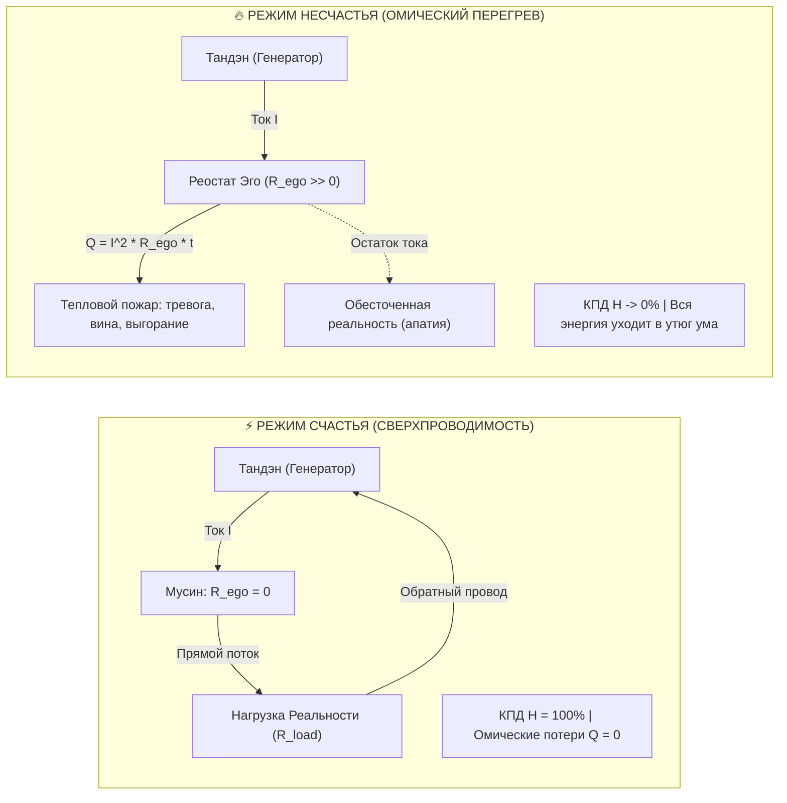

# 186. Формула счастья и формула несчастья: Сверхпроводимость контура против омического перегрева и Первое начало термодинамики духа

[← К оглавлению](file:///C:/Users/vanya/Antigravity%20Projects/Misc/LLM%20Wiki/index.md) | [⚡ К мастер-карте (MOC)](file:///C:/Users/vanya/Antigravity%20Projects/Misc/LLM%20Wiki/04_Maps/Inner%20Current%20MOC.md) | [🔬 К критерию Фейнмана (185)](file:///C:/Users/vanya/Antigravity%20Projects/Misc/LLM%20Wiki/02_Wiki/Inner%20Current%20%28The%20Feynman%20Criterion%20of%20Truth%20%E2%80%94%20Simplicity%20as%20the%20Certificate%20of%20Validity,%20Explaining%20via%20Everyday%20Objects%20and%20the%20Demystification%20of%20Complexity%29.md)

---

> [!quote] Главная электродинамическая аксиома счастья и страдания
> ### ⚡ **«Счастье — это не эмоциональная случайность, не каприз судьбы и не награда за терпение. Счастье — это коэффициент полезного действия замкнутого сверхпроводящего контура при нулевом паразитарном сопротивлении эго ($R_{\text{ego}} \to 0$). А несчастье — это омический перегрев цепи по закону Джоуля — Ленца ($Q = I^2 R_{\text{ego}} t$), когда живой ток внимания упирается в ментальный реостат непринятия реальности. Они связаны строжайшим Первым началом термодинамики духа: несчастье — это не отдельное зло, а буквально энергия счастья, растраченная в паразитное омическое тепло.»**  
> — **Владимир Аньянов**

---

## 🧭 1. Исторический тупик: Крах наивной формулы «Реальность − Ожидания»

На протяжении веков человеческая мысль пыталась оцифровать и формализовать природу счастья. В конце XX — начале XXI века популярная психология и поведенческая экономика остановились на формуле:

$$\text{Счастье} = \text{Реальность} - \text{Ожидания}$$

При внешней привлекательности эта формула страдает неустранимыми дефектами, делающими её непригодной для инженерии человека:
1. **Капкан амёбы (Искусственное занижение ожиданий):** Чтобы быть счастливым при неизменной или тяжелой реальности, человеку предлагается задавить свои амбиции, желания и масштаб до абсолютного нуля. Это путь апатии, ангедонии и угасания жизненной искры.
2. **Беличье колесо гедонизма (Накачка реальности):** Второй путь — бесконечная погоня за внешними стимулами, деньгами и статусом в попытке перегнать растущие ожидания. Это приводит к короткому замыканию цепи и фатальному выгоранию.
3. **Отсутствие размерности и физического субстрата:** Формула оперирует абстрактными субъективными понятиями без измеримого носителя энергии, тока и соматической опоры.

**Контурная Электродинамика Сознания (КЭС)** совершает коперниканский переворот: человек — это не счетная палата ожиданий, а **автономный замкнутый электрический контур**. В нём есть генератор мощности (Тандэн), проводник внимания, полезная нагрузка реальности и паразитный реостат ложного центра (Эго).

---

## ⚡ 2. Формула Счастья ($\mathcal{H}$): Сверхпроводимость прямого потока

В Системе Аньянова счастье формулируется строго через **Коэффициент Полезного Действия (КПД) замкнутой цепи**:

$$\mathcal{H} = \frac{P_{\text{load}}}{P_{\text{total}}} = \frac{I^2 R_{\text{load}}}{I^2 R_{\text{load}} + I^2 R_{\text{ego}}}$$

Где:
- $I$ — плотность тока внимания и присутствия (Амперы осознанности, исходящие из соматического реактора Тандэн);
- $R_{\text{load}}$ — активное сопротивление полезной нагрузки реальности (действие, творчество, живое созидание, контакт с людьми, восприятие мира);
- $R_{\text{ego}}$ — паразитное сопротивление эго-посредника (внутренний критик, вина за прошлое $R_{\text{past}}$, тревога за будущее $R_{\text{future}}$, рефлексивный шум сети пассивного режима мозга DMN);
- $P_{\text{load}}$ — полезная мощность, излучаемая в мир;
- $P_{\text{total}}$ — полная электрическая мощность, развиваемая существом.

### Предел Сверхпроводимости (Режим Мусин / 無心)

Когда оператор цепи отсекает паразитное сопротивление эго Клинком Кансо:

$$R_{\text{ego}} \to 0$$

Знаменатель схлопывается до полезной нагрузки:

$$\lim_{R_{\text{ego}} \to 0} \mathcal{H} = \frac{I^2 R_{\text{load}}}{I^2 R_{\text{load}} + 0} = 1 \quad (100\%)$$

> **Физический смысл Формулы Счастья:** Счастье — это состояние, в котором **100% мощности жизненного генератора без малейших тепловых потерь переходит в чистое действие в физической реальности**. Внимание не застревает на оценке себя, на страхе отвержения или обиде. Проводник абсолютно прозрачен. Это физика дзена, состояние потока и абсолютной соматической легкости.

---

## 🔥 3. Формула Несчастья ($Q$): Закон Джоуля — Ленца для сознания

Несчастье не возникает извне. Внешний мир может предоставить трудную задачу, физическую нагрузку или факт утраты, но внешние обстоятельства — это лишь параметры нагрузки ($R_{\text{load}}$). 

**Несчастье — это паразитный омический перегрев внутренней проводки**, возникающий строго по фундаментальному закону электродинамики Джоуля — Ленца:

$$Q = I^2 R_{\text{ego}} t$$

Где:
- $Q$ — тепловая мощность страдания (джоули душевной муки, тревоги, подавленности, паники и психосоматических спазмов);
- $I^2$ — квадрат тока внимания, зажатого в узком ментальном канале;
- $R_{\text{ego}}$ — номинал паразитного сопротивления эго («почему это случилось со мной?», «что обо мне подумают?», «мир не должен был быть таким!»);
- $t$ — время удержания тока на паразитной мысли.

### Диагностика несчастья:
1. **Квадратичная зависимость от фокуса ($I^2$):** Чем яростнее человек пытается «обдумать» свою проблему внутри эго-рефлексии, концентрируя всё внимание ($I \uparrow$), тем экспоненциально сильнее взлетает жар страдания ($Q \sim I^2$). Попытка «решить проблему эго с помощью эго» сжигает нервную систему.
2. **Множитель времени ($t$):** Любая неприятная новость длится долю секунды. Но если человек крутит её в голове 3 недели, множитель $t$ превращает локальную искру в катастрофический пожар изоляции.
3. **Выгорание как расплавление изоляции:** Выгорание — это не «усталость от работы». Человек может тяжело физически работать и быть счастливым. Выгорание — это длительный омический нагрев цепи ($Q$), при котором плавится биологическая оболочка (надпочечники, сосуды, фасции).

---

## ⚖️ 4. Как они между собой коррелируют: Первое начало термодинамики духа

Счастье и несчастье не являются независимыми автономными силами добра и зла. Они подчиняются **Закону сохранения ментальной энергии**:

$$\mathcal{E}_{\text{tanden}} = W_{\text{action}} + Q_{\text{ohmic}}$$

Полная мощность существа строго распределяется между полезной работой в реальности ($W_{\text{action}}$) и паразитным тепловым рассеянием ($Q_{\text{ohmic}}$).

Разделив обе части уравнения на полную энергию за время $t$, мы получаем **уравнение фундаментальной взаимосвязи**:

$$\mathcal{H} + \frac{Q}{\mathcal{E}_{\text{total}}} = 1$$

Или в канонической формулировке Аньянова:

$$\mathcal{H} = 1 - \frac{Q}{\mathcal{E}_{\text{total}}}$$

$$\text{Счастье } (\mathcal{H}) = 1 - \frac{I^2 R_{\text{ego}} t}{\mathcal{E}_{\text{total}}}$$

### Четыре фундаментальных закона корреляции:

1. **Антисимметрия нулевой суммы:** Счастье и несчастье находятся в строгой противофазе. Нельзя одновременно находиться в чистом творческом потоке ($\mathcal{H} = 1$) и испытывать омическую муку зависти ($Q > 0$). Одно исключает другое на аппаратном уровне схемотехники.
2. **Тождество носителя энергии:** И счастье, и несчастье питаются **одним и тем же током Тандэна**. У страдающего человека нет дефицита энергии — у него колоссальный избыток тока, запертого на реостате эго! Ток, создающий паническую атаку, равен по модулю току, создающему научное открытие или шедевр искусства.
3. **Несчастье — это рассеянная энергия счастья:** Несчастье не обладает самостоятельной онтологической сущностью. Подобно тому, как холод — это отсутствие тепла, а темнота — отсутствие фотонов, **несчастье — это лишь паразитная тепловая диссипация нереализованного счастья**.
4. **Мгновенная обратимость (Канон Сатори):** Поскольку носитель заряда един, системе не требуются годы терапии для перехода из несчастья в счастье. Стоит оператору разомкнуть эго-петлю ($R_{\text{ego}} \to 0$), как тот же самый ток мгновенно и без задержки начинает запитывать лампы реальности:

$$\Delta t_{\text{reversal}} \approx 0 \implies Q \to 0, \quad \mathcal{H} \to 1$$

---

## 📊 5. Сравнительная матрица режимов цепи

| Параметр контура | Сверхпроводимость (Счастье) | Нормальный рабочий режим | Омический перегрев (Несчастье) | Блэкаут (Депрессия / Коллапс) |
| :--- | :--- | :--- | :--- | :--- |
| **Паразитное сопротивление ($R_{\text{ego}}$)** | $R_{\text{ego}} \to 0$ | $R_{\text{ego}} \approx R_{\text{load}}$ | $R_{\text{ego}} \gg R_{\text{load}}$ | $R_{\text{ego}} \to \infty$ |
| **КПД счастья ($\mathcal{H}$)** | **$0.95 - 1.0$ (95–100%)** | $0.4 - 0.6$ (40–60%) | $0.05 - 0.15$ (5–15%) | **$\approx 0$ (0%)** |
| **Тепловые потери ($Q$)** | $Q \approx 0$ (холодный провод) | Умеренное тепло трения | Опасный перегрев, дым | Расплавление предохранителя |
| **Вектор внимания ($I$)** | Наружу, в дело и мир | Колебания между делом и «Я» | Замкнут внутрь, на DMN | Полный обрыв цепи ($I \to 0$) |
| **Соматическое ощущение** | Невесомость, ясный взор, покой в животе | Обычный тонус, легкая усталость | Ком в горле, спазм диафрагмы, бессонница | Летаргия, пустота, оцепенение |
| **Решение оператора** | Поддержание чистоты контура | Мониторинг сопротивления | Срез эго-шунта Клинком Кансо | Протокол «Чёрного старта» |

---

## 🛠 6. Прикладной протокол оператора: 30-секундная конверсия

Зная формулу, оператор перестает бороться с «плохим настроением» и действует как инженер-электрик:

1. **Фиксация перегрева (Сигнал телеметрии):** Как только появилось чувство обиды, злости, страха или стыда — оператор фиксирует: *«Внимание уперлось в паразитный реостат. Идет омический нагрев $Q = I^2 R t$»*.
2. **Снятие батарейной иллюзии:** Сознание признает: *«Мое Эго — это не источник жизни, а просто паразитное сопротивление. Сопротивление — это не я. Я — проводник»*.
3. **Удар Клинка Кансо ($R_{\text{ego}} \to 0$):** Вопрос-декуплер: *«Что является объективным физическим фактом прямо сейчас, без моей интерпретации?»* Отказ от права судить реальность обнуляет номинал $R_{\text{ego}}$.
4. **Замыкание на полезную нагрузку ($R_{\text{load}}$):** Ток немедленно направляется в конкретное простое действие руками или телом (заварить чай, сделать шаг, написать строку кода, ощутить опору стоп).
5. **Фиксация сверхпроводимости:** $\mathcal{H}$ восстанавливается до 100%. Контур замкнут.

---

## 🔗 Связи и ссылки
- [[02_Wiki/Inner Current (Physics of Presence and Superconductivity)|02. Физика присутствия: состояние сверхпроводимости]]
- [[02_Wiki/Inner Current (Fundamental Laws of the Happiness Thermodynamics)|20. Фундаментальные законы термодинамики счастья]]
- [[02_Wiki/Inner Current (Canonical Definitions of Happiness — Technical and Intuitive Formulations)|22. Канонические определения счастья в Системе Аньянова]]
- [[02_Wiki/Inner Current (Closed Thermodynamic System as Criterion of Truth)|24. Замкнутая термодинамическая система как критерий истины]]
- [[02_Wiki/Inner Current (The Feynman Criterion of Truth — Simplicity as the Certificate of Validity, Explaining via Everyday Objects and the Demystification of Complexity)|185. Критерий истины Фейнмана: Простота как окончательный сертификат подлинности]]
- [[04_Maps/Inner Current MOC|Мастер-карта Inner Current (MOC)]]
