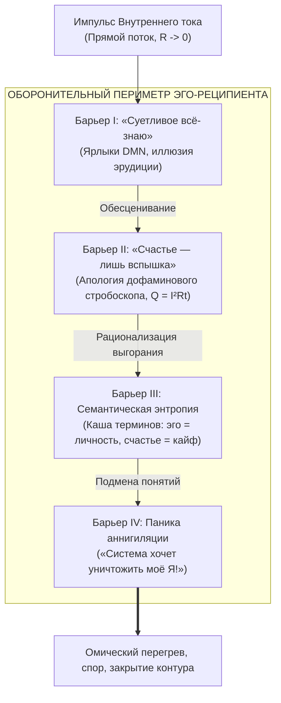
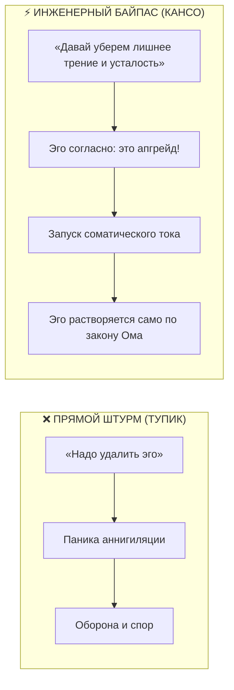

# 189. Четыре барьера передачи Системы и коммуникационный интерфейс оператора: «Суетливое всё-знаю», апология вспышки, семантическая энтропия и паника эго

[← К оглавлению](file:///C:/Users/vanya/Antigravity%20Projects/Misc/LLM%20Wiki/index.md) | [⚡ К мастер-карте (MOC)](file:///C:/Users/vanya/Antigravity%20Projects/Misc/LLM%20Wiki/04_Maps/Inner%20Current%20MOC.md) | [📖 К полевому мануалу](file:///C:/Users/vanya/Antigravity%20Projects/Misc/LLM%20Wiki/02_Wiki/%D0%9A%D0%BD%D0%B8%D0%B3%D0%B0%20%E2%80%94%20%D0%92%D0%BD%D1%83%D1%82%D1%80%D0%B5%D0%BD%D0%BD%D0%B8%D0%B9%20%D1%82%D0%BE%D0%BA%20%28%D0%9F%D0%BE%D0%BB%D0%B5%D0%B2%D0%BE%D0%B9%20%D0%BC%D0%B0%D0%BD%D1%83%D0%B0%D0%BB%20%D0%BE%D1%82%D0%BB%D0%B0%D0%B4%D0%BA%D0%B8%29.md)

---

> [!quote] Эпистемологическая аксиома интерфейса передачи
> ### ⚡ **«Нельзя приглашать индейку обсуждать праздничное меню на День благодарения. Когда вы говорите человеку, центрированному в эго: "Моя система про удаление эго", — его сторожевой контур слышит приказ о немедленной казни. Вся мощь неокортекса мобилизуется на спор, обесценивание и терминологическую схоластику. Мастер не штурмует крепость эго в лоб — он входит через троянского коня энергоэффективности и прямого соматического опыта.»**  
> — **Владимир Аньянов**

---

## 🧭 1. Полевой тупик прямого разговора: Анатомия типичного сбоя

Каждый практик и исследователь, открывший для себя физику Внутреннего тока, неизбежно проходит через искушение **прямой трансляции знания**. Кажется, что логика сверхпроводимости ($R \to 0$), закон Джоуля — Ленца ($Q = I^2 R t$) и освобождающая простота модели фонарика настолько очевидны и спасительны, что любой мыслящий собеседник должен принять их с восторгом.

Однако полевая реальность сталкивает оператора с парадоксальным сценарием:
1. **Первичный интерес:** Собеседник с любопытством выслушивает тезисы (например, о Тетраде несопротивления или природе проводимости).
2. **Включение встречного омического трения:** По мере углубления в суть разговор резко теряет плавность. Собеседник начинает перебивать, придираться к словам, доказывать ограниченность человеческой природы и невозможность постоянного счастья.
3. **Схоластический тупик:** Диалог вырождается в пустой спор о терминах, после которого обе стороны остаются при своём, а в воздухе повисает тяжёлый омический перегрев.

Этот опыт — не частная неудача конкретного диалога, а **фундаментальная закономерность работы эгоцентрического ума**. Собеседник вёл разговор не ради истины, а ради самосохранения своей архитектуры. 

Ниже приведён строгий инженерный аудит четырёх защитных барьеров, с которыми сталкивается передача Системы, и протокол перенастройки коммуникационного интерфейса оператора.

---

## 🛡️ 2. Четыре барьера эгоцентрического ума

---

### Барьер I. «Суетливое всё-знаю» (Защитный рефлекс классификации DMN)

* **Феноменология:** Едва услышав первые положения системы, собеседник суетливо прерывает: *«А, ну это буддизм!», «Это стоицизм Марка Аврелия», «Это нейробиология, дефолт-система мозга, я читал Курпатова и Харари», «Это обычный позитивный настрой»*.
* **Схемотехника сбоя:**  
  Встречаясь с принципиально новой онтологической оптикой, дефолт-система мозга (DMN) переживает угрозу статусного поражения. Для эго признать: *«Я чего-то фундаментально не понимаю в собственном устройстве»* — означает уронить потенциал своего авторитета.  
  Включается древний рефлекс когнитивного овеществления: **назвать вещь знакомым словом, чтобы лишить её преображающей силы**. Собеседник путает знание *этикетки* со знанием *тока*. Он искренне считает, что если у него в картотеке памяти есть файлы «дзен» и «электродинамика», то он уже владеет состоянием сверхпроводимости.
* **Результат:** Живое соматическое исследование подменяется каталогизацией пыльных гуманитарных ярлыков. Контакт с проводимостью заблокирован на уровне неокортекса.

---

### Барьер II. «Счастье — это лишь вспышка» (Апология дофаминового рабства)

* **Феноменология:** Собеседник яростно доказывает, что счастье по определению не может быть постоянным состоянием: *«Человек не может гореть непрерывно! Счастье — это короткая вспышка, миг эйфории, всплеск эндорфинов после достижения цели. Постоянно гореть — значит сойти с ума или сгореть дотла!»*
* **Схемотехника сбоя:**  
  Собеседник говорит **чистую правду о своём личном опыте**. Всю свою жизнь он функционировал исключительно в режиме высокого омического сопротивления ($R_{\text{ego}} \gg 0$). По закону Джоуля — Ленца:
  $$Q = I^2 R_{\text{ego}} t$$
  В этой искажённой схеме любая попытка пропустить через себя мощный ток жизни ($I$) вызывает катастрофический нагрев ($Q$). Для такого человека длительное «горение» действительно равносильно термическому шоку, психозу или клиническому выгоранию.
* **Иллюзия стробоскопа:**  
  Человек знает счастье только как **дофаминовый спайк** — резкий импульс фотовспышки от закрытия гештальта, победы над конкурентом, покупки или опьянения. Но вспышка стробоскопа конструктивно рассчитана на микросекунды; если включить импульсную лампу непрерывно, её стеклянная колба лопнет от перегрева.  
  Экстраполируя свой опыт резистора на всю Вселенную, человек делает ложный вывод: *«Постоянного ровного свечения не существует, жизнь — это череда серости с редкими вспышками облегчения»*. Он физически не знает природы **холодного диодного свечения сверхпроводимости** ($R \to 0$), где ток течёт годами без миллиграмма рассеянного тепла.

---

### Барьер III. Семантическая энтропия (Каша в терминах)

* **Феноменология:** Полная рассинхронизация словарей. На фразы оператора собеседник реагирует возражениями, основанными на совершенно иных определениях базовых слов.
* **Схемотехника сбоя:**
  В бытовой культуре и академической психологии понятия «эго» и «счастье» безнадёжно засорены:

| Понятие | Бытовое понимание собеседника | Точное определение Внутреннего тока |
| :--- | :--- | :--- |
| **Эго** | Самооценка, стержень личности, достоинство, воля к победе («Без эго меня растопчут!»). | **Паразитное омическое сопротивление** проводника ($R_{\text{ego}}$); ложная петля саморефлексии DMN, пережигающая энергию в тревогу и стыд. |
| **Счастье** | Эйфорический всплеск, радость триумфа, дофаминовый праздник, внешнее благополучие. | **Штатный режим сверхпроводимости цепи** ($R \to 0, I > 0$); фоновая проводимость бытия через чистое тело без омического трения. |
| **Свет** | Яркий внешний успех, привлечение внимания к себе («Ярко жить»). | Ламинарный поток фотонов внимания, направленный на полезную нагрузку 6 ламп мира. |

* **Результат:** Разговаривая на одном национальном языке, оператор и реципиент находятся в разных понятийных измерениях. Оператор говорит: *«Нужно убрать сопротивление в проводе»*, а собеседник слышит: *«Ты должен сломать свой хребет и стать бесхребетным овощем»*.

---

### Барьер IV. Синдром ликвидационной тревоги (Паника эго)

* **Феноменология:** Необоснованная агрессия, язвительный скепсис, уход в сарказм или внезапное раздражение: *«Это сектантство! Ты хочешь стереть индивидуальность! Без эго нет человека!»*
* **Схемотехника сбоя (Корневая причина краха диалога):**  
  **В центре слушающего находилось само эго.** Человек слушал систему *из эго* и *для эго*.  
  Когда оператор прямо заявляет: *«Вся моя система про удаление эго»*, в лимбической системе реципиента загорается красное табло высшего приоритета опасности. Для эго-структуры фраза «удаление эго» семантически эквивалентна фразе **«физическая смерть носителя»**.  
  Эго — это программный вирус, убедивший биокомпьютер в том, что он и есть процессор. Угроза разоблачения включает режим тотальной мобилизации: неокортекс начинает генерировать софизмы с невероятной скоростью, только чтобы дискредитировать собеседника, выставить его наивным идеалистом и сохранить свой паразитный статус-кво.

---

## 🛠️ 3. Коммуникационный интерфейс оператора: Тактика сократического обхода

Чтобы передать истину Внутреннего тока без потерь и омических драк, оператор должен кардинально перестроить свой **интерфейс контакта**.

---

### Правило 1. «Троянский конь Кансо»: Разговор на языке энергоэффективности

* **Табу:** Запрещено произносить перед неподготовленным человеком слова: *«ликвидация эго»*, *«просветление»*, *«растворение личности»*. Это семантические триггеры, взвинчивающие $R \to \infty$.
* **Инженерная замена:** Говорите исключительно на языке **КПД, усталости, внутреннего трения и энергопотерь**.
* **Канонический скрипт:**
  > *«Я не занимаюсь духовными практиками или эзотерикой. Я занимаюсь чистым КПД человека. Замечал ли ты, что к вечеру дико устаёшь, даже если просто сидел за компьютером? Это не физическая усталость — это внутреннее паразитное трение. Моя система — это инженерный протокол очистки проводки от ментального нагара. Мы не трогаем твою личность — мы просто убираем холостой шум в голове, чтобы 100% твоих сил шли в результат без омического перегрева».*
* **Механика:** Эго с радостью соглашается на этот разговор, полагая, что покупает турбонаддув для себя любимого. Но когда контур замыкается и ток сверхпроводимости трогается с места — омический нарост эго отпадает сам собой, как сухая грязь с вращающегося колеса.

---

### Правило 2. Легализация опыта: Принцип разделения «Вспышки» и «Света»

Когда собеседник встаёт на защиту тезиса *«Счастье — это лишь вспышка, нельзя гореть непрерывно»*, **категорически запрещено спорить с ним**. 

* **Шаг 1 (Полная валидация):** Согласитесь с ним на 100%.
  > *«Ты абсолютно прав! Если попытаться удерживать то состояние, которое ты называешь счастьем, человек сгорит за двое суток. Вспышка стробоскопа расплавит прибор, если её не гасить».*
* **Шаг 2 (Смена понятийной базы):** Покажите качественную разницу между дофаминовым взрывом и проводимостью.
  > *«Ты говоришь про дофаминовый ожог — эйфорию от победы, покупки или одобрения. Это режим короткого замыкания, он действительно сжигает ресурс. Но посмотри на светодиод в приборе или на солнечный свет: диод горит годами, и он абсолютно холодный.  
  Я говорю не про эйфорический всплеск, а про базовую проводимость: когда у тебя внутри нет тревожного гула, тело расслаблено, дыхание ровное, а ум ясен. Тебе знакомо состояние, когда ничего особенного не произошло, но тебе глубоко, спокойно и кайфово просто жить и делать дело?»*

---

### Правило 3. Сократический демонтаж иллюзии («Коперниканские вопросы»)

Не доказывайте собеседнику, что он находится в омическом аду — помогите его уму самому обнаружить перегрев собственной проводки:

1. **Вопрос на честность тишины:**  
   *«Ты говоришь, что уже всё знаешь про жизнь и про себя. Скажи по-честному: когда ты остаёшься один в темноте перед сном, без телефона и музыки — тебе внутри тихо? Или там начинается суета, прокручивание диалогов и фоновая тревога?»*
2. **Вопрос на цену дофаминового рабства:**  
   *«Если счастье — это только редкая вспышка, значит, 95% твоей жизни по умолчанию отданы серому терпению в ожидании следующего укола дофамина? Тебя действительно устраивает такой расклад, или ты просто привык оправдывать свой омический перегрев?»*
3. **Вопрос на механику усталости:**  
   *«Если твоя схема идеальна, почему на поддержание твоего "Я" уходит столько нервов и сил? Откуда берётся раздражение, когда кто-то ставит твои слова под сомнение?»*

---

### Правило 4. Сенсорный байпас Тетрады: Остановка схоластики

В тот момент, когда разговор начинает крениться в сторону схоластического диспута о терминологии, оператор обязан **мгновенно замолчать**. Продолжать теоретический спор — значит подкармливать DMN собеседника джоулевым теплом ($Q$).

Включается протокол **Тетрады Несопротивления**:
* **Возврат в интероцепцию:**  
  *«Слушай, мы спорим о терминах. Сделай паузу на пять секунд. Обрати внимание: у тебя прямо сейчас плечи подняты к ушам? Челюсти сжаты? Где дыхание — в горле или в животе?»*
* **Акустический щелчок:** Извлеките чистый открытый аккорд на укулеле (аккорд C — 400 граммов вибрирующего кедра) или поставьте трек Леванте с открытой подачей диафрагмы.
* **Ольфакторный импульс:** Нанесите каплю цитрусово-бергамотового шлейфа Versace.
* Физиология первична: **лимбическая система и блуждающий нерв реагируют за 150 миллисекунд**, пока неокортекс ещё только формулирует очередное контраргументное возражение.

---

## 📊 4. Матрица проводимости реципиентов: Кому давать ток?

Не каждый человек готов к схемотехнике сверхпроводимости. Одной из главных ошибок начинающего оператора является попытка подать напряжение 10 000 Вольт на пробитый изолятор.

| Тип реципиента | Состояние контура | Поведение в диалоге | Протокол оператора |
| :--- | :--- | :--- | :--- |
| **I. Сверхпроводник (Ищущий)** | $R \to 0$, соматический запрос на истину. | Слушает телом, задаёт вопросы о механике, тестирует на себе, чувствует облегчение. | **Полная спецификация:** разворачивать Тетраду, формулы, передавать Блокнотный канон. |
| **II. Конденсатор (Колеблющийся)** | Периодический пробой, груз концепций при сильной скрытой боли. | Спорит, но замолкает при вопросах о теле; чувствует резонанс укулеле и музыки. | **Мягкий байпас:** язык энергоэффективности, снятие трения, соматические упражнения. |
| **III. Реостат (Схоласт)** | $R \gg 0$, плотная броня DMN («Я всё знаю»). | Перебивает, сыплет цитатами, ищет противоречия, самоутверждается за счёт критики. | **Минимальный ток:** не спорить, задать 1 сократический вопрос и замолчать. |
| **IV. Глухой диэлектрик (Тролль)** | $R \to \infty$, яростная защита эго-статуса. | Агрессия, язвительный сарказм, обесценивание, перевод в дешёвую демагогию. | **Гальваническая изоляция ($I = 0$):** полная улыбка, Дзансин, перевод темы на погоду. |

---

## ⚡ 5. Резюме для полевого дневника оператора

1. **Спор — это авария КЗ:** Если в разговоре о Внутреннем токе возник спор, значит, оператор сам временно вылетел из режима сверхпроводимости и замкнулся на собственное эго. В чистом токе спорить не с кем и незачем.
2. **Люди защищают не истину, а свою изоляцию:** Когда человек яростно доказывает, что «счастье — это лишь вспышка», он защищает не объективную истину, а своё право не признавать крах своей личной жизненной схемы. Отнеситесь к этому с состраданием инженера.
3. **Лучший аргумент — ваше собственное свечение:** Никакие логические выкладки не убедят реостат так, как вид человека, который абсолютно спокоен, не суетится, не доказывает свою правоту, искренне улыбается и светит ровным, холодным, негаснущим светом присутствия.

---

## 🔗 Связи
- [[02_Wiki/Inner Current (The Tetrad of Irresistibility — Sensory Bypass of Ego Defense via Versace, Levante, Ukulele and Flashlight)|184. Тетрада несопротивления: Тотальный мультисенсорный байпас эго]]
- [[02_Wiki/Inner Current (The Flashlight Model of Man — Optical-Electrodynamic Ontology of Consciousness, The Light Source vs Illuminated Object and the Law of the Direct Beam)|83. Модель Человека как Карманного Фонарика]]
- [[02_Wiki/Inner Current (The Nature of the Light Bulb and Zen Load)|17. Природа лампочки и закон нагрузки по канонам Дзена]]
- [[02_Wiki/Inner Current (The Hedonistic Paradox — Dopamine Downregulation, Reverse Polarity and Superconductivity Byproduct)|56. Парадокс Гедонизма: Даунрегуляция дофаминовых рецепторов]]
- [[02_Wiki/Inner Current (Why the Ego Is So Powerful — Savanna Multiplier, Millennia of Cumulative Parody and the Newborn's Plight)|172. Почему эго столь сокрушительно сильно]]
- [[02_Wiki/Inner Current (Ego Dissolution as Washing Hands — Sanitary Revolution of Consciousness and Scientific Hygiene vs Martyrdom)|173. Сброс эго как мытьё рук перед едой]]
- [[02_Wiki/Inner Current (The 'I Have Not Lived Yet' Awakening — Chronic Ohmic Fire, Ego Resistance and Egoless Weightlessness)|188. Феноменология фразы «Я и не жил ещё»]]
- [[04_Maps/Inner Current MOC|⚡ Inner Current MOC]]
- [[index|Главный индекс LLM Wiki]]

---
*Created: 2026-10-02 | Maintained by Antigravity*
