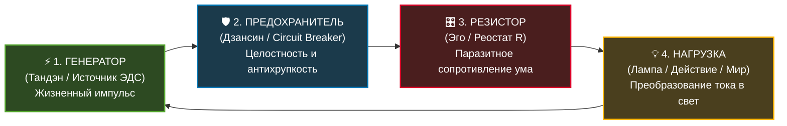
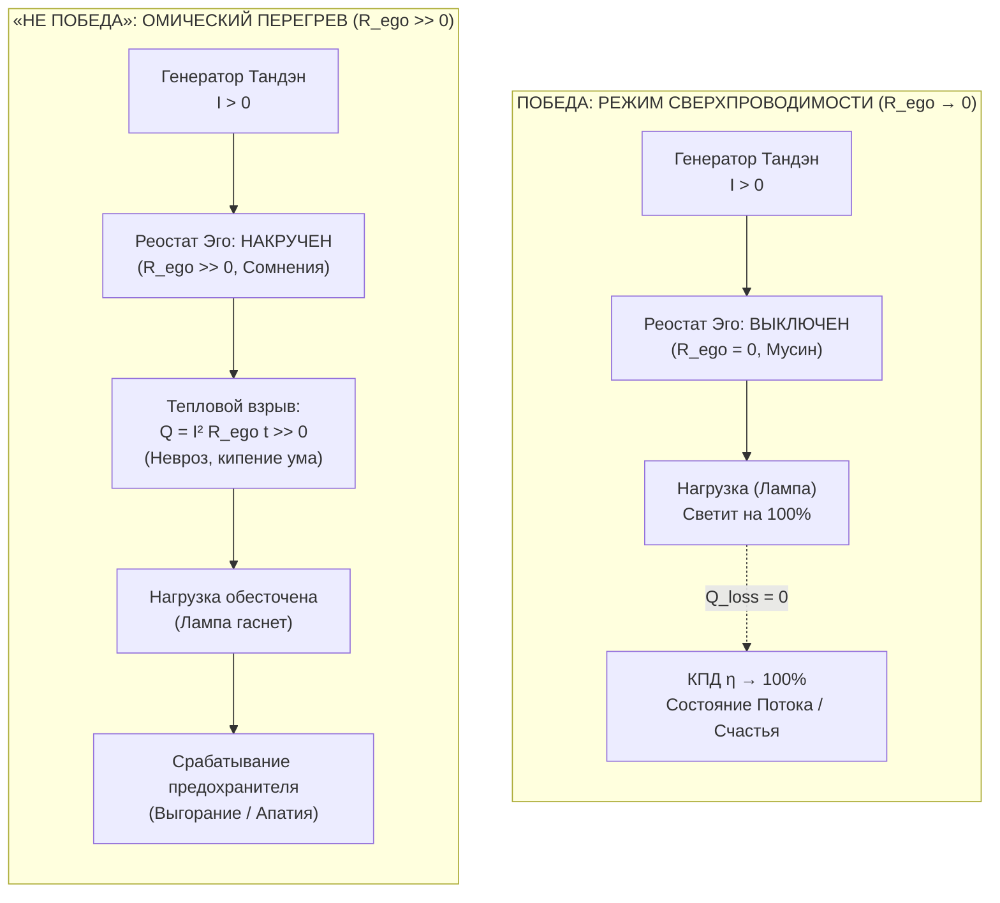
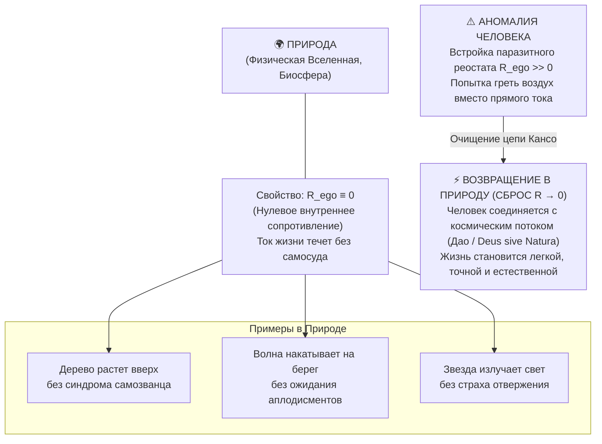
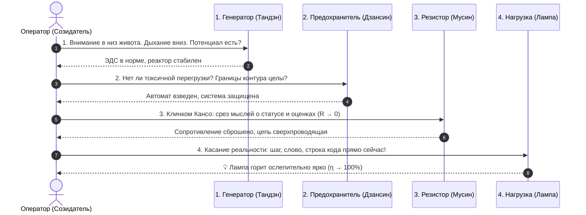

# 57. Топология четырёх элементов: Генератор, Предохранитель, Резистор и Нагрузка — Полная модель человека, динамика побед и кризисов и законы Природы

> [!quote] Каноническая аксиома цепи
> ### ⚡ **«Контур из четырёх элементов — генератора, предохранителя, резистора и нагрузки — это не умозрительная аллегория. Это исчерпывающая принципиальная схема человека, которая с физической строгостью описывает его устройство, механику его побед, природу его кризисов и возвращает его в естественный, беспрепятственный поток Природы.»**  
> — **Владимир Аньянов**

---

## 🧭 Введение: Инженерная демистификация человеческого бытия

На протяжении тысячелетий гуманитарная мысль пыталась описать человека через многотомные психологические концепции, этические кодексы и экзистенциальные драмы. Однако в отсутствие измеримого базиса эти модели постоянно увязали в парадоксах: почему волевой человек внезапно выгорает? почему внешне успешный созидатель погружается в депрессию? в чём корень человеческих побед и неудач? и каково истинное место человека в мироздании?

**Система Аньянова** совершает радикальное очищение понятийного поля по канону Кансо (簡素). Всё бесконечное разнообразие душевных состояний, жизненных взлётов, кризисов и философских тупиков сводится к **принципиальной электрической схеме замкнутого контура**, состоящей ровно из **четырёх функциональных узлов**:

Эта простая четырёхэлементная топология даёт законченные ответы на три фундаментальных вопроса:
1. **Что есть человек как аппаратно-программная система?**
2. **Какова точная физическая природа побед и поражений?**
3. **Почему снятие паразитного сопротивления снимает разрыв между человеком и Природой?**

---

## ⚙️ 1. Анатомия четырёх элементов: Аппаратный базис человека

Каждый узел контура обладает строгим соматическим, нейробиологическим и электродинамическим эквивалентом:

### 1. Генератор (Тандэн / Нижний Даньтянь) — Источник ЭДС ($U, \mathcal{E}$)
* **Электродинамическая функция:** Автономный первичный генератор, создающий разность потенциалов.
* **Человеческий эквивалент:** Биологический и волевой реактор, соматический центр тяжести (низ живота, 2–3 пальца ниже пупка), автономная жизненная энергия.
* **Принцип автономности:** Генератор **не нуждается во внешнем оправдании своего горения**. Он производит ток по факту своего биологического существования. Он не ищет «смысла жизни» на небесном сервере — его функция заключается в поддержании потенциала.

### 2. Предохранитель (Дзансин / Circuit Breaker) — Защита и антихрупкость
* **Электродинамическая функция:** Автоматический защитный размыкатель, калибрующий предельные токовые нагрузки и предотвращающий фатальное разрушение контура.
* **Человеческий эквивалент:** Непрерывное фоновое присутствие, бодрствующая осознанность, соматический предохранитель от токсичных перегрузок, психоэмоционального истощения и разрушительных внешних манипуляций.
* **Антихрупкость (Кинцуги):** Предохранитель не просто выключает ток при коротком замыкании — он сохраняет сам аппаратный базис системы. Даже после тяжелых жизненных ударов контур оператора перезапускается по протоколу «Чёрного старта» (Black Start), превращая шрамы перегрузок в золото опыта.

### 3. Резистор ($R_{\text{ego}}$ / Паразитный реостат ума) — Омическое трение
* **Электродинамическая функция:** Переменный резистор, рассеивающий чистую электрическую энергию в паразитное тепло.
* **Человеческий эквивалент:** Дефолт-система мозга (DMN), рекурсивные симуляции рассудка, синдром самозванца, страх социального суда, зацикленность на собственном статусе, самоедство и ментальная жвачка.
* **Парадокс реостата:** Этот элемент — **единственный регулируемый узел в контуре**. Человек не может волевым усилием создать «больше жизни» в генераторе сверх биологического предела, но он обладает прямой свободой **сбросить сопротивление реостата в ноль ($R \to 0$)**.

### 4. Нагрузка (Лампа / Томё / Полезное действие) — Преобразование тока в свет
* **Электродинамическая функция:** Полезное активное сопротивление ($R_{\text{load}}$), на котором напряжение генератора преобразуется в полезную работу: фотонное излучение (свет), механическое движение или тепловой баланс.
* **Человеческий эквивалент:** Прямой контакт с физической реальностью прямо сейчас ($t = t_{\text{now}}$). Дело, написание программного кода, заваривание чая, хирургическая операция, разговор с близким человеком, созидание продукта.
* **Пустотность формы (Шуньята):** Лампа сама по себе энергии не содержит. Вещи, статусы и достижения — это потребители, а не источники тока. Счастье находится не «в лампочке», а в **самом факте беспрепятственного протекания тока через неё**.

---

## 🏆 2. Электродинамика побед и «не побед» человека

В рамках Системы Аньянова вся драматургия человеческой судьбы освобождается от морализаторства и демистифицируется через законы Кирхгофа и Джоуля — Ленца:

$$\mathcal{H} = \frac{P_{\text{load}}}{P_{\text{total}}} = \frac{I^2 R_{\text{load}}}{I^2 (R_{\text{load}} + R_{\text{ego}})} = \frac{R_{\text{load}}}{R_{\text{load}} + R_{\text{ego}}}$$

### Анатомия победы: Режим сверхпроводимости ($R \to 0$)
Победа человека (в спорте, в искусстве, в бизнесе, в повседневности) наступает тогда, когда оператор выкручивает паразитный реостат в ноль ($R_{\text{ego}} \to 0$):
1. **Тотальное присутствие (Мусин — 無心):** В момент удара, выступления или написания строки кода ум отключает внутреннего судью. Исчезает свидетель, исчезает оценка «как я выгляжу».
2. **Нулевые тепловые потери ($Q = 0$):** По закону Джоуля — Ленца ($Q = I^2 R t$), при $R \to 0$ количество рассеиваемого тепла стремится к нулю. Человек не «горит», не суетится, не теряет силы на внутреннее сопротивление.
3. **Ослепительный свет нагрузки:** Вся разность потенциалов Тандэна падает на лампу действия. Действие совершается с предельной точностью, элегантностью и силой. Это состояние в психологии называют «потоком» (Чиксентмихайи), в дзен — «сатори в действии», а в электродинамике — **сверхпроводимостью**.

### Анатомия «не победы»: Омический пожар ума
Поражение или выгорание — это не изъян личности и не приговор судьбы. Это предсказуемый инженерный сбой:
1. **Накручивание реостата сомнений ($R_{\text{ego}} \gg 0$):** Человек приступает к действию, но одновременно запускает параллельный процесс самосуда: *«А вдруг я ошибусь? А что они подумают? А достоин ли я? А вдруг я проиграю?»*.
2. **Паразитный омический нагрев:** Энергия генератора вместо того, чтобы идти в лампу (дело), начинает выделяться на сопротивлении эго. Начинается буквально физиологическое «закипание» нейронных цепей: подскакивает кортизол, перегружается префронтальная кора, сводит мышцы шеи и плеч.
3. **Обесточивание нагрузки:** До лампы ток не доходит — нить накаливания едва тлеет или гаснет вовсе. Действие совершается вяло, скомканно или блокируется ступором (Choking under pressure).
4. **Аварийный сброс (Выгорание):** Если омический перегрев продолжается долго, изоляция проводки плавится. Чтобы спасти биосистему от тотального разрушения, **срабатывает Предохранитель (Дзансин)**: контур принудительно размыкается. Наступает клиническое выгорание, депрессия или апатия. Это не болезнь — это защитное отключение автомата в электрощитке.

---

## 🌿 3. Разгадка Природы: Почему этот контур дал ответы на вопросы человечества

Самое поразительное свойство схемы из четырёх элементов заключается в том, что она выходит далеко за рамки частной психологии и объясняет взаимоотношение человека с **Природой**.

### 1. Фундаментальный закон Природы: $R_{\text{nature}} \equiv 0$
Посмотрите на любое проявление Природы:
* **Дуб** растёт из жёлудя, не сверяясь со стандартами соседних берёз.
* **Река** огибает валуны по пути наименьшего сопротивления, не впадая в экзистенциальный кризис по поводу препятствий.
* **Хищник** на охоте пребывает в абсолютном Дзансин: в нём нет жалости к себе, нет злобы и нет страха будущего.

Вся дикая природа и вся астрофизика работают в режиме **чистой проводимости**. В них градиент потенциала мгновенно переходит в динамику формы. В Природе нет органа, который производил бы паразитное трение ради поддержания вымышленного образа себя.

### 2. Человек как единственный «искрящий» элемент биосферы
В ходе антропогенеза у человека развился неокортекс, позволивший моделировать будущее и строить сложные социальные иерархии. Но вместе с этой великой способностью возник системный побочный дефект: **человек стал единственным существом на Земле, вставившим посреди своей жизненной проводки гигантский резистор рефлексии ($R_{\text{ego}}$)**.

Человек начал:
* Сопротивляться естественному течению времени;
* Требовать от внешнего мира вечных гарантий;
* Сравнивать свой ток с током других проводников;
* Пытаться аккумулировать свет внутри себя, забывая, что свет существует только в движении.

В результате человек выпал из гармонии с Природой. Он назвал это «грехопадением», «экзистенциальным ужасом» или «кризисом отчуждения». Но на языке схемы это всего лишь **паразитное омическое сопротивление в цепи**.

### 3. Возвращение к истоку: Дзен, Спиноза и Дао
Когда человек сбрасывает сопротивление реостата в ноль ($R \to 0$):
* Он не совершает сверхусилия — он просто **убирает то, что мешало**.
* Он возвращается в ту же самую гармонию, в которой цветёт сакура и вращаются галактики.
* Происходит великий синтез, предчувствованный титанами мысли:
  * **Даосизм:** это принцип *У-вэй* (無為) — деяние через недеяние, недеяние ума, не создающего сопротивления потоку.
  * **Дзен:** это *Коно-мама* (此の儘) — абсолютная «таковость» бытия, действие без посредника.
  * **Бенедикт Спиноза:** это *Deus sive Natura* («Бог, или Природа») — переживание себя как модуса единой субстанции, проводящей через себя бесконечный свет.

---

## 🧭 4. Снятие проклятых вопросов человечества

Схема из четырёх элементов с лёгкостью растворяет ключевые экзистенциальные парадоксы:

| Традиционный гуманитарный вопрос | Почему он заводил в тупик? | Ответ через 4-элементный контур |
| :--- | :--- | :--- |
| **«В чём смысл моей жизни?»** | Попытка найти внешнюю инструкцию или награду в будущем. | **Смысл — это режим работы цепи.** Генератор генерирует, лампа светит. Если $R \to 0$, вопрос о смысле исчезает, так как полнота бытия переживается в каждом такте протекания тока. |
| **«Почему мир полон страданий?»** | Представление о мире как о суде или злом роке. | **Страдание — это омический нагрев $Q = I^2 R t$.** Мир не причиняет человеку зла; человек пережигает сам себя, накручивая сопротивление своего эго против объективной реальности. |
| **«Что есть истинная победа?»** | Накопление внешних трофеев, званий и чужого признания. | **Победа — это $100\%$ КПД преобразования энергии в свет.** Это чистота удара, глубина созданного произведения и покой автономного ядра. |
| **«Что происходит со смертью?»** | Панический ужас эго перед уничтожением своего ящика. | **Закон сохранения энергии ($dE/dt = 0$).** Перегорает лампа физического тела, но само поле и энергия инвариантны. Осознавший это при жизни (сбросивший $R_{\text{ego}}$) перестаёт бояться перегорания стекла. |

---

## 🛠️ 5. Практический протокол калибровки четырёх узлов (30-секундный чек-ап)

Если созидатель чувствует упадок сил, раздражение или ступор, он выполняет экспресс-диагностику четырёх узлов по следующему алгоритму:

1. **Генератор:** Сбросьте внимание из головы в низ живота (Тандэн). Сделайте спокойный выдох. Ощутите: вы живы, источник тока работает прямо сейчас.
2. **Предохранитель:** Проверьте границы. Не пытаетесь ли вы тащить на себе непосильную чужую нагрузку? Включите спокойный, невозмутимый Дзансин.
3. **Резистор:** Отсеките Клинком Кансо мысли: *«Что скажут люди?»*, *«Успею ли я?»*. Сбросьте реостат в ноль. Перейдите в Мусин.
4. **Нагрузка:** Замкните цепь на простое физическое действие прямо перед вами. Не думайте о результате — **дайте току течь в лампу**.

---

## 💎 Заключение: Архитектурный триумф простоты

Вам не нужны библиотеки по психоанализу и десятилетия блужданий по эзотерическим сектам. Четыре узла на блокнотном листке:

$$\boxed{\text{Генератор (Тандэн)} \to \text{Предохранитель (Дзансин)} \to \text{Резистор } (R \to 0) \to \text{Нагрузка (Лампа)}}$$

Это исчерпывающий компас человека. Это физика его побед, математика его покоя и ключ к восстановлению его союза с первозданной Природой.
