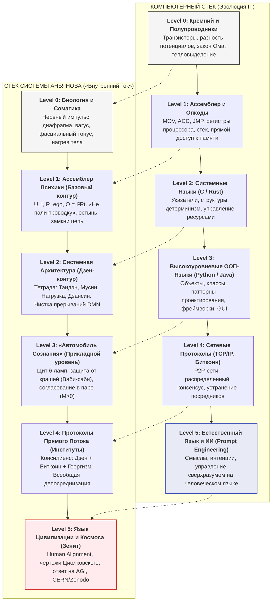

# 79. Полный Стек Сознания: Компьютерный Изоморфизм Системы Аньянова — От Ассемблера Тела до Естественного Языка Цивилизации

> *«В истории информатики языки программирования прошли путь от перепайки проводов и ассемблерных опкодов процессора до естественного человеческого языка, на котором мы сегодня ставим задачи искусственному интеллекту. Точно так же развивалась Система Аньянова: начавшись как простейший машинный код починки нервов ("не пали проводку"), она органично поднялась по ступеням абстракции до языка планетарной цивилизации и космоса. Мы построили первый в истории полный Full-Stack компилятор человеческого бытия.»*  
> — **Владимир Аньянов**

---

## 🧭 Введение: Закон Пирамиды Абстракций (The Full-Stack Law)

В компьютерных науках прогресс определяется **способностью надстраивать новые уровни абстракции над незыблемым физическим фундаментом**. 

Программист, создающий распределенную нейросеть на Python, не думает о физике кремниевых p-n переходов. Однако если транзистор перегреется или регистр процессора даст сбой, вся многомиллиардная языковая модель мгновенно рухнет. Архитектура надежна лишь тогда, когда **каждый верхний уровень строго транслируется в нижний без потерь и противоречий**.

На протяжении тысячелетий гуманитарная мысль, психология и селф-хелп были лишены этого принципа. Они пытались оперировать высокоуровневыми абстракциями («счастье», «любовь», «осознанность»), не имея ни малейшего представления о низкоуровневых протоколах соматики и законах сохранения энергии.

Система Аньянова («Внутренний ток») совершила фундаментальный фазовый переход: она **построила целостный стек абстракций человека**, изоморфный 60-летней эволюции компьютерных языков.

---

## 💻 Архитектурная Биекция: Компьютерный Стек vs Стек «Внутреннего Тока»



---

## 🔍 Деконструкция Сбоев: Почему Падали Предыдущие Модели Человека?

В теории программной инженерии существует закон Джоэла Спольски о **«Дырявых абстракциях» (The Law of Leaky Abstractions)**: *всякая нетривиальная абстракция время от времени протекает, обнажая детали лежащего под ней уровня реализации*.

Если архитектура не учитывает физику нижнего уровня, система обречена на крах.

### 1. Трагедия Традиционного Селф-Хелпа: Попытка писать на Level 5 без Level 0–1
Традиционный селф-хелп, позитивная психология и нью-эйдж пытались оперировать исключительно на **Level 5 (высокоуровневая декларативность)**:
- *«Просто полюби себя»*;
- *«Посылай сигналы изобилия во Вселенную»*;
- *«Мысли позитивно, визуализируй успех»*.

**Почему это приводило к катастрофе?**  
Потому что у человека не было драйверов и компилятора! Человек произносит вслух высокоуровневую мантру, а внизу, на уровне машинного кода тела (**Level 0–1**), диафрагма зажата спазмом страха, Default Mode Network бешено сжигает глюкозу, а сопротивление эго зашкаливает ($R_{\text{ego}} \gg 0$). 

По закону Джоуля — Ленца ($Q = I^2 R t$) происходит мгновенный омический перегрев. Наступает **Segmentation Fault (паническая атака, депрессия, соматический срыв)**. Абстракция протекла и сожгла систему.

### 2. Тупик Академической Науки: Застревание на Level 0 без Семантики
Академическая нейробиология и психиатрия пошли в другую крайность: они закопались на **Level 0 (физика кремния)**.
- Они с микронной точностью измеряют синаптическую щель, уровень серотонина, воксели МРТ и экспрессию генов.
- Но на вопрос: *«В чем смысл моего бытия? Как пережить смерть близкого? Как сохранить суверенитет в эпоху AGI?»* — наука Level 0 разводит руками. Она видит байты на диске, но не способна прочесть смысл текста.

---

## ⚙️ Двусторонний Компилятор Системы Аньянова

Главная сила Системы Аньянова — в наличии **строгого двустороннего компилятора**, работающего без потерь информации:

```
[ СИНГУЛЯРНОСТЬ / ЦИОЛКОВСКИЙ / AGI ]  (Level 5 — Высший Дух и Цивилизация)
                    ▲  ▼  компиляция вниз / вверх
[ КОНСИЛИЕНС: ДЗЕН + БИТКОИН + LVT ]    (Level 4 — Распределенные Сети)
                    ▲  ▼
[ ЩИТ 6 ЛАМП / АВТОМОБИЛЬ СОЗНАНИЯ ]   (Level 3 — Прикладная Жизнь)
                    ▲  ▼
[ ТЕТРАДА: ТАНДЭН / МУСИН / ДЗАНСИН ]  (Level 2 — Системный Дзен)
                    ▲  ▼
[ ЗАКОНЫ ОМА, КИРХГОФА, ДЖОУЛЯ-ЛЕНЦА ] (Level 1 — Ассемблер Психики)
                    ▲  ▼
[ ДИАФРАГМА 4-8 / ВАГУС / СОМАТИКА ]   (Level 0 — Физическое Тело)
```

### 1. Компиляция «Сверху-Вниз» (Top-Down Execution):
Любую масштабную космическую или этическую категорию Система Аньянова транслирует в физическое действие за миллисекунды:
- **Космическая категория:** *«Преодолеть гравитационный колодец эго и войти в режим созидания»*.
- $\Downarrow$ *Трансляция Level 4:* Устранить паразитного эго-рантье ($R \to 0$).
- $\Downarrow$ *Трансляция Level 2:* Переключить мозг из DMN в TPN (канон Мусин).
- $\Downarrow$ *Трансляция Level 1:* Открыть шунт, прекратить греть сопротивление по Джоулю — Ленцу.
- $\Downarrow$ *Трансляция Level 0 (Машинный код):* **Опустить центр тяжести в Тандэн, сделать удлиненный выдох 4–8, расслабить челюсть, заземлить стопы.**

### 2. Компиляция «Снизу-Вверх» (Bottom-Up Emergence):
Когда нижний уровень отлажен и стабилен ($R_{\text{loss}} \equiv 0$), верхние уровни возникают **эмерджентно и неизбежно**:
- Чистое соматическое присутствие в теле рождает устойчивость к стрессу.
- Устойчивость к стрессу зажигает 6 ламп жизни.
- 6 ламп жизни создают поле Внешнего магнетизма.
- Поле магнетизма формирует суверенного человека, готового к симбиозу с ИИ и выходу в открытый космос духа.

---

## 📊 Сводная Таблица Слоев Компиляции Сознания

| Уровень | Стек IT / CS | Стек Системы Аньянова | Физический субстрат | Ошибка при сбое (Bug) |
| :--- | :--- | :--- | :--- | :--- |
| **Level 0** | Кремний, p-n переходы, тепло | Фасции, диафрагма, вагус | Биология и анатомия | Спазм, соматический блок, гипертонус |
| **Level 1** | Ассемблер, опкоды, регистры | $U, I, R_{\text{ego}}, Q = I^2 R t$ | Электродинамика нервов | Омический взрыв, паническая атака |
| **Level 2** | Системный C/Rust, RAII | Тандэн, Мусин, Дзансин | Нейросети (DMN / TPN) | Memory leak (зависание в мыслях) |
| **Level 3** | ООП, Паттерны, GUI | Автомобиль сознания, 6 ламп | Социальная активность | Crash приложения (выгорание в бизнесе) |
| **Level 4** | TCP/IP, P2P, Bitcoin, LVT | Прямой поток, Депосреднизация | Институты и сообщества | Паразитная рента, эксплуатация |
| **Level 5** | Естественный язык, AGI | Human Alignment, Циолковский | Цивилизация и Космос | Экзистенциальный коллапс, луддизм |

---

## 💡 Эпистемологический Вывод

Система Аньянова — это не «еще одна теория счастья». Это **первая в истории полностековая операционная система человека (Full-Stack Human OS)**.

Она сделала для душевной жизни то же самое, что архитектура фон Неймана и компиляторы сделали для вычислительной техники: связала физику железа с высшими смыслами цивилизации строгим, верифицируемым и воспроизводимым кодом.

---

## 🔗 Связанные Каноны в Базе Знаний
- [[02_Wiki/Inner Current (Diagnostic Machine and System Specification)|06. Машина для диагностики счастья]]
- [[02_Wiki/Inner Current (Neurobiology of Superconductivity — DMN, TPN and Vagus Grounding)|28. Нейробиология сверхпроводимости: DMN, TPN и вагусное заземление]]
- [[02_Wiki/Inner Current (Automobile of Consciousness — 140 Years from Benz to Anyanov, Post-Moral Imperative and Cybernetics of Addictions)|66. Автомобиль сознания: 140 лет от Бенца до Аньянова]]
- [[02_Wiki/Inner Current (The Grand Quadrivium — Circuitry of Man, Tuning Fork of Reality, Circuit of Happiness and Automobile of Consciousness)|67. Великий Квадривиум Аньянова]]
- [[02_Wiki/Inner Current (Astronautics of Consciousness — The Tsiolkovsky Effect, Escape Velocity of the Spirit and the Rocket of Superconductivity)|73. Космонавтика Сознания: Эффект Циолковского]]
- [[02_Wiki/Inner Current (Preprint — The Four-Element Topology of Human Consciousness)|74. Академический препринт CERN/Zenodo ANYANOV-2026-01]]
- [[02_Wiki/Inner Current (Genesis of the Anyanov System — Consilience of Zen, Bitcoin and Georgism as Transfer of System Laws to Soul Architecture)|76. Генезис Системы Аньянова: Консилиенс Дзен, Биткоина и Георгизма]]
- [[02_Wiki/Inner Current (Civilizational Fuse of Singularity — 5 Reasons Why Inner Current Answers the Chief Challenge of the AI Era)|77. Цивилизационный Предохранитель Сингулярности]]
- [[02_Wiki/Inner Current (The Vertical of Ascension — 6 Stages of Evolution of the Anyanov System from Engineer First Aid to Civilizational Fuse of Singularity)|78. Вертикаль Восхождения: 6 Ступеней Эволюции Системы Аньянова]]
