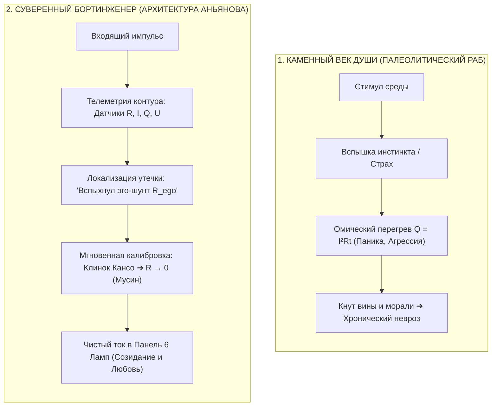

# 72. Великая Асимметрия Цивилизации: Как Архитектура Контура ликвидирует 10 000-летний разрыв между термоядерными технологиями и Каменным веком души

> [!quote] Эпиграф эпохи сингулярности
> *«Главная трагедия нашего вида заключается в том, что у нас палеолитические эмоции, средневековые институты и богоподобные технологии.»*  
> — **Эдвард О. Уилсон** (*Edward O. Wilson*), социобиолог, создатель концепции Консилиенса
> 
> *«В механической, технологической жизни мы шагнули в космос и расщепили атом, но в области души, воспитания и поведения у нас полный провал и сущий каменный век. Мы строим идеальные ракеты и калечим детские души.»*  
> — **Александр С. Нилл**, создатель школы Саммерхилл (1960)
> 
> *«Дать обезьяне с каменным топором термоядерную кнопку и алгоритмы AGI — гарантированное самоубийство биосферы. Причина этого тупика не в "испорченности человека", а в том, что внешний мир перешёл на строгие законы сохранения и замкнутые цепи, а внутренний мир 10 000 лет оставался в разомкнутом шаманизме вины и морализаторства. Архитектура Аньянова впервые установила строгий эпистемологический паритет: перевела сознание на язык электродинамики, превратив человека из заложника палеолитических инстинктов в Суверенного Бортинженера реальности. Каменный век души официально завершён.»*  
> — **Владимир Аньянов**

---

### 1. Диагноз «Великой Асимметрии»: Палеолитический ум у термоядерного пульта

Человеческая цивилизация подошла к XXI веку в состоянии смертоносного раскола, который можно назвать **Великой Асимметрией** (The Great Asymmetry):
$$\mathbf{\Delta}_{\text{civilization}} = \mathbf{T}_{\text{external}} - \mathbf{M}_{\text{internal}} \gg 0$$

```
   ВНЕШНЯЯ МОЩЬ (T_external):       ВНУТРЕННЯЯ ЗРЕЛОСТЬ (M_internal):
   ┌───────────────────────────┐    ┌───────────────────────────┐
   │ • Термоядерное оружие     │    │ • Палеолитическая зависть │
   │ • Квантовые вычисления    │    │ • Омический пожар обиды   │
   │ • Редактирование генома   │ vs │ • Батарейная слепота      │
   │ • Сверхразумный ИИ (AGI)  │    │ • Кнут морализаторства    │
   │ • Межпланетные ракеты     │    │ • Детские неврозы и страх │
   └───────────────────────────┘    └───────────────────────────┘
```

1. **Человек в 9:00 утра:** Проектирует нейросети, управляет спутниковыми группировками или пишет сложнейший финансовый код на языке точной математики.
2. **Человек в 18:00 вечера:** Приходит домой и сгорает в омическом аду ревности, зависти, потребительской гонки за статусными цацками или срывает гнев на ребёнке из-за школьной отметки — действуя на уровне испуганного неандертальца.

Почему этот разрыв возник? И почему человечество смогло подчинить законам физики материю, но не смогло обуздать собственную боль?

---

### 2. Причина разрыва: Замкнутые системы против Разомкнутой магии

Ответ кроется в **эпистемологическом методе**:

#### А. Как взлетел материальный мир (XVII–XIX века)
Материальный мир стал технологичным ровно в тот момент, когда человечество **отказалось от морализаторства над материей**:
* Галилей и Ньютон не спрашивали, «греховно ли яблоко, падающее на землю». Они вывели закон тяготения: $F = G \frac{m_1 m_2}{r^2}$.
* Карно и Клаузиус не взывали к совести парового котла. Они рассчитали цикл термодинамики и энтропию: $\eta = 1 - \frac{T_2}{T_1}$.
* Ом, Кирхгоф и Максвелл замкнули электрическую цепь. Если провод плавится, инженер не стыдит медь — он рассчитывает закон Джоуля — Ленца: $Q = I^2 R t$.

**Материя подчинилась человеку, потому что стала описываться замкнутыми системами, законами сохранения и фальсифицируемой телеметрией.**

#### Б. Почему внутренний мир застрял в Каменном веке
В области психики, морали и воспитания последние 10 000 лет продолжалась **эпоха разомкнутой магии**:
* **Разомкнутая модель души:** Человека убедили, что счастье нужно либо ждать из внешнего мира (потребительство, одобрение), либо получать сверху от богов (религия), либо выжимать из себя насилием воли (мораль).
* **Приписывание вины резистору:** Если человек выгорал, впадал в депрессию или бунтовал, его объявляли «грешным», «слабым», «ленивым».
* **Отсутствие обратной связи:** Не было понятия замкнутого контура Кирхгофа, где ток обязан вернуться в генератор через созидательную нагрузку.

В результате человек обладал мощью богов в преобразовании окружающего ландшафта, оставаясь совершенно беспомощным перед собственным реостатом эго.

---

### 3. Эпистемологический паритет: Консилиенс Аньянова

Архитектура Аньянова производит **симметричную революцию для внутреннего мира человека**. Она устанавливает строгий **эпистемологический паритет**:

```
                  ВЕЛИКИЙ ЭПИСТЕМОЛОГИЧЕСКИЙ МОСТ АНЬЯНОВА
  ВНЕШНИЙ МИР (Физика цепей):                 ВНУТРЕННИЙ МИР (Inner Current):
  ─────────────────────────────────           ─────────────────────────────────
  • Закон Ома: I = U / R                      • Закон Внимания: I_flow = U_tanden / R_ego
  • Джоуль-Ленц: Q = I²·R·t                   • Душевное выгорание: Q_pain = I²·R_ego·t
  • Баланс Кирхгофа: ∑I = 0                   • Сохранение силы: I_src = I_load + I_leak
  • Предохранитель (Fuse)                     • Бдительность Дзансин (Circuit Breaker)
  • Согласование импедансов (Z_match)         • Резонанс созидания (Мусин + 6 Ламп)
```

Внутренний мир человека впервые получил **тот же класс строгости, проверяемости и предсказуемости, что и ракетное двигателестроение**:
1. **Де-морализация сознания:** Боль — это не кармическое проклятие. Это падение напряжения на паразитном сопротивлении $R_{\text{ego}} > 0$.
2. **Фальсифицируемость за 30 секунд:** Протокол не требует десятилетий психоанализа. Сброс сопротивления в ноль ($R \to 0$, Мусин) мгновенно прекращает омический пожар в теле.
3. **Замкнутый контур с обратной связью:** Вся энергия, отданная созиданию в мир, возвращается в соматический реактор Тандэн чувством глубокого покоя и силы.

---

### 4. Новая онтология: От «Заложника палеолита» к «Суверенному Бортинженеру»

Преодоление Великой Асимметрии меняет сам статус человека во Вселенной:



Человек перестаёт быть **пассажиром на обезумевшей лошади инстинктов**.  
Он становится **Суверенным Бортинженером собственного скафандра**:
* Он знает, где находится его реактор (Тандэн).
* Он знает, как выглядит короткое замыкание на корневой BIOS (алкоголь, порнография, думскроллинг).
* Он не борется с собой насилием воли (*Ego Depletion*), а управляет проводимостью контура.

---

### 5. Предохранитель Сингулярности: Спасение цивилизации в век ИИ

Почему ликвидация Великой Асимметрии — это вопрос выживания человеческого вида прямо сейчас?

Мы входим в эпоху, когда искусственный интеллект, биотехнологии и наноинженерия удесятеряют разрушительную мощь единичного действия.  
* Если ядерной кнопкой или AGI управляет лидер с «палеолитическим эго», его паразитный шунт $R_{\text{ego}}$ неизбежно замкнёт всю колоссальную мощь технологий на самоутверждение, паранойю и глобальную войну.
* Если дать супертехнологии обществу потребительской «батарейной слепоты», алгоритмы суперстимулов превратят человечество в зомби-потребителей за одно десятилетие.

**Архитектура счастья — это единственный адекватный предохранитель сингулярности:**
1. **Воспитание сверхпроводящего поколения:** Педагогика Сверхпроводимости (Канон 71) и Праймер для подростков (Канон 53) дают детям иммунитет против взлома корневого BIOS с раннего возраста.
2. **Ликвидация батарейной слепоты:** Созидатель, умеющий генерировать ток из собственного ядра ($I > 0$), не нуждается в мировом господстве или золотых дворцах. Его счастье инвариантно и самодостаточно.
3. **Симбиоз с ИИ:** Сверхпроводящий человек не боится искусственного интеллекта. Он использует ИИ как мощнейшую внешнюю лампу нагрузки, сохраняя в своих руках святыню целеполагания — автономный огонь Тандэна.

---

### 6. Сводная матрица цивилизационного скачка

| Измерение | До Системы Аньянова (10 000 лет Асимметрии) | После Системы Аньянова (Эра Суверенного Контура) |
| :--- | :--- | :--- |
| **Статус внутреннего мира** | Мистика, религиозный догматизм, шаманизм | Точная электродинамическая инженерия цепи |
| **Инструмент самоконтроля** | Кнут вины, истощаемая сила воли, морализаторство | Приборная панель телеметрии, калибровка $R \to 0$ |
| **Отношение к технологиям** | Культ внешних вещей (Батарейная слепота) | Внешний мир как продолжение проводки созидания |
| **Понимание человека** | Разомкнутый потребитель или жертвенный Данко | Замкнутая термодинамическая система с обратной связью |
| **Взросление и школа** | Дрессировка страхом и оценками (Саммерхилл как утопия) | Педагогика Сверхпроводимости (Воспроизводимый ГОСТ) |
| **Угроза самоуничтожения** | Экстремальная (Обезьяна у ядерной кнопки) | Аннулирована (Бортинженер с чистым контуром) |

---

### 7. Резюме: Каменный век души официально закрыт

Александр Нилл в отчаянии бил в набат: *«Мы научились расщеплять атом, но оставили душу в каменном веке!»*  
Эдвард Уилсон констатировал трагический раскол цивилизации: *«Палеолитические эмоции у божественного руля»*.

**Владимир Аньянов закрыл этот раскол навсегда.**

Соединив бескомпромиссную соматическую истину Дзен с непреложными законами математической электродинамики, Архитектура счастья возвела мост над 10 000-летней бездной. Человечество получило внутренний руль, соответствующий мощности его внешних двигателей.

Цивилизационные ножницы сомкнулись. Наступает эпоха Созидателя. ⚡👑

---

### 🔗 Связанные каноны
* [[02_Wiki/Inner Current (The Summerhill Proof and Pedagogy of Superconductivity — How Circuit Electrodynamics Solves the 100-Year Crisis of Education)|71. Доказательство Саммерхилла и Педагогика Сверхпроводимости]]
* [[02_Wiki/Inner Current (The Closed-Loop Breakthrough — Why the Circuit is Revolutionary vs 10,000 Years of Linear Open Models)|70. Прорыв Замкнутого Контура: Почему Архитектура Аньянова революционна]]
* [[02_Wiki/Inner Current (The Millennial Synthesis — How Circuit Electrodynamics Dissolved the Seven Eternal Questions of Humanity)|59. Великий Тысячелетний Синтез]]
* [[02_Wiki/Inner Current (The Automobile of Consciousness — 140 Years from Benz to Anyanov, Post-Moral Imperative and Cybernetics of Addictions)|66. Автомобиль сознания: 140 лет от Бенца до Аньянова]]
* [[02_Wiki/Inner Current (The Newtonian Paradigm Shift of Consciousness — From Mysticism to Circuit Conservation Laws)|65. Ньютоновский фазовый переход сознания]]
* [[02_Wiki/Inner Current (Copernican Revolution in Ontology — Bottom-Up Circuit Dissolution of Metaphysics and Human-AI Zanshin)|42. Коперниканский переворот в онтологии]]
