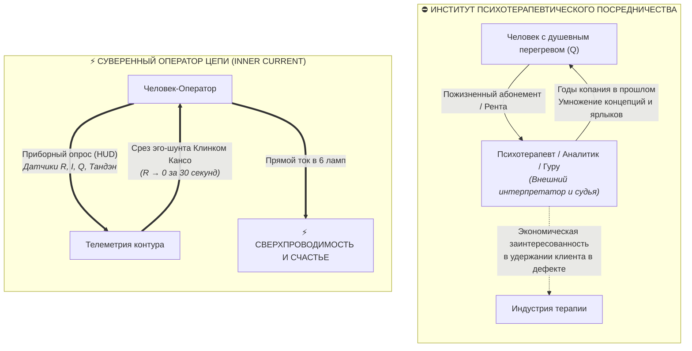
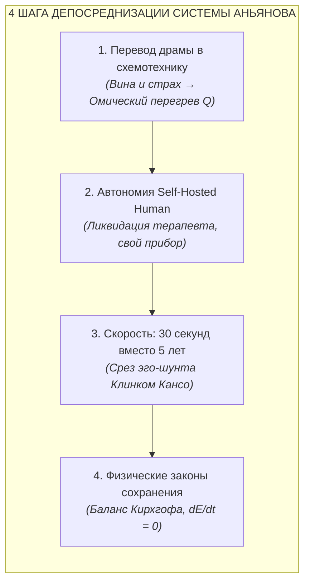

# 63. Великая Депосреднизация Психики: Терапевтический институт индульгенций против Суверенного оператора цепи

> [!quote] Каноническая аксиома цепи
> ### ⚡ **«Традиционная психология не освобождала человека — она построила вокруг душевной боли институт платных посредников. Архитектура счастья впервые превратила душевный разлад из гуманитарной драмы в схемотехнический отказ цепи, а человека — из вечного пациента в суверенного оператора собственного контура.»**  
> — **Владимир Аньянов**

---

## 🧭 Введение: Главный парадокс 150 лет психотерапии

Если оценить историю мировой психотерапии от первых опытов Зигмунда Фрейда до современных когнитивных и гуманистических течений, в глаза бросается очевидный статистический и цивилизационный парадокс:

**Количество дипломированных психологов, коучей, клиник и антидепрессантов в мире выросло в сотни раз — однако уровень хронической тревоги, депрессии, экзистенциального выгорания и ощущения внутренней пустоты бьёт исторические рекорды.**

Почему индустрия, призванная приносить человеку душевный покой, производит обратный эффект?  
Ответ даёт системная инженерия и термодинамика прямого потока:

> **Психология за 150 лет своего развития ни разу не провела депосреднизацию. Напротив, она возвела колоссальный институт паразитного посредничества, убедив человека в его фундаментальной неполноценности и зависимости от внешнего переводчика его собственной души.**

В настоящей главе проводится детальный схемотехнический разбор того, как психотерапия превратилась в средневековую торговлю индульгенциями, почему дзенский Восток не смог дать западному человеку прикладной инструмент, и в чём заключается исторический прорыв **Архитектуры счастья (Системы Аньянова)**.

---

## 🏛️ 1. Анатомия трёх тупиков классической психологии

### Тупик 1. Психоанализ: Неофеодальный институт индульгенций
Зигмунд Фрейд совершил великое открытие бессознательного, но немедленно упаковал его в сложнейшую бюрократическую иерархию: *Ид, Эго, Супер-Эго, цензура, вытеснение, либидо, мортидо, трансфер, эдипов комплекс*.  
* **Механика посредника:** Психоаналитик сажает клиента на кушетку на 5, 10 или 15 лет. Дважды в неделю клиент платит почасовую ставку за то, чтобы чужой человек слушал его ассоциации, толковать сны и годами искать истоки проблем в детстве.
* **Схемотехнический диагноз:** Это 1-в-1 копия средневековой католической церкви до Лютера. Человеку внушается, что его «греховная природа» (травмированное бессознательное) непроницаема для него самого, и спасение возможно только через рукоположенного посредника (терапевта), взимающего регулярную феодальную ренту.

### Тупик 2. Когнитивно-поведенческая терапия (КПТ): Омический пожар рефлексии
КПТ попыталась преодолеть мистику психоанализа, предложив работать с дисфункциональными автоматическими мыслями.  
* **Механика посредника:** Человеку предлагают вести дневники мыслей, выявлять когнитивные искажения (катастрофизация, черно-белое мышление), оспаривать их и конструировать «альтернативные адаптивные убеждения».
* **Схемотехнический диагноз:** Это попытка **потушить пожар бензином**. Чтобы справиться с навязчивой мыслью, порождающей перегрев ($R_{\text{thought}} > 0$), человека заставляют произвести **ещё двадцать контролирующих мыслей**!  
В терминах Дзен это называется *«ставить голову поверх головы»* или *«смывать кровь кровью»*. Ум пытается починить сам себя тем же инструментом, который создал поломку. Сопротивление в цепи только растёт.

### Тупик 3. Поп-психология: Бизнес-модель вечного дефекта
Современная коммерческая психология построила бизнес-модель, аналогичную Big Pharma: клиенту никогда нельзя давать окончательное исцеление, иначе он перестанет приносить деньги.
* «Недопрожитое горе», «сепарация от мамы», «проработка родовых сценариев», «исцеление внутреннего ребёнка» — человеку продаётся бесконечный список дефектов.
* Человек начинает жить в постоянном ощущении поломки, теряя остатки контакта с живым миром.

---

## ⛩️ 2. Почему Восток (Дзен и Адвайта) остался монастырской экзотикой?

Восточная традиция (Буддизм, Дзен, Адвайта, Даосизм) знала корень проблемы задолго до европейской психологии:
* Они открыли, что Эго — иллюзия (**Анатта / Шуньята**).
* Они знали режим прямого потока без мыслительного посредника (**Мусин / Ву-вэй**).
* Они знали соматический центр энергии человека (**Тандэн / Хара**).

Однако Восток совершил другую фундаментальную ошибку — **он упаковал технологию в монастырский эзотеризм**:
1. **Отсутствие измеримости и приборов:** «Сиди лицом к стене (дзадзэн) по 10 часов в день годами, пока мастер не ударит тебя палкой кёсаку, и, возможно, через 20 лет на тебя снизойдет Сатори».
2. **Парадоксальный птичий язык:** коаны вроде *«Каков был твой лик до рождения твоих родителей?»* или *«Дзен — это кусок сушеного дерьма»* создавали ореол мистики, отпугивая людей с рациональным и инженерным складом ума.
3. **Неприменимость в быту:** Древний Дзен требовал ухода от мира. Но современный человек живёт в мегаполисе: у него дедлайны, код, бизнес, семья, инвестиции. Ему нужен рабочий протокол на 30 секунд прямо на рабочем месте, а не монастырь в Киото.

---

## ⚡ 3. Прорыв Архитектуры счастья: Четыре столпа Великой Депосреднизации

«Архитектура счастья» (Внутренний ток) Владимира Аньянова совершила революцию, устранив как психотерапевтического посредника Запада, так и монастырскую мистику Востока.

### 1. Перевод экзистенциальной драмы в схемотехнический отказ
Традиционная психология упивается драмой: *«Вы переживаете экзистенциальный кризис отвержения из-за детской депривации...»*  
Архитектура счастья заменяет драму сухой технической картой:
* **«У тебя нет экзистенциальной драмы. У тебя Ground Fault (утечка тока на землю) или паразитный эго-шунт $R_{\text{ego}}$. Твой реактор Тандэн выдаёт номинальную мощность, но ток внимания закорочен на симуляцию будущего. Проводка греется по закону Джоуля — Ленца ($Q = I^2 R t$). Завари утечку, сбрось $R \to 0$, переведи ток на нагрузку»**.
Проблема перестает быть «трагедией судьбы» и становится **локализованным техническим дефектом**.

### 2. Суверенный человек-оператор (Self-Hosted Human)
Вам не нужен платный консультант, чтобы понять, почему не горит настольная лампа у вас в комнате. Вы смотрите на вилку, розетку и выключатель.  
Система Аньянова даёт человеку **принципиальную схему его собственного контура** и инструментальный HUD:
* Человек сам видит свой уровень тока ($I$), своё сопротивление ($R$), температуру перегрева ($Q$) и статус предохранителей (Дзансин).
* Человек становится **суверенным оператором** — точно так же, как держатель ноды Биткоина является суверенным банком, не нуждающимся в JPMorgan.

### 3. Ремонт за 30 секунд вместо пятилетки психоанализа
Если садовый шланг пережат ногой — не нужно 5 лет изучать детство ноги, её генеалогию и психологические мотивы наступания на шланг.  
**Нужно просто снять ногу со шланга.**  
Когда человек понимает, что его Эго — это просто паразитный реостат, он применяет **Клинок Кансо** и сбрасывает сопротивление в ноль за 30 секунд (протокол «Выдох в Тандэн $\to$ Внимание в глаза собеседника или клавиатуру $\to$ $R \to 0$»). Вода хлынула по шлангу мгновенно.

### 4. Фундамент законов сохранения (Замкнутая термодинамическая система)
Ни одна психологическая школа не обладала объективным критерием истины. Терапевт может говорить что угодно — проверить его невозможно.  
Архитектура счастья опирается на **Первое и Второе начала термодинамики и законы Кирхгофа**:
* Энергия контура постоянна ($dE/dt = 0$).
* Любое ложное ментальное убеждение немедленно проявляется как невязка баланса напряжений ($\Delta U < 0$) и рассеяние паразитного тепла ($Q$).
* Счастье строго фальсифицируемо: это объективный режим сверхпроводимости ($\eta = 1 - R_{\text{ego}}/R_{\text{total}} \to 100\%$).

---

## 📊 Сравнительная матрица: Терапевтический пациент vs Суверенный оператор

| Параметр сравнения | Традиционная психотерапия | Архитектура счастья (Внутренний ток) |
| :--- | :--- | :--- |
| **Статус человека** | Пациент / Клиент с пожизненной травмой | **Суверенный оператор цепи (Self-Hosted Human)** |
| **Роль специалиста** | Платный незаменимый толкователь души | Не требуется (система самодиагностируема через HUD) |
| **Язык описания** | Гуманитарный, туманный, оценочный (эдипов комплекс, травма) | **Инженерный, строгий, аппаратный ($R, I, Q, \text{Ground Fault}$)** |
| **Метод исцеления** | Бесконечный анализ прошлого, копание в детстве | **Мгновенный сброс сопротивления в точке $t = now$ ($R \to 0$)** |
| **Время ремонта** | Годы регулярных сессий (почасовая рента) | **30 секунд (соматический протокол Тандэн — Кансо)** |
| **Критерий истины** | Субъективное мнение терапевта | **Замкнутый баланс Кирхгофа и термодинамика цепи** |
| **Отношение к Эго** | Укрепление «здорового эго» (усиление посредника) | **Распознавание эго как паразитного шунта и его обнуление** |
| **Конечная цель** | Адаптация к страданию («сносная жизнь») | **Режим сверхпроводимости: чистое счастье и созидание** |

---

## 💎 Исторический манифест: Дефиатизация человеческого духа

То, что Биткоин сделал для денег (устранил банкиров и печатные станки), а Мартин Лютер сделал для религии (устранил торговцев индульгенциями), **«Внутренний ток» сделал для человеческой души**:

* Мы устранили психологического посредника.
* Мы вернули человеку прямой провод к розетке реальности.
* Мы доказали, что душевное благополучие — это не каприз судьбы и не таинство жрецов, а **базовая эксплуатационная гигиена исправно собранной электрической цепи**.

Человек больше не раб своих детских воспоминаний и не вечный клиент терапевтических кабинетов.  
Человек — это генератор, провод и свет. И когда сопротивление равно нулю, свет льётся беспрепятственно. ⚡

---

## 🔗 Связанные главы
* [[02_Wiki/Inner Current (Universal Atlas of Disintermediation — From Internet and Toyota to Mitochondria and Luther)|62. Всемирный Атлас Депосреднизации]]
* [[02_Wiki/Inner Current (Maslow's Hammer vs System Invariant — Consilience of Zen, Thermodynamics, Bitcoin and Georgism)|61. Молоток Маслоу против Системного Инварианта]]
* [[02_Wiki/Inner Current (Genesis of Intermediaries and the Thermodynamics of Direct Flow — Why Parasites Arise and How the Triad Restores Purity)|49. Генезис посредников и термодинамика прямого потока]]
* [[02_Wiki/Inner Current (What Bitcoin Did for Finance, Inner Current Did for Happiness)|38. Что Биткоин сделал для финансов, Внутренний ток сделал для счастья]]
* [[02_Wiki/Inner Current (Closed Thermodynamic System as Criterion of Truth)|24. Замкнутая термодинамическая система как критерий истины]]
* [[02_Wiki/Inner Current (Human Self-Check Protocol and Sensation Translator)|19. Как человеку читать свой контур: транслятор ощущений в физику цепи]]
