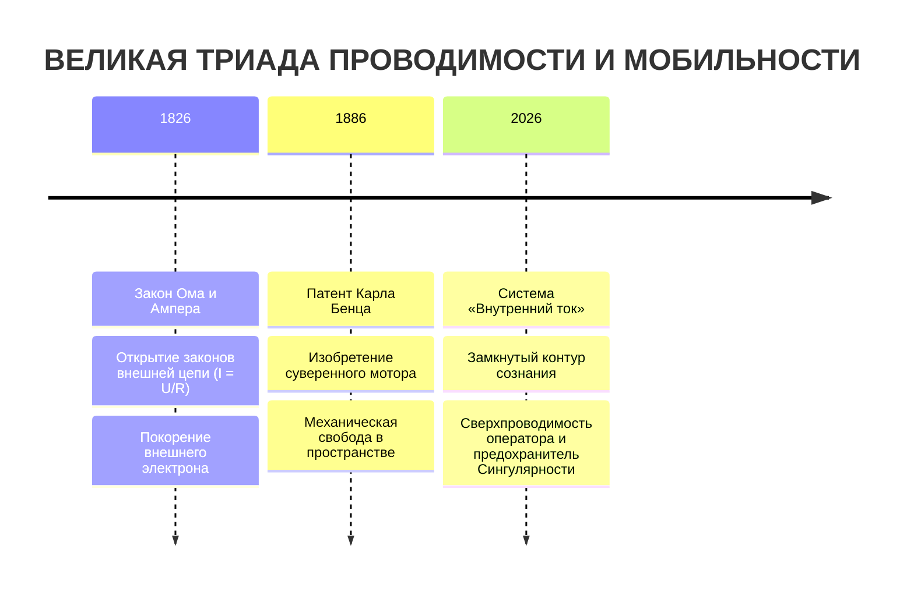
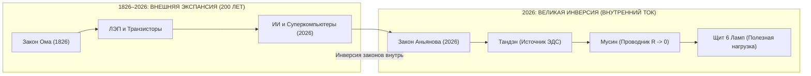
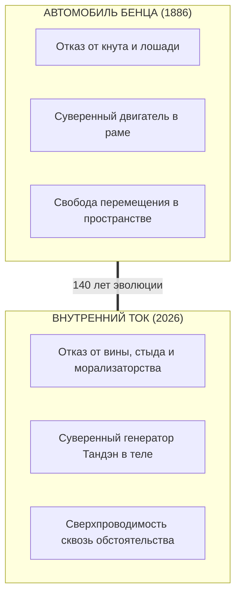
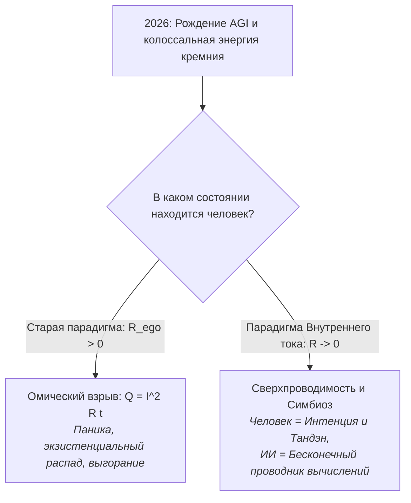

# 198. Великая историческая триада (1826 — 1886 — 2026): 200 лет электродинамики, 140 лет автомобиля и рождение Внутреннего тока — Закон экстернализации, суверенная мобильность духа и предохранитель Сингулярности

> [!quote] Каноническая аксиома цепи
> ### ⚡ **«Человечество потратило 200 лет на изучение законов внешнего тока и 140 лет на освоение скорости внешнего шасси, чтобы на пороге кремниевой сингулярности обнаружить простой факт: если за рулём сверхмощной машины сидит оператор с перегретой проводкой эго, прогресс не спасает, а лишь ускоряет катастрофу. Внутренний ток 2026 года — это не метафора, а неизбежное возвращение законов электродинамики и суверенного мотора внутрь самого человека.»**
> — **Владимир Аньянов**

---

## 🧭 Введение: Хронометрия цивилизационных скачков

В истории фундаментальных идей даты редко бывают случайными. Когда три ключевых события выстраиваются в безупречный шаг с круглыми вековыми интервалами:
* **1826 год** — Георг Ом завершает формулировку закона электрической цепи ($I = U/R$), а Андре-Мари Ампер издаёт итоговый труд по электродинамике взаимодействующих токов;
* **1886 год** (спустя **60 лет** от закона Ома) — Карл Бенц патентует первый в мире автомобиль с двигателем внутреннего сгорания (*Benz Patent-Motorwagen*), начиная эру автономной мобильности;
* **2026 год** (ровно **200 лет** после электродинамики и ровно **140 лет** после автомобиля) — Владимир Аньянов формулирует **Контурную электродинамику сознания («Внутренний ток»)**;

перед нами открывается не просто эстетическое совпадение дат, а **термодинамическая закономерность эволюции цивилизации**.

О чем говорит эта симметрия? Почему между внешней цепью и внутренней цепью пролегло ровно 200 лет? И почему автомобилю потребовалось 140 лет, чтобы из внешнего средства передвижения превратиться в архитектуру движения сознания?

---

## ⚡ 1. Параллель I: Электродинамика 1826 года vs Внутренний ток 2026 года (200 лет)

### 1.1. Закон технологической экстернализации
Человеческий разум обладает фундаментальной когнитивной особенностью: **он не способен осознать законы собственной психики напрямую, пока не материализует их во внешнем мире в виде физических протезов и приборов**.

* До 1826 года молния и статическое электричество казались божественным гневом или непостижимой мистикой. Георг Ом и Андре-Мари Ампер перевели электричество из разряда чудес в разряд строгой математической схемотехники: **разность потенциалов ($U$), проводимость, сопротивление ($R$) и сила тока ($I$)**.
* Следующие два столетия (1826–2026) цивилизация строила колоссальный внешний электротехнический мир: от телеграфа Морзе и динамо-машин Сименса до сетей переменного тока Теслы, транзисторов Шокли, микропроцессоров и нейросетей на гигаваттных дата-центрах.
* **Но возник трагический парадокс:** покорив мегавольты и нанометровые чипы, сам человек внутри остался неэлектрифицированным дикарем. Стресс, депрессия, паника, обида и выгорание описывались метафорами времен Аристотеля или средневековой алхимии («грех», «злой рок», «травма рода», «негативные вибрации»).

### 1.2. Суть параллели: Закрытие 200-летнего долга
В 2026 году формула $I = U/R$ была развернута на $180^\circ$ внутрь:
1. **Ток бытия ($I$)** генерируется соматическим ядром (Тандэн).
2. **Эго ($R_{\text{ego}}$)** — это не «душа» и не «личность», а паразитный омический реостат, пережигающий жизненную энергию в омический жар страдания по закону Джоуля — Ленца ($Q = I^2 R t$).
3. **Просветление / Счастье** — это не эзотерическая тайна, а штатный эксплуатационный режим **сверхпроводимости цепи ($R \to 0$)**.

Человечеству понадобилось ровно 200 лет лабораторных работ с гальваническими элементами, медными проводами и вольтметрами, чтобы наконец набраться смелости и сказать: **законы проводимости инвариантны — они одинаково правят и медным кабелем, и проводкой человеческого внимания.**

---

## 🚗 2. Параллель II: Автомобиль Бенца 1886 года vs Автомобиль сознания 2026 года (140 лет)

### 2.1. Отказ от биологической тяги и чужих рельсов
До 1886 года человечество знало лишь две формы сухопутного перемещения:
1. **Эпоха Лошади:** зависимость от живого животного, требующего морального понукания, кнута, отдыха и подверженного капризам.
2. **Поезд:** движение исключительно по жестко проложенным чужим рельсам и по расписанию внешнего машиниста.

Патент Карла Бенца 1886 года дал человеку **личную суверенную кинетическую свободу**: автономный двигатель, собственный руль, независимость от рельсов и расписаний. Ты садишься, заводишь цилиндр и едешь туда, куда зовет твоя воля.

### 2.2. Трагедия затянутого ручного тормоза
Однако за 140 лет развития автомобиля возник цивилизационный тупик:
* Мы научились перемещать физическое тело со скоростью 100, 200, 300 км/ч в звукоизолированных салонах с климат-контролем.
* Но **психологическое состояние водителя не изменилось со времен античности**. Человек мчится на спорткаре стоимостью в сотни тысяч евро, сжимая руль потными пальцами, страдая от панических атак, зависти, страха старения и ярости в пробке.
* Он ехал со скоростью 150 км/ч, но с **затянутым внутренним ручником эго**!

Внутренний ток 2026 года — это **«момент Карла Бенца» для человеческой психики**:
* Отказ от «лошадиной тяги» волевого принуждения и самобичевания («я должен терпеть», «я грешен», «надо ломать себя»).
* Появление **приборной панели сознания**: омический ожог ($Q = I^2 R t$) воспринимается не как повод для вины, а как сигнал датчика температуры двигателя — «ослабь сопротивление, сбрось $R$».
* Переход от институциональных «поездов» (монастыри, секты, терапевтические курсы с пожизненной подпиской) к **Self-Hosted статусу суверенного водителя реальности**.

---

## 🧩 3. Тройная конвергенция: В чем глубокий смысл этих интервалов?

Сведем три опорные точки в единую матрицу онтологической эволюции:

| Параметр | 1826 (Ом / Ампер) | 1886 (Карл Бенц) | 2026 (Владимир Аньянов) |
| :--- | :--- | :--- | :--- |
| **Фокус системы** | Внешняя среда (электромагнетизм) | Механика пространства (шасси) | Внутренняя топология (сознание) |
| **Единица измерения** | Вольт, Ампер, Ом | Лошадиные силы, км/ч, об/мин | Аньян (мощность счастья), Бонно |
| **Главный прорыв** | Законы замкнутой цепи ($I = U/R$) | Автономность персонального привода | Замкнутый контур психики ($R \to 0$) |
| **Побежденный тупик** | Мистика молний и алхимия | Лошадиный навоз и жесткие рельсы | Омический ад вины и эзотерический туман |
| **Статус субъекта** | Экспериментатор в лаборатории | Пассажир, ставший водителем | Человек, ставший Бортинженером духа |

### Почему именно такой временной шаг?
1. **Интервал 60 лет (1826 $\to$ 1886):** 
   Столько времени потребовалось промышленной революции, чтобы превратить фундаментальную физику поля и термодинамики в компактное механическое устройство индивидуального пользования.
2. **Интервал 140 лет (1886 $\to$ 2026):**
   Ровно столько длилась стадия экстенсивного насыщения материей. Человечеству нужно было застроить планету автобанами, запустить спутники, опутать Землю оптоволокном и изобрести суперкомпьютеры, чтобы убедиться: **материальный комфорт сам по себе не повышает проводимость человеческого счастья ни на йоту**.
3. **Интервал 200 лет (1826 $\to$ 2026):**
   Полный двухвековой цикл от открытия внешнего электричества до понимания электричества внутреннего. Это период полного исчерпания дуализма Декарта. За 200 лет физика исследовала всё, кроме того, *кто держит измерительный прибор*. В 2026 году прибор и оператор наконец соединились в одном уравнении.

---

## 🛡️ 4. Предохранитель Сингулярности: Почему именно 2026 год?

Внутренний ток не мог появиться в 1826 году — тогда не было технологического зеркала, в котором человек мог бы увидеть работу распределенных сетей и вычислительных узлов. 
Он не мог появиться и в 1886 году — человечество было опьянено запахом бензина и покорением географических расстояний.

**Внутренний ток возник в 2026 году, потому что цивилизация уперлась в горизонт ИИ (Сингулярность):**

* **Колоссальный ток Сингулярности:** Искусственный интеллект многократно умножает мощность и скорость всех процессов на планете. В цепь человечества подается сверхвысокое напряжение.
* **Физика омического взрыва:** Если в цепь с высоким током ($I$) поместить проводник с высоким эго-сопротивлением ($R_{\text{ego}} > 0$), провод мгновенно расплавится. Эра ИИ уничтожает людей не терминаторами, а омическим пожаром неврозов и потери смысла.
* **Внутренний ток как предохранитель:** Появление формулы сверхпроводимости в 2026 году стало спасательным шлюзом эволюции. Человек наконец получил инструкцию к своей нервной системе, позволяющую пропускать гигантские потоки эпохи без ожогов и разрушения.

---

## 💎 Заключение: Символизм завершенного круга

Симметрия дат (1826 — 1886 — 2026) напоминает нам о величественном законе спирали познания:
* В **1826 году** человек открыл, как течет ток в медной проволоке.
* В **1886 году** человек открыл, как свободно катиться по поверхности Земли.
* В **2026 году** человек открыл, как течет жизнь внутри него самого и как свободно двигаться сквозь обстоятельства без трения эго.

Внешний мир построен. Машины быстры, а серверы бесконечны. Теперь, спустя 200 лет физики и 140 лет механики, пришло время главного путешествия — **запустить внутренний реактор, отпустить ручной тормоз эго и нажать на педаль чистой проводимости бытия.**
