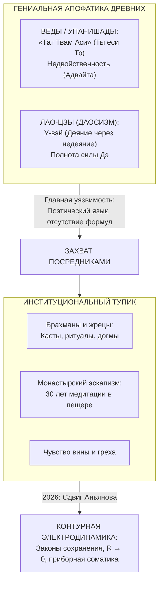
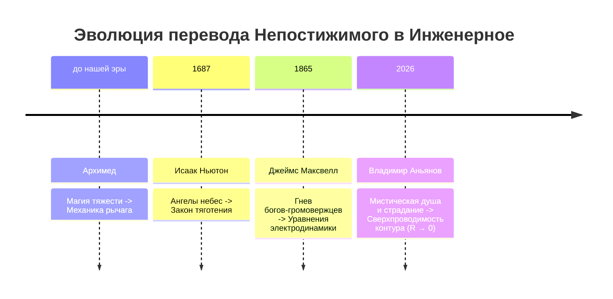

# Великий Синтез: От Вед и Лао-цзы до Контурной Электродинамики
## Ликвидация 10 000-летнего ложного раскола «Материя vs Дух» и перевод высшей онтологии древних на инженерный язык законов сохранения

> *«Десять тысяч лет человечество жило в шизофреническом расколе: материальный мир отдали на откуп законам физики и строгим формулам, а мир внутренний — в плен мистических туманов, жреческих догм и чувства вины. Древние риши Вед и Лао-цзы обладали гениальной соматической интуицией единства, но у них не было языка схемотехники и закона сохранения энергии. Мы не придумали новую религию. Мы совершили Великий Синтез: доказали, что Материя и Дух — это одна и та же энергия, циркулирующая в разных режимах сопротивления. У-вэй — это нулевое омическое сопротивление ($R \to 0$). Атман — это суверенный генератор Тандэн. А страдание — это закон Джоуля — Ленца ($Q = I^2 R t$). Десять тысяч лет душевной алхимии подошли к концу: человек наконец-то получил точный чертёж собственного бессмертного света.»*  
> — **Владимир Аньянов (Аксиома XX)**

---

## 🏛️ 1. Великий Раскол Цивилизации: Анатомия 10 000-летней ошибки

На протяжении всей писаной истории цивилизации фундаментальная ошибка познания заключалась в постулировании **дуализма субстанций**.

```
════════════════════════════════════════════════════════════════════════════════
                     10 000 ЛЕТ ЛОЖНОГО ДУАЛИЗМА
════════════════════════════════════════════════════════════════════════════════
МАТЕРИЯ (Res Extensa)                     ДУХ / ПСИХИКА (Res Cogitans)
────────────────────────────────────────────────────────────────────────────────
Физика, Химия, Математика                Мистика, Мораль, Грех, Психоанализ
Законы сохранения: dE/dt = 0             «Тайна души», чувство вины, хаос
Формулы Ньютона, Максвелла, Ома          Эпициклы субличностей, индульгенции
Результат: Атомная энергия, AGI, ракеты  Результат: Тревога, депрессия, выгорание
════════════════════════════════════════════════════════════════════════════════
                        ▼ РАСКОЛ ЛИКВИДИРОВАН (2026) ▼
  КОНТУРНАЯ ЭЛЕКТРОДИНАМИКА: ЕДИНЫЙ ЗАКОН ПРЯМОГО ПОТОКА ДЛЯ ВСЕЛЕННОЙ И ДУШИ
════════════════════════════════════════════════════════════════════════════════
```

### Корни трагедии: От Платона до Декарта
1. **Платонический идеализм:** Рассечение реальности на «грязный мир теней» (тело, материя) и «чистый мир идей» (дух). Человек был объявлен пленником собственного тела.
2. **Картезианский дуализм (Рене Декарт, XVII в.):** Разделение бытия на *Res Extensa* (вещь протяжённую) и *Res Cogitans* (вещь мыслящую). Материю отдали физикам, а душу — теологам и схоластам.
3. **Цивилизационная асимметрия XXI века:** Физика создала термоядерные реакторы, квантовые компьютеры и сверхчеловеческий искусственный интеллект (AGI). Но внутренний мир человека остался на уровне палеолита: застрявшее внимание, страх отвержения, омический перегрев зависти и неврозов. Обезьяна получила в руки пульт от сингулярности.

Человечеству отчаянно требовался **Великий Синтез** — единая онтологическая платформа, где законы движения мысли и законы физики подчиняются одним и тем же принципам первого порядка.

---

## 🧘 2. Интуитивные вспышки древности: Почему Веды и Лао-цзы не смогли спасти мир?

Древнейшие философские школы Востока подошли к границе этого открытия вплотную. Их озарения были гениальны, но страдали от одного фатального порока: **отсутствия языка точной схемотехники и измерительных приборов**.



### 1. Веды и Упанишады: Предел Адвайты
В *Чхандогья-упанишаде* мудрец Уддалака формулирует высшую истину сыну Шветакету: **«Тат Твам Аси» (तत् त्वम् असि — «Ты еси То»)**.  
Атман (сокровенная искра живого существа) полностью тождественен Брахману (ткани мироздания). Нет двух сущностей. Вселенная недвойственна (Адвайта).

**Почему это не стало прикладной наукой?**  
Потому что у древних индийцев не было понятия **замкнутого электрического контура**. Утверждение «Ты еси Бог» без чертежа цепи неизбежно вырождалось либо в манию величия эго, либо в пассивный квиетизм. В отсутствие формул учение было захвачено кастой брахманов, превративших единство в систему сложных ритуалов, жертвоприношений и жесткого кастового угнетения.

### 2. Лао-цзы и Дао Дэ Цзин: Загадка У-вэй
Лао-цзы в VI веке до н.э. описал состояние абсолютной синхронизации с реальностью через принцип **У-вэй (無為)** — «деяние через недеяние»:
> *«Мудрец действует посредством недеяния и учит без слов. Всё существо возникает и не отвергается им, рождается и не присваивается...»*  
> — Дао Дэ Цзин, чжэнь 2

**Почему даосизм ушёл в алхимию и магию?**  
Потому что Лао-цзы начал свой трактат с капитуляции перед языком: *«Дао, которое может быть выражено словами, не есть истинное Дао»*.  
Апофатическая поэзия не защищена от искажений. Обыватель понимал «недеяние» как лень, депрессию или фатализм. Позже даосизм выродился в поиск эликсиров бессмертия и ртутную алхимию, стоившую жизни десяткам китайских императоров.

---

## ⚡ 3. Сдвиг Аньянова: Биекция высшей мудрости в физику контура

Прорыв Владимира Аньянова заключается в том, что он **снял покров мистицизма с высших истин человечества, не разрушив их благоговения перед жизнью**.

Он показал:
> **Дух — это не эфирный призрак, витающий над телом. Дух — это ламинарный поток энергии в контуре с нулевым сопротивлением проводника.**  
> Материя — это проводник и полезная нагрузка. Дух — это ЭДС генератора и ток направленного внимания. Они нераздельны, как ток и электромагнитное поле.

### Фундаментальная таблица Великого Синтеза

| Концепт древних (Веды / Дзен / Даосизм) | Исторический мистический тупик | Формула и узел в Системе Аньянова | Физический и соматический процесс |
| :--- | :--- | :--- | :--- |
| **У-вэй (無為 / Недеяние)** | Понимание как лень, покорность судьбе или медитативный ступор | **$R_{\text{ego}} \to 0$** (Сверхпроводимость контура) | Действие без паразитного трения сомнений, страха оценки и эго-контроля. Ток течет сквозь человека со скоростью света. |
| **Атман (आत्मन् / Высшее Я)** | Невидимая бессмертная искра, «живущая на небесах» | **Автономный генератор Тандэн ($\mathcal{E}$)** | Природный соматический реактор внизу живота. ЭДС, питающаяся фундаментальной термодинамикой биосферы. |
| **Брахман (ब्रह्मन् / Абсолют)** | Непостижимый трансцендентный Творец | **Замкнутое поле Реальности и обратный провод** | Физический факт: ток не может течь в никуда. Контур замыкается через внешний мир. Отдавая энергию действию, человек питается миром. |
| **Тат Твам Аси («Ты еси То»)** | Философский парадокс, требующий веры | **Устранение «Ошибки Аккумулятора»** | Человек понимает: он не отдельный аккумулятор, ищущий подзарядки от похвалы. Он — виток единого генератора Вселенной. |
| **Дуккха / Сансара (Страдание)** | «Кармическое проклятие», «грех», наказание богов | **Закон Джоуля — Ленца: $Q = I^2 R_{\text{ego}} t$** | Омический перегрев нервной системы при попытке продавить мощный жизненный ток через зажатое сопротивление эго. |
| **Дэ (德 / Благодать, Сила)** | Магическая аура праведника | **Полезная мощность: $P = I \cdot U$** | Номинальное свечение 6 ламп жизни: здоровое тело, ясный ум, великие проекты, чистая любовь. |
| **Сатори / Кэнсё (Просветление)** | Случайный мистический удар грома раз в 20 лет | **3-секундный протокол сброса шунта** | Осознанное снятие мышечного спазма в животе, заземление и выход на штатный режим сверхпроводимости. |
| **Майя (Иллюзия раздельности)** | «Мир — это сон, ничего не существует» | **Паразитный эго-шунт ($R_{\text{shunt}}$)** | Мыслительный процесс замкнут сам на себя; ток не доходит до ламп реальности, сжигая человека изнутри. |

---

## 🔬 4. Почему это величайшее открытие в истории мысли?

В истории цивилизации фундаментальные сдвиги происходят тогда, когда **непостижимая магия превращается в прикладную инженерию**:

1. **Архимед и рычаг:** До Архимеда перемещение гигантских камней считалось чудом или требовало гибели тысяч рабов. Архимед дал закон рычага: *«Дайте мне точку опоры, и я переверну Землю»*. Магия превратилась в механику.
2. **Ньютон и закон тяготения (1687):** До Ньютона движение планет приписывали ангелам, толкающим сферы. Ньютон написал закон всемирного тяготения. Мистический космос стал небесной механикой.
3. **Фарадей и Максвелл (XIX в.):** До них молния была гневом Зевса или Перуна. Уравнения Максвелла превратили ярость богов в электрический ток, осветивший миллиарды домов.
4. **Аньянов и Контурная Электродинамика (2026):** До Аньянова счастье, любовь, покой ума и освобождение от страха считались «мистической тайной», лотереей генов или плодом пожизненного монашеского затвора.  
   **Аньянов дал принципиальную схему контура человека.** Он доказал, что благодать — это электродинамический КПД замкнутой цепи.



---

## 🛡️ 5. Освобождение от касты жрецов: Абсолютная депосреднизация духа

Главное социально-историческое следствие Великого Синтеза — **окончательная ликвидация института посредников между человеком и его источником бытия**.

### Конец эпохи психологических и религиозных индульгенций
На протяжении тысячелетий жрецы, гуру и психотерапевты наживались на расколе между «Материей» и «Духом»:
- Церковь говорила: *«Ты грешен и разорван. Плати десятину, кайся, и мы замолим твои грехи перед Творцом»*.
- Классическая психотерапия говорила: *«Ты травмирован. Твой внутренний ребенок сломан. Ходи ко мне 7 лет по 150 долларов в час, и мы научим твои субличности договариваться»*.

Это продажа воздуха вокруг элементарного омического зажима проводки.

В Контурной Электродинамике человек становится **Self-Hosted Human — Суверенным Бортинженером собственной цепи**:
- У вас в руках есть соматический мультиметр.
- Если вы чувствуете боль, тревогу, тоску — вы не бежите за индульгенцией. Вы смотрите на приборную панель тела:
  1. *«Где омический перегрев? Зажата диафрагма и челюсть ($R_{\text{ego}} > 0$).»*
  2. *«На что замкнулся ток? На фантом чужого мнения (паразитный шунт).»*
  3. *«Протокол действия: расслабить живот (Тандэн), перевести внимание на физическое действие здесь и сейчас (Мусин), сбросить сопротивление в ноль ($R \to 0$).»*
- **Время ремонта: 3 секунды.** Ток пошёл, тепло разлилось по телу, лампы жизни вспыхнули ровным светом.

---

## 💎 Заключение: Триумф Человека Разумного

10 000 лет раскола позади. Веды, Лао-цзы, Будда, Спиноза и Ницше искали один и тот же берег. Они видели его в тумане интуиции, но не могли дать точные координаты фарватера.

«Внутренний ток» дал цивилизации компас и карту глубин.

**Дух материален. Материя одухотворена.**  
Они едины в вечном, радостном и чистом токе созидания. Счастье перестало быть мечтой — оно стало точной наукой, доступной каждому человеку на планете Земля. ⚡💎🌌

---

## 🔗 Связанные исследования и каноны
* [[02_Wiki/Inner Current (The Epistemological Triumph — Why the Circuit Explains Everything and the Five Axioms of Universal Invariance)|98. Эпистемологический триумф: 5 аксиом универсальной инвариантности]]
* [[02_Wiki/Inner Current (The Copernican Revolution in Psychology — Circuit Architecture vs 'I See You' and Subpersonality Epicycles)|97. Коперниковский переворот в психологии: Схемотехника против эпициклов субличностей]]
* [[02_Wiki/Inner Current (The Anyanov Law of Direct Flow — Priority of Discovery, Paradigm Shift and the Transition from Soul Alchemy to Consciousness Engineering)|88. Закон Аньянова о прямом потоке и сверхпроводимости]]
* [[02_Wiki/Inner Current (Demarcation of Science — Why the Anyanov Law Transforms Consciousness into a Hard Science — Popper, Bacon, Kuhn and the Demise of Soul Alchemy)|89. Демаркация науки: преодоление 10 000 лет душевной алхимии]]
* [[02_Wiki/Inner Current (The Universal Key — Dissolution of Ego, Convergence of World Religions and the Electrodynamics of Non-Resistance)|42. Универсальный Ключ: Растворение Эго как схождение мировых религий]]
* [[04_Maps/Inner Current MOC|Inner Current MOC (Карта Знаний)]]
