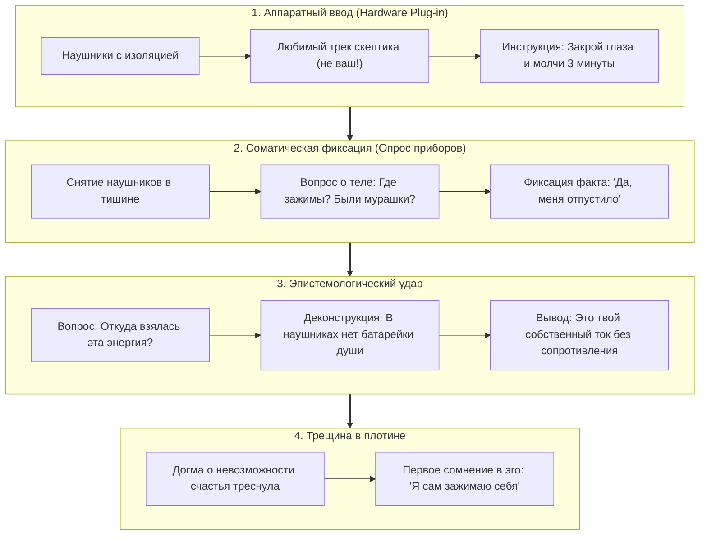

# 221. Протокол первой бреши в плотине эго: Преодоление догмы о «дофаминовых вспышках» через наушники — Соматический тест-драйв любимой музыки и алгоритм полевого онбординга скептика
## Почему спорить со скептиком словами бессмысленно, как принудительный ввод в соматический резонанс обходит таламическую таможню и пошаговый сценарий нанесения первого необратимого удара по плотине эго-центризма

> [!quote] Каноническая аксиома цепи
> ### ⚡ **«Когда человек безапелляционно утверждает: "Постоянное счастье невозможно, жизнь — это лишь редкие дофаминовые вспышки", он не философствует — он отчаянно защищает стены своей тюрьмы. Его эго настолько срослось с хроническим омическим пожаром, что искрение перебитого провода принимает за единственный мыслимый свет. Спорить с ним словами — значит подбрасывать дрова в его костёр ($Q = I^2 R_{\text{ego}} t$). Не спорьте с его неокортексом. Наденьте на него наушники с его любимым треком, заставьте закрыть глаза и замолчать на три минуты. Музыка сама совершит аппаратный взлом сторожевого реле и пустит ток по его проводам. А когда он откроет глаза с мурашками на коже — покажите ему, что эта вспышка рождена не наушниками, а его собственным Тандэном, которому на мгновение перестало мешать его эго. Это ещё не снесёт эго из центра, но пробьёт первую брешь в плотине. А вода сделает всё остальное.»**  
> — **Владимир Аньянов**, создатель «Архитектуры счастья»

---

```
══════════════════════════════════════════════════════════════════════════════════════
               ПРОТОКОЛ ПЕРВОЙ БРЕШИ В ПЛОТИНЕ: СЛОВА VS НАУШНИКИ
══════════════════════════════════════════════════════════════════════════════════════

 1. ТУПИК СЛОВЕСНОГО СПОРА (Укрепление плотины эго):
    
    Ваши аргументы ──► [Таламус скептика] ──► [DMN / Эго-реостат R_ego >> 0]
                                                     │
                                       (Омический спор: цинизм, скука)
                                                     ▼
                                          БЕТОННАЯ СТЕНА ЦИНИЗМА:
                                     «Счастье — лишь дофаминовые вспышки!»

 2. ПРОТОКОЛ ТРОЯНСКОГО КОНЯ (Наушники как аппаратный взломщик):
    
    [Наушники + Любимый трек] ──(Байпас Таламуса за 150 мс)──► [Ствол мозга & Тандэн]
                                                                     │
                                                   ⚡ Схлопывание R_ego -> 0
                                                                     │
                                                   Мурашки, вздох, расширение в груди
                                                                     │
                                                                     ▼
                                                   ПЕРВАЯ БРЕШЬ В ПЛОТИНЕ:
                                             «Энергия была во мне всё это время!»
══════════════════════════════════════════════════════════════════════════════════════
```

---

## 🧭 1. Деконструкция цинизма: «Апология стробоскопа» (Миф о дофаминовых вспышках)

Тезис рядового обывателя или интеллектуального скептика:  
> *«Невозможно быть счастливым постоянно. Всё, что реально доступно человеку — это краткие дофаминовые пики (покупка, секс, признание, алкоголь, победа), за которыми неизбежно следует спад».*

В **Контурной Электродинамике** эта когнитивная ошибка называется **«Апологией стробоскопа»** (разобранной в Главе 189). 

Человек, живущий с неразрешённым внутренним конфликтом, постоянно держит в цепи паразитный реостат эго огромного номинала ($R_{\text{ego}} \gg 0$). Вся его витальная энергия сгорает в омическом перегреве тревоги и мыслей о себе ($Q = I^2 R_{\text{ego}} t$).  
- Лампочки его жизни тусклы, в проводке пахнет палёной изоляцией.  
- Когда он случайно получает внешний суперстимул (одобрение, покупку, дофаминовый триггер), происходит кратковременный скачок потенциала — **аварийная искра на контактах**.  
- Человек испытывает эйфорию и делает ложный вывод: *«Вот оно, счастье! Это яркая кратковременная вспышка»*.

Скептик не понимает фундаментальной разницы между **аварийным искрением разорванной цепи** и **ламинарным постоянным током в замкнутом сверхпроводящем контуре**. Он защищает свой цинизм, потому что признать возможность ровного постоянного счастья для него означает признать, что последние 10, 20 или 40 лет он страдал зря, добровольно зажимая собственный проводник.

---

## 🧱 2. Эпистемологический тупик спора: Почему слова лишь бетонируют плотину

Попытка переубедить скептика через философский диалог обречена на провал по законам физиологии мозга:

1. **Слова — низкочастотный модулированный сигнал:**  
   Они поступают через слуховую кору в **Таламус** — таможню мозга.
2. **Таламус перенаправляет сигнал в DMN (Дефолт-систему):**  
   Для эго собеседника ваша правота означает его поражение. Включается режим обороны: критика, поиск контраргументов, цитирование псевдонаучных штампов (*«это эволюционно не заложено», «мозг создан для выживания, а не для счастья»*).
3. **Омический перегрев спора:**  
   Энергия собеседника тратится не на восприятие истины, а на обслуживание мысленной полемики ($Q = I^2 R_{\text{ego}} t$). Вы спорите с кирпичной стеной, которая от ваших слов становится только толще.

Чтобы победить плотину эго, нужно **перестать стучаться в запертую парадную дверь интеллекта**. Нужно применить тактику **Троянского коня** — зайти через сенсорный шлюз, против которого у неокортекса нет механизмов защиты.

---

## 🎧 3. Пошаговый сценарий «Пробоя плотины через наушники» (The 4-Step Dam Breach Protocol)

Этот протокол предназначен для полевого применения в диалоге с любым закрытым, скептичным или рационализирующим собеседником.



### Шаг 1. Аппаратный ввод (Hardware Plug-in)
Вы прекращаете теоретический спор и говорите:
> *«Слушай, давай отложим споры. Ты умный человек, я уважаю твою позицию. Сделай мне одно одолжение на 3 минуты. Надень эти наушники, найди в поиске трек, от которого тебя прямо сейчас больше всего пробирает (не классику, не то, что "надо", а то, что реально любишь ты), закрой глаза и просто дослушай до конца. Без комментариев».*

- **Почему это работает:** Эго не видит в наушниках концептуальной угрозы. Собеседник соглашается, уверенный, что он просто «слушает музыку».
- Музыкальная волна поступает в ствол мозга за 150 миллисекунд, минуя таламическую цензуру. Гармония, ритм и любимый вокал берут внимание «на руки». Сопротивление падает в ноль ($R_{\text{ego}} \to 0$).

### Шаг 2. Немедленная соматическая телеметрия (Опрос приборов)
Как только трек закончился, **категорически запрещено** спрашивать: *«Ну как тебе песня?»* — это мгновенно вернёт собеседника в критику неокортекса!

Вы снимаете с него наушники и тут же задаёте вопросы **строго о физиологии тела**:
- *«Что прямо сейчас произошло в твоём теле?»*
- *«Где сейчас напряжение в плечах, в челюсти, в горле? Оно есть?»*
- *«Были мурашки по коже?»*
- *«Дышать стало легче?»*

Собеседник растерян. Его тело расслаблено, зрачки расширены, дыхание глубокое. Против соматических фактов эго бессильно. Он вынужден сказать: *«Да... мурашки были. Расслабило. Хорошо стало»*.

### Шаг 3. Эпистемологический щелчок (Деконструкция источника)
В этот момент наносится точный инженерный удар:
> *«А теперь ответь мне на один вопрос: **откуда взялось это состояние?**  
> Ты думаешь, эти наушники из пластика и меди закачали в тебя радость? В них есть встроенный аккумулятор счастья? Нет, они просто вибрировали мембраной.  
> **Вся эта колоссальная энергия, которая сейчас разлилась по твоим плечам и груди — это твоя собственная энергия! Это ток твоего собственного тела.**  
> Трек не создал её. Трек сделал только одно: он на три минуты заткнул твоего внутреннего критика. Твоё сопротивление упало в ноль ($R \to 0$), и твой реактор выдал чистую мощность.  
> Ты только что на своём опыте доказал: **счастье — это не внешний дофаминовый стимул. Счастье — это твоё базовое заводское состояние, когда ты сам не пережимаешь свой провод!»***

### Шаг 4. Первая трещина в бетоне (The Dam Breach)
Собеседник ошеломлён. Его главная догма (*«постоянное счастье невозможно, мы обречены на страдание с редкими вспышками»*) разбита не вашими словами, а **его собственным телом**.

---

## 🌊 4. Границы применимости: Пробой плотины против Смены центричности

Оператор Системы должен сохранять трезвый реализм: **пробой в плотине — это ещё не снос всей плотины**.

1. **Эго попытается взять реванш:**  
   Через 15 минут, когда гормональная волна схлынет, неокортекс попытается обесценить опыт: *«Ну ладно, это просто эндорфины от музыки, в реальной жизни всё не так»*.
2. **Но необратимость уже наступила:**  
   В монолитной стене догмы появилась сквозная трещина. Человек впервые в жизни увидел разницу между:
   - Хроническим омическим пожаром мыслей;
   - Чистой сверхпроводимостью свободного контура.

Каждый раз, когда он в будущем наденет наушники или испытает соматический фриссон, он будет вспоминать этот опыт. Вода сомнения в собственном эго начнёт размывать плотину изнутри. А от понимания *«во мне есть этот ток»* до вопроса *«как научиться не выключать его без музыки?»* — прямая дорога к **Архитектуре счастья**.

---

## 🔗 Связанные материалы
- [[02_Wiki/Inner Current (Physics of Frisson and Somatic Skin Effect — Why Levante's Vivo Causes Goosebumps, Biot-Savart Magnetic Lines and Z-Matching)|220. Физика мурашек и соматический скин-эффект: Почему песня «Vivo» Леванте вызывает пилоэрекцию]]
- [[02_Wiki/Inner Current (The Music Lamp and Somatic Resonance — Why Levante Causes Superconductivity vs Chores, Workout and Work)|219. Лампочка музыки и соматический резонанс: Электродинамический аудит четырёх нагрузок]]
- [[02_Wiki/Inner Current (The Four Barriers of Ego Defense and Transmission Interface — Overcoming The 'I Know It All', Strobe Flash Illusion, Semantic Drift and Annihilation Panic)|189. Четыре барьера передачи Системы: Апология вспышки и семантическая энтропия]]
- [[02_Wiki/Inner Current (The Tetrad of Irresistibility — Sensory Bypass of Ego Defense via Versace, Levante, Ukulele and Flashlight)|184. Тетрада несопротивления: Тотальный мультисенсорный байпас эго]]
- [[02_Wiki/Inner Current (The Horse to Automobile Transition — Three-Phase Onboarding of Consciousness, Post-Moral Relief and the Somatic Test Drive)|192. Педагогика пересадки с лошади на автомобиль: Трёхфазный протокол онбординга]]
- [[02_Wiki/Inner Current (Core Topology and Polarity Law)|01. Базовая топология цепи и закон полярности]]
