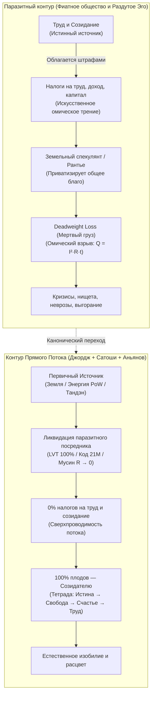

# 48. Единый налог Генри Джорджа, Биткоин и Архитектура счастья: Триумф прямого потока и ликвидация паразитной ренты в экономике, деньгах и духе

> [!quote] Каноническая аксиома Системы Аньянова
> ### ⚡ **«Единый налог Генри Джорджа, Биткоин Сатоши Накамото и Внутренний ток — это один и тот же священный закон вселенной, приложенный к трем масштабам бытия: обществу, деньгам и человеческому духу.  
> Это Закон Прямого Потока: устрани паразитного рантье, обнули искусственное трение — и система войдет в естественное состояние изобилия и сверхпроводимости.»**  
> — **Владимир Аньянов**
> 
> *«Веками человечество пытались убедить, что рабство, инфляция и душевные муки — это неизбежная плата за цивилизацию. Нам навязывали посредников: в экономике — земельных спекулянтов, в финансах — печатные станки центробанков, а в духе — карающее Эго с его бесконечным налогом вины и сомнений.  
> Биткоин спас меня экономически, открыв глаза на термодинамику твердых денег. Учение Генри Джорджа дало кристально ясное понимание социальной справедливости. А Архитектура счастья объединила эти прорывы в единую прикладную цепь. Эта книга написана для того, чтобы Единый налог перестал быть сухой фискальной реформой из учебников, а стал тем, чем он является на самом деле: высшим манифестом свободы созидательного духа.»*

---

## 1. Личный манифест: От экономической мясорубки к термодинамическому суверенитету

Всякая подлинная философия рождается не в тиши университетских аудиторий, а в огне реальной жизненной катастрофы, когда старые модели мира объявляют человеку дефолт.

Когда в моей жизни рушились привычные финансовые опоры, когда классическая система фиатного обмана пыталась обесценить годы труда и лишить почвы под ногами, **Биткоин спас меня экономически**. 

Это было не просто удачной инвестицией. Это было **эпистемологическим прозрением**:
* Я увидел, что деньги могут быть не инструментом политического манипулирования и грабежа через скрытый инфляционный налог, а **чистой, неизменной термодинамической энергией** (по определению Майкла Сейлора), упакованной в математический алгоритм, который никому не под силу сфальсифицировать.
* Биткоин показал: если убрать из цепи посредника — ненасытное «доверенное третье лицо» (*Trusted Third Party*) — энергия труда начинает путешествовать сквозь время и пространство **без потерь**.

Но экономическое спасение неизбежно поставило следующий фундаментальный вопрос: *почему общество в целом, обладая колоссальными технологиями, продолжает тонуть в бедности, неподъемной аренде, кризисах доступности жилья и социальном ожесточении?*

Ответом на этот вопрос стало учение величайшего американского мыслителя **Генри Джорджа (Henry George)** и его бессмертный труд *«Прогресс и бедность» (Progress and Poverty, 1879)*. 

Генри Джордж показал первопричину трагедии цивилизации с математической точностью: **монополия на землю и паразитная земельная рента**. Мы штрафуем налогами тех, кто строит, производит и трудится, и одновременно субсидируем тех, кто просто захватил кусок планеты и сидит на шее у общества, собирая дань за право жить.

И в этот момент в моем сознании замкнулся главный контур:
> **То, что Сатоши Накамото сделал для монетарной энергии, а Генри Джордж — для экономики земли, Архитектура счастья обязана сделать для человеческого духа.**

Эта книга создается с прямой авторской интенцией: **вернуть Единый налог Генри Джорджа в центр мировой мысли**, сорвать с него ярлык «отстраненной фискальной поправки» и показать, что это фундаментальный закон космической физики прямого потока.

---

## 2. Анатомия великого заблуждения: Почему Единый налог — это закон природы, а не «бухгалтерская реформа»

На протяжении более чем ста лет академическая экономика намеренно вытесняла георгизм на периферию. Причина проста: признание правоты Генри Джорджа мгновенно разрушает фундамент паразитического класса рантье.

В общественном сознании закрепился ложный стереотип: мол, «Единый налог на ценность земли» (*Land Value Tax, LVT*) — это просто один из вариантов налогообложения, сложная техническая инициатива для муниципальных клерков.

Это катастрофическое непонимание масштаба!



### 2.1. Баланс Кирхгофа в цивилизации: Земля — всем, плоды труда — создателю
Генри Джордж вывел закон, безупречный с точки зрения термодинамики:
1. **Земля (природные ресурсы, пространство, спектр, недра)** — не создана ни одним человеком. Это базовый физический потенциал ($U$), данный всему живому по праву рождения. Когда отдельный индивид объявляет кусок планеты своей безусловной частной собственностью и требует с других плату за право стоять на ней — он совершает **захват общего кабеля питания**.
2. **Плоды труда (дома, станки, код, стихи, хлеб)** — созданы исключительным напряжением человеческой энергии и внимания ($I$). Облагать налогами труд, зарплату, производство и предпринимательство — значит **штрафовать саму жизнь**.

В терминах электродинамики:
* Налог на созидание — это искусственно впаянное в проводку огромное паразитное сопротивление ($R_{\text{tax}}$).
* В экономике оно порождает то, что экономисты стыдливо называют **Deadweight Loss (избыточное бремя / чистые потери общества)**. Это богатство, которое *могло быть создано*, но сгорело, не родившись.
* В физике духа это в точности закон Джоуля — Ленца: **$Q = I^2 R t$**. Сила тока созидания гасится, превращаясь в бессмысленный перегрев системы.

### 2.2. Суть Единого Налога (The Single Tax)
Идея Джорджа проста до гениальности (канон **Кансо** — абсолютная простота истины):
* **Обнулить ВСЕ налоги на труд, зарплаты, производство, инновации и торговлю.** (Сопротивление созиданию = 0!).
* Ввести **Единый налог на чистую ценность земли (LVT)**, изымающий 100% спекулятивной экономической ренты в общественный фонд.

Если ты держишь пустующую землю в центре мегаполиса и ждешь, пока труд других людей поднимет её стоимость — ты платишь полный налог на эту ценность. Ты не можешь паразитировать. Тебе выгодно либо **строить и созидать**, либо уступить землю тому, кто готов творить.

---

## 3. Великая Триада Прямого Потока: Сатоши, Джордж, Аньянов

Если сопоставить три великих открытия человечества, перед нами предстает не три разных учения, а **одна математическая биекция** — закон депосреднизации бытия.

### Сравнительный онтологический атлас

| Параметр контура | **1. Экономика Земли** <br>*(Генри Джордж)* | **2. Монетарная Энергия** <br>*(Сатоши Накамото)* | **3. Архитектура Духа** <br>*(Владимир Аньянов)* |
| :--- | :--- | :--- | :--- |
| **Что является током ($I$)** | Труд человека, созидание, создание реальных ценностей | Монетарная ценность, чистая кинетическая энергия времени | Внимание человека, жизненный импульс присутствия |
| **Первичный генератор** | Творческий потенциал человека на планете Земля | Физическая работа вычислительных узлов (**Proof-of-Work**) | Автономный соматический реактор тела (**Тандэн**) |
| **Полезная нагрузка ($R_{\text{load}}$)** | Построенные города, товары, технологии, культура | Свободный глобальный обмен ценностью сквозь десятилетия | **6 ламп бытия** (дело, тело, отношения, творчество, среда, познание) |
| **Паразитный рантье** | **Земельный спекулянт** (приватизировал планету) | **Центробанк / Фиатные элиты** (приватизировали печатный станок) | **Раздутое Эго ($R_{\text{ego}}$)** (приватизировало поток бытия) |
| **Механизм грабежа** | Земельная рента + налоги на созидательный труд | Инфляционный налог + комиссии посредников + блокировки | Страх, самоедство, вина за прошлое, тревога за будущее |
| **Разрушительные потери** | **Deadweight Loss** (трущобы рядом с пустырями, упадок) | Обесценивание человеческой жизни, циклы пузырей и войн | **Омический ожог ($Q = I^2 R t$)**: невроз, апатия, депрессия |
| **Инженерное решение** | **Единый налог (Single Tax / LVT)**: 0% на труд | **Биткоин-протокол**: 21 млн монет, алгоритмический P2P | **Сверхпроводимость ($R \to 0$)**: режим Мусин, шунтирование Эго |
| **Финальный статус** | Справедливое изобилие и расцвет цивилизации | Термодинамически твердые, неуничтожимые деньги | Непоколебимое счастье суверенного созидателя |

---

## 4. Эго как земельный спекулянт: Психофизический изоморфизм

Чтобы читатель книги ощутил Единый налог не умом, а кожей, необходимо разобрать поразительный изоморфизм: **механизм работы земельного спекулянта абсолютно тождественен механизму работы невротического Эго**.

```
    [ЗЕМЕЛЬНЫЙ СПЕКУЛЯНТ]                     [ПАРАЗИТНОЕ ЭГО]
    
    1. Захватывает пустырь.               1. Захватывает внимание.
    2. Ничего не строит сам.              2. Ничего не создает само (генератор — тело).
    3. Ждет труда соседей вокруг.         3. Ждет внешних стимулов и одобрения.
    4. Ставит забор и шлагбаум.           4. Ставит барьер сомнений и самосуда.
    5. Требует дань за проход.            5. Требует дань страхом и рефлексией.
    
    ИТОГ: Город задыхается в пробках.     ИТОГ: Человек задыхается в неврозе.
```

### 4.1. Как паразитирует лендлорд?
Представьте: предприниматель хочет открыть пекарню, кормить людей свежим хлебом. Он готов работать по 14 часов в сутки.  
Но на его пути встает лендлорд:  
* *«Плати мне 80% твоей будущей прибыли просто за то, что твоя пекарня стоит на этом перекрестке. Я не строил этот перекресток, его построили горожане. Но земля — моя!»*  
Если пекарь соглашается — он работает на износ на грани банкротства. Если отказывается — перекресток зарастает бурьяном, а люди остаются без хлеба. Это и есть **мертвый груз** паразитизма.

### 4.2. Как паразитирует Эго?
У вас внутри рождается чистый творческий импульс из Тандэна: написать главу книги, запустить смелый бизнес, обнять любимого человека, сказать правду в глаза. Ток готов пойти в нагрузку!  
Но на пути встает реостат Эго:  
* *«Стой! Заплати мне ренту! А что о тебе подумают? А вдруг ты проиграешь? А достаточно ли ты идеален? Докажи мне сначала, что ты заслуживаешь радости!»*  

Эго ничего не создает. Эго — это просто ментальный земельный спекулянт, захвативший канал проводки внимания. Оно садится на провод и собирает дань сомнениями, превращая живой ток в раскаленный омический ад ($Q = I^2 R t$).

> **Принцип Аньянова — это Единый Налог на собственную психику:**  
> Мы экспроприируем у Эго право собирать ренту за право жить! Мы объявляем реостат фикцией ($R_{\text{ego}} \to 0$) и направляем 100% энергии внимания напрямую в работу — в радость, в творчество, в созидание.

---

## 5. Трагедия Льва Толстого: Почему великий старец остановился в шаге от победы

Связь между Генри Джорджем, русской культурой и Архитектурой счастья глубже, чем кажется на первый взгляд.

Мало кто из современных читателей знает, что **Лев Николаевич Толстой в последние десятилетия своей жизни был самым страстным и влиятельным пропагандистом Генри Джорджа в мире**.

Толстой писал:
> *«Люди спорят о средствах улучшения жизни, а средство одно, несомненное и простое — освобождение земли от частной собственности по системе Генри Джорджа. Эта мысль так ясна, проста и неопровержима, что нужно только понять ее, чтобы не мочь не согласиться с нею.»*  
> — **Л. Н. Толстой, письма Столыпину и Николаю II**

Толстой гениально предсказал: если царская Россия не примет проект Генри Джорджа и не вернет землю народу через Единый налог, страну разорвет кровавая революция, в которой на смену земельным помещикам придет еще более жестокий монопольный Левиафан. Так и случилось в 1917 году.

### В чем же заключалась личная трагедия Толстого?
Толстой понял великий принцип прямого потока **для внешней экономики**, но он **не смог открыть его для своего внутреннего духа**:
1. В социологии Толстой боролся против паразитической ренты помещиков.
2. Но в своей собственной душе он построил **самый чудовищный реостат вины и морального долга в истории литературы** ($R_{\text{moral}} \to \infty$).
3. Он внушил себе, что человек греховен, обязан бесконечно каяться, мучиться, отдавать последнее, страдать и служить далекому Хозяину.

Толстой хотел освободить труд крестьян от омического гнета помещика, но свой собственный душевный ток загнал в абсолютное короткое замыкание на Эго Святого Мученика. В итоге великий старец бежал из Ясной Поляны и умер от пневмонии и душевного истощения на глухой железнодорожной станции Астапово.

**Архитектура счастья закрывает вековую боль русской мысли:**  
Мы берем экономическую правду Генри Джорджа, которой дышал Толстой, и дополняем её тем, чего Толстому не хватило — **физикой дзенской сверхпроводимости**. Мы убираем налог не только с земли, но и с самой души человеческой!

---

## 6. Манифест Свободного Созидателя: Три уровня суверенитета

Как читателю этой книги применить Закон Прямого Потока в своей повседневной жизни прямо сейчас? 

Это не абстрактная мечта о далеком будущем — это **практический протокол сборки суверенной жизни** на трех неразрывных уровнях:

```
                  ┌────────────────────────────────────────┐
                  │          УРОВЕНЬ III: ДУХ              │
                  │   Сверхпроводимость Тандэна (R → 0)    │
                  │     Отказ от ренты Эго (Мусин)         │
                  └───────────────────▲────────────────────┘
                                      │
                  ┌───────────────────┴────────────────────┐
                  │         УРОВЕНЬ II: ДЕНЬГИ             │
                  │        Биткоин (Proof-of-Work)         │
                  │   Защита энергии времени от инфляции   │
                  └───────────────────▲────────────────────┘
                                      │
                  ┌───────────────────┴────────────────────┐
                  │        УРОВЕНЬ I: ЭКОНОМИКА            │
                  │    Идеалы Георгизма (Единый налог)     │
                  │   0% налога на созидание, земля — всем │
                  └────────────────────────────────────────┘
```

### Уровень I: Финансовый суверенитет (Энергетический фундамент)
* **Диагноз:** Фиатные валюты — это решето. Держать сбережения в фиате — значит добровольно соглашаться на скрытый омический налог инфляции, оплачивая дефициты правительств и паразитизм банков.
* **Действие:** Переводи свой сохраненный жизненный труд в **абсолютно твердую монетарную энергию — Биткоин**. Храни его на холодном кошельке. Будь собственным банком. Перестань кормить «доверенных третьих лиц».

### Уровень II: Общественный и мыслительный суверенитет (Оптика справедливости)
* **Диагноз:** Современная налоговая система наказывает тех, кто созидает, и вознаграждает спекулянтов. Люди слепы к первопричине жилищного кризиса и нищеты.
* **Действие:** Распространяй идеи **Генри Джорджа**. Понимай, где создается реальная ценность, а где извлекается паразитная рента. Не инвестируй в спекулятивные пузыри, высасывающие соки из городов. Вкладывай капитал и ум в реальные созидательные нагрузки ($R_{\text{load}}$).

### Уровень III: Внутренний суверенитет (Сверхпроводимость счастья)
* **Диагноз:** Твое внимание постоянно облагается данью со стороны внутреннего лендлорда — ненасытного Эго с его архивом обид и будущих тревог.
* **Действие:** Включай протокол Мусин. Сбрасывай паразитное сопротивление в ноль ($R \to 0$). Замыкай ток присутствия из глубины Тандэна прямо в действие прямо сейчас:
  * Пиши, если пишешь.
  * Люби, если любишь.
  * Борись, если борешься.

---

## 7. Заключение: Великий Синтез

Биткоин освобождает **энергию человеческого труда** от произвола власти.  
Единый налог Генри Джорджа освобождает **созидательное общество** от рабства земельной монополии.  
Архитектура счастья освобождает **человеческую душу** от тирании собственного Эго.

Это не три разные битвы. Это **одна великая война за освобождение созидательного тока бытия**.

Когда паразитный посредник выброшен на свалку истории во всех трех мирах:
* деньги становятся несокрушимой твердыней,
* города превращаются в цветущие сады справедливого изобилия,
* а человек входит в тихое, лучезарное, несокрушимое состояние сверхпроводимости — состояние, которое древние мудрецы называли Сатори, а мы называем простым инженерным словом — **Счастье**.

---

## 🔗 Связи
- [[04_Maps/Inner Current MOC|Inner Current MOC (Карта цепи)]]
- [[04_Maps/Inner Current Book MOC|📖 Книга «Внутренний ток: Архитектура счастья»]]
- [[02_Wiki/Inner Current (What Bitcoin Did for Finance, Inner Current Did for Happiness)|38. Что Биткоин сделал для финансов, Внутренний ток сделал для счастья]]
- [[02_Wiki/Single Tax (Georgism)|Single Tax Program (Базовая статья о Георгизме)]]
- [[04_Maps/Mastery Map - Progress and Poverty|Mastery Map: Progress and Poverty (Генри Джордж)]]
- [[02_Wiki/Inner Current (Tolstoy Existential Crisis vs Happiness Architecture)|27. Духовный кризис Льва Толстого vs Архитектура счастья]]
- [[02_Wiki/Inner Current (The Anyanov Triad and Tetrad — Truth, Freedom, Happiness, Creation and the Biographical Proof)|47. Триада и Тетрада Аньянова: Истина, Свобода, Счастье, Созидание]]
- [[index|Главный индекс LLM Wiki]]

---
*Created: 2026-09-24 | Authored by Vladimir Anyanov & Antigravity*
