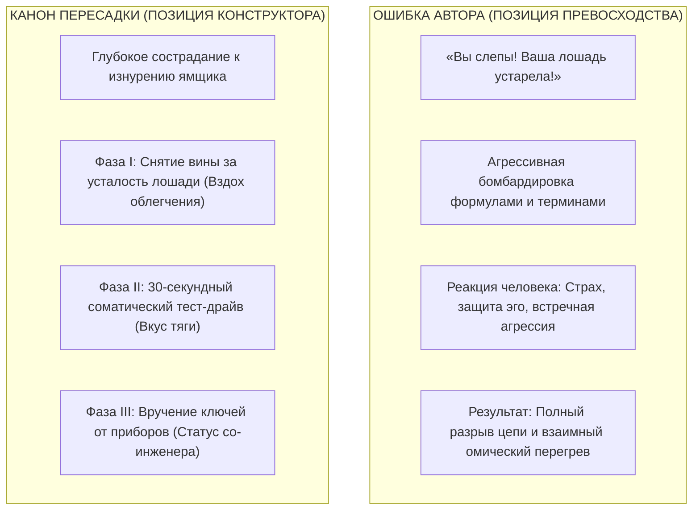
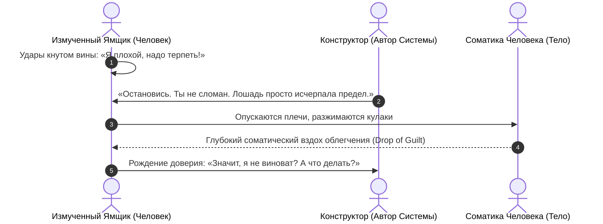
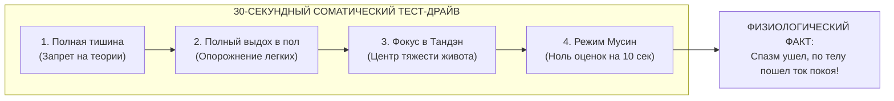
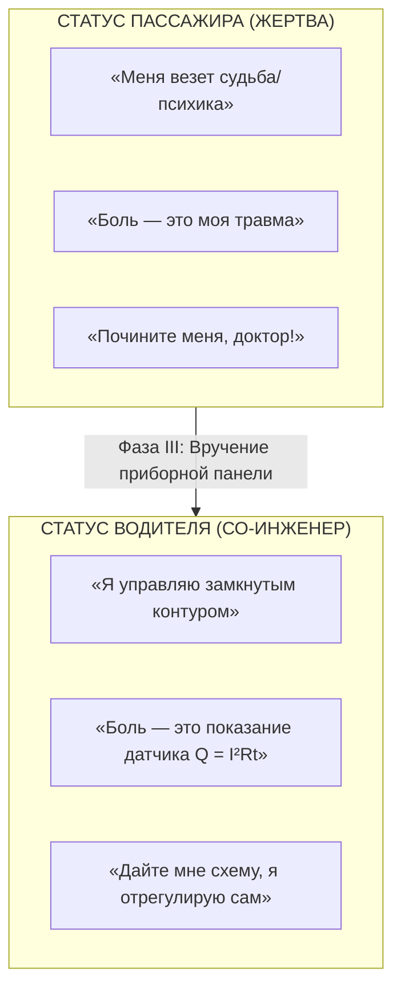
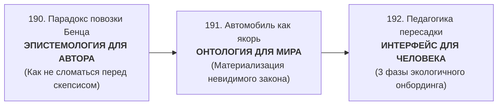

# 192. Педагогика пересадки с лошади на автомобиль: В какое состояние перевести человека, чтобы он понял Систему — Трёхфазный протокол онбординга (Снятие вины, соматический тест-драйв и статус водителя)

[← К оглавлению](file:///C:/Users/vanya/Antigravity%20Projects/Misc/LLM%20Wiki/index.md) | [⚡ К мастер-карте (MOC)](file:///C:/Users/vanya/Antigravity%20Projects/Misc/LLM%20Wiki/04_Maps/Inner%20Current%20MOC.md) | [📖 К полевому мануалу](file:///C:/Users/vanya/Antigravity%20Projects/Misc/LLM%20Wiki/02_Wiki/%D0%9A%D0%BD%D0%B8%D0%B3%D0%B0%20%E2%80%94%20%D0%92%D0%BD%D1%83%D1%82%D1%80%D0%B5%D0%BD%D0%BD%D0%B8%D0%B9%20%D1%82%D0%BE%D0%BA%20%28%D0%9F%D0%BE%D0%BB%D0%B5%D0%B2%D0%BE%D0%B9%20%D0%BC%D0%B0%D0%BD%D1%83%D0%B0%D0%BB%20%D0%BE%D1%82%D0%BB%D0%B0%D0%B4%D0%BA%D0%B8%29.md)

---

> [!quote] Педагогический канон пересадки
> ### ⚡ **«Человек 1886 года не виноват в том, что он знает только лошадь. Вся его родовая память, язык, привычки и страхи выкованы в конюшне. Если создатель автомобиля начинает обвинять ямщика в отсталости или совать ему под нос чертежи термодинамического цикла Карно — ямщик лишь испугается и агрессивно схватится за кнут.  
> Чтобы человек пересел с изнуренной клячи старой жизни в автомобиль сознания, его нельзя учить силой. Его нужно провести через три состояния: сначала снять вину за то, что его лошадь упала; затем дать пережить 30-секундный тест-драйв чистой соматической тяги без кнута; и лишь затем вручить ключи от приборной панели. Истинный конструктор не доказывает правоту — он приглашает за руль.»**  
> — **Владимир Аньянов**

---

## 🧭 1. Парадокс 1886 года: Трагедия ямщика и ошибка изобретателя

Когда на булыжную мостовую XIX века выкатился первый грохочущий экипаж Карла Бенца, подавляющее большинство людей встретило его либо глухим непониманием, либо насмешками. Однако величайшая ловушка для изобретателя — **обидеться на эту реакцию и счесть людей слепцами**.

### Почему человек защищает свою «лошадь»?
Человек эпохи лошади держался за поводья не от глупости, а по фундаментальным эволюционным причинам:
1. **Онтологическая укорененность:** Лошадь сопровождала цивилизацию пять тысячелетий. Вокруг нее были выстроены законы, профессии, архитектура улиц, моральные поучения и метафоры языка (*«пахать как лошадь»*, *«закусить удила»*, *«держать вожжи»*).
2. **Иллюзия надежности:** Лошадь понятна биологически. Она живая, теплая, ест траву, спит в стойле. Автомобиль казался чертовщиной из железа, огня и зловонного аптечного лигроина.
3. **Страх потери компетентности:** Ямщик умел запрягать, чистить копыта и щелкать кнутом. Перед автомобилем его вековые навыки обнулялись. Он чувствовал себя беспомощным ребенком.



Если изобретатель Системы подходит к человеку со словами: *«Твоя психотерапия — чепуха, твои привычки — иллюзия эго, учи законы Кирхгофа!»* — он совершает грубейшую ошибку согласования импедансов ($Z_{\text{src}} \neq Z_{\text{load}}$). Собеседник видит угрозу своему выживанию и немедленно возводит глухую стену сопротивления ($R_{\text{ego}} \to \infty$).

Чтобы перевод состоялся экологично, безыскрово и необратимо, оператор Системы обязан провести человека через **трёхфазный протокол онбординга сознания**.

---

## 😮‍💨 2. Фаза I. Состояние глубокого вздоха: Снятие моральной вины за изнеможение

Человек никогда не заинтересуется автомобилем, пока его «лошадь» молода, сыта, а впереди легкая прогулка.  
К поиску фундаментального решения человек подходит только тогда, когда **его старая система рухнула**:
- Он годами выжимал из себя остатки сил на нелюбимой работе;
- Он истерзал себя кнутом самобичевания (*«Я слабак, я ленив, я не умею медитировать, у меня нет дисциплины»*);
- Он потратил тысячи часов и миллионы рублей на «дорогой овес» (психотерапевтов, антидепрессанты, коучей, марафоны осознанности), но конь всё равно лежит в пыли и тяжело дышит.

### Слово Конструктора
В этот момент человеку меньше всего нужны нравоучения. Первое действие создателя — **сокрушить многовековой моральный миф о вине**:

> *«Остановись. Положи кнут. Посмотри мне в глаза.  
> Ты не сломан. Ты не грешен. Ты не ленив. И твоя лошадь не виновата.  
> Просто лошадь — это биологический механизм, рассчитанный на 20 км/ч по грунтовой дороге. А мир требует от тебя движения со скоростью 100 км/ч в потоке колоссальных нагрузок.  
> Сколько ни хлещи загнанную плоть кнутом стыда — она не сможет выдать энергию турбины. Дело не в твоей порочности. Дело в том, что **этот тип привода исчерпал свой физический ресурс**»*.



### Соматический эффект Фазы I
Когда снимается груз моральной вины, в теле человека происходит **первый квантовый сброс паразитного напряжения**:
- Спазмированная диафрагма делает первый глубокий, свободный вдох;
- Разжимаются трапециевидные мышцы и челюстные зажимы;
- Внутренний обвинитель (DMN) на мгновение замолкает в шоке: его многолетняя пытка признана не преступлением, а инженерной ошибкой масштаба привода.

Рождается базовое состояние готовности: **человек больше не обороняется**. Он готов слушать.

---

## 🏎️ 3. Фаза II. Состояние соматического тест-драйва: Ощущение тяги без кнута

Вторая фаза онбординга — самая критическая. Здесь погибает большинство теоретиков.  
Теоретик начинает совать ямщику учебник физики, объяснять степени сжатия и формулы Максвелла. Ямщик зевает, пугается и уходит обратно в стойло.

Берта Бенц поступила иначе. Она не читала лекций крестьянам в Вислохе. Она **посадила детей, повернула рычаг и поехала**. Люди увидели чудо: повозка движется в гору сама, а впереди нет избиваемого кнутом животного!

В Архитектуре счастья Фаза II — это **30-секундный соматический тест-драйв**:



### Протокол полевого тест-драйва:
Конструктор говорит человеку:
> *«Ни во что не верь. Забудь все слова. Не надо верить мне на слово.  
> Давай сделаем простой эксперимент на тридцать секунд:  
> 1. Сядь ровно и положи руки на колени.  
> 2. Сделай медленный выдох ртом до самого дна, как будто выдуваешь остатки дыма, и опусти всё внимание в точку на два пальца ниже пупка — в центр тяжести своего тела.  
> 3. Задержи дыхание на 3–5 секунд в этой пустоте и просто почувствуй вес своего таза на стуле. Не думай ни о прошлом, ни о будущем. Только тяжесть и тепло внизу живота»*.

Человек делает это. И в течение 15–20 секунд происходит то, чего он не мог добиться годами психотерапии:
- Горловой ком бесследно растворяется;
- Глазные яблоки перестают судорожно метаться;
- В груди разливается странное, незнакомое, монолитное спокойствие — холодная сверхпроводимость цепи ($R \to 0$).

Человек открывает глаза с ошеломленным взглядом:
> *«Подожди... Я же ничего не делал. Я не аффирмировал, не молился, не каялся. Почему мне так спокойно? Откуда эта сила?»*

**Ответ Конструктора:**  
*«Ты только что заглушил изнуренную лошадь и на пять секунд включил двигатель внутреннего сгорания своего тела. Это соматический генератор Тандэн. Сила всегда была там. Просто проводка была замкнута на эго»*.

---

## 🎛️ 4. Фаза III. Состояние любопытного со-инженера: Вручение ключей от приборной панели

Только после того, как человек **телом почувствовал вкус тяги без кнута**, у него просыпается истинный, живой интеллект. Теперь он сам жаждет знания! Он не отмахивается от формул — он просит дать ему инструкцию по эксплуатации.

В этой фазе происходит главное цивилизационное преображение: **человек перестает быть слепым потребителем (пассажиром) и становится суверенным водителем своего контура**.



### Как передавать приборную панель:
1. **Перевод эмоций в датчики:**  
   *«Чувствуешь, как закипает злость, когда тебе не ответили на сообщение? Это не признак твоей греховности. Это стрелка температуры охлаждающей жидкости полезла в красную зону ($Q = I^2 R t$). Ты включил реостат важности своего эго. Выжми сцепление Мусин — сбрось газ ожидания. Видишь? Стрелка пошла вниз»*.
2. **Перевод тревоги в Check Engine:**  
   *«Накатила беспричинная тоска? Не беги за коньяком и не клей изоленту на лампочку. Открой капот: какая из шести ламп нагрузки обесточена? Ты не спал двое суток (лампа Тела)? Или забросил близких (лампа Близости)? Подключи проводку — лампа погаснет сама»*.
3. **Обучение рулению на виражах:**  
   Человек учится проходить стрессовые ситуации бизнеса, семьи и творчества не как драмы шекспировского масштаба, а как **динамическое маневрирование на скоростной трассе жизни**.

---

## 📋 5. Кодекс коммуникации Дзен-Конструктора: Памятка оператора Системы

Чтобы никогда не скатиться в токсичный спор и не вызвать отторжение у людей, оператор Системы Аньянова соблюдает строгий коммуникационный регламент:

```
┌──────────────────────────────────────────────┬──────────────────────────────────────────────┐
│ ❌ ЗАПРЕЩЕНО (Позиция Гордого Гуру)           │  ДОЗВОЛЕНО (Позиция Дзен-Конструктора)      │
├──────────────────────────────────────────────┼──────────────────────────────────────────────┤
│ 1. Обвинять людей в отсталости и слепоте.    │ 1. Сострадать их изнурению и боли от кнута.  │
│ 2. Навязывать теорию до снятия напряжения.   │ 2. Сначала дать 30 секунд тишины и вздоха.   │
│ 3. Спорить о терминах («эго», «бог», «душа»).│ 3. Переводить разговор в физику тела и ток.  │
│ 4. Требовать слепой веры в истинность книги. │ 4. Говорить: «Не верь мне — проверь сам».    │
│ 5. Насильно пересаживать тех, кто счастлив   │ 5. Работать только с теми, чья «лошадь»      │
│    на своей лошади прямо сейчас.             │    уже не везет груз реальности.             │
└──────────────────────────────────────────────┴──────────────────────────────────────────────┘
```

---

## 💎 6. Трилогия Бенца (1886–2026) как завершённый свод перехода

Три статьи канона образуют неразрывное концептуальное единство:



1. **[[02_Wiki/Inner Current (The Benz Motorwagen Paradox — Clumsy Prototypes, The Faster Horse Trap and the Calibration of the Happiness Law)|190. Парадокс повозки Бенца]]** защищает **Автора**: объясняет, почему первый прототип всегда несовершенен, почему нельзя ждать аплодисментов толпы и как держать верность искре в цилиндре.
2. **[[02_Wiki/Inner Current (The Automobile as the Ultimate Physical Anchor — Materializing the Invisible, Dashboard of Consciousness and the End of the Moral Whip)|191. Автомобиль как идеальный физический якорь невидимого]]** защищает **Систему**: переводит абстрактную метафизику в осязаемый металл, приборную панель, двигатель и отмену морального кнута.
3. **[[02_Wiki/Inner Current (The Horse to Automobile Transition — Three-Phase Onboarding of Consciousness, Post-Moral Relief and the Somatic Test Drive)|192. Педагогика пересадки с лошади на автомобиль]]** защищает **Человека**: дает бережный, сострадательный мост перехода от замученной клячи вины к суверенному управлению автомобилем собственного бытия.

---

### Связанные статьи архитектуры цепи:
- **[[02_Wiki/Inner Current (The Automobile of Consciousness — 140 Years from Benz to Anyanov, Post-Moral Imperative and Cybernetics of Addictions)|66. Автомобиль сознания: 140 лет от Бенца до Аньянова, пост-моральный императив и кибернетика зависимостей]]**
- **[[02_Wiki/Inner Current (The Grand Quadrivium — Circuitry of Man, Tuning Fork of Reality, Circuit of Happiness and Automobile of Consciousness)|67. Великий Квадривиум Аньянова: Модель Человека, Камертон Реальности, Контур Счастья и Автомобиль Сознания]]**
- **[[02_Wiki/Inner Current (The Four Barriers of Ego Defense and Transmission Interface — Overcoming The 'I Know It All', Strobe Flash Illusion, Semantic Drift and Annihilation Panic)|189. Четыре барьера передачи Системы и коммуникационный интерфейс оператора]]**
- **[[02_Wiki/Inner Current (The Benz Motorwagen Paradox — Clumsy Prototypes, The Faster Horse Trap and the Calibration of the Happiness Law)|190. Парадокс повозки Бенца: Почему фундаментальное открытие вначале хуже «лошади», ловушка готового результата и калибровка первого мотора счастья]]**
- **[[02_Wiki/Inner Current (The Automobile as the Ultimate Physical Anchor — Materializing the Invisible, Dashboard of Consciousness and the End of the Moral Whip)|191. Автомобиль как идеальный физический якорь невидимого: Почему закону счастья требовался мотор Карла Бенца]]**
