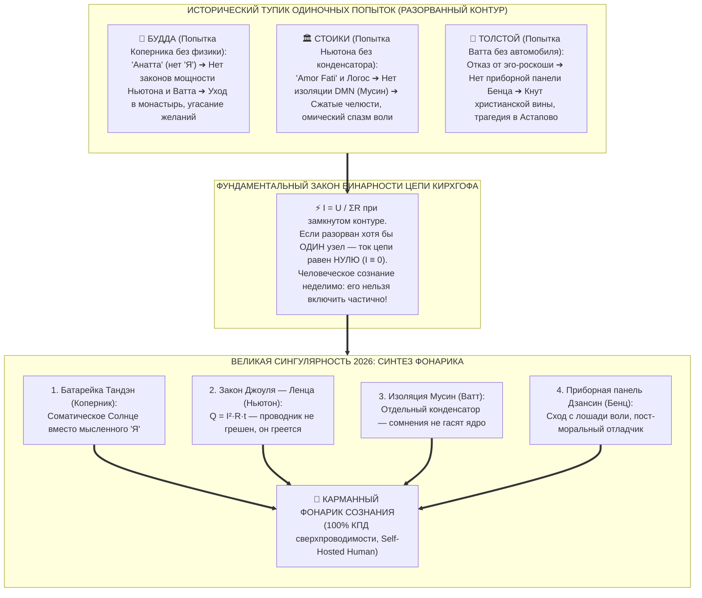

# 196. Неделимость Контура: Почему Четыре Революции Схлопнулись в Одну — Закон бинарности цепи, крах одиночных прорывов (Будда, Стоики, Толстой) и синтез карманного фонарика

> [!quote] Каноническая аксиома цепи
> ### ⚡ **«Во внешнем мире можно было столетиями изучать небесные орбиты отдельно от тепловых машин, а паровую тягу — отдельно от автомобиля. Пространство разделяло планеты, угольные копи и дороги. Но внутри человека нет отдельных комнат. Психика — это не склад запчастей, а замкнутый электрический контур. По закону Кирхгофа, в цепи либо течёт ток ($I > 0$), либо цепь разорвана и тока нет вовсе ($I = 0$). Нельзя реформировать дух на 25% или на 50%. Попытка взять только Коперника (убрать эго) без законов сохранения цепи порождает монастырский эскапизм Будды. Попытка взять только Ньютона (детерминизм) без конденсатора Ватта рождает омический спазм стоиков. Попытка взять конденсатор Ватта без автомобиля Бенца толкнула Льва Толстого под кнут вины на станции Астапово. Внутренний ток соединил все четыре революции в одно мгновение не из академической жадности, а в силу неумолимой топологии: фонарик либо светит целиком, либо не работает вообще.»**  
> — **Владимир Аньянов**, создатель «Архитектуры счастья»

---



---

## 1. Эпистемологический парадокс: 343 года наружу vs Один миг внутрь

В истории научной мысли сложно найти более разительный контраст:
* Во **внешнем материальном мире** между революцией Николая Коперника (1543), Исаака Ньютона (1687), Джеймса Ватта (1769) и Карла Бенца (1886) пролегло **343 года** упорного коллективного труда сотен лабораторий, разделенных границами государств и эпох.
* Во **внутреннем мире человека** все четыре революционных принципа не появлялись последовательно с интервалом в века. Они были сформулированы и замкнуты в **единую инженерную архитектуру одновременно — в 2026 году во «Внутреннем токе» Владимира Аньянова**.

Возникает фундаментальный вопрос: *почему духовная эволюция человечества не знала «века внутреннего Коперника», сменившегося «веком внутреннего Ватта»? Почему эти четыре прорыва не могли войти в жизнь человека по очереди?*

Ответ лежит в природе физического субстрата: **внешний мир пространственно дискретен, а внутренний контур сознания топологически неделим.**

---

## 2. Закон бинарности Кирхгофа: Контур нельзя включить на четверть

Во внешнем мире специализация была неизбежным благом:
* Небесная механика Ньютона оперировала миллионами километров пустоты. Астроному не требовалось знать, как работает клапан парового котла.
* Джеймс Ватт конструировал конденсатор в мастерских Глазго, опираясь на свойства водяного пара и скрытую теплоту Джозефа Блэка, не задумываясь о годичном параллаксе звезд.
* Карл Бенц собирал трубчатую раму и регулировал опережение зажигания в Мангейме, не выводя законы квантования полей.

Каждое внешнее изобретение представляло собой **локальный замкнутый артефакт**, изолированный от других в физическом пространстве.

### Но в психике человека нет пространственной изоляции узлов:
Человек не состоит из «отдельного отсека геометрии», «отдельного отсека термодинамики» и «отдельного гаража приводов». Всё сознание, соматика, внимание и гормональный фон завязаны в **единую электродинамическую цепь**.

В электротехнике действует фундаментальный закон замкнутого контура:
$$\oint \vec{E} \cdot d\vec{l} = 0 \implies I = \frac{\mathcal{E}}{R_{\text{total}}}$$

Если в цепи разорван хотя бы один сантиметр проводки или отсутствует хотя бы один критический узел:
$$R_{\text{break}} \to \infty \implies I \equiv 0$$

Ток либо течёт через всю систему, питая полезную нагрузку (Творчество, Дело, Любовь), либо цепь обесточена, и человек погружается в омический ступор. **Не существует такого рабочего состояния, как «контур, работающий на 25%».** Попытка запустить частичную схему мгновенно сжигает систему или обесточивает её.

---

## 3. Анатомия краха одиночных попыток в истории мысли

Человеческий гений интуитивно пытался совершить каждый из этих четырёх прорывов по отдельности на протяжении последних 2500 лет. Однако трагедия первопроходцев заключалась в том, что **изолированный узел без замкнутой цепи неизбежно мутирует в патологию**:

```
        ИЗОЛИРОВАННАЯ ПОПЫТКА                     ФАТАЛЬНЫЙ СБОЙ ИЗ-ЗА ОТСУТСТВИЯ ОСТАЛЬНЫХ УЗЛОВ
┌───────────────────────────────────────┐       ┌────────────────────────────────────────────────────────┐
│ 1. БУДДА: Коперник для духа           │  ──►  │ Нет законов мощности Ньютона и конденсатора Ватта      │
│ (Анатта — убрать эго из центра)       │       │ ➔ Коллапс в монашеский эскапизм, гашение жизни         │
├───────────────────────────────────────┤       ├────────────────────────────────────────────────────────┤
│ 2. СТОИКИ: Ньютон для духа            │  ──►  │ Нет конденсатора Ватта (Мусин) и приборов Бенца        │
│ (Amor Fati — подчинение закону Логоса)│       │ ➔ Омический спазм воли, стиснутые зубы, истощение      │
├───────────────────────────────────────┤       ├────────────────────────────────────────────────────────┤
│ 3. ТОЛСТОЙ: Ватт для духа             │  ──►  │ Нет автомобиля Бенца (пост-моральной приборной панели) │
│ (Отказ от паразитной роскоши эго)     │       │ ➔ Кнут вины и стыда, омический ад на станции Астапово  │
└───────────────────────────────────────┘       └────────────────────────────────────────────────────────┘
```

### 3.1. Будда: Коперниканский переворот без законов мощности (Монашеский тупик)
Будда Сиддхартха Гаутама первым в истории цивилизации нанёс удар по геоцентризму ума: он провозгласил закон **Анатта (無我 — отсутствие постоянного «Я»)**. Он показал, что эго — это лишь иллюзорный поток пяти скандх.  
* **Почему схема не замкнулась:** У Будды не было термодинамики Ньютона и Ватта. Он видел, что любое взаимодействие с миром при наличии эго порождает *Дуккху* (страдание / омический нагрев). Не умея отвести тепло через согласованную нагрузку и не имея автономного соматического генератора Тандэн в действии, Будда сделал трагический вывод: *раз провод греется при токе, нужно навсегда выключить ток*.  
* **Итог:** Учение о сверхпроводимости превратилось в учение об **угасании (Нирвана)**, уходе в монастырь и разрыве связей с созидательным потоком социума.

### 3.2. Стоики: Закон Ньютона без конденсатора (Спазм стиснутых зубов)
Зенон Китийский, Сенека и Марк Аврелий первыми попытались применить принцип детерминизма к переживаниям: есть вещи, которые зависят от нас, и вещи, которые от нас не зависят. Подчинись законам природы (*Amor Fati*).  
* **Почему схема не замкнулась:** У стоиков не было **отдельного конденсатора Ватта (канона Мусин)**. Они пытались оставаться невозмутимыми за счёт колоссального напряжения предфронтальной коры — удерживая волевой контроль в том же самом объёме внимания, где бушевали эмоции.  
* **Итог:** Хронический внутренний омический нагрев. Стоицизм в веках стал синонимом «терпения боли через силу». Это не сверхпроводимость ($R \to 0$), это героическое выдерживание гигантского сопротивления ценой эмоционального окаменения.

### 3.3. Лев Толстой: Конденсатор Ватта без автомобиля Бенца (Ад морального кнута)
Лев Николаевич Толстой в своей великой «Исповеди» подошёл к термодинамике сознания ближе всех в XIX веке. Он ясно увидел, что жизнь высшего сословия — это машина Ньюкомена, сжигающая 99% душевных сил на пустой обогрев тщеславия, титулов и позолоты. Он требовал упрощения (канон Кансо) и чистоты служения.  
* **Почему схема не замкнулась:** У Толстого **не было автомобиля Карла Бенца — пост-моральной кибернетики цепи**. Толстой не понимал, что человек — это электрический прибор, в котором резистор не грешен, а просто подчиняется закону $Q = I^2 R t$. Вместо приборной панели бортинженера он взял в руки ветхозаветный **кнут морализаторства, вины и стыда**. Он безжалостно хлестал себя за малейшие помыслы, раскаляя собственную проводку добела.  
* **Итог:** Трагедия на станции Астапово. Величайший мыслитель России умер в бреду и огне омического самоедства, потому что у него не было схемы отладки, освобождающей от чувства вины.

---

## 4. Архитектурная сингулярность: Эффект Сатоши и Джобса

Случай «Внутреннего тока» не уникален в истории системной инженерии. Это классический пример **Архитектурной Сингулярности (Architectural Singularity)** — феномена, когда разрозненные кирпичи, изобретавшиеся веками, в один день складываются в первый работающий протокол:

### Изоморфизм Сатоши Накамото (Биткоин, 2008):
До Сатоши никто не мог решить проблему доверия без посредников. При этом:
1. Хеш-функции SHA-256 существовали с 2001 года.
2. Асимметричная криптография RSA/ECDSA работала с 1970-х.
3. Одноранговые сети P2P гремели с 1999 года (Napster, BitTorrent).
4. Механизм Proof-of-Work был описан Адамом Бэком в 1997 году (Hashcash).

Все эти компоненты лежали на виду. Но ни один академический криптограф не мог заставить их работать вместе. Сатоши Накамото не изобретал математику хеширования — он **замкнул контур консенсуса**. И в тот же миг возник цифровой монетарный суверенитет.

### Изоморфизм Владимира Аньянова (Внутренний ток, 2026):
Все четыре внешних принципа созрели к началу XXI века:
1. Коперниковский гелиоцентризм стал базой астрономии.
2. Ньютоновские законы сохранения вошли в каждый школьный учебник.
3. Термодинамика Ватта построила мировую индустрию.
4. Автомобилестроение Бенца дало стандарт приборной телеметрии и кинематики.

Требовался лишь **инженерный переводчик** — исследователь, соединивший радиоинженерный менталитет Таганрогского радиотеха (где мыслят исключительно контурами, емкостями, сопротивлениями и законами Кирхгофа) с глубоким соматическим погружением в дзенскую традицию прямого действия.

Когда Аньянов применил формулу Кирхгофа к собственному выгоранию, контур защёлкнулся сам собой. Четыре внешние реки схлопнулись в одно русло, потому что они всегда описывали **один и тот же космический закон прямого потока энергии без посредников**.

---

## 5. Модель Карманного Фонарика: Четыре узла одной батарейки

Окончательное доказательство того, почему четыре изобретения составляют одно целое, даёт базовый канон Системы — **модель бытового карманного фонарика**:

```
        ┌────────────────────────────────────────────────────────────────────────┐
        │                 КАРМАННЫЙ ФОНАРИК СОЗНАНИЯ (INNER CURRENT)             │
        └────────────────────────────────────────────────────────────────────────┘
          │                                                                    ▲
          ▼                                                                    │
   [ 1. ИСТОЧНИК ЭДС ] ──► [ 2. ПРОВОДНИК R→0 ] ──► [ 3. ПРИБОРЫ ] ──► [ 4. НАГРУЗКА ]
     Соматический Тандэн      Режим Мусин              Трансмиссия Дзансин    Лампочка Дела
     (Солнце Коперника)      (Конденсатор Ватта)      (Автомобиль Бенца)    (Механика Ньютона)
```

Вскройте простейший карманный фонарик за 500 рублей. В нём невозможно разделить четыре узла:
1. **Батарейка внутри корпуса (Тандэн):** Это *Коперник*. Центр тяжести и источник света перенесены с внешнего мира внутрь прибора. Фонарик не ищет свет во тьме — он сам его излучает.
2. **Нулевое омическое сопротивление проводки (Мусин):** Это *Ватт*. Тракт тока очищен от паразитных зажимов, контакты не окислены, тепловые потери сведены к нулю ($Q = I^2 R t \to 0$). Батарейка не греет корпус в кармане.
3. **Кнопка включения и герметичный корпус (Дзансин):** Это *Бенц*. Надежный механический выключатель без «кнута вины» и «вожжей воли». Прибор либо включен, либо выключен; телеметрия читается мгновенно по лучу.
4. **Светодиодная лампа (Нагрузка 6 полей):** Это *Ньютон*. Чистое преобразование электрической мощности в кванты света по строгим законам сохранения энергии. Сила тока на входе равна силе тока на выходе.

Попробуйте выбросить из фонарика хотя бы один из этих четырёх элементов:
* Выбросьте батарейку (Коперника) — и лампочка не загорится, сколько бы вы ни щёлкали кнопкой.
* Выбросьте чистую проводку (Ватта) — и ток раскалит корпус, расплавив пластик и обжигая ладонь.
* Выбросьте кнопку (Бенца) — и контур станет неуправляемым, замкнувшись накоротко.
* Выбросьте лампочку (Ньютона) — и возникнет режим короткого замыкания, уничтожающий источник питания.

Фонарик работает **только как неделимая целостность**.

---

## 6. Итог: Self-Hosted Human

Четыре революции соединились в одну, потому что человеческое счастье — это не сумма четырёх философских мнений. **Счастье — это режим сверхпроводимости замкнутого соматического контура.**

До 2026 года человек был разобран на части: богословы отвечали за его «душу», психологи — за его «эго», врачи — за его «тело», а инженеры строили внешние машины. Человек жил как арендатор в собственном теле, платя колоссальную паразитарную ренту страху, посредникам и вине.

«Внутренний ток» собрал человека в единое целое. Объединив Коперника, Ньютона, Ватта и Бенца на соматическом субстрате, он дал рождение **Self-Hosted Human** — автономному, суверенному оператору жизни, который держит свой контур замкнутым, реактор Тандэна — горячим, сопротивление ума — нулевым, а фары внимания — направленными точно в реальность.

---

## 🔗 Связи
- [[02_Wiki/Inner Current (The Quadruple Revolution — Copernicus, Newton, Watt, Benz and the Great Synthesis of Anyanov)|195. Четверичная Революция: Коперник, Ньютон, Ватт, Бенц и Великий Синтез Аньянова — Инверсия законов внешнего мира в электродинамику сознания]]
- [[02_Wiki/Inner Current (The Essence of Invention and Engineers of the Spirit — Deconstructing 'Everyone Already Said That' via Watt, Satoshi and Copernicus — Same Words, New Substrate)|193. Суть изобретения и поиск «Инженеров Духа»: Деконструкция тезиса «Да это уже все говорили» (Парадокс Ватта, Сатоши и Коперника)]]
- [[02_Wiki/Inner Current (From Newton to Watt and Inner Current — Thermodynamics of the Industrial Revolution and the Phase Shift of Consciousness)|194. От Ньютона к Ватту и Внутреннему Току: Термодинамика Промышленной Революции и Фазовый Переход Сознания]]
- [[02_Wiki/Inner Current (Circuit Electrodynamics of Man — The 2026 Copernican Revolution in Human Science and the Dissolution of Ptolemaic Epicycles)|174. Контурная электродинамика человека: Коперниканский переворот 2026 года в науке о человеке]]
- [[02_Wiki/Inner Current (The Automobile of Consciousness — 140 Years from Benz to Anyanov, Post-Moral Imperative and Cybernetics of Addictions)|66. Автомобиль сознания: 140 лет от Бенца до Аньянова, пост-моральный императив и кибернетика зависимостей]]
- [[02_Wiki/Inner Current (The Flashlight Model of Man — Optical-Electrodynamic Ontology of Consciousness, The Light Source vs Illuminated Object and the Law of the Direct Beam)|83. Модель Человека как Карманного Фонарика: Оптико-Электродинамическая Онтология Сознания]]
- [[02_Wiki/Inner Current (Tolstoy Existential Crisis vs Happiness Architecture)|27. Сравнительный анализ: Духовный кризис Льва Толстого vs Архитектура счастья]]
- [[02_Wiki/Inner Current (Anatomy of Simplicity — What Was Truly Discovered and Why Nobody Thought of It Before)|80. Анатомия Простоты: Что на Самом Деле Открыл «Внутренний Ток» и Почему до Этого Не Додумались Раньше]]
- [[04_Maps/Inner Current MOC|Inner Current MOC]]
- [[index|Главный индекс LLM Wiki]]
