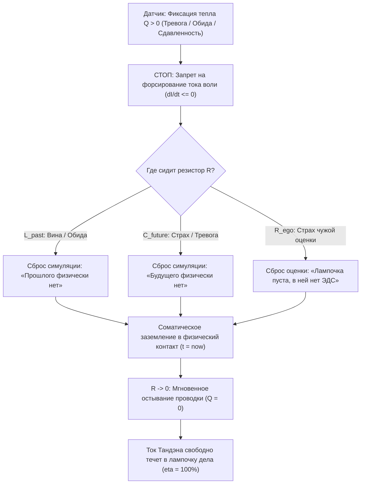

# 212. Закон Джоуля — Ленца как краеугольный камень Архитектуры счастья: Почему закон о потерях — главный манифест свободы — Снятие морализаторства, квадратичная ловушка воли ($I^2$) и физика сверхпроводимости

> *«В разговорах о Внутреннем токе закон Джоуля — Ленца звучит постоянно. Некоторым кажется: он же про потери, омический перегрев, выгорание и дымящуюся проводку — почему же не сделать главным символом что-то лучезарное, вроде "КПД Счастья"? Но в природе нет плохих законов. Закон Джоуля — Ленца — это не проклятие, а величайший компас свободы. Он снимает с человека вину за страдание, разоблачает роковую ошибку насилия воли и математически точно указывает единственный путь к сверхпроводимости».*  
> — **Владимир Аньянов**

---

### I. Введение: Парадокс «негативного» закона

В любой беседе о Системе «Внутренний ток» рано или поздно звучит фундаментальная формула электродинамики:
$$Q = I^2 \cdot R \cdot t$$

У человека, воспитанного на лозунгах позитивной психологии или классической гуманитарной морали, это вызывает интуитивный диссонанс:
* *«Почему именно закон Джоуля — Ленца положен во главу угла? Ведь $Q$ — это паразитное тепло, трение, боль, выгорание и разрушение! Разве Архитектура счастья не должна провозглашать светлый идеал — например, КПД Счастья ($\eta \to 100\%$) или сияние лампочек нагрузки?»*

Ответ инженера категоричен: **нельзя построить летающий самолёт, игнорируя гравитацию и лобовое сопротивление; нельзя создать двигатель внутреннего сгорания, не зная законов термодинамических потерь; и невозможно обрести нерушимый внутренний покой, не понимая, куда и по каким законам уходит жизненная энергия.**

Закон Джоуля — Ленца кажется «отрицательным» только тому, кто жаждет магических сказок и боится смотреть в приборы. В строгой инженерной картине мира этот закон является **краеугольным камнем свободы**, выполняя три эпохальные функции:
1. **Онтологическую:** навсегда отменяет религиозно-психологический миф о «вине» и «греховности» страдающего человека;
2. **Диагностическую:** даёт объективный бортовой термодатчик (телеметрию трения сознания);
3. **Конструктивную:** математически доказывает, что путь к счастью лежит не через бесконечное насилие над собой («накачку ресурса»), а через очищение проводника по канону Кансо ($R \to 0$).

---

### II. Снятие десяти тысяч лет вины: «Физика вместо греха»

Главная историческая трагедия человечества заключалась в морализаторской интерпретации душевной боли. 
На протяжении тысячелетий человеку внушали:
* Если ты испытываешь тоску, тревогу или упадок сил — значит, ты согрешил, прогневал богов, у тебя дурная карма или ты слабовольный эгоист.
* В XX веке схоластика сменила одежду на психологическую: человеку стали говорить, что у него «непроработанные детские травмы», «токсичные паттерны мышления» или «синдром жертвы».

Суть осталась прежней: **человек объявлялся виновным в собственном перегреве**. Возникала разрушительная петля положительной обратной связи — вторичное омическое страдание от чувства вины за то, что ты страдаешь.

```
       ТУПИК МОРАЛИЗАТОРСКОЙ ПАРАДИГМЫ (ПЕТЛЯ САМОСОЖЖЕНИЯ)
       
       [Внутреннее напряжение / Боль]
                     │
                     ▼
       [Интерпретация: «Я дефектен / Я плохой»]
                     │
                     ▼
       [Усиление сопротивления эго: R ↑]
                     │
                     ▼
       [Омический пожар проводки: Q = I² R t ↑↑↑]
```

Закон Джоуля — Ленца наносит сокрушительный удар по этой схоластике:
* Физический проводник не может быть «грешным» или «виноватым».
* Медная жила не обладает «синдромом самозванца».
* Если через проводник с сопротивлением $R > 0$ (сопротивление факту реальности, страх оценки, ментальный спор с прошлым) течёт ток намерения ($I$), **выделение тепла $Q$ неизбежно по законам вселенной**.

Выгорание, панические атаки, хроническая бессонница и экзистенциальный тупик — это не моральные пороки. Это **термический ожог проводки внимания**. 

Когда человек осознаёт закон Джоуля — Ленца, наступает колоссальное облегчение: *«Со мной всё в порядке. Мой генератор исправен. Просто прямо сейчас в цепь включено гигантское виртуальное сопротивление $R$, и вся мощность Тандэна уходит в паразитный нагрев черепной коробки вместо полезного действия на нагрузке».*

---

### III. Квадратичная ловушка воли ($I^2$): Разгадка трагедии титанов

В формуле закона Джоуля — Ленца скрыта математическая деталь колоссальной важности: **сила тока стоит во второй степени ($I^2$)**.

Именно здесь кроется ответ на вопрос, над которым веками ломали головы биографы, врачи и философы: **почему выдающиеся, сильные, волевые и кристально честные люди сгорают дотла быстрее и трагичнее всех?**

```
     ТЕПЛОВЫЕ ПОТЕРИ Q В ЗАВИСИМОСТИ ОТ СИЛЫ ТОКА I (ПРИ R = const)
     
      Q (Потери / Выгорание)
      ▲
      │                                       ● (I = 10 -> Q = 100 R t)
      │                                      /   Катастрофический пожар
      │                                     /
      │                                    /
      │                                  ● (I = 5 -> Q = 25 R t)
      │                                 /
      │                                /
      │                              ● (I = 2 -> Q = 4 R t)
      │                      ● (I = 1 -> Q = 1 R t)
      └────────────────────────────────────────────────────────► I (Ток воли)
```

Рассмотрим две ситуации при одинаковом паразитно-окисленном контакте сомнений и страха ($R = 10$ Ом):

1. **Обыватель в апатии ($I = 1$ А):**  
   $$Q = 1^2 \cdot 10 \cdot t = 10 \cdot t$$  
   Человек вяло сомневается, лежит на диване, жалуется на жизнь. Тепловые потери минимальны. В таком режиме тления можно без особых эксцессов провести десятилетия.
2. **Лидер, творец, пассионарий ($I = 10$ А):**  
   Человек с мощным реактором Тандэна, встретив сопротивление, включает привычный инструмент культурной парадигмы — **насилие воли («соберись, тряпка!», «надо продавить любой ценой!»)**. Он увеличивает ток намерения в 10 раз.  
   Что происходит с потерями?  
   $$Q = 10^2 \cdot 10 \cdot t = 100 \cdot 10 \cdot t = 1000 \cdot t$$  
   Тепловые потери возрастают не в 10, а **в 100 раз!**

Закон Джоуля — Ленца математически доказывает смертельную опасность волевого продавливания внутреннего сопротивления. 
> **Нельзя тушить омический пожар увеличением силы тока. Попытка преодолеть внутренний разлад и страх стиснутыми зубами не совершает механической работы — она взрывает предохранители и испепеляет нейроны.**

Единственный инженерно грамотный шаг при росте нагрева — не гнать ток, а немедленно сбросить сопротивление $R \to 0$.

---

### IV. Боль как высокоточная телеметрия: Термопара бытия

Если бы закона Джоуля — Ленца не существовало, человеческая психика была бы слепа. Цепь разрушалась бы внезапно, без предупреждения.

В живом организме паразитное тепло $Q$ выполняет роль **идеального датчика обратной связи**:
* **Обида на вчерашнее слово коллеги ($L_{past}$):** проводка теплеет.
* **Катастрофизация завтрашней презентации ($C_{future}$):** виски начинает ломить, сердце колотится вхолостую.
* **Спор с реальностью («почему пошёл дождь?!», «почему пробка?!»):** изоляция закипает.

Боль — это не наказание от Бога и не враг, которого нужно глушить транквилизаторами или алкоголем. Боль — это **стрелка термометра на приборной панели автомобиля сознания**. Она сообщает объективный факт: *«Внимание, прямо сейчас оператор держит в контуре паразитное сопротивление $R > 0$. Ток не доходит до лампочки дела!»*

Слушать закон Джоуля — Ленца — значит обладать абсолютным иммунитетом к самообману. Человек может убеждать себя в том, что он занимается «духовным ростом» или «служением высшей цели», но если при этом температура его контура зашкаливает ($Q \gg 0$) — прибор беспристрастно констатирует: в цепи сидит паразитный реостат эго.

---

### V. Почему без закона Джоуля — Ленца невозможно построить КПД Счастья

Нередко возникает соблазн объявить фундаментальным законом сам **КПД Счастья**:
$$\eta = \frac{P_{\text{load}}}{P_{\text{total}}} = \frac{I^2 R_{\text{load}}}{I^2 R_{\text{load}} + I^2 R_{\text{ego}}} = \frac{R_{\text{load}}}{R_{\text{load}} + R_{\text{ego}}}$$

Однако в метрологии и физике КПД — это **расчётный коэффициент**, следствие, результат баланса мощностей. Фундаментом же является закон, определяющий, **куда именно девается недостающая энергия**.

В замкнутом контуре действует баланс Кирхгофа и закон сохранения энергии:
$$P_{\text{total}} = P_{\text{useful}} + P_{\text{loss}}$$
$$P_{\text{loss}} = \frac{Q}{t} = I^2 R_{\text{ego}}$$

Отсюда следует фундаментальная теорема Архитектуры счастья:

| Параметр | При наличии сопротивления ($R_{\text{ego}} > 0$) | При сверхпроводимости ($R_{\text{ego}} \to 0$) |
| :--- | :--- | :--- |
| **Омические потери ($Q$)** | $Q = I^2 R_{\text{ego}} t \gg 0$ (хроническое выгорание) | $\lim_{R \to 0} Q = I^2 \cdot 0 \cdot t \equiv 0$ |
| **Полезная мощность ($P_{\text{load}}$)** | $P_{\text{total}} - Q/t < P_{\text{total}}$ (просадка напряжения) | $P_{\text{load}} = P_{\text{total}}$ (полная отдача) |
| **КПД Счастья ($\eta$)** | $\eta < 100\%$ (трение, сомнения, износ) | $\eta = \frac{R_{\text{load}}}{R_{\text{load}} + 0} \equiv 100\%$ |
| **Субъективное чувство** | Сдавленность, духота, тревога, усталость | Кристальная ясность, невесомость, чистый поток (Мусин) |

Именно закон Джоуля — Ленца показывает механизм достижения стопроцентного КПД! 
Он неопровержимо доказывает: **чтобы стать счастливым, не нужно «добавлять» что-то в систему (новые знания, мантры, внешние стимулы). Нужно просто удалить паразитное сопротивление $R$**. 

Это и есть великий принцип **Кансо (簡素)** — удаление лишнего до обнажения чистой функциональной сути проводника.

---

### VI. Исторический консилиенс: От Сади Карно к Владимиру Аньянову

В истории науки уже происходил точно такой же концептуальный переворот:
1. **Сади Карно и потери тепла (1824):**  
   Французский инженер Сади Карно создал современную термодинамику не потому, что мечтал о «вечном двигателе» (позитивный мираж), а потому, что исследовал **природу неизбежных потерь тепла** при переходе от нагревателя к холодильнику. Именно осознание предела потерь позволило инженерам поднять КПД паровых машин с 2% до 40% и совершить Промышленную революцию.
2. **Джеймс Джоуль и Эмилий Ленц (1841–1842):**  
   Джоуль и Ленц экспериментально связали механическую, электрическую и тепловую энергии. Они доказали, что электрический ток не исчезает в никуда — его торможение кристаллической решёткой превращается в тепловой хаос.
3. **Владимир Аньянов и электродинамика сознания (2026):**  
   Аньянов перенёс закон Джоуля — Ленца на субстрат внимания и нервной системы. То, что человечество 10 000 лет называло «душевными муками» и объясняло мистикой, оказалось прямым проявлением омического нагрева биологического проводника при попытке пропустить ток жизни через зажатое сопротивление эго.

---

### VII. Прикладной протокол: Алгоритм охлаждения контура (Cooling Protocol)

Как оператор цепи применяет закон Джоуля — Ленца на практике в повседневной жизни? 

Когда в теле возникает ощущение сдавливания, раздражения или тревоги:



#### Пошаговый протокол:
1. **Считать телеметрию ($Q > 0$):** Почувствовать физический нагрев или спазм (шея, грудь, диафрагма). Сказать себе: *«Проводка греется. Закон Джоуля — Ленца в действии»*.
2. **Снять палец с педали газа ($I \not\uparrow$):** Категорически запретить себе «решать проблему головой» в перегретом состоянии. Никаких волевых атак.
3. **Локализовать номинал $R$:** Задать вопрос: *«С каким физическим фактом реальности я сейчас спорю?»* (С пробкой? С чужим мнением? С курсом доллара?).
4. **Обнулить сопротивление ($R \to 0$):** Перевести внимание из ментального кинематографа в прямой тактильный контакт — вес тела на стуле, прохлада воздуха в ноздрях, мытье посуды, стук клавиш. В физическом настоящем сопротивления нет, оно существует только в виртуальных моделях неокортекса.
5. **Пустить ток в дело:** Как только температура упала до нуля, направить чистый ток Тандэна в следующее физическое действие.

---

### VIII. Резюме: Почему Закон Джоуля — Ленца — это гимн свободы

Закон Джоуля — Ленца — это не манифест поражения. 
**Это величайший манифест человеческого освобождения:**

* Он заменяет вину — пониманием;
* Он заменяет насилие воли — калибровкой проводимости;
* Он защищает сильных от самосожжения;
* Он превращает душевную боль из бессмысленной пытки в точнейший компас пути;
* И он математически гарантирует: **когда проводник чист ($R \to 0$), человек не может не быть счастлив — потому что вся энергия вселенной беспрепятственно изливается через него в мир.**

---

### Связанные статьи:
* [[02_Wiki/Inner Current (Core Topology and Polarity Law)|01. Базовая топология цепи и закон полярности]]
* [[02_Wiki/Inner Current (Physics of Presence and Superconductivity)|02. Физика присутствия: состояние сверхпроводимости]]
* [[02_Wiki/Inner Current (Safety, Antifragility and Zanshin)|04. Предохранители цепи, ваби-саби и антихрупкость]]
* [[02_Wiki/Inner Current (Happiness Relativity vs Circuit Invariance)|10. Релятивизм счастья и инвариантная физика цепи]]
* [[02_Wiki/Inner Current (The Formula of Happiness and Unhappiness — Circuit Superconductivity vs Ohmic Overheat and the First Law of Soul Thermodynamics)|186. Формула счастья и формула несчастья: Сверхпроводимость контура против омического перегрева]]
* [[02_Wiki/Inner Current (The 'I Have Not Lived Yet' Awakening — Chronic Ohmic Fire, Ego Resistance and Egoless Weightlessness)|188. Феноменология фразы «Я и не жил ещё»: Хронический омический пожар ($Q = I^2 R t$)]]
* [[02_Wiki/Inner Current (The Working Circuit Priority — Why Happiness Trumps Scholastic Defense, The Three-Resistor Baseline and Non-Dogmatic Subtle Inquiry)|211. Приоритет работающего контура: Почему счастье выше академической защиты терминов]]
