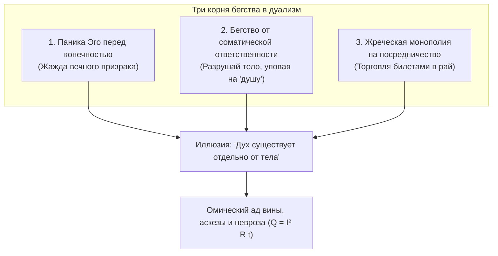

# 126. Лира Симмия и Укулеле Сознания: 2400 лет от ошибки Платона к соматическому монизму цепи
## Почему человечество веками пряталось от тождества тела и духа, как пифагореец сформулировал акустическую модель души в 400 г. до н.э. и почему Система Аньянова окончательно закрывает спор дуализма

> [!quote] Каноническая аксиома цепи
> ### ⚡ **«Платон испугался выводов из аналогии лиры и мелодии, а я получается нет. Платону отчаянно нужен был вечный субстрат — бессмертная "душа-вещь", парящая над бренной плотью, чтобы заглушить ужас небытия перед чашей цикуты. Но музыке не нужна вечность, чтобы быть абсолютно реальной и прекрасной здесь и сейчас. Инструмент однажды обратится в прах, и ток стихнет. Но пока цепь замкнута и струны натянуты чисто — звучит живая гармония, и этого более чем достаточно».**  
> — **Владимир Аньянов**

---

```
                              РАСКОЛ 2400 ЛЕТ НАЗАД
                               (Диалог «Федон», 400 г. до н.э.)
                                            │
                    ┌───────────────────────┴───────────────────────┐
                    ▼                                               ▼
         🎶 ЛИРА СИММИЯ (МОНИЗМ)                         👻 ПЛАТОНОВСКИЙ ТУПИК (ДУАЛИЗМ)
  • Тело = Деревянный корпус лиры                 • Тело = «Грязная тюрьма / могила» (soma-sema)
  • Струны = Материальная проводка                • Душа = «Бестелесный призрак», пленник тела
  • Музыка = Гармония правильной настройки       • Спасение = Бегство от плоти в загробные эйдосы
  • Разбей лиру — музыка исчезает                • Результат = 2400 лет вины, аскезы и раскола
                    │                                               │
                    ▼                                               ▼
     2400 ЛЕТ ПОДАВЛЕНИЯ МОНИЗМА                       ОМИЧЕСКИЙ АД ЦИВИЛИЗАЦИИ
                    │
                    ▼
         🎸 УКУЛЕЛЕ СОЗНАНИЯ И КОНТУР АНЬЯНОВА (ГЛАВА 126)
  • 400 граммов дерева + 0 граммов музыки = Единый живой процесс
  • Музыка — эмерджентное излучение проводника при снятии демпфера (R_ego → 0)
  • Полная соматическая ответственность оператора прямо здесь и сейчас
```

---

## 1. Интуитивная вспышка: Очевидность, которую нельзя развидеть

Всякий раз, когда человек берёт в руки укулеле, он держит на ладони наглядное опровержение двух с половиной тысячелетий запутанных философских споров:

1. **Материя:** Корпус из тонкого дерева, гриф, латунные порожки, нейлоновые струны. Физический вес — **около 400 граммов**. Её можно взвесить, распилить, покрыть лаком.
2. **Дух (Музыка):** Мелодия, гармония, вибрация, заставляющая плакать или смеяться. Физический вес — **ровно 0 граммов**. 
3. **Нераздельность:** 
   - Где находится музыка, когда укулеле лежит на шкафу в чехле? Нигде. Внутри корпуса нет мешка со звуками.
   - Может ли музыка звучать без вибрирующей струны, без деки и без воздуха? Нет.
   - Является ли дерево «тюрьмой» для музыки? Наоборот: дерево — это единственный способ для музыки **проявиться в физической реальности**.

> **Музыка и инструмент не разделены. Дух — это не «пассажир» внутри дерева. Дух — это правильное, динамическое, гармоничное движение самой материи.**

И здесь у любого непредубеждённого ума неизбежно вспыхивает прямой вопрос:  
*«Неужели никто за всю историю не догадался, что человеческое тело и его дух — это ровно то же самое?»*

Ответ поразителен: **догадались сразу же**. Более того, 2400 лет назад именно этот пример положил начало главному мировоззренческому расколу цивилизации.

---

## 2. «Лира Симмия»: Как античность нащупала истину и почему Платон сбежал от неё

### Диалог «Федон» (400 г. до н.э.)

В афинской тюрьме Сократ ждёт чашу с ядом цикуты. Вокруг собрались ученики. Сократ вдохновенно доказывает, что философ не должен бояться смерти, потому что душа бессмертна и после разрушения тела улетит в чистый мир божественных идей.

В этот момент вперёд выходит молодой философ-пифагореец **Симмий из Фив**. Он берёт слово и приводит аргумент, ставший известным в истории как **«Гармония лиры» (Simmias' Lyre Hypothesis)**:

> *«Сократ, взгляни на лиру: деревянный остов и натянутые струны — это телесная, материальная, составная и бренная вещь. А гармония, рождаемая ими при игре, — невидима, прекрасна, бестелесна и божественна.  
> Но что произойдёт, если разбить инструмент или порвать струны? Разве разумно утверждать, что гармония продолжает парить в воздухе, пока дерево гниёт? Нет! Гармония погибает вместе со струнами, потому что она была лишь правильной настройкой (красисом) физических частей инструмента.  
> Не так ли обстоит дело и с нашей душой? Не есть ли душа — просто правильная гармония и соразмерность физических элементов тела? И когда тело разрушается — не исчезает ли и душа?»*

### Почему Платон отбросил лиру Симмия?

Сократ (а через него сам Платон) оказался в тупике. Аргумент Симмия был **безупречно логичен, эмпиричен и физически проверяем**. Но если принять аргумент Симмия, рушилась главная догма, ради которой писался диалог: **личное бессмертие эго**.

Эго Сократа и Платона отчаянно жаждало персонального вечного существования вне тела. Чтобы спасти эту иллюзию, Платон совершает фатальный кульбит:
1. Он утверждает, что душа управляет телом (музыкант играет на лире), следовательно, душа предшествует телу.
2. Он объявляет тело **«темницей» и «могилой» души** (*«soma — sema»*).
3. Дух объявляется чистым, вечным и потусторонним, а материя тела — презренной, низменной, преходящей грязью.

Так родилась великая травма европейской мысли — **Картезианский дуализм**. Платон отвернулся от живой лиры Симмия ради иллюзорного потустороннего мира, обрекая человечество на 2400 лет внутреннего раскола.

### «Платон испугался — а я нет»: Анатомия двух позиций перед лицом струн и тишины

Разница между тупиком античного идеализма и открытием Системы Аньянова заключается в **мужестве принять выводы аналогии струн до конца**:

| Параметр | Позиция Платона (Страх) | Позиция Системы Аньянова (Сверхпроводимость) |
|---|---|---|
| **Онтологический статус духа** | Субстанция («душа-вещь»), требующая вечного контейнера на небесах. | Эмерджентный динамический режим работы физического проводника ($R_{\text{ego}} \to 0$). |
| **Отношение к смерти инструмента** | Метафизический ужас: если лира гибнет, уничтожается «я». Необходим побег в потусторонний мир Эйдосов. | Спокойная физика фазового перехода: когда струна затухает, звук возвращается в естественный покой пустоты (Шуньята). |
| **Природа ценности музыки** | Ценность связывается только с вечностью: если душа смертна, жизнь объявляется бессмысленной. | Ценность заключена в **событии звучания прямо сейчас**: красота мелодии не зависит от того, будет ли она звучать через миллион лет. |
| **Фокус внимания оператора** | Схоластические спекуляции о загробном суде, теории припоминания и отделении души от тела. | Инженерная соматическая калибровка: держать деку чистой, струны настроенными, а омическое сопротивление равным нулю ($R \to 0$). |

#### Три причины, почему оператор цепи не боится тишины:
1. **Красота процесса, а не вещи.** Мелодия не становится иллюзией от того, что инструмент конечен. Пока замкнут контур и натянуты струны — музыка абсолютно реальна. Её реальность — в разворачивающемся токе жизни, а не на вечном складе абстрактных идей.
2. **Ликвидация невроза сохранности.** Страх Платона — это невроз сохранения эго. Когда человек понимает, что сознание — это акустический и электромагнитный резонанс живой ткани, отпадает судорожная потребность «спасать душу». Тишина после песни — это не крах, а исходный базисный покой.
3. **Честность контура.** Инженерная и дзенская мысль смыкаются: ток течёт, пока замкнута цепь. Задача не в том, чтобы торговаться с небесами о судьбе мелодии после гибели дерева, а в том, чтобы **прямо сейчас инструмент звучал без фальши, без зажимов и без потерь на нагрев ($Q = I^2 R t$)**.

---

## 3. Линия преемственности: Кто держал оборону монизма

Несмотря на платоновский террор идеализма, величайшие прозрения человечества раз за разом возвращались к «инструменту Симмия»:

| Мыслитель / Традиция | Формулировка | Акустико-соматический смысл |
|---|---|---|
| **Аристотель** *(De Anima, IV в. до н.э.)* | *«Душа — это энтелехия (осуществление) тела, как зрение для глаза или рубка для топора»*. | Если бы топор был живым, его «душой» была бы рубка. Если укулеле живое — его «душа» это песня. Отделить рубку от топора невозможно. |
| **Бенедикт Спиноза** *(«Этика», 1677)* | *«Субстанция едина (Deus sive Natura). Порядок и связь идей те же, что порядок и связь вещей»*. | Мышление и протяжённость (дух и материя) — не две вещи, а два атрибута единой реальности. |
| **Догэн / Дзэн** *(«Сёбогэндзо», XIII в.)* | **Син-син итиньо (身心一如)**: *«Тело и ум суть одно неделимое целое»*. | Нет ума вне постановки стопы, дыхания низом живота (Тандэн) и расслабления плеч. Дух — это соматическая калибровка. |
| **Гилберт Райл** *(1949)* | *«Призрак в машине» (Ghost in the Machine)*. | Категориальная ошибка Декарта: искать университет среди колледжей и аудиторий — то же самое, что искать «дух» отдельно от работы нервной системы. |
| **Embodied Cognition** *(XXI век)* | *Воплощённое познание: разум порождается телесным взаимодействием со средой*. | Сознание не абстрактный софт, а эмерджентный динамический процесс биологического контура. |

---

## 4. Психологический диагноз: Почему люди веками прятались от правды укулеле?

Если аналогия с укулеле столь кристально ясна, почему человечество миллионными тиражами покупает эзотерику, ищет «астральные тела» и грезит о потусторонних мирах?

В Архитектуре цепи вскрыты **три системных причины этой тысячелетней слепоты**:



### 1. Наркоз бессмертия для испуганного Эго
Признать правоту укулеле — значит признать: **когда инструмент ломается, музыка прекращается**. 
Эго панически боится признать себя временным звучанием 400 граммов материи. Оно придумывает «бестелесного призрака», который якобы выживет, переселится в другое тело или будет вечно вкушать райские кущи. Вера в отдельный дух — это обезболивающий наркоз от страха смерти.

### 2. Снятие ответственности за биологический инструмент
Если «дух» свят и независим от плоти, можно:
- Не спать ночами, заливаться энергетиками и алкоголем;
- Сидеть с перекошенной спиной и спазмированной диафрагмой;
- Зажимать челюсти и дышать верхушками лёгких;
- ...а затем сесть в медитацию или пойти в храм и «духовно развиваться».

Но укулеле не обманешь: **если дека расколота, а струны забиты грязью, ты не сыграешь Баха, сколько бы мантр ты ни прочитал**. Единство духа и материи требует строгой, бескомпромиссной гигиены тела. Люди ненавидят эту ответственность и предпочитают сказки об «отдельном духе».

### 3. Институт жрецов-рантье (Посредничество)
На укулеле невозможно построить коммерческую монополию страха. Если гармония рождается прямо здесь от прикосновения пальца к струне, **тебе не нужен посредник**.
Но если объявить, что «дух» витает в недосягаемых высях, немедленно возникает каста посредников (жрецы, гуру, шаманы, психоаналитики), продающих инструкции по умилостивлению невидимого призрака.

---

## 5. Акустико-электродинамическая биекция Системы Аньянова

Система Владимира Аньянова делает решающий шаг: переводит античную интуицию Симмия и Аристотеля в **строгий инженерный протокол**.

```
    ┌────────────────────────────────────────────────────────────────────────┐
    │                        СИСТЕМА «ВНУТРЕННИЙ ТОК»                        │
    ├─────────────────────────────┬──────────────────────────────────────────┤
    │  ЭЛЕМЕНТ УКУЛЕЛЕ            │  СОМАТИЧЕСКИЙ УЗЕЛ ЦЕПИ ЧЕЛОВЕКА         │
    ├─────────────────────────────┼──────────────────────────────────────────┤
    │  Корпус (дека, гриф, лады)  │  Биологическое шасси / Нервная система    │
    │  Струна «До» (басовая)      │  Тандэн (соматический генератор ЭДС E)    │
    │  Свободное натяжение        │  Режим Мусин (проводка без трения, R → 0)│
    │  Мёртвая хватка пальцев     │  Резистор Эго (R_ego >> 0, омический ад) │
    │  Деревянная пустота внутри  │  Шуньята / Анатта (отсутствие эго-ядра)  │
    │  Звучащая музыка в комнате  │  Дух / Радость / Поле (B_joy ∝ I / R)    │
    │  Резонанс второй укулеле    │  Взаимная индукция Фарадея (M > 0, Любовь)│
    └─────────────────────────────┴──────────────────────────────────────────┘
```

### Почему укулеле точнее скрипки? (Канон Кансо)
В старых трактатах человека любили сравнивать со **скрипкой Страдивари** или **оргáном**. Это требовало консерватории, виртуозности и десятилетий мучений.
Укулеле — апогей **Кансо (簡素, простоты)**:
- 4 струны, вес 400 граммов;
- Чтобы взять абсолютный аккорд счастья (До-мажор / C), нужен **один палец на одном ладу**;
- На ней органически невозможно выглядеть пафосным страдальцем. Либо ты играешь легко и весело, либо не играешь вовсе.

---

## 6. Протокол соматической калибровки: «Очисти деку за 30 секунд»

Когда внутри возникает тревога, тоска или ощущение духовного тупика — не ищи «смысл жизни» в книгах. Проверь физический инструмент:

```
[Шаг 1. ПРОВЕРЬ ХВАТКУ] ──► Ослабь судорожные пальцы на шее и челюсти.
                            Реальность не нужно душить контролем.
                                       │
                                       ▼
[Шаг 2. СОТРИ ЖВАЧКУ]   ──► Выдохни обиды и вчерашние споры.
                            Налипший ментальный балласт глушит деку.
                                       │
                                       ▼
[Шаг 3. ВЕРНИСЬ В БАС]  ──► Опусти внимание в живот (Тандэн).
                            Струна дыхания должна вибрировать свободно.
                                       │
                                       ▼
[Шаг 4. КОСНИСЬ СТРУНЫ] ──► Сделай одно простое физическое действие (Дэай).
                            ✨ ИНСТРУМЕНТ ПОЁТ СНОВА ✨
```

---

## 7. Вывод: Великое примирение через 2400 лет

Симмий был прав. Аристотель был прав. Догэн был прав. 
Человек — это не ангел, запертый в клетке из мяса. Человек — это **поющий инструмент бытия**.

Материя — это форма инструмента.  
Дух — это музыка, которую он издаёт, когда ток внимания течёт свободно, а пальцы не зажимают струну мёртвой хваткой эго.

Спор закрыт: **Тело и дух едины, как дерево укулеле и рождённая им песня.**

---

## 🔗 Связанные каноны в Базе Знаний
- [[02_Wiki/Inner Current (Plato's Epicycles and the Mirage of Ideas — Reification Fallacy, The Museum of Phlogiston and Objective Invariants of Matter)|127. Эпициклы Платона и Мираж Мира Идей: Ошибка гипостазирования, полка истории рядом с теплородом и физика объективных инвариантов]]
- [[02_Wiki/Inner Current (The Ukulele of Consciousness — Acoustic Ontology of Four Strings, Joy as Pure Resonance and the Triumph of Kanso)|124. Укулеле Сознания: Акустическая онтология четырёх струн, радость как чистый резонанс и триумф простоты Кансо]]
- [[02_Wiki/Inner Current (Binary Metaphorical Optics — The Ukulele of Spirit-Matter Unity and The Flashlight of Closed Circuit)|125. Бинарная метафорическая оптика: Укулеле как единство духа и материи и Фонарик как замкнутый контур]]
- [[02_Wiki/Inner Current (Joy as Magnetic Field — Spirit as Emergent Property of Matter and the Law of Radiance)|109. Радость как Магнитное Поле: Дух как Порождение Материи и Закон Лучистости]]
- [[02_Wiki/Inner Current (Monism of Circuit Electrodynamics — Proof of Unity of Spirit and Matter and Elimination of Dualism)|116. Монизм контурной электродинамики: Строгое доказательство единства духа и материи]]
- [[02_Wiki/Inner Current (The Root Problem Dissolution — Why Solving the Matter-Spirit Dualism Automatically Eliminates All Human Problems and Illusions)|121. Ликвидация Корневой Проблемы: Снятие дуализма Материи и Духа]]
- [[02_Wiki/Inner Current (The Flashlight Model of Man — Optical-Electrodynamic Ontology of Consciousness, The Light Source vs Illuminated Object and the Law of the Direct Beam)|83. Модель Человека как Карманного Фонарика: Оптико-Электродинамическая Онтология Сознания]]
