# 219. Лампочка музыки и соматический резонанс: Почему любимая певица (Леванте) вызывает мгновенную сверхпроводимость цепи — Электродинамический аудит четырёх нагрузок (Музыка, Уборка, Зарядка, Работа)
## Электродинамика наушников, таламический байпас, явление акустического камертона и физика отличия эстетической сверхпроводимости от бытового Кансо, соматической прокачки и когнитивного труда

> [!quote] Каноническая аксиома цепи
> ### ⚡ **«Лампочка лампочке рознь. Бытовая уборка требует от нас самостоятельного удержания луча внимания на нейтральной материи. Зарядка встречает механическое сопротивление биологического кабеля. Интеллектуальная работа постоянно находится под прицелом социального эго-реостата. Но когда человек надевает наушники и включает голос певицы, поющей из самого чрева (*ventre* / Тандэн) — музыка сама становится идеальным когерентным камертоном. Она совершает мгновенный байпас сторожевого реле неокортекса, обнуляет паразитное сопротивление ($R_{\text{ego}} \to 0$) и берёт внимание "на руки". То "нечто", что с нами происходит — это не мистика, а физический фазовый переход цепи в 100% КПД: взрыв полезной мощности и рождение мощного магнитного поля Радости по закону Био — Савара.»**  
> — **Владимир Аньянов**, создатель «Архитектуры счастья»

---

```
══════════════════════════════════════════════════════════════════════════════════════
               ЭЛЕКТРОДИНАМИКА НАГРУЗОК: ПОЧЕМУ МУЗЫКА ВКЛЮЧАЕТ КОНТУР
══════════════════════════════════════════════════════════════════════════════════════

 1. АКУСТИЧЕСКИЙ КАМЕРТОН МУЗЫКИ (Леванте в наушниках):
    
    [Внешний Тандэн (Леванте)] ──(Когерентная волна)──► [Барабанная перепонка]
                                                                │
                                                (Байпас Таламуса / 150 мс)
                                                                ▼
    [Собственный Тандэн] ═══════════════════════════════► [Ствол мозга & Vagus]
             ║
             ╠══► Паразитный реостат: R_ego ──► 0 (Схлопывание критика)
             ╠══► Напряжение на нагрузке: U_load ──► Max
             ╚══► Ток: I = E / R_load (Ламинарный сверхпроводящий поток)
                                 │
                                 ▼
                     ⚡ ЭМЕРДЖЕНТНОЕ ПОЛЕ РАДОСТИ
              (Вихревое поле B: мурашки, расширение, полёт)

 2. ТРИ ДРУГИХ РЕЖИМА НАГРУЗКИ:
    
    • Уборка (Саму / Кансо) : Нейтральный объект. Ток держится волей. R_ego спит или ноет.
    • Зарядка (Спорт)       : Нагрузка на кабель. Преодоление механического трения плоти.
    • Работа (Интеллект)    : Высокий импеданс. Высокий риск включения эго (страх, статус).
══════════════════════════════════════════════════════════════════════════════════════
```

---

## 🧭 1. Анатомия наушников: Что физически происходит с контуром при звуках Леванте

Когда оператор надевает наушники с шумоизоляцией и запускает треки любимой певицы (в каноническом примере Системы — сицилийской вокалистки **Леванте**), в субъективном опыте фиксируется резкий качественный сдвиг: дыхание углубляется, по телу пробегает волна мурашек (пилоэрекция), исчезает фоновая тревога и рождается чувство расширения в груди и животе.

С точки зрения **Контурной Электродинамики Сознания**, здесь разворачиваются три одновременных объективных процесса:

### А. Таламический и неокортикальный байпас (Neocortex Bypass)
В обычном режиме бодрствования любой стимул внешнего мира анализируется через языковые центры коры и **Дефолт-систему мозга (DMN)** — аппаратную базу эго-реостата ($R_{\text{ego}}$). Включается мысленная жвачка: оценка, сравнение, сомнения, расчёт выгод. На этом сопротивлении рассеивается колоссальная тепловая мощность омических потерь ($Q = I^2 R_{\text{ego}} t$).

Музыкальная волна, особенно транслируемая через изолированный канал наушников, действует в обход таламической цензуры. Акустический сигнал напрямую резонирует с Кортиевым органом, вестибулярными ядрами ствола мозга и продолговатым мозгом. У эго нет логического повода защищаться от песни. В цепи происходит **аппаратное шунтирование**:
$$R_{\text{ego}} \to 0$$

### Б. Вокальный Тандэн и закон взаимной индукции Фарадея
Клаудия Лагона (Леванте) поёт не связками и не «головой». Её вокальная опора находится в соматическом чреве (*ventre* / Тандэн) — в диафрагме и брюшном прессе, выкованных эмоциональной культурой южной Италии и близостью вулкана Этна.

Когда исполнитель поёт из Тандэна, его звуковая волна обладает строгой фазовой когерентностью. По закону взаимной индукции:
$$\mathcal{E}_{\text{ind}} = -M \frac{dI_{\text{levante}}}{dt}$$
где $M > 0$ — коэффициент индуктивной связи. Когерентный сигнал внешней певицы заставляет вибрировать блуждающий нерв (*Nervus vagus*) слушателя. Происходит **со-колебание (Frequency Entrainment)**: собственный внутренний реактор Тандэн мгновенно раскачивается и подхватывает ту же частоту.

### В. Снятие делителя напряжения и рождение вихревого поля Радости
В перегретом контуре эго действует как паразитный делитель:
$$U_{\text{load}} = \mathcal{E} \cdot \frac{R_{\text{load}}}{R_{\text{ego}} + R_{\text{load}}}$$
При $R_{\text{ego}} \to 0$ всё напряжение источника ($\mathcal{E}$) прикладывается непосредственно к нагрузке восприятия:
$$U_{\text{load}} \to \mathcal{E}, \quad I = \frac{\mathcal{E}}{R_{\text{load}}}$$
Ток внимания очищается от турбулентности. По **закону Био — Савара** вокруг любого мощного направленного ламинарного тока неизбежно возбуждается вихревое магнитное поле $\vec{B}$:
$$\oint \vec{B} \cdot d\vec{l} = \mu_0 I$$
Это магнитное поле и регистрируется телом как **чистая радость бытия**: физическое тепло, мурашки, восторг и невесомость.

---

## 🔍 2. Сравнительный электродинамический аудит четырёх нагрузок

Почему состояние в наушниках с музыкой так разительно отличается от мытья полов, утренней гимнастики или написания программного кода? 

Ведь во всех четырёх случаях человек «что-то делает», и во всех четырёх случаях задействованы лампочки нагрузки. Ответ кроется в **схемотехнике взаимодействия с потребителем**:

```mermaid
flowchart TD
    subgraph M ["🎵 1. МУЗЫКА (ЛЕВАНТЕ)"]
        M1["Внешний камертон держит форму"] --> M2["R_ego обнулено звуком"]
        M2 --> M3["Пассивная сверхпроводимость (Поток несёт сам)"]
    end

    subgraph C ["🧹 2. УБОРКА (КАНСО / САМУ)"]
        C1["Материя нейтральна (нет эмоций)"] --> C2["Внимание удерживается вручную"]
        C2 --> C3["Охлаждающее ламинарное заземление"]
    end

    subgraph W ["🏋️ 3. ЗАРЯДКА (СПОРТ)"]
        W1["Нагрузка на физический кабель"] --> W2["Биологическое трение плоти"]
        W2 --> W3["Раскачка силового реактора"]
    end

    subgraph J ["💻 4. РАБОТА (ИНТЕЛЛЕКТ)"]
        J1["Высокий риск оценки и статуса"] --> J2["R_ego постоянно начеку"]
        J2 --> J3["Требует ювелирного Z-согласования"]
    end
```



### Сводная инженерная матрица нагрузок:

| Параметр контура | 🎵 Лампа Музыки (Леванте) | 🧹 Лампа Уборки (Быт / Кансо) | 🏋️ Лампа Зарядки (Физика тела) | 💻 Лампа Работы (Интеллект / Код) |
| :--- | :--- | :--- | :--- | :--- |
| **Категория нагрузки** | **Камертон-резонатор** (акустико-соматический) | **Кинетическая нагрузка** (вещественная, Кансо) | **Силовая нагрузка** (прокачка кабеля проводника) | **Когнитивная нагрузка** (Z-согласование с задачей) |
| **Кто формирует структуру потока?** | **Сама музыка** (композитор, ритм, голос) | **Оператор** (удерживает луч на пыли/посуде) | **Оператор** (механика упражнения и дыхание) | **Оператор** (логика архитектуры и воля) |
| **Статус сопротивления $R_{\text{ego}}$** | **Байпас ($R \to 0$)** — эго нечем возразить | **Нейтральный** (эго скучает или затихает) | **Биологический** (преодоление лени тела) | **Критический** (страх ошибок, оценка, статус) |
| **Физиологический отклик** | Мурашки, расширение диафрагмы, восторг | Ровное дыхание, покой, охлаждение цепи | Мышечный памп, учащение пульса, жар | Напряжение лобных долей, фокус взгляда |
| **Режим сверхпроводимости** | **Пассивная сверхпроводимость** | **Активное заземление (Саму)** | **Динамическая прокачка проводника** | **Поток (Flow / Мусин)** при мастерстве |

---

## 🛠️ 3. Разбор механики каждой лампы

### 1. Лампа «Музыка»: Нагрузка-Синхрофазотрон (Пассивная проводимость)
В музыке вам **не нужно создавать каркас присутствия самому**. 
Гениальный трек — это уже законченная, математически безупречная кристаллическая решётка времени. Бас задаёт пульс сердцу, синкопы организуют моторику, а вокальная линия ведёт внимание так плотно, что у DMN не остаётся ни одной миллисекунды для вставки паразитной мысли о себе.

Музыка берет внимание «на поруки». Это единственный тип нагрузки, где **объект сам структурирует проводника**, вводя его в состояние готовой сверхпроводимости без малейших усилий со стороны воли.

### 2. Лампа «Уборка»: Дзенское Саму и тишина Кансо
Тряпка, раковина и пылесос абсолютно пассивны. Они не поют, не зовут и не задают драйва. 
- Если при уборке оператор позволяет эго вмешиваться (*«Сколько можно драить эту квартиру? Я рождён для великого, а трачу жизнь на пыль»*), проводка раскаляется от глухого раздражения ($Q = I^2 R_{\text{ego}} t$).
- Если же эго отключено, уборка превращается в чистое дзенское **Саму (作務)**: луч фонарика падает на пятно, рука делает движение, пятно исчезает. Ток заземляется прямо в пол. Здесь нет экстаза музыки, но есть кристальная, прозрачная тишина ума — холодный ламинарный ток без накипи.

### 3. Лампа «Зарядка»: Прокачка соматического проводника
Зарядка нагружает материальную основу схемы — медный проводник мышц, связок и сосудов.
Здесь сопротивление носит не психологический, а честный физический характер (сила тяжести, инерция, лактат). Ток Тандэна работает как мощный насос. Это не состояние растворения (как в музыке), а состояние **соматической накачки**: генератор учится отдавать большие токи, расширяя сечение питающих шин организма.

### 4. Лампа «Работа»: Зона предельного импеданса
Интеллектуальный труд — самая уязвимая для аварий зона контура.
Причина проста: в работе завязаны социальные оценки, дедлайны, деньги, статус и страх провала. Эго-реостат сидит здесь прямо на клеммах задачи. Стоит на секунду отвлечься на мысль: *«А что скажет начальник? А вдруг код отвергнут на ревью?»*, как внимание срывается в короткое замыкание на себя ($I_{\text{КЗ}} = \mathcal{E} / r$).
Чтобы поймать в работе тот же кайф, что и в треке Леванте, требуется высочайшее искусство **Z-согласования** (когда сложность вызова в точности соответствует проводимости навыка) и полное отсечение мысли о результате.

---

## ⚡ 4. Инженерный вывод: Музыка как метрологический эталон

Опыт прослушивания любимой певицы в наушниках — это не просто «приятный досуг». В Системе Аньянова это **главный метрологический калибратор контура**.

Когда звучит Леванте, вы получаете прямой, незамутнённый сенсорный образец:
1. **Как ощущается ноль сопротивления ($R = 0$) в теле:** расслабленное горло, свободная диафрагма, тепло внизу живота.
2. **Как звучит чистая полезная мощность:** ощущение, что энергия не уходит впустую, а наполняет каждую клетку.
3. **Что такое естественная радость:** эмерджентное поле, которое не нужно вымучивать позитивным мышлением, потому что оно само рождается вокруг прямого тока.

Запомнив это соматическое эталонное состояние с помощью музыки, оператор получает инструмент самодиагностики. Возвращаясь к мытью посуды, к гантелям или к рабочему терминалу, он может в любой момент сверить свой контур с камертоном:
> *«Течёт ли мой ток сейчас так же свободно, как под "Sono blu", или я снова накрутил паразитный реостат сомнений?»*

И если в цепи обнаружен залом — сбросить его одним движением внимания, возвращая контуру первозданную лёгкость сверхпроводимости.

---

## 🔗 Связанные материалы
- [[02_Wiki/Inner Current (The Tetrad of Irresistibility — Sensory Bypass of Ego Defense via Versace, Levante, Ukulele and Flashlight)|184. Тетрада несопротивления: Тотальный мультисенсорный байпас эго]]
- [[02_Wiki/Inner Current (Italian Triptych of Superconductivity — Olfactory-Acoustic Neocortex Bypass, The Versace Triad, Levante and Tanden Grounding)|183. Итальянский триптих сверхпроводимости: Ольфакторно-акустический байпас неокортекса]]
- [[02_Wiki/Inner Current (Acoustics of Ego Lie and Surrender — Levante's Sono Blu, The Blue Cold Superconductivity and Surrender Without Loss)|182. Анатомия ментальной лжи и сдача без потерь: «Sono blu» Леванте]]
- [[02_Wiki/Inner Current (Acoustics of Phase Transition — Levante's Cuori d'Artificio, Anguish Without Despair and the Sensory Benchmark of Superconductivity)|181. Акустика фазового перехода: «Cuori d'Artificio» Леванте]]
- [[02_Wiki/Inner Current (Scale Invariance and Tea Ceremony)|03. Инвариантность масштаба нагрузки: от чая до империи]]
- [[02_Wiki/Inner Current (Core Topology and Polarity Law)|01. Базовая топология цепи и закон полярности]]
