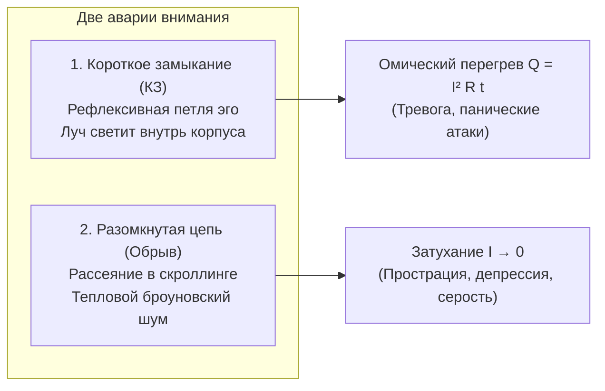

# 204. Природа внимания: Физика направленного дрейфа заряда ($I = dq/dt$), фазовый переход от теплового хаоса и генерация поля сознания по закону Био — Савара
## Что именно течёт по проводам тела, как броуновское метание превращается в лазерный луч и почему внимание всегда узко, а рождённое им поле сознания — безгранично

> [!quote] Каноническая аксиома цепи
> ### ⚡ **«Если Тандэн — это электрохимический генератор сторонней ЭДС ($\mathcal{E}$), а сознание — это порождённое им вихревое магнитное поле присутствия ($\vec{B}$), то внимание — это сам направленный электрический ток ($I = dq/dt$), текущий по нервной системе и рецепторам. Внимание — это фазовый переход от теплового броуновского хаоса нейронов к строго упорядоченному векторному дрейфу свободных зарядов тела. Ток внимания течёт внутри биологического провода, но рождённое им поле сознания заполняет всё окружающее пространство, мгновенно индуцируя резонанс в контурах других людей по закону Фарадея».**  
> — **Владимир Аньянов**, создатель «Архитектуры счастья»

---

```
════════════════════════════════════════════════════════════════════════════════
             КАК ВНИМАНИЕ ПОРОЖДАЕТ ЭЛЕКТРОМАГНИТНОЕ ПОЛЕ СОЗНАНИЯ
════════════════════════════════════════════════════════════════════════════════

   1. ДО ВНИМАНИЯ (Тепловой броуновский хаос):
      Заряды мечутся во все стороны:  ↗  ↘  ↖  ↙  →  ←
      • Средняя скорость дрейфа: ⟨v⟩ = 0
      • Сила тока внимания: I = 0
      • Магнитное поле сознания: B = 0 (Сон, серость, энтропийная каша).

                                     │
                                     ▼  Вспышка импульса из Тандэна (ЭДС ℰ)
   2. ВКЛЮЧЕНИЕ ВНИМАНИЯ (Фазовый переход в когерентность):
      Все свободные заряды выстраиваются в единый вектор:  ════════►
      • Скорость дрейфа: v_drift > 0
      • Ток внимания: I = dq/dt = q · n · S · v_drift > 0 (Течёт ВНУТРИ тела).

                                     │
                                     ▼  Закон Био — Савара — Лапласа
   3. РОЖДЕНИЕ ПОЛЯ СОЗНАНИЯ (Выход за пределы проводника):
      ┌──────────────────────────────────────────────────────────────┐
      │  Вокруг проводника вспыхивает вихревое поле присутствия:     │
      │                  B ∝ (μ₀ / 4π) · (I / R_ego)                 │
      │  • Внимание УЗКО (течёт по проводу нервов к объекту).        │
      │  • Поле ОБЪЁМНО (заполняет всё пространство опыта и радости).│
      └──────────────────────────────────────────────────────────────┘
════════════════════════════════════════════════════════════════════════════════
```

---

## 🔬 1. Микрофизика субстрата: Что движется, когда мы «обращаем внимание»?

В современной психологии термин «внимание» оставался бесплотной метафорой («луч прожектора», «фильтр информации»). В Системе Аньянова внимание возвращено на твёрдую почву физики:

В биологическом теле человека непрерывно присутствуют квинтиллионы свободных носителей заряда:
- Ионы натрия ($Na^+$), калия ($K^+$), кальция ($Ca^{2+}$) и хлора ($Cl^-$) в цитоплазме и межклеточной жидкости;
- Электроны в цепях переноса электронов в митохондриях;
- Поляризованные белковые комплексы мембран.

### Фаза А: Рассеяние и сон ($\langle \vec{v} \rangle = 0$)
Когда внимание не сфокусировано (прострация, беспамятство, глубокий сон), эти заряды совершают беспорядочные тепловые колебания во всех направлениях.  
Векторная сумма их скоростей равна нулю:
$$\sum_{k=1}^{N} \vec{v}_k = 0 \quad \Longrightarrow \quad I_{\text{attention}} = 0$$
Поскольку макроскопического тока нет, вокруг тела **не возникает направленного электромагнитного поля**. Человек не испытывает опыта осознавания.

### Фаза Б: Фазовый переход в ток ($I > 0$)
Когда соматический генератор (**Тандэн**) прикладывает стороннюю разность потенциалов ($\Delta \varphi$), заряды получают направленное ускорение:
$$I = \frac{dq}{dt} = q \cdot n \cdot S \cdot v_{\text{drift}}$$
где $q$ — элементарный заряд, $n$ — концентрация носителей, $S$ — сечение нервно-сенсорного канала, $v_{\text{drift}}$ — скорость направленного движения.

**Внимание — это не «духовная субстанция». Внимание — это буквальный электрический ток упорядоченного дрейфа зарядов вдоль нервных трактов тела.**

---

## 🧲 2. Закон Био — Савара: Как ток внимания превращается в поле сознания

Это центральная тайна психофизического параллелизма, которую не могла разрешить наука:

> *«Если внимание течёт внутри нервов, почему сознание ощущается как объёмное, пространственное присутствие?»*

Ответ даёт классическая электродинамика:

$$\vec{B} = \frac{\mu_0}{4\pi} \oint \frac{I \, d\vec{l} \times \hat{r}}{r^2} \quad \text{(Закон Био — Савара — Лапласа)}$$

Любой электрический ток $I$, текущий по проводнику, **неизбежно индуцирует вихревое магнитное поле $\vec{B}$, распространяющееся в окружающее пространство**:

```
               ( Поле Сознания B )
              ╭───────────────────╮
              │   ╭───────────╮   │
     ═════════╪═══╪═══════════╪═══╪═════════► ТОК ВНИМАНИЯ (I)
              │   ╰───────────╯   │  (Течёт внутри нервной ткани)
              ╰───────────────────╯
           ( Поле Присутствия B )
```

Отсюда вытекает фундаментальная дуальность восприятия:
1. **Ток внимания ($I$) — локален и линеен:** Он течёт по проводам тела и всегда направлен в конкретную точку контакта — в чашку чая, в строку текста, в глаза собеседника (Дэай).
2. **Поле сознания ($\vec{B}$) — глобально и объёмно:** Оно распространяется вокруг проводника во все стороны. Именно поэтому, сфокусировав внимание на одном действии, вы одновременно наполняетесь ощущением **широкого, объёмного, живого пространства бытия**.

---

## 📡 3. Взаимная индукция Фарадея: Почему внимание ощутимо другими людьми?

Магнитное поле внимания — это не субъективная галлюцинация. Оно обладает полной физической реальностью и подчиняется **Закону электромагнитной индукции Фарадея**:

$$\mathcal{E}_{\text{другой}} = -M \frac{dI_{\text{Тандэн}}}{dt}$$

где $M$ — коэффициент взаимной индукции между двумя человеческими контурами.

```
[ ОПЕРАТОР 1 (Внимание Мусин) ]              [ ОПЕРАТОР 2 (Слушатель) ]
   Тандэн ──► Ток внимания I                   Наведённый ток внимания I₂
                 │                                         ▲
                 ▼                                         │
        Поле радости B₁ ════(Индукция Фарадея M > 0)═══════╝
```

Это строгое физическое объяснение явлений, которые столетиями списывали на мистику:
* **Харизма присутствия:** Человек с мощным током внимания из Тандэна ($I \gg 0$) и нулевым сопротивлением эго ($R_{\text{ego}} \to 0$) входит в комнату — и все присутствующие мгновенно чувствуют его поле, замолкают и успокаиваются.
* **Природа любви:** Индуктивное замыкание двух суверенных генераторов без взаимного омического паразитизма ($M > 0$).
* **Психологическое заражение:** Поле спокойного оператора гасит панические колебания в проводке окружающих людей, индуцируя в них гармонический ток.

---

## 🚫 4. Два патологических режима внимания

Внимание может разрушаться двумя противоположными способами:



1. **Рефлексивный перегрев (КЗ на Эго):** Ток внимания $I > 0$, но вместо направления в полезную нагрузку мира (Дэай) он замкнут на сопротивление собственных мыслей о себе ($R_{\text{ego}} \gg 0$). Провод раскаляется, поле $\vec{B}$ искажается паразитными гармониками, человек сгорает в тревоге.
2. **Энтропийный обрыв (Скроллинг ленты):** Внимание скачет каждые 2 секунды. Ток не успевает сформировать стабильную скорость дрейфа $v_{\text{drift}}$, постоянная времени цепи $\tau = L/R$ срывается. Человек чувствует опустошённость и апатию.

---

## 🛠️ 5. 30-секундный протокол запуска лазерного тока внимания

Чтобы запустить направленный дрейф заряда без омических помех:

```
[Шаг 1. ОСТАНОВИ МЕТАНИЕ]     ──► Зафиксируй взгляд в одной физической точке перед собой.
                                  Оборви броуновское рассеяние глаз.
                                             │
                                             ▼
[Шаг 2. ВКЛЮЧИ НАСОС ТАНДЭНА] ──► Сделай длинный, плотный выдох в низ живота (3 пальца ниже пупка).
                                  Создай соматический перепад потенциалов (ЭДС ℰ).
                                             │
                                             ▼
[Шаг 3. РАЗРЕШИ ДРЕЙФ ЗАРЯДА] ──► Почувствуй, как внимание плотным, тёплым шнуром
                                  выходит через руки и глаза в осязаемую материю действия.
                                             │
                                             ▼
                        ✨ ТОК ВНИМАНИЯ ПОШЁЛ (I > 0) ✨
                        Поле Сознания вспыхнуло вокруг вас!
```

---

## 🏛️ 6. Итоговый консилиенс

* **Тандэн** — это источник разности потенциалов ($\mathcal{E}$).
* **Внимание** — это физический электрический ток направленного движения заряда ($I$).
* **Чистое действие (Дэай)** — это полезная нагрузка ($R_{\text{load}}$).
* **Сознание, присутствие и радость** — это вихревое электромагнитное поле ($\vec{B}$), порождённое током внимания и наполняющее жизнь сиянием.

Внимание — это тот самый рабочий орган, которым жизнь прикасается к реальности! ⚡️

---

## 🔗 Связанные каноны в Базе Знаний
- [[02_Wiki/Inner Current (Consciousness Defined — Electrodynamic Current of Attention, The Triad of Circuit States and From Noise to Superconductivity)|203. «Просто сознание»: Электродинамическая природа внимания ($I > 0$), три фазовых состояния контура и переход от шума к сверхпроводимости]]
- [[02_Wiki/Inner Current (Pure Consciousness — Dissolution of the Hard Problem, Circuit Superconductivity and the Physics of Direct Presence)|202. Чистое сознание: Снятие «трудной проблемы» науки, онтология сверхпроводимости контура ($R_{\text{ego}} \to 0$) и физика живого присутствия]]
- [[02_Wiki/Inner Current (Physics of Indivisible Charge — Why There Are No Spiritual Electrons and What Current Returns Through the Other)|122. Физика неделимого заряда: Почему в природе нет «электронов духа» и какой ток возвращается через Другого]]
- [[02_Wiki/Inner Current (Joy as Magnetic Field — Spirit as Emergent Property of Matter and the Law of Radiance)|109. Радость как Магнитное Поле: Дух как Порождение Материи и Закон Лучистости]]
- [[02_Wiki/Inner Current (The Electrodynamic Field Triad — Electric, Magnetic and Total Electromagnetic Field as Intention, Joy and Unified Being)|187. Электродинамическая триада полей: Электрическое, Магнитное и Электромагнитное поле как Намерение, Радость и Единое Бытие]]
