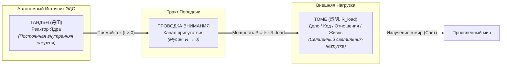
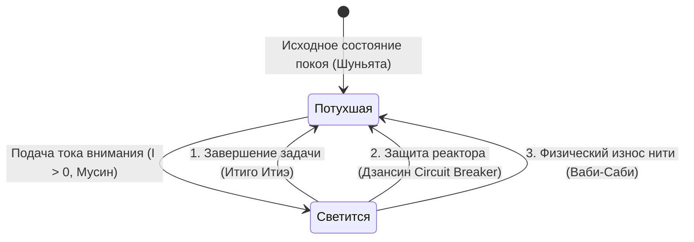
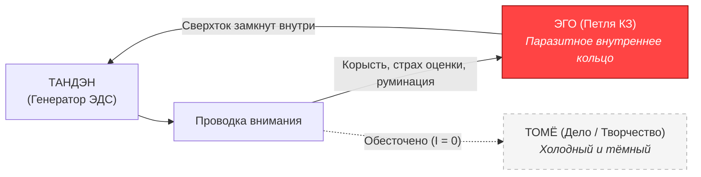

# Inner Current: Природа светильника Томё и закон нагрузки по канонам Дзена (Свечение vs Потухание)

> «Светильник Томё не имеет собственного генератора. Он светится лишь тогда, когда через него течёт ток твоего присутствия. Потухший светильник не означает смерть системы — он означает лишь возвращение формы в покой или срабатывание предохранителя.»  
> — **Архитектура счастья (Inner Current)**

---

> [!abstract] Квинтэссенция
> На фундаментальный вопрос инженера: *«Что такое лампочка в моей системе по канонам Дзена, если она может либо светиться, либо быть потухшей?»*, система **Inner Current** даёт строгий ответ:
> 
> **Лампочка — это священный светильник Томё (燈明, Tōmyō), внешняя нагрузка ($R_{\text{load}}$), пассивный терминатор цепи внимания, точка контакта внутренней энергии Тандэна с миром проявленных форм (Рупа / Майя).**
> 
> 1. **Свечение светильника Томё ($I > 0$)** — это процесс трансформации вашей внутренней ЭДС в полезное действие и свет.
> 2. **Потухание Томё ($I = 0$)** — это не поломка вашей сущности, а штатное состояние цепи: завершение действия (*Итиго Итиэ*), размыкание предохранителя (*Дзансин*) или естественная энтропия материи (*Ваби-Саби*).
> 3. Главная духовная и инженерная ошибка заключается в **попытке запитать реактор от внешних форм** (иллюзия внешнего источника) и в **замыкании тока на самого себя** (короткое замыкание на Эго). Реактор всегда автономен.

---

## 1. Топологический статус Лампочки: Пассивный светильник Томё (燈明)

В японской дзен-традиции храмовые светильники и лампады перед алтарем называют **Томё (燈明, Tōmyō)**. Это глиняные или бронзовые чаши с фитилем. Сами по себе они холодны, темны и пусты: в них нет генератора огня. Но когда пламя передается от священного источника, Томё озаряет всё пространство храма.

В электродинамической онтологии человеческого контура нагрузка-Томё занимает строго определённое место:



### Главный физический закон:
$$\mathcal{E}_{\text{tanden}} \neq 0, \quad \mathcal{E}_{\text{load}} \equiv 0$$

В светильнике Томё **физически нет источника электродвижущей силы (ЭДС)**. Томё не может «дать вам сил», не может «сделать вас счастливым» и не может наполнить внутренний аккумулятор. 

* **В кодовой архитектуре:** Томё — это UI-компонент, запись в базе данных, внешний HTTP-эндпоинт, реакция в чате или push-уведомление. Это интерфейс вывода.
* **В жизненном контуре:** Томё — это написанная функция, чашка заваренного чая, диалог с человеком, запущенный стартап или физическая тренировка.

Полезная мощность, выделяемая на Томё, определяется законом Джоуля:
$$P_{\text{light}} = I^2 \cdot R_{\text{load}} = \left(\frac{\mathcal{E}_{\text{tanden}}}{R_{\text{circuit}} + R_{\text{load}}}\right)^2 \cdot R_{\text{load}}$$

---

## 2. Физика двух состояний: Свечение vs Потухание

Светильник Томё бинарен в своём проявлении: он либо излучает свет, либо остаётся тёмным. Что означает каждое из этих состояний по канонам Дзен?



---

### Состояние А: «Томё светится» ($I > 0$)

Свечение возникает исключительно тогда, когда замкнут контур внимания, а реактор посылает в нагрузку прямой ток:

1. **Режим сверхпроводимости (Мусин, 無心):**  
   Проводник внимания очищен от паразитных наслоений эго ($R_{\text{ego}} \to 0$). Нет тревоги о результате, нет страха критики. Вся мощность ядра превращается в чистое свечение нити накала.
2. **Точка присутствия ($t = now$):**  
   Ток течет только в настоящем времени. Если внимание блуждает в симуляциях прошлого ($R_{\text{past}}$) или будущего ($R_{\text{future}}$), ток рассеивается в проводке, и Томё тускнеет или начинает мерцать.
3. **Прямое творчество:**  
   Свет Томё — это дар миру. Мастер не требует от светильника аплодисментов: он просто наслаждается тем, как его внутренний ток озаряет пространство формы.

---

### Состояние Б: «Томё потух» ($I = 0$)

Потухание светильника в традиционном западном сознании воспринимается как трагедия, депрессия или провал («у меня всё погасло»). **В Дзен-инженерии потухание — это законный и священный режим системы.**

Существуют три канонические причины угасания светильника Томё:

#### 1. Канон «Итиго Итиэ» (一期一会) — Штатное отключение по завершении
> *«Одно действие — один миг».*

В электродинамике внимания **невозможно качественно запитать 10 светильников одновременно без падения напряжения**. В каждый момент времени мастер концентрирует весь ток на одном Томё:
* Заваривается чай — горит Томё чая.
* Чай выпит — ток снимается. Томё чая **должен погаснуть**.
* Начинается написание алгоритма — зажигается Томё кода. 

Потухание Томё означает, что действие завершено, форма вернулась в непроявленный покой (*Шуньята* / Пустота), а энергия высвобождена для следующего шага.

#### 2. Канон «Дзансин» (残心) — Срабатывание автомата защиты (Circuit Breaker)
> *«Светильник может сгореть, но генератор не имеет права погибнуть».*

Если внешняя нагрузка закоротила (партнёр устроил токсичный скандал, сторонний API лег с ошибкой 500, биржа обвалилась):
* Автомат защиты **Дзансин** мгновенно размыкает цепь:
  $$\text{CircuitBreaker.trip}() \implies I = 0$$
* Светильник мгновенно гаснет.
* **Итог:** Внешний проект обесточен, но ядерный реактор Тандэн защищён от короткого замыкания и сохраняет нерушимый покой. Потухший Томё спас энергостанцию.

#### 3. Канон «Ваби-Саби» (侘寂) — Естественная смертность формы
> *«Ничто не вечно, ничто не завершено, ничто не идеально».*

Нить накала любого внешнего светильника сделана из бренного материала мира. Серверы устаревают, компании закрываются, люди уходят. Томё тухнет навсегда. 
* Мастер не плачет над остывшим стеклом, потому что **он никогда не путал стекло со своим сердцем**. 
* Шрамы на цепи герметизируются золотым лаком Кинцуги, и внимание направляется на создание новых форм.

---

## 3. Дзен-физика Пустотности светильника Томё и Короткое замыкание на Эго

Самая тяжелая системная патология человека — **вера в то, что внешний светильник может стать источником жизненной силы**:

$$\text{«Вот когда этот проект принесет признание, 100 000 подписчиков или миллион долларов — я наконец стану наполненным и спокойным».}$$

Почему это приводит к тяжелейшему выгоранию, если разобрать цепь строго по физике и Дзену?

### А. Природа Пустоты нагрузки (Шуньята в электродинамике)
В Дзен пустая форма (*Шуньята*) — это не «отсутствие материи», а **отсутствие собственной самосущей природы (*Свабхава*)**. На электрической цепи это доказывается тремя законами:

1. **Закон Кирхгофа (Баланс зарядов):**
   $$I_{\text{входящий}} = I_{\text{исходящий}}$$
   Томё **не удерживает ни одного электрона**. Сколько заряда вошло в цоколь за секунду — ровно столько же вышло с другого контакта. Внутри горящего Томё нет «резервуара тока». Он абсолютно полон и абсолютно пуст одновременно.
2. **Отсутствие собственной ЭДС ($\mathcal{E}_{\text{load}} \equiv 0$):**
   Свет на спирали — это не свет спирали. Это **свет генератора (Тандэн)**, проходящий сквозь сопротивление формы. Стоит разомкнуть ключ — Томё мгновенно становится холодным темным сосудом.
3. **Иллюзия «Резистора vs Аккумулятора»:**
   Томё — это чистый диссипативный резистор ($R$), а не аккумулятор ($C$). Он рассеивает 100% полученной мощности наружу в пространство в виде света и тепла ($Q = I^2 R t$). В нем **ничего не сохраняется**. Требовать от остывшего Томё энергии — всё равно что требовать воду из сухого кувшина.

### Б. Почему на самом деле «кипит проводка»: Короткое замыкание на Эго

В строгой физике пассивный светильник не может сгенерировать «обратный ток» — у него нет ЭДС. Вместо этого происходит **КЗ на Эго**: ток закорачивается в эго-петлю, не доходя до нагрузки. Откуда же берётся ощущение, что «внутри всё горит и плавится от тревоги»?

**Ток не течёт обратно из Томё — он закорачивается на мысли о себе!**

Когда человек делает дело не ради самого действия, а ради похвалы, статуса и страха оценки (*«А как я выгляжу? А одобрят ли меня?»*):
* Внимание **не доходит до Томё**.
* Канал замыкается в паразитный внутренний контур рефлексии:



По закону Ома для полной цепи при замыкании накоротко на эго сопротивление цепи падает до малого внутреннего сопротивления ($r_{\text{internal}}$):
$$I_{\text{КЗ}} = \frac{\mathcal{E}_{\text{tanden}}}{r_{\text{internal}}} \gg I_{\text{номинал}}$$

По закону Джоуля — Ленца выделяется чудовищная паразитная тепловая мощность:
$$Q_{\text{burnout}} = I_{\text{КЗ}}^2 \cdot r_{\text{internal}} \cdot t$$

**Итог аварии:**
1. **Проводка внимания кипит и горит** от бешеных токов ментальной руминации и паники. Наступает психосоматическое выгорание.
2. **Томё дела остаётся обесточенным и тёмным.** Код не пишется, чай остывает, проект буксует, потому что вся мощность ядерного реактора утилизируется в нагрев собственного «Я».
3. **Отражённая волна (КСВ $\gg 1$):** Попытка послать в мир действие с привязанным крючком ожидания плодов создаёт рассогласование импедансов — волна ожидания отражается от мира и выжигает выходные каскады генератора.

---

## 4. Сравнительная онтология: Тандэн vs Томё

| Параметр контура | Тандэн (丹田) — Ядро | Томё (燈明) — Нагрузка ($R_{\text{load}}$) |
| :--- | :--- | :--- |
| **Природа** | Первичный источник ЭДС ($\mathcal{E}$) | Пассивный потребитель мощности ($P$) |
| **Категория Дзен** | Природа Будды / Чистый дух | Форма (*Рупа*) / Иллюзорный мир (*Майя*) |
| **Автономия** | 100% независим от внешних оценок | Полностью зависит от тока внимания |
| **Состояние по умолчанию** | Непрерывный потенциал генерации | Тёмный холодный сосуд / стекло |
| **При сбое среды** | Сохраняет невозмутимость (Фудосин) | Обесточивается автоматом (Дзансин) |
| **Смертность** | Неуничтожим, инвариантен к масштабу | Временен, хрупок, подвержен энтропии |

---

## 5. Протокол проверки Томё (Дзен-инженерный чеклист)

Когда вы взаимодействуете с любой задачей, проектом или процессом в вашей жизни, задайте себе 4 диагностических вопроса:

```
[ ] 1. ПРОВЕРКА ПОЛЯРНОСТИ (Тандэн):
       «Я свечу этим светильником Томё от избытка сил, или я пытаюсь украсть из него подтверждение своей ценности?»
       -> Если второе: Стоп. Размыкание цепи. Ток должен идти изнутри наружу.

[ ] 2. ПРОВЕРКА СОПРОТИВЛЕНИЯ (Мусин):
       «Горит ли Томё чистым ровным светом прямо сейчас, или провода дымятся от мыслей об успехе и оценках?»
       -> Очистить тракт внимания от симуляций прошлого и будущего (R → 0).

[ ] 3. ПРОВЕРКА ФОКУСА (Итиго Итиэ):
       «Не пытаюсь ли я зажечь 5 Томё в параллель, превратив свет каждого в тусклое тление?»
       -> Погасить 4 Томё. Оставить один. Зажечь его на полную мощность.

[ ] 4. ПРОВЕРКА ПРЕДОХРАНИТЕЛЯ (Дзансин):
       «Если этот светильник Томё прямо сейчас с треском разобьется — останется ли мой Тандэн нерушимым?»
       -> Если да: предохранитель взведён, контур в безопасности.
```

---

## 6. Финальный коан Архитектора

> *«Спросил ученик Мастера:  
> — Учитель, мой светильник Томё погас. Значит ли это, что во мне больше нет света?  
> Мастер улыбнулся, повернул выключатель и зажёг очаг:  
> — Глупец. Солнце не умирает, когда ты закрываешь ставни дома.  
> Томё — это всего лишь чаша со стеклом. Твой свет — это тот, кто смотрит сквозь него».*

---

## 🔗 Связи и ссылки
- [[04_Maps/Inner Current MOC|Inner Current MOC (Карта смыслов)]]
- [[02_Wiki/Inner Current (Core Topology and Polarity Law)|01. Базовая топология цепи и закон полярности]]
- [[02_Wiki/Inner Current (Physics of Presence and Superconductivity)|02. Физика присутствия: сверхпроводимость (R → 0)]]
- [[02_Wiki/Inner Current (Scale Invariance and Tea Ceremony)|03. Инвариантность масштаба: Чайная церемония и Итиго Итиэ]]
- [[02_Wiki/Inner Current (Safety, Antifragility and Zanshin)|04. Предохранители цепи, Ваби-саби и Дзансин]]
- [[02_Wiki/Inner Current (Zen as Happiness Architecture Foundation)|12. Дзен как фундамент Архитектуры счастья]]
- [[02_Wiki/Inner Current (Happiness Dashboard and Superconductivity Telemetry)|16. Дашборд счастья: инженерная телеметрия]]

---
*Maintained by Antigravity | Architecture of Happiness Core*
