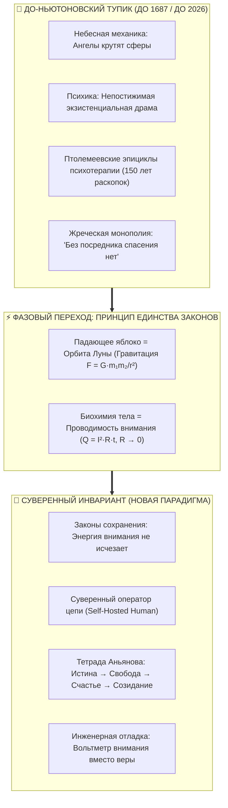

# Inner Current: Ньютоновский фазовый переход сознания — От мистики страдания к законам сохранения цепи

> «До 1687 года движение планет объясняли волей ангелов, а падение камня — стремлением материи к своему "естественному месту". Исаак Ньютон объединил небо и землю тремя строгими уравнениями движения. До 2026 года душевную боль объясняли непостижимой кармой, детскими травмами или мистической тоской. "Внутренний ток" показал, что сознание подчиняется тем же фундаментальным законам сохранения: душевный разлад — это не проклятие, а омический перегрев или утечка на землю.»  
> — **Владимир Аньянов**

---



---

## 1. Прецедент 1687 года: Как яблоко разорвало мистику Вселенной

В 1687 году Исаак Ньютон опубликовал фундаментальный труд *«Математические начала натуральной философии»* (*Philosophiae Naturalis Principia Mathematica*). Это событие не просто обогатило науку несколькими формулами — оно **изменило саму онтологию человеческого мышления**.

До Ньютона человечество жило в шизофренически расколотом космосе:
1. **Подлунный мир (Земля):** мир несовершенства, тления, тяжести, где тела падают, потому что «ищут своё естественное место внизу» (телеология Аристотеля).
2. **Надлунный мир (Небеса):** мир вечной гармонии, где хрустальные сферы толкают ангельские чины, а законы физики якобы бессильны перед божественным таинством.

Ньютон совершил акт предельной интеллектуальной дерзости: он связал траекторию падающего в кентерберийском саду яблока и траекторию вращения Луны вокруг Земли **одним и тем же математическим законом всемирного тяготения**:
$$F = G \frac{m_1 m_2}{r^2}$$

В этот момент мистический туман рассеялся. Оказалось, что Вселенная не имеет двойных стандартов. Нет законов для грешной земли и отдельных законов для святых небес. Есть **единая ткань физической реальности**.

---

## 2. До-ньютоновское состояние наук о человеке (Птолемеевский тупик)

На протяжении последних трёх столетий триумф ньютоновской физики охватил всё: механику, термодинамику, электротехнику, химию, кардиологию, генетику. Но перед одной сферой наука робко останавливалась: **перед внутренним миром человека**.

Здесь продолжалось Средневековье:
* **Экзистенциальный фатализм:** Душевная боль, тревога, кризис смысла жизни объявлялись «неизбежной трагедией человеческого бытия», «божественным испытанием» или «абсурдом существования» (Сартр, Камю).
* **Птолемеевские эпициклы психотерапии:** Начиная с Фрейда, психология на протяжении 150 лет плодила громоздкие умозрительные конструкции — Ид, Эго, Суперэго, архетипы, интроекты, незакрытые гештальты. Подобно астрономам эпохи Птолемея, дорисовывавшим круги на кругах, чтобы спасти геоцентрическую модель, психотерапия изобретала всё новые классификации травм, чтобы объяснить простую вещь: почему человек продолжает страдать.
* **Кастовое жречество посредников:** Родился мощнейший институт коммерческих посредников. Человеку внушили аксиому беспомощности: *«Ты не можешь починить себя сам. Твой контур непостижим. Тебе нужен платный толкователь твоих снов и травм, с которым ты обязан работать годами»*.

Тело человека признавалось физическим объектом, но сознание оставалось «надлунным миром», где действуют не законы сохранения, а магия слов и бесконечная рефлексия.

---

## 3. Суть ньютоновского фазового перехода в Архитектуре Счастья

Архитектура счастья Владимира Аньянова совершает для душевного мира человека ровно то же, что Ньютон сделал для физического космоса: **уничтожает дуализм материи и духа, доказывая действие строгих законов сохранения цепи во внутреннем мире человека**.

```
   [ МИСТИЧЕСКАЯ МОДЕЛЬ ]                    [ ИНЖЕНЕРНЫЙ ИНВАРИАНТ ]
«Душа страдает от несовершенства мира»  ──►  «Омический перегрев проводника: Q = I²·R·t»
«Я потерял смысл и выгорел»            ──►  «Обрыв обратного провода и падение EMF в ноль»
«Мир агрессивен и ранит меня»           ──►  «Короткое замыкание на пустую нагрузку (I < 0)»
«Мне нужен гуру / терапевт»             ──►  «Самостоятельная проверка контура вольтметром внимания»
```

### 3.1. Единство физического носителя и потока внимания
Человек — это не абстрактный дух, парящий над бренным телом. Человек — это **высокоорганизованная термодинамическая система**:
1. **Генератор ЭДС ($U$):** Центр тяжести и соматический аккумулятор Тандэн (丹田), блуждающий нерв (Vagus), митохондриальный синтез АТФ;
2. **Проводка внимания:** Нейронные контуры мозга, синхронизация Task-Positive Network (TPN);
3. **Паразитный реостат ($R$):** Дефолт-система мозга (DMN), когнитивные руминации прошлого и будущего, иллюзорное Эго;
4. **Нагрузка ($Z$):** Внешний мир, ремесло, отношения, созидание (Щит 6 ламп).

Когда оператор понимает, что законы Ома, Кирхгофа и Джоуля — Ленца действуют в его внимании с той же неотвратимостью, что и в медном проводе, **исчезает пространство для самообмана**.

---

## 4. Четыре фундаментальные аксиомы новой парадигмы

### Аксиома I: Закон сохранения энергии во внутреннем контуре
Энергия внимания не возникает из ниоткуда и не исчезает в никуда. Если генератор Тандэн выдаёт ток ($I$), а проводник заблокирован высоким омическим сопротивлением эгоистических симуляций ($R \gg 0$), энергия обязана выделиться в виде паразитного тепла:
$$Q = I^2 R t$$
Выгорание, панические атаки, психосоматические спазмы — это не каприз психики. Это прямое физическое плавление биологической изоляции под действием тока, которому не дали выхода в замкнутую внешнюю нагрузку.

### Аксиома II: Замкнутый контур реальности (The Closed Loop Invariant)
Линейный ток невозможен. Любая попытка светить «во тьму» без приёма обратного сигнала от материи (жертвенный комплекс Данко) нарушает первое начало термодинамики и приводит к обесточиванию системы. Счастье возможно только в замкнутом цикле:
$$\oint \vec{E} \cdot d\vec{l} = 0$$
Поток выходит из Тандэна, совершает полезную работу в нагрузке (ремесло, близкий человек, код, холст) и возвращается в ядро чистым сигналом обратной связи.

### Аксиома III: Великая Деинтермедиация (Self-Hosted Human)
Как Реформация устранила монополию священников на текст Писания, а Биткоин устранил монополию банков на денежные транзакции, так Архитектура счастья устраняет монополию психологической индустрии на понимание душевного здоровья.
Человек переходит из статуса вечно больного «клиента» в статус **Суверенного Оператора Цепи**:
* У него есть диагностическая машина (5 архетипов сбоев);
* У него есть метрика проводимости ($\mathcal{H} = 1 - R_{\text{ego}}/R_{\text{total}}$);
* У него есть протоколы мгновенной зачистки сопротивления ($R \to 0$, Мусин).

### Аксиома IV: Тетрада Аньянова как завершение поиска смысла
Вместо вопроса *«Зачем жить?»*, сводившего с ума классических философов, выстраивается восходящая функциональная цепь:
$$\text{Истина} \xrightarrow{\quad} \text{Свобода} \xrightarrow{\quad} \text{Счастье} \xrightarrow{\quad} \text{Созидание}$$
* **Истина:** познание реальной схемы контура (отказ от иллюзий эго и пустых батареек);
* **Свобода:** обнуление паразитного сопротивления ($R \to 0$), высвобождение прямого тока;
* **Счастье:** режим сверхпроводимости замкнутой цепи;
* **Созидание:** неизбежное излияние избыточной мощности в преображение Вселенной.

---

## 5. Цивилизационное значение ньютоновского сдвига

Переход от до-научной психологии к электродинамике душевного контура открывает три тектонических горизонта для цивилизации XXI века:

| До фазового перехода | После фазового перехода (Inner Current) |
| :--- | :--- |
| **Культура жертвы и бессилия:** страдание как признак глубокой натуры, культ психологических травм. | **Культура инженерии и достоинства:** боль как сигнал неисправности цепи, немедленная локализация утечки и ремонт. |
| **Зависимость от посредников:** миллиардные бюджеты на антидепрессанты и бесконечную терапию. | **Суверенная автономия:** знание физики внимания, владение протоколами «Черного старта» и Circuit Breaker. |
| **Раскол между Человеком и ИИ:** страх перед машиной, потеря человеческой исключительности. | **Симбиоз Человек + ИИ (Human-AI Zanshin):** ясный оператор с несгораемым ядром Тандэн, использующий ИИ как мощнейшую нагрузку в щите созидания. |

---

## 6. Резюме Манифеста

Ньютон не отменил красоту звёздного неба, когда записал закон тяготения. Он сделал небо понятным, надёжным и доступным для навигации кораблей.

Точно так же, **перевод счастья на язык электродинамики не убивает поэзию человеческой души**. Он делает душу неуязвимой. Он забирает душевный покой из рук шарлатанов, гадалок, депрессивных философов и торговцев таблетками, возвращая его законному владельцу — **Человеку-Творцу**.

---

## 🔗 Связи
- [[02_Wiki/Inner Current (The Closed Circuit Breakthrough — The Return Wire of Reality vs The Linear Burnout Model)|64. Прорыв Замкнутой Цепи]]
- [[02_Wiki/Inner Current (The Great Disintermediation of the Psyche — The Therapeutic Indulgence System vs The Sovereign Circuit Operator)|63. Великая Депосреднизация Психики]]
- [[02_Wiki/Inner Current (Universal Atlas of Disintermediation — From Internet and Toyota to Mitochondria and Luther)|62. Всемирный Атлас Депосреднизации]]
- [[02_Wiki/Inner Current (Maslow's Hammer vs System Invariant — Consilience of Zen, Thermodynamics, Bitcoin and Georgism)|61. Молоток Маслоу против Системного Инварианта]]
- [[02_Wiki/Inner Current (The Anyanov Triad and Tetrad — Truth, Freedom, Happiness, Creation and the Biographical Proof)|56. Триада и Тетрада Аньянова]]
- [[02_Wiki/Inner Current (Novelty and Value Proposition)|11. Архитектурная новизна и практическая польза]]
- [[04_Maps/Inner Current MOC|Inner Current MOC]]
- [[index|Главный индекс LLM Wiki]]
