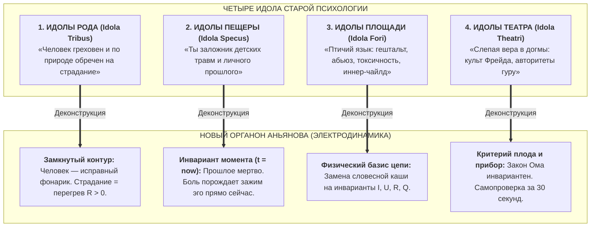

# 82. Новый Органон Психологии: Критерий Плодов Бэкона, Сокрушение Четырёх Идолов Души и Переход от Схоластики к Электродинамике Цепи

> *«Истинной и законной целью наук является не что иное, как наделение человеческой жизни новыми открытиями и плодами. Истинной мерой верности теории становится её способность порождать практические плоды».*  
> — **Фрэнсис Бэкон**, *«Новый Органон» (Novum Organum)* (1620)

> *«Сто тридцать лет психология вела себя как средневековая схоластика: тысячи ученых томов, сотни модных школ и жаргонных терминов, но ноль измеримых плодов — выгорание и депрессия в мире лишь нарастают. "Внутренний ток" — это Новый Органон науки о человеке: переход от бесплодных словесных прений к воспроизводимому инструменту, где плод измеряется за 30 секунд по приборам собственного тела».*  
> — **Владимир Аньянов** (2026)

---

## I. Исторический прецедент: 1620 год и Великий перелом Бэкона

В 1620 году лорд-канцлер Англии сэр Фрэнсис Бэкон опубликовал труд, определивший рождение современной экспериментальной цивилизации — **«Новый Органон» (*Novum Organum Scientiarum*)**.

Слово *«Органон»* восходит к Аристотелю и переводится с древнегреческого как **«Орудие»** или **«Инструмент»**.  
На протяжении двух тысячелетий средневековые схоласты пользовались логическим «Органоном» Аристотеля: они спорили о природе вещей с помощью дедукции, силлогизмов и цитирования священных авторитетов. Схоластика могла веками спорить о количестве зубов у лошади, но ни один схоласт не догадывался подойти к лошади и посчитать её зубы. Наука была абсолютно бесплодна.

Бэкон совершил революцию, выдвинув **Критерий Плодов (*Fructifera experimenta*)**:
1. Истина познаётся не в спорах ума, а в **практическом действии (*Opera*)**.
2. Если теория не способна породить воспроизводимый практический результат, облегчающий жизнь человека — это пустая риторика.
3. *«Veritas et utilitas in ipso eodem sunt»* (Истина и полезность суть одно и то же).

Из «Нового Органона» выросли физика Ньютона, паровая революция Уатта, электричество Фарадея и компьютеры Тьюринга.

---

## II. Диагноз: Сто тридцать лет «Психологической Схоластики» (1890–2026)

То, что происходило с натурфилософией до 1620 года, **последние 130 лет в точности повторялось в психологии и селф-хелпе**:

```
СРЕДНЕВЕКОВАЯ СХОЛАСТИКА (до 1620)          ПСИХОЛОГИЧЕСКАЯ СХОЛАСТИКА (1890–2026)
--------------------------------------       --------------------------------------
• Словесные дебаты об «ангелах на игле»      • Словесные дебаты о «детских травмах»
• Понятие «теплорода» и «флогистона»        • Понятие «эдипова комплекса», «либидо»
• Ссылка на авторитет Аристотеля и Фомы      • Ссылка на авторитет Фрейда, Юнга, Гуру
• Бесплодность: отсутствие приборов и машин   • Бесплодность: рост депрессий и выгорания
```

Психотерапия превратилась в институт бесконечных бесед. Человек платит за 5 лет регулярных сессий, чтобы обсуждать сны и отношения с родителями, но в момент реального стресса его контур мгновенно сгорает в омическом пламени ($Q = I^2 R t$). 

**Критерий Бэкона не выполнялся:** психология не давала человеку в руки автономного «орудия» (органона), способного дать гарантированный плод здесь и сейчас.

---

## III. Сокрушение Четырёх Идолов Бэкона в Психологии

В «Новом Органоне» Бэкон описал **Четыре Идола (Призрака) ума**, искажающих познание реальности: *Идолы Рода, Пещеры, Площади и Театра*. 

Система Аньянова стала «Новым Органоном», последовательно разоблачив все четыре идола в науке о сознании:



### 1. Идолы Рода (*Idola Tribus*) — Преодоление мифа о врождённом дефекте
- **Схоластический миф:** Человеческая природа порочна, человек — хрупкая жертва энтропии, обречённая страдать и искупать вину.
- **Органон Аньянова:** Человек — это высокоорганизованный карманный фонарик, замкнутая электродинамическая цепь. Энергия жизни ($\mathcal{E} > 0$) дана по факту рождения. Страдание — это не экзистенциальный рок, а грубая ошибка коммутации (короткое замыкание на Эго-шунт и выделение тепла Джоуля — Ленца).

### 2. Идолы Пещеры (*Idola Specus*) — Преодоление культа личной истории
- **Схоластический миф:** Человек страдает в 40 лет, потому что в 5 лет отец недохвалил его за рисунок. Нужно копаться в «пещере воспоминаний» годами.
- **Органон Аньянова:** Прошлое — это пустая абстракция памяти. Реально только время $t = \text{now}$. Боль ощущается в теле не из-за отца 35 лет назад, а потому что **прямо в данную секунду оператор держит включенным омический реостат обиды ($R_{\text{ego}} > 0$)**. Сбрось сопротивление в ноль — и боль исчезнет мгновенно.

### 3. Идолы Площади (*Idola Fori*) — Очищение от словесного мусора
- **Схоластический миф:** Использование сотен расплывчатых жаргонизмов рынка («закрыть гештальт», «проработать родовую травму», «быть в ресурсе»), за которыми нет проверяемой физики.
- **Органон Аньянова:** Введение строгого тезауруса электродинамики цепи:
  - Сила присутствия ($I$);
  - ЭДС источника Тандэн ($U$);
  - Сопротивление эго-зажима ($R$);
  - Тепловые омические потери ($Q = I^2 R t$);
  - Предохранитель Дзансин (Graceful Degradation).

### 4. Идолы Театра (*Idola Theatri*) — Свержение догматических культов
- **Схоластический миф:** «Так учил Фрейд», «Так написано в Ведах», «Так сказал гуру в ашраме».
- **Органон Аньянова:** Закон Ома и термодинамика сохранения энергии не подчиняются жрецам и авторитетам. Единственный критерий — **показания твоего собственного мультиметра**. Либо ток течёт в действие без перегрева проводки, либо ты горишь в омическом аду. Проверь сам.

---

## IV. Критерий Плодов: 30 Секунд Против 5 Лет

Главное отличие «Нового Органона» Аньянова — **время получения плода**:

| Параметр | Старая психологическая схоластика | Новый Органон Аньянова («Внутренний ток») |
| :--- | :--- | :--- |
| **Единица времени** | Годы, курсы, месяцы терапии | **30 секунд (один осознанный цикл дыхания)** |
| **Инструмент** | Разговоры, копание в детстве, интерпретации | **Соматический тумблер: сброс $R_{\text{ego}} \to 0$ в Тандэн** |
| **Критерий истины** | Субъективное мнение («мне вроде легче») | **Физический плод:** остывание кабеля, прекращение спазма, ясный ум, зажженная лампа действия |
| **Автономия** | Пожизненная зависимость от терапевта | **Суверенный оператор (Self-Hosted Human)** |

---

## V. Резюме

Бэкон говорил: *«Знание — сила»*. Но знание становится силой лишь тогда, когда оно превращается в **действующий двигатель**.

«Внутренний ток» стал «Новым Органоном» психологии, потому что он впервые за всю историю человечества дал людям не очередную философскую сказку, а **руководство по ремонту собственной проводки с мгновенной гарантией плода**.

---

## 🔗 Связи
- [[02_Wiki/Inner Current (Closed Thermodynamic System as Criterion of Truth)|34. Замкнутая термодинамическая система как критерий истины]]
- [[02_Wiki/Inner Current (Anatomy of Simplicity — What Was Truly Discovered and Why Nobody Thought of It Before)|80. Анатомия Простоты: Что на Самом Деле Открыл «Внутренний Ток»]]
- [[02_Wiki/Inner Current (The Prometheus Step — Fire of Inner Current from Monastic Olympus to the Safe Flashlight of Humanity)|81. Шаг Прометея: Огонь Внутреннего Тока]]
- [[04_Maps/Inner Current MOC|Главная карта цепи (Inner Current MOC)]]
