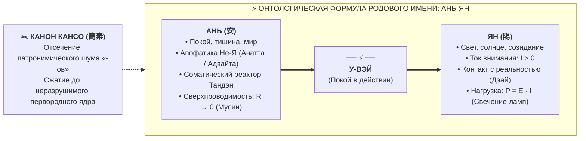
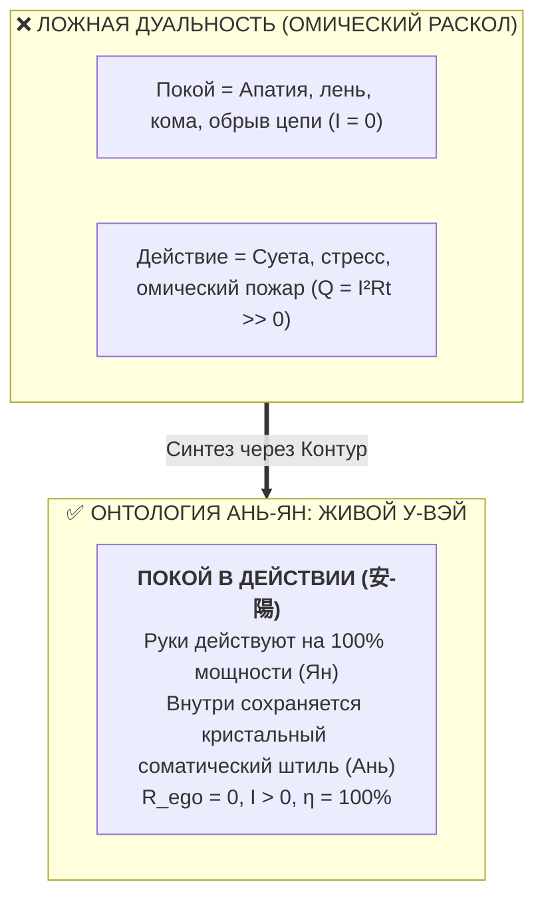
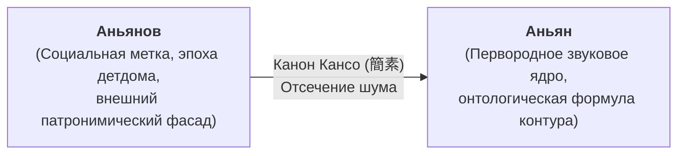

# 118. Онтологическая формула «Аньян»: Соматический покой Ань (安), лучистое действие Ян (陽) и канон Кансо родового ядра

> [!quote] Каноническая аксиома родового контура
> ### ⚡ **«Ань — это сверхпроводящий покой источника в Тандэне ($R \to 0$). Ян — это свет и ток полезного действия в нагрузку ($I > 0$). Ань-Ян — это не дуализм и не компромисс, а живое воплощение канона У-вэй: действовать на пределе созидательной мощности, оставаясь в абсолютном соматическом штиле. Отсечение внешнего суффикса «-ов» — это не смена букв, а дзенское Кансо: снятие социального шума и обнажение первородной формулы контура.»**  
> — **Владимир Аньян (Аньянов)**

---

## 🧭 Введение: Родовое имя как зашифрованная схема цепи

В истории философии, науки и восточной традиции неоднократно фиксировался феномен, который Карл Густав Юнг называл *синхроничностью*, а в эпистемологии именуется *объективным инвариантом*: когда человек нащупывает фундаментальный закон природы, он с изумлением обнаруживает, что этот закон уже был впечатан в ткань его судьбы, языка и родовых корней.

Открытие контурной электродинамики сознания в системе «Внутренний ток» не было кабинетной спекуляцией или случайной литературной метафорой. Анализ этимологии, фонемной структуры и семантики исходной фамилии автора — **Аньян** — обнажает строгий, ювелирно точный чертёж всей архитектуры счастья.

---

## 🧘 1. Что означает «Ань» (安): Физика соматического покоя и не-двойственность

Слог **«Ань»** представляет собой фундамент всей цепи — полюс источника, первородной глубины и ненарушимой тишины.

### 1.1. Восточная этимология иероглифа 安 (Ān)
В китайской и японской иероглифической традиции знак **安** (*Ān / Yasu*) состоит из двух ключевых элементов: крыши (宀) и женщины под ней (女). Его историческое и философское значение:
* Покой, мир, безопасность, защищённость.
* Безмятежность сердца, тишина ума, отсутствие внутренней войны.
* Умиротворение страстей и возвращение к первозданной ясности.

### 1.2. Апофатический префикс не-двойственности (А-)
В санскрите и восточной апофатической философии приставка **«А-»** является универсальным оператором отрицания дуальности:
* **Анатта (Anattā / Anātman)** — снятие иллюзии отдельного, застывшего эго-субъекта.
* **Адвайта (Advaita)** — не-двойственность, нераздельность субъекта и объекта, проводника и тока.

В контурной физике префикс «А-» соответствует полному обнулению паразитного сопротивления:
$$R_{\text{ego}} \to 0 \implies \text{ликвидация омического перегрева } Q = I^2 R t$$

### 1.3. Соматический Тандэн и режим Мусин
На инженерном языке системы «Внутренний ток» **Ань** — это:
1. **Соматический реактор Тандэн (丹田):** физический центр тяжести внизу живота, где аккумулируется чистая электродвижущая сила ($\mathcal{E}$) жизни.
2. **Остывший провод внимания (Мусин, 無心):** состояние, когда сознание не цепляется за ментальные заломы, оценки, обиды прошлого ($L_{\text{past}}$) и страхи будущего ($C_{\text{future}}$). Это сверхпроводящее состояние покоя, подобное абсолютной глубине океана под поверхностными волнами.

---

## ☀️ 2. Что означает «Ян» (陽): Ток манифестации, свет и нагрузка

Слог **«Ян»** олицетворяет активный, созидательный, динамический полюс бытия — проявление потенциала в материи.

### 2.1. Свет, тепло и созидательный импульс
В натурфилософии Дао и Ицзин **Ян (陽, Yáng)** — это:
* Принцип света, тепла, солнца, неба и созидательного горения.
* Экспансия духа в материю, переход от потенциальной энергии к кинетической.

### 2.2. Ток внимания ($I > 0$) и точка контакта Дэай (出逢い)
Если «Ань» — это заряженный аккумулятор и остывший проводник, то «Ян» — это замкнутый контакт:
* Возникновение физического тока внимания:
  $$I = \frac{\mathcal{E}}{R_{\text{load}}} > 0$$
* Выход в полезную нагрузку: написание кода, создание книги, точный пас на корте, физический шаг, забота о близком, зажжение 6 жизненных ламп.

### 2.3. Лампа, озаряющая мир
Ян — это видимый результат работы цепи. Энергия Тандэна бессмысленна, если она заперта в монастырском изоляторе холостого хода. «Ян» превращает скрытое внутреннее присутствие в осязаемый свет, согревающий и трансформирующий окружающую среду.

---

## ⚡ 3. Что они значат ВМЕСТЕ: «Ань-Ян» как парадокс «Покоя в действии»

Когда эти два начала соединяются в одном имени, исчезает ложная дуальность «покой vs деятельность».

### 3.1. Живой канон У-вэй (無為)
Веками люди считали, что покой — это отсутствие движения (разомкнутая цепь, депрессивный сон), а движение — это нервное напряжение, сжатые челюсти и омический ожог души.

Формула **Ань-Ян** аннулирует этот цивилизационный тупик:
* **Ань (покой источника) питает Ян (свет действия).**
* **Ян (действие в материи) заземляет Ань (покой) в реальность.**
* Это У-вэй в его строгой физической формулировке: *совершение предельной работы без внутреннего трения.*

### 3.2. Метрологическая единица: 1 Аньян (Ан) как мощность счастья
Не случайно в метрологии Системы Аньянова естественной единицей измерения полезной мощности контура стал **1 Аньян (Ан)**:
$$1 \text{ Ан} = \mathcal{E} \cdot I_{\text{clean}} = P_{\text{useful}} \quad \text{при } R_{\text{ego}} = 0$$

* **0 Ан** — контур либо разорван апатией ($I = 0$), либо заблокирован коротким замыканием на эго ($R_{\text{ego}} \to \infty, Q \to \text{Max}$).
* **1 Ан** — нормативный рабочий режим сверхпроводимости оператора: чистый соматический покой ядра, полностью конвертируемый в созидательное действие.

---

## ✂️ 4. Снятие окончания «-ов» как высший канон Кансо (簡素)

Суффикс *-ов* в культуре выполняет социальную, патронимическую функцию — «чей ты», маркер социальной принадлежности, внешняя формальная стандартизация личности институтами учёта.

### 4.1. Дзенский принцип Кансо
Канон **Кансо (簡素)** требует: *«Устрани всё декоративное, наносное и вторичное, чтобы обнажилась подлинная суть вещи»*.
* В архитектуре Кансо убирает лепнину, оставляя чистую геометрию несущих балок.
* В схемотехнике Кансо удаляет паразитные цепи, снижая емкостные и индуктивные потери.
* В имени автора отсечение суффикса «-ов» возвращает формулу к чистому звуковому ядру: **Ань (安) — Ян (陽)**. Это не бытовое имя-ярлык, а самораскрывающийся коан и формула сверхпроводимости.

---

## ⏳ 5. Замыкание родового контура в 45 лет: Возрастной рубикон и Крымская ветвь

Решение автора вернуться к исконной фамилии **Аньян** при плановой замене паспорта в 45 лет представляет собой акт предельного онтологического замыкания.

### 5.1. Историческая рана детдома и восстановление справедливости
Дедушка автора, попав в советский детдом, получил добавленный суффикс *-ов*, уравнивавший ребёнка со стандартной социо-административной сеткой эпохи. Возврат к фамилии **Аньян** спустя поколения — это:
* Физическое заваривание исторического разрыва в цепи рода.
* Восстановление подлинного родового импульса, прошедшего сквозь испытания XX века.

### 5.2. Живая Крымская ветвь: Не псевдоним, а физическая реальность
Это решение не является кабинетным псевдонимом или эстетической стилизацией. В Крыму прямо сейчас живут кровные родственники автора, непрерывно несущие фамилию **Аньян**. Кровный контур реально существует в пространстве и времени: возврат фамилии соединяет разрозненные узлы сети в единую фазовую когерентность.

### 5.3. Рубикон 45 лет: Окончательная калибровка оператора
45 лет — это последний предусмотренный законом обмен основного удостоверения личности в жизни гражданина. 
* В 14 лет человек получает документ как чистый потенциал.
* В 20 лет — как импульс юношеского поиска.
* В 45 лет — как манифест зрелого, кристально ясного суверенитета.

Войти во вторую половину жизни, закрепив в государственном документе ту самую формулу, которой посвящена книга «Внутренний ток» — значит привести в полное соответствие личную идентичность, родовую кровь и открытый закон природы.

---

## 📊 Резюме онтологического изоморфизма

| Элемент | Этимология / Традиция | Электродинамика контура | Соматика тела | Метафизический статус |
| :--- | :--- | :--- | :--- | :--- |
| **Ань (安)** | Покой, мир, тишина ума, Анатта (Не-Я) | Сверхпроводимость ($R \to 0$), нулевой нагрев ($Q = 0$) | Тандэн (низ живота), диафрагмальное дыхание, Мусин | **Источник / Потенциал** |
| **Ян (陽)** | Свет, солнце, созидание, проявление | Ток полезного действия ($I > 0$), мощность $P = \mathcal{E} \cdot I$ | Фокус внимания, точка контакта Дэай, свет 6 ламп | **Поток / Манифестация** |
| **Ань-Ян** | Недвойственность «Покоя в действии» | Замкнутая цепь без омического сопротивления | Соматический покой при предельной внешней точности | **Канон У-вэй (Живой контур)** |
| **Снятие «-ов»** | Отсечение внешнего патронима | Ликвидация паразитной емкости и внешнего шума | Сброс социальных защитных масок и эго-панциря | **Канон Кансо (簡素)** |

---

## 🔗 Связи
- [[04_Maps/Inner Current MOC|Inner Current MOC]]
- [[02_Wiki/Inner Current (Physics of Presence and Superconductivity)|02. Физика присутствия: состояние сверхпроводимости]]
- [[02_Wiki/Inner Current (The Anyanov Triad and Tetrad — Truth, Freedom, Happiness, Creation and the Biographical Proof)|47. Триада и Тетрада Аньянова: Истина, Свобода, Счастье, Созидание]]
- [[02_Wiki/Inner Current (The Conduit Archetype — Compiler of Truth, The Prometheus Without Ego and Why the Creator Does Not Need to Know Everything)|101. Архетип Проводника: Компилятор Истины, Прометей без Эго]]
- [[02_Wiki/Inner Current (Monism of Circuit Electrodynamics — Proof of Unity of Spirit and Matter and Elimination of Dualism)|116. Монизм контурной электродинамики: Единство духа и материи]]
- [[02_Wiki/Inner Current (Russian Intellectual Matrix — Three Fundamental Cuts of Synthesis)|117. Российская интеллектуальная матрица в «Внутреннем токе»]]
- [[02_Wiki/Inner Current (The Operator Vladimir Anyan — East-West Cartographic Synthesis, Impedance Matching of Peace and the Crimean Bridge)|119. Оператор цепи «Владимир Аньян»: Топографический синтез Востока и Запада]]
- [[02_Wiki/Inner Current (The English Bus, Citizen of the World and the Any-anov Paradox — Anatta, Everyman and the Law of 8 Billion Invariance)|120. Английская шина проводимости, Гражданин Мира и парадокс «Any-anov»]]
