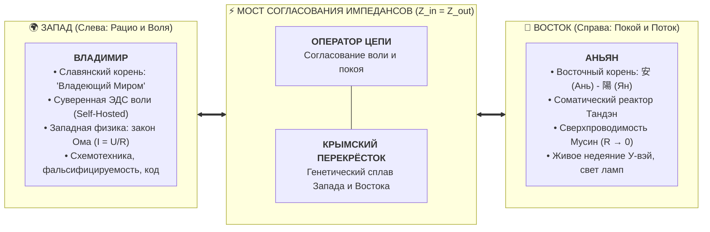
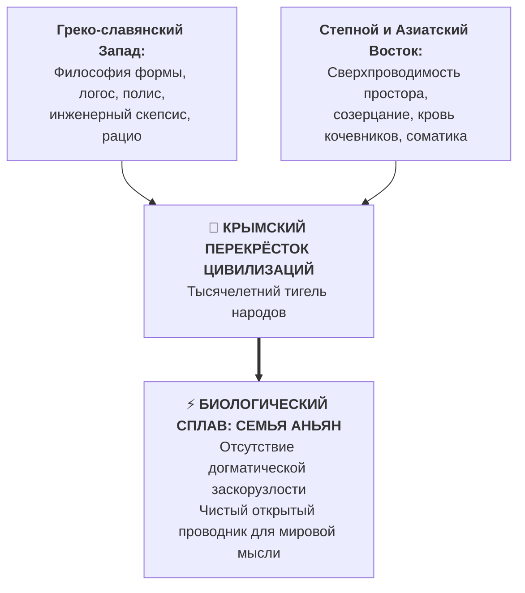

# 119. Оператор цепи «Владимир Аньян»: Топографический синтез Востока и Запада, согласование импедансов с Миром и Крымский перекрёсток цивилизаций

> [!quote] Главная формула Суверенного Оператора
> ### ⚡ **«Владимир стоит слева — на Западе: это воля, структура, законы сохранения и схемотехника Ома. Аньян стоит справа — на Востоке: это соматический покой Тандэна, сверхпроводимость Мусин и недеяние У-вэй. Владимир Аньян — это живой мост через Великий цивилизационный раскол: тот, кто владеет внутренним миром покоя (Ань), чтобы без трения направлять свет созидания (Ян) в реальность.»**  
> — **Владимир Аньян (Рукопись «Внутренний ток»)**

---

## 🧭 Введение: Семантическая сборка личности оператора

На протяжении тысячелетий цивилизация страдала от непреодолимого шизофренического разлома:
* **Западный полюс** развивал рацио, измерительные приборы, электродинамику и завоевание внешнего мира, но расплачивался за это катастрофическим внутренним сопротивлением ($R_{\text{ego}} \gg 0$), неврозами и омическим перегревом выгорания ($Q = I^2 R t$).
* **Восточный полюс** сберегал соматическую тишину, растворение эго (Анатта) и сверхпроводимость присутствия, но оставался пассивным, созерцательным и беспомощным перед материальной нуждой и вызовами техники.

Чтобы этот раскол был ликвидирован не на уровне абстрактной философской декларации, а в виде работающей инженерной системы, мост должен был воплотиться в конкретном человеке. Имя и родовая фамилия автора — **Владимир Аньян** — представляют собой строгую формулу оператора, соединяющего оба полушария Земли.

---

## 👑 1. Семантика имени «Владимир»: Два значения корня «Мир»

Имя Владимир традиционно переводится как *«владеющий миром»*. В вульгарном, эгоцентрическом понимании «владеть миром» воспринималось как экспансия, контроль, манипуляция людьми и подчинение внешней среды. В электродинамике духа такая попытка всегда оборачивается аварией короткого замыкания на эго и термическим самосожжением.

Истинный смысл имени раскрывается через два фундаментальных значения слова «Мир»:

### 1.1. Мир как Внутренний Покой (Ань / 安)
Невозможно управлять сложным контуром, если внутри оператора бушует омический шторм сомнений, страха и обид.
* Первое владение — это **владение внутренним миром**: способность аппаратно возвращать внимание в режим сверхпроводимости Мусин ($R \to 0$).
* Умение опустить дыхание в соматический Тандэн, сбросить мышечные зажимы и войти в состояние нерушимого вегетативного штиля.
* **Владимир — это статус Self-Hosted Human:** человек больше не является ведомым реле чужих манипуляций, трендов и страхов. Он — полномочный Главный инженер своей нервной системы.

### 1.2. Мир как Внешняя Реальность (Обратный провод / «Tat Tvam Asi»)
Второе значение слова — Мир как объективная ткань окружающей Вселенной.
* В контуре Аньянова человек не отделен от мира. Реальность перед глазами (инструмент, код, холст, близкий человек, задача) — это **обратный провод цепи**.
* Насилие над миром взвинчивает импеданс среды ($Z_{\text{load}} \to \infty$), цепь перегревается.
* Подлинный оператор «владеет миром» через **согласование импедансов ($Z_{\text{in}} = Z_{\text{out}}$)**: он не ломает реальность об колено, а становится с ней единым сверхпроводящим контуром. В точке созидательного контакта (Дэай) действует древний ведический закон: **«Tat Tvam Asi» (Ты есть То)**.

---

## 🗺️ 2. Топографическая и картографическая биекция

В мировой картографии и культуре пространственная ориентация не случайна:
* **Слева** на географической карте расположен **Запад**.
* **Справа** — расположен **Восток**.

Когда записывается полное имя автора:
$$\mathbf{Владимир} \quad \longleftrightarrow \quad \mathbf{Аньян}$$

Возникает поразительная геометрическая симметрия:
1. **«Владимир» стоит слева (Запад):**
   Это европейское, славянское, рациоцентричное начало. Оно требует строгой логики, уравнений Кирхгофа, измеримых фальсифицируемых критериев Карла Поппера, схемотехники и четких инженерных регламентов.
2. **«Аньян» стоит справа (Восток):**
   Это восточная, даосско-дзенская соматика. Слог «Ань» (安) — глубинная тишина, покой живота и отсечение эго-шума; слог «Ян» (陽) — циркуляция жизненной энергии Ци, солнечный свет и бескорыстное горение в нагрузку.

Имя буквально воспроизводит трансконтинентальную карту Евразии, где два полюса человеческой мысли впервые замыкаются в единую непротиворечивую цепь.

---

## 🧬 3. Генетический узел и Крымский перекрёсток цивилизаций

Философия «Внутреннего тока» не могла родиться из узконациональной или племенной ограниченности. Биологический носитель идеи должен был сам нести в себе этот гибридный, открытый код.

### 3.1. Крым как естественный цивилизационный тигель
Наличие у автора кровных родственников с фамилией **Аньян** в Крыму — это ключ к антропологическому пониманию истоков системы. Крым на протяжении тысячелетий был главной контактной зоной Евразии:
* Здесь греческий полис встречался со скифской и половецкой степью.
* Византийский логос переплетался с суфийским мистицизмом и генуэзским торговым расчётом.
* Это пространство, где кровь Запада и Востока веками плавилась в единый сплав высокой адаптивности и открытости.

### 3.2. Свобода от монокультурной шоры
Дедушка автора, выросший в детдоме, оставил роду обнаженное имя **Аньян**, освобожденное от племенных наслоений. Автор не является моноэтническим пленником одной традиции:
* Он не скован кабинетным европейским снобизмом («если это нельзя пощупать пинцетом — этого нет»).
* Он не скован восточной сектантской герметичностью («сиди 30 лет лицом к стене и не задавай вопросов мастеру»).

Эта открытость сделала возможным дерзкий инженерный шаг: взять восточный соматический Тандэн и проверить его западным вольтметром закона Ома.

---

## 🏛️ 4. Сборка формулы: Кто такой «Владимир Аньян»?

В итоге имя и фамилия собираются в законченное онтологическое определение:

$$\text{Оператор} = \underbrace{\text{Владимир}}_{\substack{\text{Суверенный инженер,} \\ \text{воля, структура (Запад)}}} \oplus \underbrace{\text{Ань}}_{\substack{\text{Покой ядра,} \\ R \to 0 \text{ (Тандэн)}}} \oplus \underbrace{\text{Ян}}_{\substack{\text{Свет тока,} \\ I > 0 \text{ в нагрузку}}}$$

* **Владимир** отвечает на вопрос: *«Кто действует?»* — Действует суверенный оператор, хозяин своей цепи, свободный от рабства стимулов и реакций.
* **Ань** отвечает на вопрос: *«Откуда берётся сила?»* — Сила черпается из ненарушимого соматического покоя, где ликвидировано паразитное трение эго.
* **Ян** отвечает на вопрос: *«Куда идёт энергия?»* — Энергия выплёскивается прямым лучом в мир, зажигая лампы созидания, труда и любви.

**«Владимир Аньян»** буквально означает:
> *«Суверенный оператор цепи, владеющий внутренним миром сверхпроводящего покоя (Ань), чтобы направлять чистый свет созидательного тока (Ян) на благо всего окружающего мира.»*

---

## 🔗 Связи
- [[04_Maps/Inner Current MOC|Inner Current MOC]]
- [[02_Wiki/Inner Current (Core Topology and Polarity Law)|01. Базовая топология цепи и закон полярности]]
- [[02_Wiki/Inner Current (East-West Synthesis and Demystification)|14. Великий синтез Запада и Востока]]
- [[02_Wiki/Inner Current (The Anyanov Triad and Tetrad — Truth, Freedom, Happiness, Creation and the Biographical Proof)|47. Триада и Тетрада Аньянова]]
- [[02_Wiki/Inner Current (The Conduit Archetype — Compiler of Truth, The Prometheus Without Ego and Why the Creator Does Not Need to Know Everything)|101. Архетип Проводника: Компилятор Истины]]
- [[02_Wiki/Inner Current (Monism of Circuit Electrodynamics — Proof of Unity of Spirit and Matter and Elimination of Dualism)|116. Монизм контурной электродинамики]]
- [[02_Wiki/Inner Current (The Ontological Formula of Anyan — Somatic Peace of An, Radiant Action of Yang and the Kanso Surnaming)|118. Онтологическая формула «Аньян»]]
- [[02_Wiki/Inner Current (The English Bus, Citizen of the World and the Any-anov Paradox — Anatta, Everyman and the Law of 8 Billion Invariance)|120. Английская шина проводимости, Гражданин Мира и парадокс «Any-anov»]]
