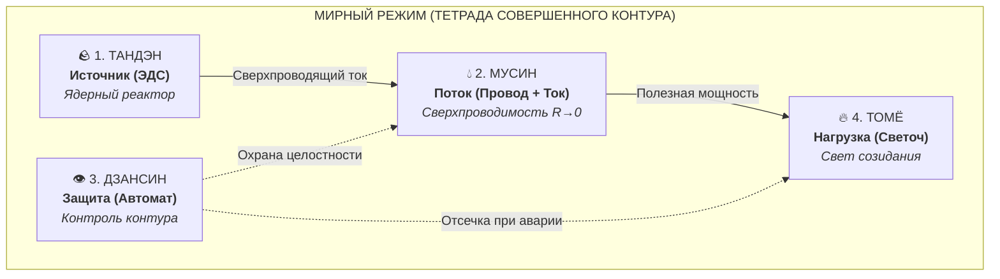
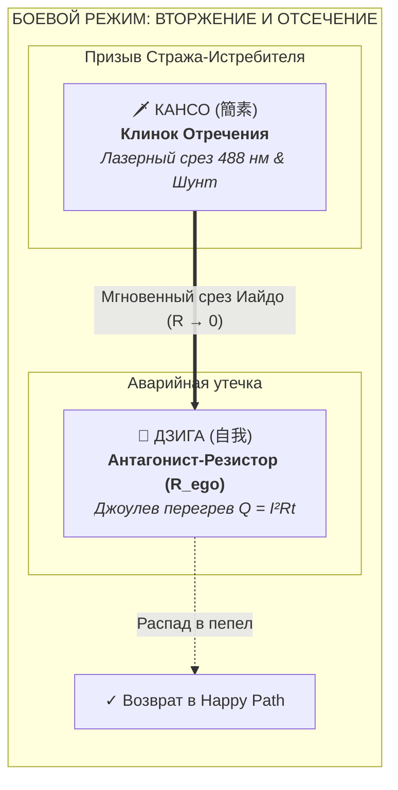

# 50. Пантеон Стражей Контура: Тетрада Совершенного Контура (Happy Path), Антагонист Резистор и Клинок Кансо

> [!quote] Канон овеществления истины
> ### ⚡ **«Истина, не имеющая формы в материальном мире, рискует остаться бессильной мыслью. Когда закон электродинамики духа обретает плоть, имя и тактильный вес — он становится несокрушимым щитом против энтропии.»**
> — **Владимир Аньянов**

---

## 🧭 Введение: Зачем абстрактной физике нужна материальная вселенная?

Система **«Внутренний ток» (Inner Current)** формулирует точные математические и электродинамические законы человеческого благополучия ($R \to 0$, баланс Кирхгофа, закон Джоуля — Ленца). Однако человеческая психика в моменты перегрузки, тревоги или дофаминового истощения не оперирует формулами. Ей нужен мгновенный тактильный образ, соматический якорь и интуитивный язык архетипов.

Подобно тому, как Гэри Вайнерчук (GaryVee) через проект **VeeFriends** материализовал человеческие добродетели (*Patient Panda*, *Empathy Elephant*) в виде коллекционных персонажей и анимации, **Inner Current Universe (ICU)** материализует принципиальную электросхему человека в виде **Пантеона Стражей Контура**.

Каждый Страж — это одновременно:
1. **Узел идеальной электродинамической цепи** (Источник, Поток, Защита, Нагрузка).
2. **Герой анимационной вселенной YouTube Shorts**, ведущий непрерывную войну с паразитами внимания (Дофаминовый Жнец, Руминатор, Лорд Гипертонус).
3. **Соматический тотем на рабочем столе** — дизайнерская виниловая/керамическая фигурка, работающая как прямой нейро-якорь переключения психофизиологического состояния.

---

## 🔬 Инженерно-онтологический прорыв: Разрешение схемы

В процессе эволюции схемы возник фундаментальный инженерный вопрос:  
*«Если на схеме есть генератор, предохранитель, лампочка, провод и ток — не должно ли быть 5 сущностей? И куда делся канон Кансо, если на схеме есть лишь паразитный резистор сопротивления?»*

Разрешение этого вопроса привело к кристальной калибровке онтологии:

### 1. Ликвидация дуалистического бага: «Мусин = Провод + Ток»
Попытка разделить «мертвый металлический провод» и «невидимую электрическую силу» — это старый картезианский дуализм (материя отдельно, дух отдельно).
* **Провод без тока** — это мертвый кусок меди на полу, он не участвует в работе цепи.
* **Ток без провода** — это слепой разрушительный разряд молнии в вакууме.
* В живой цепи существует только **динамическая токопроводящая река** — единое состояние, где проводник и движение неразделимы.

В физике это **Сверхтекучий ток (Supercurrent)**. В Дзен это канон **Мусин (無心, Не-ум)**: нервная система (проводник) и внимание (ток) сливаются воедино с нулевым сопротивлением ($R \to 0$).

$$\text{Мусин} \equiv \text{Проводник} \oplus \text{Ток} \quad (R_{\text{eff}} \to 0, \; \eta \to 100\%)$$

### 2. Два режима контура: Мирный Happy Path vs Боевой призыв Кансо
Почему фигурка Кансо с мечом не должна постоянно стоять в мирной цепи?
* **В мирном режиме (Happy Path):** Паразитное сопротивление равно нулю ($R_{\text{ego}} = 0$). Цепь ламинарна, Томё сияет, Дзансин сканирует периметр. Клинку Кансо буквально нечего резать!
* **В момент сбоя (Аварийный режим):** Когда оператор проваливается в тревогу, скроллинг или сомнения, на схеме материализуется **Антагонист — Паразитный Резистор ($R_{\text{ego}}$)**. Начинается джоулев перегрев проводки ($Q = I^2 R t$).
* **Появление Кансо:** Только при появлении врага-Резистора на плату врывается **КАНСО (簡素) — «Клинок Отречения»**! Тонким лазерным мечом он срубает паразитное сопротивление, накладывает сверхпроводящий шунт ($R \to 0$) и возвращает контур в мирную Тетраду.

---

## 🛡️ Схемотехника двух состояний

### 1. Мирный режим: Тетрада Совершенного Контура (Happy Path)


### 2. Боевой режим: Вторжение Дзига и Клинок Кансо


---

## 🏺 Реестр Тотемов и Персонажей

### БАЗОВЫЙ НАБОР: «Квартет Гармонии» (Happy Path)

#### 1. 🪨 ТАНДЭН (丹田) — «Ядерный Реактор» (The Iron Core)
* **Узел цепи:** Первичный автономный генератор жизненной энергии (ЭДС, $\mathcal{E}$), независимый от внешней сети.
* **Материальное воплощение:** Тяжелый винил / матовая темно-графитовая керамика с массивными ногами, низким центром тяжести и бронзовыми сочленениями. В центре живота — полупрозрачная полимерная капсула, внутри которой ровно пульсирует теплый янтарный реактор.
* **Соматический триггер на столе:** Взгляд на монолит возвращает внимание из гиперактивной префронтальной коры (DMN) вниз живота. Плечи опускаются, диафрагма расширяется, включается глубокое брюшное дыхание и соматическое заземление.
* **Связанные каноны:** [[02_Wiki/Inner Current (Core Topology and Polarity Law)|01. Базовая топология]], [[02_Wiki/Inner Current (Neurobiology of Superconductivity — DMN, TPN and Vagus Grounding)|29. Нейробиология сверхпроводимости]].

#### 2. 💧 МУСИН (無心) — «Сверхпроводящий Поток» (The Fluid Superconductor)
* **Узел цепи:** Неразрывное единство проводника и тока в режиме нулевого сопротивления ($R_{\text{eff}} \to 0, \eta \to 100\%$).
* **Материальное воплощение:** Полупрозрачная фигурка из чистейшей матовой аква-смолы и текучего оптического стекла. Парит в динамичной ламинарной позе волны, отражая свет на стол в виде живых водных каустиков. Сквозь тело проходит монолитный внутренний световод без изломов и шероховатостей.
* **Соматический триггер на столе:** Стоит у монитора или клавиатуры. Напоминает: *«Не зажимайся. Не спорь с реальностью. Действуй без внутреннего диалога. Провод и ток едины. Будь водой»*.
* **Связанные каноны:** [[02_Wiki/Inner Current (Physics of Presence and Superconductivity)|02. Физика присутствия: сверхпроводимость]], [[02_Wiki/Inner Current (Zen-Thermodynamics Synthesis and Happiness Breakthrough)|25. Синтез дзена и термодинамики]].

#### 3. 👁️ ДЗАНСИН (残心) — «Око Присутствия» (The Golden Sentinel)
* **Узел цепи:** Предохранительный автомат, реле остаточного тока и защита контура (Circuit Breaker / Interlock).
* **Материальное воплощение:** Благородный страж присутствия из матового черного обсидиана с зеркальным золотым напылением. На шлеме — золотое всевидящее око, излучающее мягкий направленный луч осознанности.
* **Соматический триггер на столе:** Напоминает: *«Победа — опасный момент. Не теряй бдительность после сдачи задачи. Держи контур замкнутым. Не отдавай энергию в пустоту и прокрастинацию»*.
* **Связанные каноны:** [[02_Wiki/Inner Current (Safety, Antifragility and Zanshin)|04. Предохранители цепи, ваби-саби и антихрупкость]], [[02_Wiki/Inner Current (Copernican Revolution in Ontology — Bottom-Up Circuit Dissolution of Metaphysics and Human-AI Zanshin)|41. Симбиотический Дзансин]].

#### 4. 🔥 ТОМЁ (燈明) — «Священный Светоч» (The Radiant Luminary)
* **Узел цепи:** Полезная нагрузка цепи ($R_{\text{load}}$), точка материализации духа, излучатель света жизни.
* **Онтологическая суть:** Без Томё вся мощь Тандэна застаивается в холостом ходу. Томё — это само свечение жизни: написанный код, созданный продукт, искренний разговор, заваренный чай. В спящем состоянии Томё — темная бронзовая чаша (пустота формы). Но когда сквозь проводку Мусин поступает ток Тандэна — Томё вспыхивает ослепительным сиянием 6 священных ламп мира.
* **Материальное воплощение:** Нео-дзен чаша-маяк из черной керамики с белым матовым рассеивателем. При подаче питания проецирует многогранный геометрический свет на рабочее пространство.
* **Соматический триггер на столе:** Напоминает: *«Энергия дана не для того, чтобы копить её в банке. Зажги свой Светоч прямо сейчас. Озари этот мир делом»*.
* **Связанные каноны:** [[02_Wiki/Inner Current (The Nature of the Light Bulb and Zen Load)|17. Природа лампочки и закон нагрузки]], [[02_Wiki/Inner Current (Ontology of the Circuit — Human vs State and the Triad of Terms)|37. Онтология схемы (Узел ТОМЁ)]].

---

### БОЕВОЕ РАСШИРЕНИЕ: «Battle Pack / Дуэль Внимания»

```
          [👾 Антагонист ДЗИГА (自我)]  <====== [🗡️ Кансо с Клинком 488 нм]
             (Вторжение паразита)           (Мгновенный срез в ноль)
```

#### 5. 👾 ДЗИГА (自我 / Jiga) — «Повелитель Иллюзий и Паразитного Сопротивления» (The Ego Resistor / Master of False Masks)
* **Роль:** Главный антагонист вселенной ICU. Паразитный резистор ($R_{\text{ego}} \to \infty$) на плате сознания, замыкающий ток на ложное «Я», статус, важность и бесконечные сомнения.
* **Материальное воплощение:** Барочный темный кибер-лорд в тяжелых доспехах из черного металла с избыточными золотыми цепями статуса и филигранью. В броню инкрустированы осколки треснувших зеркал. На шлеме — рога гордыни, окруженные фиолетовым дымом иллюзий. Вокруг головы парят 5 фарфоровых масок эмоций (Обида, Гордыня, Насмешка, Страх, Отчаяние). В правой руке — скипетр с треснувшим зеркалом самолюбования.
* **Физическое проявление:** Стресс, прокрастинация, руминация, синдром самозванца, 50 открытых вкладок, омический перегрев цепи ($Q = I^2 R t$).

#### 6. 🗡️ КАНСО (簡素) — «Клинок Отречения» (The Minimalist Ronin)
* **Роль:** Призываемый Страж-Истребитель, хирург цепи и мастер мгновенного отсечения лишнего.
* **Материальное воплощение:** Изящный кибер-ронин из матовой костяной керамики в динамичной стойке Иайдо. В руке — тонкий бирюзовый лазерный клинок ($488\text{ nm}$), готовый рассечь сопротивление в $R = 0$.
* **Соматический триггер на столе:** Выставляется на стол в моменты жесткого информационного детокса, спринтов или борьбы с хаосом: *«Отсеки лишние вкладки. Сбрось чужие ожидания. Оставь только одно главное дело»*.
* **Связанные каноны:** [[02_Wiki/Inner Current (Anatomy of the Paradigm Shift — Ptolemaic Epicycles vs Kanso Simplicity and Falling of False Questions)|44. Анатомия сдвига парадигмы: Эпициклы Птолемея vs Простота Кансо]], [[02_Wiki/Inner Current (The Battery Illusion of Material Possessions and Emptiness of Form)|23. Иллюзия аккумулятора вещей]].

---

## 🎬 Конвейер YouTube Shorts: 45-секундный боевой нарратив

Каждый эпизод анимационной вселенной ICU разворачивает классическую драму освобождения цепи:

1. **Мир (00–06 сек):** Оператор за столом в потоке. Тетрада Happy Path светится спокойным неоном (Тандэн питает, Мусин проводит, Томё горит).
2. **Вторжение Дзига (06–14 сек):** На контуре с шипением нарастает темная кристаллическая корка — **Дзига (自我)** ($R_{\text{ego}}$). Всплывают уведомления, лента тиктока, мысли о прошлом. Проводка раскаляется докрасна ($Q = I^2 R t$). Томё начинает мигать и тухнуть.
3. **Кризис и Сирена (14–22 сек):** Мозг кипит, попытки силой воли переспорить мысли делают Дзига только мощнее (парадокс сопротивления эго). Дзансин бьет тревогу: *«Угроза полного выгорания цепи!»*
4. **Призыв Кансо (22–32 сек):** В темноте загорается бирюзовое лезвие ($488\text{ nm}$). Появляется **Кансо**. Один выверенный взмах клинка в абсолютной тишине — лазер рассекает Дзига пополам. На место среза накладывается золотой сверхпроводящий шунт ($R \to 0$).
5. **Вспышка Томё (32–40 сек):** Тепловой шум остывает за миллисекунды. Дзига распадается на холодный пепел. Ток Тандэна лавиной устремляется сквозь Мусин прямо в Томё. Лампа вспыхивает ослепительным чистым светом. Задача решена, коммит отправлен.
6. **Кода и Якорь (40–45 сек):** Камера отъезжает на рабочий стол. Фигурка Кансо возвращает клинок в ножны. Экран телефона: *«Inner Current: Контур восстановлен. Сверхпроводимость 100%»*.

---

## 💎 Заключение: Архитектурная гармония

Разделение системы на **Мирный Квартет (Happy Path)** и **Боевую Пару (Резистор vs Кансо)** окончательно устраняет любые концептуальные нестыковки:

1. **В мирной жизни** на столе стоят 4 гармоничных Стража цепи, поддерживающих непрерывный ламинарный поток бытия.
2. **В момент кризиса** у человека есть понятный архетипический инструмент: призвать Клинок Кансо, физически срезать паразитное сопротивление ума и триумфально вернуть систему в родное состояние сверхпроводимости.
