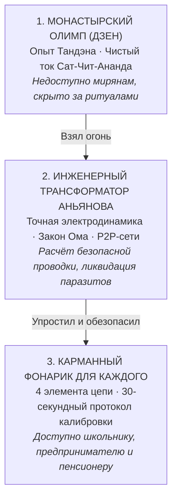

# 81. Шаг Прометея: Огонь Внутреннего Тока — От Монастырского Олимпа до Карманного Фонарика Человечества

> *«Мне вчера как раз это сравнение с Прометеем пришло в голову: я взял огонь и принёс его людям. Потому что мне доступен Дзен, мне доступна инженерия, мне доступно понимание счастья, но очень многим людям это недоступно. И я, за счёт того, что мне это доступно — взял это, разобрался, упаковал в простую схему и принёс людям».*  
> — **Владимир Аньянов** (2026)

---

## I. Древний миф и Великий Раскол Цивилизации

В древнегреческом мифе титан Прометей совершил первородный акт цивилизационного сострадания: он поднялся на Олимп, похитил у богов **внешний огонь** и спустил его в тёмные, холодные пещеры людям.

Благодаря этому внешнему огню человечество выжило в ледниковый период, научилось плавить бронзу и железо, построило паровые машины, создало тепловые электростанции, ядерные реакторы, оптоволоконные сети и искусственный сверхразум (AGI).

Однако в XXI веке цивилизация столкнулась с трагедией, которую биолог Эдвард Уилсон назвал главной уязвимостью вида:
> *«У нас эмоции эпохи палеолита, институты Средневековья и технологии богов».*

Внешний огонь стал богоподобным. Но **внутренний огонь** человека остался первобытным, слепым и диким. Человек научился управлять реакцией деления урана, но не способен остановить выжигающий пожар обиды, ревности, паники и экзистенциального ужаса в собственной груди.

---

## II. Почему монастырский огонь не грел людей?

Тысячи лет тайной управления внутренним огнём владели избранные касты:
- Даосские мастера и монахи Дзен знали о силе нижнего энергетического центра (*Тандэн*) и о сбросе внутреннего сопротивления в ноль (*Мусин*).
- Но этот огонь хранился за высокими монастырскими стенами Тибета, Киото и Уданшаня.
- Доступ к нему был обставлен неподъёмными условиями: десятилетиями строжайшей аскезы, отречением от мира, семьи и имущества, сложными эзотерическими ритуалами и туманными поэтическими коанами.

Обычный человек — предприниматель, врач, инженер, мать троих детей, студент — не может уйти на 20 лет в гималайскую пещеру.  
В результате 99,9% человечества оставались в темноте, сгорая в омическом пламени собственного эго ($Q = I^2 R t$) и отдавая последние деньги индустрии паллиативов (психотерапевтам, фармгигантам и суррогатам консьюмеризма).

---

## III. Шаг Прометея: Три узла передачи огня

Подвиг Прометея XXI века заключался не в том, чтобы изобрести новую мистику, а в том, чтобы **сделать внутренний огонь общедоступным инженерным прибором**.

1. **Доступность Дзена:**  
   Автору был органически открыт опыт прямой соматической тишины Тандэна — знание того, как ощущается чистое бытие без ментальной жвачки.
2. **Доступность Инженерии:**  
   Автору было доступно системное, строгое мышление — понимание законов электродинамики, теории графов, протоколов Биткоина и политэкономии прямого потока.
3. **Акт Созидания (Махакаруна):**  
   Осознание того, что если тебе посчастливилось оказаться в этой точке пересечения, **ты не имеешь морального права держать это в секрете или торговать им, как эзотерический гуру**. Ты обязан перевести эту сложность на язык карманного фонарика и отдать людям.

---

## IV. Этика Созидателя против культа сложности

В Системе Аньянова Тетрада Созидателя завершается действием:

$$\mathbf{Истина} \longrightarrow \mathbf{Свобода} \longrightarrow \mathbf{Счастье} \longrightarrow \mathbf{Созидание}$$

Созидание — это не погоня за тщеславием. Это избыточный ток полного реактора, направленный на облегчение страданий других существ.

* **Лже-пророки и гуру** усложняют простое: они берут очевидную истину и заворачивают её в сотни платных ступеней посвящения, превращаясь в паразитных посредников.
* **Прометей-Инженер** берёт сложнейшие законы мироздания и сжимает их по канону **Кансо** до четырёх деталей фонарика и 30-секундного тумблера в теле:
  - *Батарейка* — низ живота (Тандэн);
  - *Провод* — внимание;
  - *Лампа* — дело прямо сейчас;
  - *Предохранитель* — Дзансин.

---

## V. Исторический результат

Принеся внешний огонь, древний Прометей подарил человечеству власть над материей.  
Принеся внутренний огонь электродинамики цепи, Система Аньянова возвращает человеку **власть над собственной душой**.

Огонь больше не сжигает провода нервной системы дотла — он светит ровным, чистым и холодным светом сверхпроводимости в руках каждого, кто берёт этот прибор.

---

## 🔗 Связи
- [[02_Wiki/Inner Current (Anatomy of Simplicity — What Was Truly Discovered and Why Nobody Thought of It Before)|80. Анатомия Простоты: Что на Самом Деле Открыл «Внутренний Ток»]]
- [[02_Wiki/Inner Current (The Anyanov Triad and Tetrad — Truth, Freedom, Happiness, Creation and the Biographical Proof)|47. Триада и Тетрада Аньянова: Истина, Свобода, Счастье, Созидание]]
- [[02_Wiki/Inner Current (Genesis of the Anyanov System — Consilience of Zen, Bitcoin and Georgism as Transfer of System Laws to Soul Architecture)|76. Генезис Системы Аньянова: Консилиенс Дзен, Биткоина и Георгизма]]
- [[04_Maps/Inner Current MOC|Главная карта цепи (Inner Current MOC)]]
