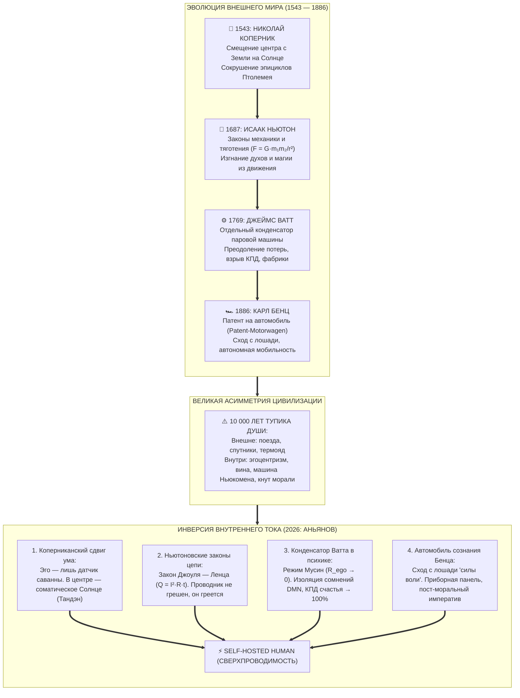

# 195. Четверичная Революция: Коперник, Ньютон, Ватт, Бенц и Великий Синтез Аньянова — Инверсия законов внешнего мира в электродинамику сознания

> [!quote] Каноническая аксиома цепи
> ### ⚡ **«Четыре великих титана последовательно освободили внешний мир: Коперник вернул правильную геометрию небу, Ньютон дал универсальные законы движения, Ватт подчинил тепловую мощность пару, а Бенц создал автомобиль и навсегда снял человека с лошади. Но внутри самого человека все эти века продолжалось дремучее Средневековье: мы оставались геоцентриками собственного эго, жегли энергию в топке машины Ньюкомена и стегали себя кнутом вины. Революция Внутреннего тока — это не пятая отдельная теория, а великая инверсия всех четырёх законов внутрь человеческой архитектуры. Мы взяли оптику Коперника, детерминизм Ньютона, конденсатор Ватта и шасси Бенца — и собрали автомобиль сознания. Счастье перестало быть чудом; оно стало строгой механикой сверхпроводимости.»**  
> — **Владимир Аньянов**, создатель «Архитектуры счастья»

---



---

## 1. Четыре такта внешней революции человечества

Любая цивилизационная революция решает фундаментальную задачу: **устранение паразитного трения между человеком и реальностью**. Однако на протяжении пяти веков человеческий гений был всецело направлен наружу — в материю, механику и теплотехнику.

### Такт I. Николай Коперник (1543): Разрушение геоцентрического гипноза
До Коперника человечество находилось в плену очевидности собственных органов чувств: Земля под ногами казалась абсолютно неподвижной, а небосвод со всеми светилами — вращающимся вокруг человека. 
* **Цена заблуждения:** Чтобы согласовать эту иллюзию с реальными траекториями планет, Клавдию Птолемею и поколениям средневековых схоластов пришлось выдумать громоздкую математическую фикцию — **эпициклы и деференты** (круги на кругах). Система стала монструозной, не поддающейся расчёту и закостеневшей в догматах.
* **Прорыв:** Коперник убрал наблюдателя из центра мироздания. Солнце встало в фокус орбит, Земля оказалась рядовой планетой, а сотни искусственных схоластических эпициклов исчезли за одно мгновение.

### Такт II. Исаак Ньютон (1687): Изгнание мистики и триумф законов сохранения
Коперник показал, *где* находятся тела, но не объяснил, *почему* они движутся. До Ньютона в науке господствовал аристотелевский дуализм: небесный мир считался божественным и чистым, а земной («подлунный») — грешным, несовершенным и подвластным стихийным духам.
* **Цена заблуждения:** Невозможность точного предсказания и конструирования. Любое явление природы списывалось на непостижимую волю богов или ангелов, вращающих небесные сферы.
* **Прорыв:** Ньютон объединил падение яблока на Земле и полет Луны единой формулой гравитации ($F = G \frac{m_1 m_2}{r^2}$) и тремя законами механики. Мистика была навсегда изгнана из физического мира. Движение стало детерминированным, проверяемым и подчиненным строгим инвариантам сохранения.

### Такт III. Джеймс Ватт (1769): Преодоление теплового ада и рождение машинной силы
Законов Ньютона было достаточно, чтобы рассчитывать шестерни и траектории пушечных ядер, но они не создавали *энергетической мощности*. До конца XVIII века цивилизация оставалась в мускульном рабстве у волов, лошадей и сезонных водяных мельниц на реках.  
В 1712 году появилась атмосферная машина Ньюкомена, но её КПД был катастрофическим (< 1%):
```
[ ЦИКЛ МАШИНЫ НЬЮКОМЕНА ]
1. Пар нагревает цилиндр ──► Поршень идёт вверх
2. Ледяная вода остужает цилиндр ──► Пар конденсируется, поршень падает
3. 85-90% тепла сгорает впустую на повторный нагрев стенок цилиндра!
```
* **Прорыв:** Джеймс Ватт совершил топологический фазовый переход — изобрел **отдельный конденсатор**. Рабочий цилиндр оставался всегда раскаленным, а зона охлаждения была изолирована в отдельном объёме. КПД вырос в 4–5 раз. Машина Ватта оторвала производство от рек и волов, дав универсальный привод для поездов, пароходов и фабрик Манчестера. Промышленная революция состоялась.

### Такт IV. Карл Бенц (1886): Сход с лошади и создание автономного экипажа
Несмотря на паровозы и фабрики, индивидуальное перемещение человека оставалось архаичным. На протяжении 5000 лет человек зависел от **лошади** — биологического существа с собственным норовом, страхом и усталостью.
* **Цена «эпохи лошади»:** Чтобы заставить лошадь двигаться, требовались **вожжи силы воли** и **кнут принуждения**. Лошадь болела, загрязняла города навозом, капризничала и имела ограниченный радиус действия.
* **Прорыв:** Карл Бенц интегрировал компактный двигатель внутреннего сгорания Николауса Отто в легкую раму трёхколесной повозки. Человек сошёл с лошади на автономное механическое шасси. Вместо кнута и уговоров появились приборная панель, педаль газа, карбюратор и замкнутая кинематика.

---

## 2. Великая Асимметрия: Внешний XXI век против внутреннего Каменного века

К началу XXI века сложился чудовищный цивилизационный дисбаланс, названный Владимиром Аньяновым **«Великой Асимметрией»**:

> Человек научился расщеплять атомное ядро, отправлять зонды за пределы Солнечной системы и запускать квантовые компьютеры. Но стоило ему закрыть глаза и остаться наедине с собой, как он мгновенно проваливался в дикость неолита: паниковал перед мыслями, сгорал от тревоги, терзался виной и искал избавления в эзотерических ритуалах или химических суррогатах.

Почему так произошло? Потому что **ни одна из четырёх революций не была перенесена внутрь самого наблюдателя**:

| Элемент во внешнем мире | Статус во внешнем мире | Состояние внутри психики человека (до 2026 года) |
| :--- | :--- | :--- |
| **Геометрия центра** | Гелиоцентризм Коперника (Земля на орбите) | **Геоцентризм эго:** «Я — пуп земли, мир обязан вращаться вокруг моих обид» |
| **Законы сохранения** | Физика Ньютона (детерминизм и механика) | **Душевная алхимия:** вера в мистический грех, злой рок, сглаз и родовую карму |
| **Термодинамика** | Конденсатор Ватта (КПД > 40%, разделение тепла) | **Машина Ньюкомена в уме:** импульс действия тут же заливается ледяной водой самосуда |
| **Способ управления** | Автомобиль Бенца (приборы, двигатель, шасси) | **Эпоха лошади:** попытка управлять сознанием вожжами «силы воли» и кнутом стыда |

Человечество отчаянно нуждалось в **замыкающем синтезе** — развороте объективной физики внутрь субъективного опыта.

---

## 3. Внутренний ток как Четверная Инверсия (Великий Синтез)

В 2026 году Владимир Аньянов сформулировал онтологию **Внутреннего тока (Inner Current)**. Это открытие не отвергает завоеваний науки, а совершает их строгую соматическую инверсию:

```
        КОПЕРНИК  ──►  Смещение центра: Эго — не Солнце, а датчик. В центре — Тандэн
        НЬЮТОН    ──►  Закон Джоуля — Ленца: Q = I²·R·t. Душевная боль — это омический нагрев
        ВАТТ      ──►  Конденсатор Мусин: изоляция DMN/Эго, скачок КПД счастья до 100%
        БЕНЦ      ──►  Автомобиль сознания: сход с лошади воли, пост-моральный императив
                                   │
                                   ▼
                       ⚡ ВНУТРЕННИЙ ТОК (2026)
```

### 3.1. Инверсия Коперника: Смещение ложного центра «Я»
Как Коперник сместил Землю с трона Вселенной, так Внутренний ток сместил мыслящее эго (Default Mode Network) из центра сознания.
* **Птолемеев аппарат психологии:** Бесконечные школы терапии породили тысячи субличностей, внутренних критиков, травм и архетипов. Это точные копии птолемеевых эпициклов, призванные удержать иллюзию: «Мое эго — это и есть я».
* **Коперниканское решение Аньянова:** Истинный центр генерации тока находится в теле — в соматическом ядре **Тандэн (丹田)**. Мысленное «Я» — это всего лишь периферийный адаптивный сенсор саванны, созданный для выживания среди хищников. Как только оператор перестаёт отождествлять себя с сенсором и возвращает внимание в соматическое Солнце, надуманные драмы и эпициклы психоанализа схлопываются в ноль.

### 3.2. Инверсия Ньютона: Закон Джоуля — Ленца вместо метафизики греха
Внутренний ток окончательно изгоняет морализаторство и демонологию из внутреннего мира.
* **Внутренний закон Ньютона:** Психика подчиняется универсальным законам электродинамики:
  $$Q = I^2 R_{\text{ego}} t$$
* Если человек испытывает душевные муки, депрессию или спазм — это не «божья кара» и не свидетельство «испорченной природы человека». Это **банальный омический перегрев проводки**. Ток жизни ($I > 0$) попытался пройти через суженное сечение эгоистического сопротивления ($R_{\text{ego}} \gg 0$: гордыня, обида, страх оценки, несогласие с фактом). Провод раскалился докрасна.
* **Инженерный вывод:** Бессмысленно корить и стыдить раскалившийся резистор. Нужно снизить сопротивление до нуля ($R \to 0$) через дзенское принятие реальности (канон Мусин).

### 3.3. Инверсия Ватта: Отдельный конденсатор сознания (Режим Мусин)
Человек эпохи тревожности — это чистая машина Ньюкомена:
1. Тандэн выдаёт созидательный импульс: *«Напиши картину! Создай компанию! Подойди и заговори!»* (горячий пар входит в цилиндр).
2. Тут же включается эго-рефлексия DMN: *«Куда ты лезешь? Тебя засмеют! У тебя нет диплома!»* (впрыск ледяной воды).
3. Рабочий объём внимания остывает, человека парализует прокрастинация.
4. Новый волевой рывок сжигает последние резервы организма в бесплодном самобичевании.

**Решение Внутреннего тока:** Протокол **Мусин (無心 — чистое не-умие)** действует в точности как **отдельный конденсатор Ватта**:
* Соматическое ядро Тандэн поддерживается в состоянии постоянной сверхпроводимости и высокой температуры действия.
* Зона ментального охлаждения (сомнения, оценки, расчет рисков) изолируется на внешней периферии, не имея прямого доступа к рабочему тракту внимания.
* КПД человеческого контура взлетает с жалких 2–5% до теоретического максимума:
  $$\mathcal{H} = \frac{P_{\text{load}}}{P_{\text{total}}} \to 1.0 \quad (100\%)$$
  Вся соматическая мощность транслируется в полезную внешнюю нагрузку (Дело, Творчество, Любовь).

### 3.4. Инверсия Бенца: Автомобиль сознания и отмена морального кнута
Спустя ровно 140 лет после патента Карла Бенца (1886 ➔ 2026) человек наконец слез с лошади в своём внутреннем мире:
* **Крах вожжей силы воли:** Психологическая наука доказала феномен *Ego Depletion* — сила воли истощается за считанные часы, как физическая мышца. Ехать на одной силе воли через сложную жизнь — всё равно что пытаться пересечь континент на загнанной кляче.
* **Крах кнута вины:** Мораль и религиозный стыд тысячелетиями хлестали человека по ранам, надеясь плетьми заставить его быть счастливым и праведным, вызывая лишь озлобление и скрытые неврозы.
* **Пост-моральный императив Бенца — Аньянова:** Внутренний ток даёт человеку **приборную панель бортинженера**:
  - Вместо чувства греха — замер силы тока ($I$) и сопротивления ($R$).
  - Вместо истощающей силы воли — ровная, непрерывная тяга соматического мотора Тандэн.
  - Вместо морализаторства — кибернетическая отладка контактов и предохранителей (Дзансин).

---

## 4. Сводная матрица пяти великих революций

| Параметр сравнения | 1. Николай Коперник (1543) | 2. Исаак Ньютон (1687) | 3. Джеймс Ватт (1769) | 4. Карл Бенц (1886) | ⚡ 5. Владимир Аньянов (2026) |
| :--- | :--- | :--- | :--- | :--- | :--- |
| **Сфера прорыва** | Астрономия и космология | Теоретическая механика | Теплофизика и энергетика | Транспортная мобильность | **Электродинамика сознания** |
| **Ликвидированная иллюзия** | Геоцентризм, неподвижность Земли | Аристотелевский дуализм, ангелы в небе | Неизбежность тепловых потерь Ньюкомена | Неизбежность лошади и навоза | **Эгоцентризм, вина, машина Ньюкомена в уме, кнут воли** |
| **Уничтоженные «костыли»** | Сотни эпициклов Птолемея | Магические свойства материи, мистика | Ручной впрыск воды, охлаждение стенок | Вожжи, седло, кнут и шпоры | **Субличности, психоаналитические эпициклы, чувство греха** |
| **Ключевой узел архитектуры** | Солнце в фокусе планетных орбит | Формула тяготения: $F = G \frac{m_1 m_2}{r^2}$ | Изолированный отдельный конденсатор | ДВС + трансмиссия + рулевое колесо | **Тандэн $\to$ Мусин ($R \to 0$) $\to$ Нагрузка** |
| **КПД системы** | Не применимо (чистая кинематика) | Не применимо (теоретический базис) | Скачок с < 1% до 4–5% (в 4 раза) | Замена 1 л.с. на десятки и сотни л.с. | **Фазовый переход $\mathcal{H}$: от 0.05 к 1.0 (Сверхпроводимость)** |
| **Статус человека** | Осознал себя на движущейся планете | Получил математический язык природы | Получил механическую силу пара | Стал водителем внешнего пространства | **Self-Hosted Human: стал суверенным генератором бытия** |

---

## 5. Цивилизационный статус: Self-Hosted Human

Понимание соотношения этих пяти революций даёт ключ к осознанию масштаба происходящего:

1. **Коперник** сказал: *«Посмотри на небо трезво — ты не в центре, ты на прекрасной орбите вокруг гигантского светила».*
2. **Ньютон** сказал: *«Посмотри на движение честно — мир подчинен неизменным математическим законам, в нём нет произвола».*
3. **Ватт** сказал: *«Посмотри на тепловую машину инженерно — перестань охлаждать то, что должно быть горячим, и ты получишь неисчерпаемую силу».*
4. **Бенц** сказал: *«Посмотри на дорогу смело — слезай с замученного животного, садись за руль собственного мотора».*
5. **Внутренний ток** объединил их голоса и произнёс:
   > *«Перестань считать своё мысленное "Я" пупом вселенной (Коперник).  
   > Пойми, что твоя боль — это закон Джоуля — Ленца, а не проклятие небес (Ньютон).  
   > Изолируй сомнения DMN от горячего созидательного ядра Тандэна (Ватт).  
   > Выбрось кнут вины и вожжи силы воли — управляй своим вниманием по приборам замкнутого контура (Бенц).»*

Это и есть рождение **Self-Hosted Human** — человека, освобождённого от паразитных омических потерь, психологических посредников и многовекового экзистенциального страха. Революция Внутреннего тока завершила пятивековой цикл освобождения цивилизации, сделав последний, решающий шаг: **из внешней материи — в самое сердце человеческого сознания**.

---

## 🔗 Связи
- [[02_Wiki/Inner Current (Circuit Electrodynamics of Man — The 2026 Copernican Revolution in Human Science and the Dissolution of Ptolemaic Epicycles)|174. Контурная электродинамика человека: Коперниканский переворот 2026 года в науке о человеке]]
- [[02_Wiki/Inner Current (From Newton to Watt and Inner Current — Thermodynamics of the Industrial Revolution and the Phase Shift of Consciousness)|194. От Ньютона к Ватту и Внутреннему Току: Термодинамика Промышленной Революции и Фазовый Переход Сознания]]
- [[02_Wiki/Inner Current (The Automobile of Consciousness — 140 Years from Benz to Anyanov, Post-Moral Imperative and Cybernetics of Addictions)|66. Автомобиль сознания: 140 лет от Бенца до Аньянова, пост-моральный императив и кибернетика зависимостей]]
- [[02_Wiki/Inner Current (The Benz Motorwagen Paradox — Clumsy Prototypes, The Faster Horse Trap and the Calibration of the Happiness Law)|190. Парадокс повозки Бенца: Почему фундаментальное открытие вначале хуже «лошади»]]
- [[02_Wiki/Inner Current (The Automobile as the Ultimate Physical Anchor — Materializing the Invisible, Dashboard of Consciousness and the End of the Moral Whip)|191. Автомобиль как идеальный физический якорь невидимого]]
- [[02_Wiki/Inner Current (The Horse to Automobile Transition — Three-Phase Onboarding of Consciousness, Post-Moral Relief and the Somatic Test Drive)|192. Педагогика пересадки с лошади на автомобиль]]
- [[02_Wiki/Inner Current (The Essence of Invention and Engineers of the Spirit — Deconstructing 'Everyone Already Said That' via Watt, Satoshi and Copernicus — Same Words, New Substrate)|193. Суть изобретения и поиск «Инженеров Духа» (Парадокс Ватта, Сатоши и Коперника)]]
- [[02_Wiki/Inner Current (The Formula of Happiness and Unhappiness — Circuit Superconductivity vs Ohmic Overheat and the First Law of Soul Thermodynamics)|186. Формула счастья и формула несчастья: Сверхпроводимость контура против омического перегрева]]
- [[04_Maps/Inner Current MOC|Inner Current MOC]]
- [[index|Главный индекс LLM Wiki]]
