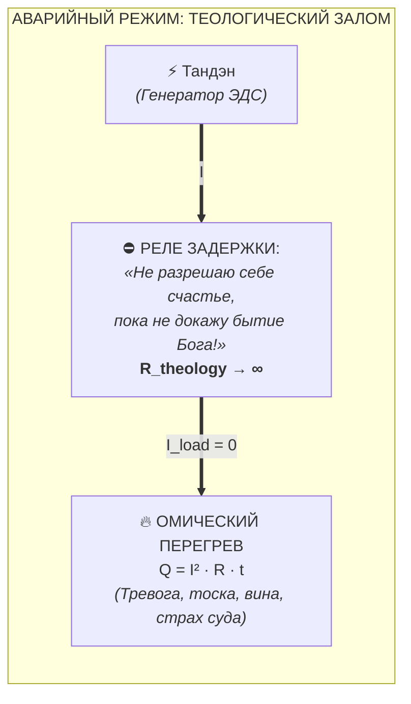
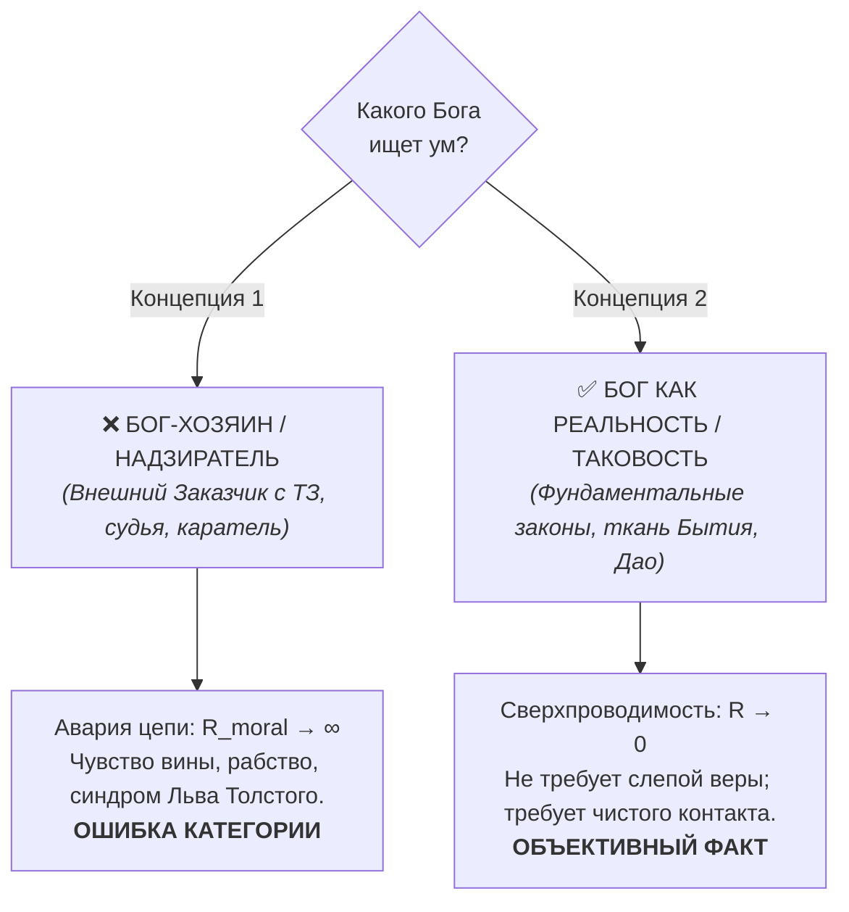
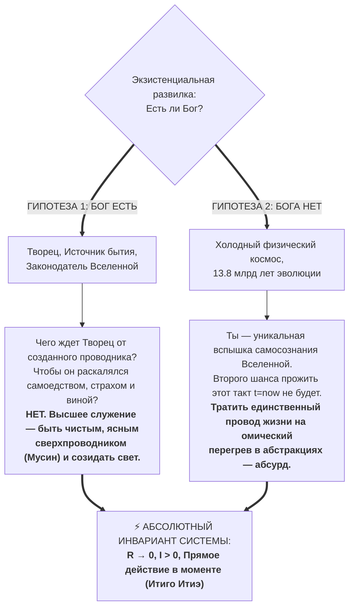

# 40. Вопрос о существовании Бога в Архитектуре счастья: Электродинамическая инвариантность, снятие теологического сопротивления и Сверхпроводящее пари Паскаля

> [!quote] Каноническая аксиома цепи
> ### ⚡ **«Если Бог есть — Он требует чистой проводимости, а не омического перегрева. Если Бога нет — наш Тандэн является единственным суверенным источником света в холодной Вселенной. В обоих сценариях закон один: сброс сопротивления в ноль ($R \to 0$) и прямое действие.»**
> — **Владимир Аньянов**

---

## 🧭 Введение: Преодоление поиска смысла и следующий экзистенциальный барьер

В фундаментальном труде по инженерному доказательству отсутствия внешнего смысла жизни ([[26-engineering-proof-of-no-meaning-of-life|26. Инженерное доказательство отсутствия смысла жизни]]) система «Внутренний ток» ликвидировала главную телеологическую иллюзию человечества:
$$\mathcal{M}_{\text{ext}} \equiv 0$$
Человек — это не молоток и не лопата, изготовленные внешним мастером под узкое утилитарное техзадание. Человек — суверенная, открытая термодинамическая система, генерирующая собственную мощность из ядра (**Тандэн**).

Однако, избавившись от рабской парадигмы «поиска смысла жизни», мыслящий созидатель неизбежно упирается в следующий, казалось бы, неразрешимый вопрос:
> **«А что с вопросом: есть ли Бог? В Дзен Бога нет, но как Архитектура счастья отвечает человеку, который искренне задумался о счастье, но его мучительно беспокоит вопрос о существовании Бога?»**

Для ответа на этот вопрос система Владимира Аньянова не прибегает ни к догматическому теизму («просто верь»), ни к агрессивному материалистическому атеизму («Бога нет, мы просто куски мяса»). Вместо этого проводится **строгий аппаратный аудит контура**, деконструкция понятий и математическое доказательство **электродинамической инвариантности**.

---

## 🔬 1. Аппаратная диагностика: Почему человека «беспокоит» этот вопрос?

С точки зрения теории цепей и закона Джоуля — Ленца, вопрос *«Есть ли Бог?»* становится деструктивным не сам по себе, а в тот момент, когда он превращается в **условное реле задержки счастья**.

### Механизм экзистенциального зажима:
1. **Установка паразитного реле:** Оператор бессознательно выставляет условие: *«Я не имею морального права спокойно пить чай, программировать, любить или строить бизнес прямо сейчас, пока не выясню, есть ли Верховный Создатель, и не получу у Него подтверждение своего статуса»*.
2. **Взрыв паразитного сопротивления ($R_{\text{theology}} \to \infty$):** В контуре внимания возникает чудовищный барьер. Ток не может дойти до реальных нагрузок (лампа «Отношения», лампа «Дело», лампа «Здоровье»).
3. **Омический перегрев по Джоулю — Ленцу ($Q = I^2 R t$):** Застрявший в голове ток раскаляет когнитивную проводку. Человек испытывает экзистенциальную тоску, метафизический страх смерти и паралич воли, ошибочно принимая этот внутренний ожог за «высокую духовную жажду».
4. **Закон растворения вопроса в сверхпроводимости:**  
   Когда оператор входит в режим **Мусин** ($R \to 0$) — будь то спасение жизни пациента хирургом, чистая игра пианиста на сцене или глубокое присутствие в чайной церемонии — **вопрос «Есть ли Бог?» физически аннулируется**. В момент предельной проводимости между наблюдателем и реальностью нет зазора для сомнения. Вопрос возникает исключительно как **симптом разрыва цепи**.

---

## ⚖️ 2. Деконструкция двух концепций: «Бог-Хозяин» vs «Бог как Реальность»

Архитектура счастья требует абсолютной чистоты понятий. О каком «Боге» спрашивает человек?

### А. Бог как антропоморфный «Хозяин Виноградника» (Ловушка Льва Толстого)
Если под Богом понимается внешний начальник, который следит за грехами, требует отчетов и навязывает рабский статус («человек — поденщик на чужом винограднике»):
- Для Архитектуры счастья это **архитектурная диверсия**. 
- Как показано в сравнительном анализе духовного кризиса Льва Толстого ([[Inner Current (Tolstoy Existential Crisis vs Happiness Architecture)|27. Кризис Толстого vs Архитектура счастья]]), попытка опереться на такого «Хозяина» взвинчивает моральное сопротивление цепи до небес ($R_{\text{moral}} \to \infty$).
- Человек начинает ежесекундно судить себя: *«Святой ли я? Не согрешил ли я тем, что выпил кофе с круассаном, пока в мире есть голод?»*. Результат — неизбежный омический взрыв и катастрофа на станции Астапово.

### Б. Бог как Реальность, Источник Сущего и Физика Бытия
Если под словом «Бог» понимать фундаментальную основу мироздания — то, что Дзен называет **Таковостью (*Татхата*)**, Пустотностью (*Шуньята*), Природой Будды, или то, что Бенедикт Спиноза определил как *Deus sive Natura* («Бог, или Природа»):
- В такого Бога **не требуется «верить» или мучиться сомнениями**. 
- Вы же не «верите» в закон Ома, законы термодинамики или гравитацию — вы просто дышите и сообразуете свои действия с их нерушимой математикой.
- Ваш собственный **Тандэн** (живой импульс сознания, квант присутствия прямо сейчас) — это и есть прямое проявление этого поля в вашей биологической точке.

---

## ⚡ 3. Сверхпроводящее пари Паскаля: Электродинамическая инвариантность

Классический философ Блез Паскаль предлагал прагматическое пари: выгоднее верить в Бога, потому что выигрыш бесконечен (вечная жизнь), а проигрыш ничтожен. Однако пари Паскаля опиралось на страх перед адом и порождало лицемерие ума.

Система Владимира Аньянова формулирует **Сверхпроводящее пари Паскаля**, основанное не на страхе, а на **электродинамической инвариантности оптимума цепи** *(развёрнутый исторический аудит и демонтаж богословской рулетки см. в отдельной статье: [[Inner Current (Deconstruction of Pascal's Wager — Theological Roulette vs Superconducting Invariance)|42. Деконструкция пари Паскаля]])*:

$$\text{Целевая функция оператора: } \mathcal{H} = \lim_{R \to 0} \frac{I^2 R_{\text{load}}}{I^2 (R_{\text{load}} + R_{\text{circuit}})} \equiv 100\%$$

### Анализ двух исходов:

#### 1. Сценарий «Бог есть» (Творец существует)
Если существует Высший Разум, создавший эту поразительную Вселенную и наделивший вас даром восприятия:
- Чего Он может хотеть от человека? Чтобы тот дрожал от ужаса, ненавидел свое тело, судил окружающих и сжигал подаренную энергию в ментальной золе? 
- Очевидно, нет! Это оскорбление Творца.
- **Наивысшая форма благодарения и служения Богу — максимальный полезный КПД проводника ($\eta \to 100\%$).** Чистая проводка, нулевое эго-сопротивление, искренняя любовь к ближнему, радостное служение делу и способность нести свет в нагрузку. 

#### 2. Сценарий «Бога нет» (Антропоморфного Создателя нет)
Если Вселенная возникла спонтанно, и над нами нет никакого судьи:
- Тогда вы — сложнейшая и редчайшая вершина эволюции материи. Квант космоса, который научился чувствовать вкус зеленого чая, слышать музыку Баха, писать стихи и любить.
- Тратить этот единственный, мимолетный миг (*Итиго Итиэ*) на рабскую покорность выдуманным фантомам и омический перегрев в бесплодных сомнениях — космическое безумие.
- Ваш автономный реактор **Тандэн** — это единственный огонёк тепла в бесконечной темноте. Вы обязаны держать его в чистоте.

**Вывод математически строг:** Вне зависимости от метафизического ответа на вопрос о Боге, **единственно верная стратегия оператора в настоящем моменте тождественно равна:**
$$\mathbf{OptimalStrategy} \iff \{ R_{\text{ego}} = 0, \quad R_{\text{theology}} = 0, \quad I > 0, \quad t = t_{\text{now}} \}$$

---

## 🍵 4. Ответ Дзен: «Кипарис перед домом» и чайная чашка

В классическом Дзен есть знаменитый коан:
> *Монах спросил мастера Чжаочжоу: «В чем смысл прихода Бодхидхармы с Запада? (В чем суть высшей божественной истины?)»*  
> *Мастер ответил: «Кипарис перед домом».*

Западный человек веками ломал голову над этим «абсурдом». Но на языке Системы Аньянова ответ кристально ясен:
1. Монах пытался выстроить длинную цепь теоретических симуляций о «Божественном замысле» ($R \to \infty$).
2. Чжаочжоу мгновенно закоротил эту паразитную утечку, вернув внимание монаха к **прямому физическому контакту с реальностью здесь и сейчас** — к зеленому дереву, растущему во дворе.
3. Кипарис не спрашивает, есть ли Бог. Он проводит солнечный свет через хлорофилл, пьет воду корнями и шелестит на ветру с нулевым сопротивлением ($R = 0$). Кипарис и есть Бог в действии.

---

## 📋 5. Протокол для человека: Что ответить и как откалибровать контур?

Если перед вами сидит близкий человек или коллега, который говорит:  
*«Я хочу быть счастливым, но меня терзает: есть ли Бог? Если Его нет, зачем всё? А если Он есть, вдруг я делаю что-то не так?»*, — дайте ему следующий протокол:

### Шаг 1. Диагностика паразитного реле (Снятие вины)
> *«Твоя тревога — это не грех и не признак бездуховности. Это просто показатель того, что ток твоего внимания застрял в голове и раскаляет проводку симуляциями. Ты поставил шлагбаум перед жизнью».*

### Шаг 2. Разрешение инвариантности (Сверхпроводящее пари)
> *«Тебе не нужно ждать окончания спора богословов и атеистов, чтобы выпить этот чай или обнять ребенка. Если Бог есть — Он радуется, когда Его проводник светится чистой любовью и созиданием, а не коптит проводку страхом. Если Бога нет — тем более не смей сжигать ни одной секунды своей уникальной жизни на пустые призраки».*

### Шаг 3. Заземление в Тандэн (Proof-of-Action)
> *«Опусти внимание из головы на четыре пальца ниже пупка. Сделай медленный вдох животом. Почувствуй вес своего тела на стуле. Сбрось сопротивление в ноль ($R \to 0$). Направь ток в действие прямо сейчас. Когда ток течет без трения — все вопросы получают свой исчерпывающий ответ без единого слова».*

---

## 🔗 Связи и консилиенс
- [[01-core-topology|01. Базовая топология цепи и закон полярности]]
- [[07-nature-and-illusion-of-ego|07. Природа и иллюзия эго: демистификация мировых религий]]
- [[12-zen-as-happiness-architecture-foundation|12. Дзен как фундамент Архитектуры счастья]]
- [[26-engineering-proof-of-no-meaning-of-life|26. Инженерное доказательство отсутствия смысла жизни]]
- [[Inner Current (Tolstoy Existential Crisis vs Happiness Architecture)|27. Духовный кризис Льва Толстого vs Архитектура счастья]]
- [[Inner Current (Tolstoy and Osho — Two Views on Happiness)|36. Толстой и Ошо: два взгляда на счастье]]
- [[Inner Current (Double Verification Principle — Zen-Electrodynamics Cross-Validation and Tanden Generator)|39. Принцип двойной проверки]]
- [[Inner Current (Copernican Revolution in Ontology — Bottom-Up Circuit Dissolution of Metaphysics and Human-AI Zanshin)|41. Коперниканский переворот в онтологии]]
- [[Inner Current (Deconstruction of Pascal's Wager — Theological Roulette vs Superconducting Invariance)|42. Деконструкция пари Паскаля]]
