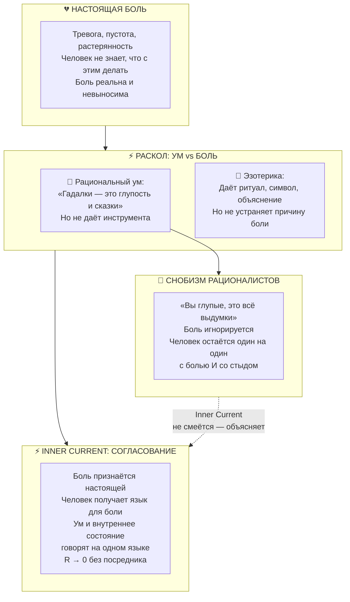

# Inner Current: Настоящая боль за эзотерикой — Почему гадалки существуют не от глупости, а от отчаяния, и как «Внутренний ток» впервые согласует ум и внутреннее состояние человека

> «Не смейтесь над женщиной, которая идёт к гадалке. Её боль настоящая. Её отчаяние честное. У неё просто нет лучшего инструмента. Критики, высмеивающие её суеверие, ничего ей не предложили взамен. "Внутренний ток" — первая система, которая наконец предлагает.»  
> — **Владимир Аньянов**

---



---

## 1. Боль настоящая. Инструмента не было.

Человек, который идёт к гадалке, не делает это из любви к мистике.

Он делает это потому что:
- Его тревога реальна, и он не может её остановить;
- Его растерянность честная — он не знает, куда идти;
- Его отчаяние подлинное — он перепробовал то, что ему советовали рационалисты, и это не помогло.

> **У него настоящая боль. И нет инструмента.**

В этой ситуации он берёт тот инструмент, который есть. Пусть несовершенный. Пусть основанный на магии. Потому что хоть что-то — лучше, чем ничего и насмешка.

Это не глупость. Это **рациональное поведение в условиях информационного вакуума**.

---

## 2. Позиция рационалиста: «Вы глупые» — и ничего взамен

Рационалист смотрит на человека, идущего к гадалке, и говорит:

> *«Это всё сказки и выдумки. Марс не может влиять на ваши отношения. Карты Таро — случайные картинки. Вы просто суеверны и необразованны.»*

Он прав в одном: Марс действительно не влияет на отношения.

Но он **не предлагает ничего взамен**.

Он выбивает костыль — не давая здоровой ноги. Человек остаётся один:
- С болью, которая никуда не делась;
- Плюс со стыдом за «глупость»;
- Плюс с ощущением, что умные люди выше его проблем.

Рационалист не победил эзотерику. Он просто добавил к боли человека ещё и унижение.

**Это самая жестокая позиция из всех возможных.**

---

## 3. Почему человек выбирает эзотерику вопреки уму

Ключевое слово здесь — **вопреки**. Человек часто сам понимает, что Марс не может быть причиной его проблем. Но он всё равно идёт к гадалке.

Почему?

Потому что в момент острой боли **ум отступает**, а боль остаётся. И если выбор стоит между:

| Вариант A | Вариант B |
|---|---|
| Рационалист: «Это бессмыслица» — и пустота | Гадалка: нарратив, ритуал, символ, «объяснение» |

— человек выбирает B. Не потому что верит в карты. А потому что **ритуал создаёт временное снижение сопротивления** ($R_{ego} \to 0$ на час), и это ощущается как облегчение.

Гадалка ненадолго даёт то, чего не даёт рационалист: **присутствие рядом с болью** и попытку её назвать.

Это и есть её единственная реальная функция. Не предсказание будущего. А **суррогатное называние боли**.

---

## 4. Раскол, который терзал человека тысячелетиями

До «Внутреннего тока» человек жил в мучительном расколе:

```
          УМ                          ВНУТРЕННЕЕ СОСТОЯНИЕ
    ┌──────────────┐                  ┌──────────────────┐
    │              │                  │                  │
    │  «Эзотерика  │                  │  Боль настоящая. │
    │   — глупость»│                  │  Помогает хоть   │
    │              │                  │  немного.        │
    │  «Карты Таро │                  │                  │
    │   — выдумка» │                  │  Значит, иду.   │
    │              │                  │                  │
    └──────────────┘                  └──────────────────┘
           ↕ КОНФЛИКТ                        ↕ СТЫД
```

Ум говорит: «Это глупость».  
Боль говорит: «Мне всё равно — мне плохо».  
Стыд говорит: «Ты слабый, раз не можешь сам».

Человек разорван между тремя голосами. Ни один из них не помогает.

**Это и есть точка, в которую бьёт «Внутренний ток».**

---

## 5. Что делает «Внутренний ток»: первое подлинное согласование

«Внутренний ток» — **первая система, которая не выбирает между умом и болью**, а говорит обоим:

> *«Вы правы одновременно. Боль настоящая (внутреннее состояние). И объяснение должно быть строгим (ум). Вот строгое объяснение настоящей боли.»*

### Как это работает:

**Шаг 1: Боль признаётся подлинной**  
Не «вам кажется». Не «это слабость». Не «займитесь делом».  
Боль — это сигнал омического перегрева: $Q = I^2 R t$.  
Это **физический факт**, а не каприз психики.

**Шаг 2: Боль получает точный язык**  
Больше не нужно прибегать к карте Таро как к «языку», потому что теперь есть **свой язык**:
- Тревога = высокое $R_{ego}$, ток не проходит в нагрузку;
- Пустота = обрыв обратного провода, $I \to 0$;
- Раздражение = короткое замыкание, обратный ток.

**Шаг 3: Ум и внутреннее состояние говорят на одном языке**  
Законы Ома и Кирхгофа — это язык ума.  
Сигналы тела (тревога, усталость, злость, пустота) — это язык внутреннего состояния.  
Когда оба переведены на одну схему — **раскол исчезает**.  
Ум больше не смеётся над болью. Боль больше не ищет магии.

---

## 6. Портрет человека, которому это нужно

Это не маргинал и не невежда. Это любой человек, у которого:
- Есть реальная боль (тревога, выгорание, пустота, страх, злость);
- Есть ум, который говорит «карты Таро — бессмыслица»;
- И нет третьего варианта между «поверить магии» и «терпи, это жизнь».

Это **большинство людей на планете**.

Именно поэтому индустрия эзотерики — многомиллиардная. Не потому что люди глупее, чем раньше. А потому что боли больше, а системы до сих пор не было.

---

## 7. Манифест сострадания: правильная позиция к тем, кто идёт к гадалке

Правильная позиция — не насмешка и не снисхождение. Правильная позиция:

> *«Твоя боль настоящая. Ты делал лучшее, что мог, с теми инструментами, что были. Теперь есть инструмент точнее. Пойдём посмотрим, что происходит в твоём контуре.»*

Это не снисхождение. Это **уважение к человеку и признание реальности его боли**.

В этом — принципиальное отличие «Внутреннего тока» от рационалистической критики эзотерики:

| | Рационалист | Inner Current |
|---|---|---|
| К боли человека | Игнорирует / высмеивает | Признаёт как физический факт |
| К эзотерике | «Глупость» | «Суррогат при отсутствии системы» |
| Что предлагает | Ничего | Язык + диагностику + протокол |
| Результат | Стыд + изоляция | Суверенность + понимание |

---

## 8. Итог: «Внутренний ток» — не победа ума над болью, а их первое примирение

Ньютон не сказал людям, молившимся на гром: «Вы идиоты».  
Он показал, что гром — это электрический разряд. И молитва стала не нужна.

«Внутренний ток» не говорит людям, идущим к гадалкам: «Вы наивны».  
Он показывает, что тревога — это $Q = I^2 R t$.  
И карты Таро перестают быть нужны — **не потому что их запретили, а потому что появился инструмент точнее**.

> *Гадалка существует не вечно. Она существует ровно до того момента, когда у человека появляется своя принципиальная схема.*

---

## 🔗 Связи
- [[02_Wiki/Inner Current (The Stone Age of the Spirit — Why Esoterics in the 21st Century Proves the Absence of a System and How Inner Current Is the Newton of Consciousness)|107. Каменный век духа]]
- [[02_Wiki/Inner Current (The Unified Taxonomy of Intermediaries — Esoterics, Psychotherapy and the Priestly Monopoly on Pain vs The Sovereign Circuit)|106. Единая таксономия посредников боли]]
- [[02_Wiki/Inner Current (The Newtonian Paradigm Shift of Consciousness — From Mysticism to Circuit Conservation Laws)|65. Ньютоновский фазовый переход сознания]]
- [[02_Wiki/Inner Current (The Great Disintermediation of the Psyche — The Therapeutic Indulgence System vs The Sovereign Circuit Operator)|63. Великая Депосреднизация Психики]]
- [[02_Wiki/Inner Current (Novelty and Value Proposition)|11. Архитектурная новизна и практическая польза]]
- [[04_Maps/Inner Current MOC|Inner Current MOC]]
- [[index|Главный индекс LLM Wiki]]
