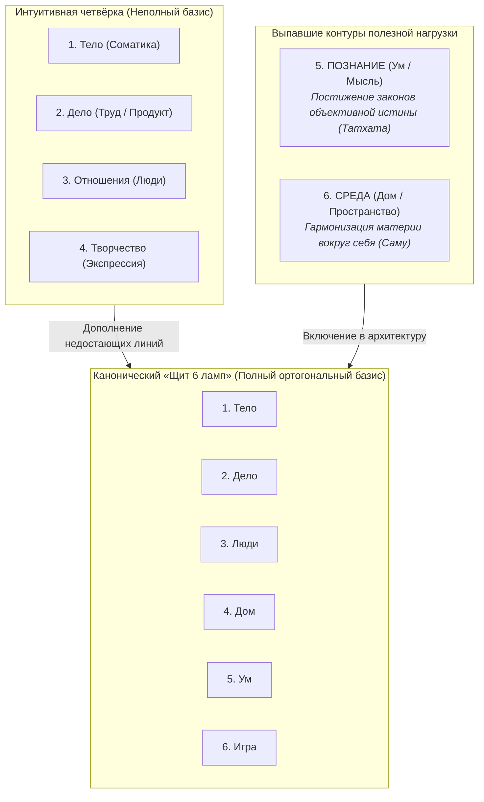
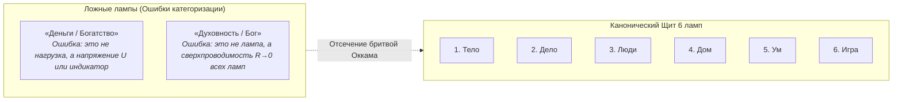

# Inner Current: 144. Щит из шести ламп бытия — Исчерпывающий базис нагрузки, разбор четвёрки и канон Кансо (почему ламп ровно 6, а не 4, 7 или 33)

> «Ни одна из ламп бытия не содержит готового счастья внутри себя. Лампочка — это всего лишь стекло и вольфрам, пассивная форма материи. Свечение рождается только тогда, когда сквозь неё из соматического генератора (Тандэна) протекает ток направленного внимания без омического сопротивления эго.»  
> — **Владимир Аньянов**

---

> [!abstract] Квинтэссенция
> Архитектура человеческого контура **Inner Current** устанавливает строгую электродинамическую и онтологическую аксиоматику нагрузки (Load):
> 
> 1. **Исчерпывающий базис полезной нагрузки — ровно 6 ламп («Щит 6 ламп бытия»):**
>    - **Тело:** соматический фундамент, дыхание, сон, мышечный тонус, физическое здоровье.
>    - **Дело (Мастерство):** производство ценности, прикладной продукт, код, ремесло, управление.
>    - **Люди (Близость):** прямой контакт «глаза в глаза» без масок, манипуляций и защитных игр эго.
>    - **Дом (Среда):** организация физического пространства, чистота инструментов, порядок вокруг себя.
>    - **Ум (Познание):** постижение объективных законов мироздания, чтение, научный поиск, логика.
>    - **Игра (Творчество):** чистая спонтанность без утилитарной корысти, юмор, музыка, праздник бытия.
> 2. **Неполнота интуитивной четвёрки:** бытовая модель *(Тело, Дело, Отношения, Творчество)* оставляет два слепых пятна — **Познание** (которое не является рыночным «Делом» и субъективным «Творчеством») и **Среду** (которая не сводится к уходу за биологическим «Телом» или профессиональному «Делу»).
> 3. **Канон Кансо (Бритва Оккама):** базис строго замкнут на числе 6. Умножение сущностей исключено:
>    - **Деньги** — не лампа, а индикатор потока и разность потенциалов ($U$).
>    - **Бог / Духовность** — не отдельная лампа на полке, а сам режим сверхпроводимости всего контура ($R_{\text{ego}} \to 0, I > 0$) при протекании тока через любую из ламп.

---

## 1. Проблема базиса нагрузки: Интуитивная четверка против Шестерки

В житейской интуиции человек часто пытается свести многообразие жизненной энергии к четырём крупным направлениям:
$$\text{Интуитивная четверка} = \{\text{Тело}, \, \text{Дело}, \, \text{Отношения}, \, \text{Творчество}\}$$

Этот костяк кажется логичным и привычным. Однако при строгом схемотехническом аудите вектора соматического внимания оператора ($I > 0$) обнаруживаются два фундаментальных слепых пятна:

---

## 2. Анализ выпавших контуров

### Контур 5: ПОЗНАНИЕ (Интеллектуальный контур / Ум / Мысль)
* **Почему Познание — это не «Дело»?**
  Дело (Мастерство) измеряется прикладной утилитарностью: написать работающую программу, построить мост, вылечить пациента, закрыть квартальный план. Его критерий — полезный продукт или услуга для внешнего мира. 
  Когда ученый, мыслитель или инженер часами вчитывается в фундаментальный научный трактат или решает математическое уравнение, он не производит коммерческого продукта. Его внимание замкнуто не на рыночный артефакт, а на постижение объективной структуры мироздания.
* **Почему Познание — это не «Творчество»?**
  Творчество (Игра) — это спонтанная субъективная экспрессия, праздник формы без диктата строгих правил (импровизация, танец, юмор). Познание же подчинено строгой объективной истине: физический закон нельзя «сочинить» по настроению, его можно только открыть. Это проникновение сквозь покров Майи к объективному факту реальности (*Татхата*).
* **Следствие слепоты:**
  Если в системе нет контура «Познание», исследовательский импульс человека остаётся без законного русла. Ток ума начинает циркулировать в паразитных петлях рефлексии, вызывая омический перегрев тревожности и экзистенциального тупика.

### Контур 4: СРЕДА (Пространственный контур / Материальное окружение / Дом)
* **Почему Среда — это не «Тело»?**
  Мытьё посуды, раскладывание инструментов по местам, чистка рабочего стола, уход за садом — это не биологический уход за организмом. Тело здесь выполняет лишь роль физического манипулятора.
* **Почему Среда — это не «Дело»?**
  Уборка комнаты или протирание монитора не преследует карьерных, статусно-иерархических или монетарных целей.
* **Следствие слепоты:**
  В дзэнской традиции этот контур возведён в абсолют — это **практика Саму (作務)**. Уход за материальным пространством вокруг себя — это не «бытовая рутина перед настоящей медитацией», а прямая практика присутствия. Оператор, живущий в материальном хаосе, непрерывно расходует ток внимания на подавление зрительного и пространственного шума.

---

## 3. Принцип Кансо (Бритва Оккама): Почему ровно 6 ламп, а не 7, 8 или 33

При отсутствии строгой онтологии перечень жизненных сфер легко раздуть до бесконечности: спорт, сон, еда, инвестиции, дети, друзья, чтение, ремонт, сад, хобби... Но дзен-инженерия опирается на принцип **Кансо (簡素 / священная простота)**:
$$\text{Базис нагрузки} = \text{Минимально необходимое} \land \text{Исчерпывающе достаточное}$$

Любая попытка добавить 7-ю или 8-ю лампу оказывается категорической ошибкой:

### Деконструкция псевдо-лампы «Деньги / Богатство»
В физике цепей деньги **не являются нагрузкой**. 
1. Деньги — это разность потенциалов ($U$) или мера потока монетарной энергии (как Биткоин), следствие корректной работы ламп **Дела** и **Среды**.
2. Деньги играют роль гидродинамического редуктора внешнего сопротивления среды, но сами по себе не способны излучать кванты радости.
3. Попытка сделать деньги самостоятельной лампой приводит к глухому короткому замыканию на фиатную абстракцию: внимание циркулирует не в физической реальности, а в виртуальных символах счёта, вызывая ожог проводки ($Q = I^2 R t$).

### Деконструкция псевдо-лампы «Духовность / Бог»
Выделение «духовности» в отдельную лампу — корневая ошибка средневековой схоластики и храмового фарисейства.
1. Как доказано в онтологии «Внутреннего тока», Бог или Духовность — это **не отдельный прибор на полке потребителей**.
2. Духовность — это **сам режим сверхпроводимости всего контура ($R_{\text{ego}} \to 0, I > 0$)** при протекании соматического тока сквозь **любую** из шести ламп:
   $$\text{Духовность} \equiv \left( R_{\text{ego}} \to 0 \right) \quad \forall \, \text{Lamps} \in \{1 \dots 6\}$$
3. Подметание пола в тишине присутствия ($R=0$) — абсолютно духовно. Чтение богословских книг с раздутой гордыней ($R_{\text{ego}} \gg 0$) — омический ад.

---

## 4. Сводная матрица «Щита 6 ламп бытия»

Шесть ламп образуют **полный ортогональный базис человеческого бытия**:

| № | Лампа бытия | Контур цепи | Физический смысл замыкания тока внимания | Диагностический вопрос оператора |
|---|---|---|---|---|
| **1** | **Тело** | Соматический | Дыхание диафрагмой, тонус мышц, сон, питание, движение, заземление. | *«Свободно ли моё дыхание и чувствую ли я тело прямо сейчас?»* |
| **2** | **Дело** | Трудовой | Производство осязаемой ценности, код, ремесло, управление, проект. | *«Делаю ли я текущую работу ради самого мастерства, без суеты?»* |
| **3** | **Люди** | Реляционный | Прямой контакт «глаза в глаза» без масок, манипуляций и защиты эго. | *«Вижу ли я живого человека перед собой, сбросив ментальный щит?»* |
| **4** | **Дом** | Пространственный | Наведение порядка в физическом окружении, чистота стола и инструментов. | *«Наведён ли кристальный порядок в точке пространства, где я нахожусь?»* |
| **5** | **Ум** | Интеллектуальный | Понимание фундаментальных законов мира, чтение, логика, исследование. | *«Направлен ли мой ум на постижение истины, а не на тревожную жвачку?»* |
| **6** | **Игра** | Творческий | Чистая спонтанность, созидание без прагматики, юмор, музыка, праздник. | *«Есть ли в моих сутках пространство для чистой, бесцельной радости?»* |

---

## 5. Вывод

«Щит из 6 ламп» — это не произвольный список сфер жизни из поп-психологии, а **математически полный и неизбыточный базис полезной нагрузки**. 

При таком щите перекос фаз исключён: соматическая энергия Тандэна находит совершенный баланс между внутренним храмом тела, материальным миром, другими людьми и простором мысли.

---

## 🔗 Связи
- [[02_Wiki/Inner Current (The Dual-Cable Architecture — Western Functional UI vs Zen Ontological Kernel)|143. Архитектура сдвоенного кабеля: Западный UI vs Дзенское ядро]]
- [[02_Wiki/Inner Current (Flashlight Circuit Alignment — Action-Gyō Load Triad and Deai Decoupling)|144. Схемотехника фонарика и согласование лада: Триада «Дело — Action — Гё»]]
- [[02_Wiki/Inner Current (The Nature of the Light Bulb and Zen Load)|17. Природа лампочки и закон нагрузки по канонам Дзена]]
- [[04_Maps/Inner Current MOC|Inner Current MOC]]
- [[index|Главный индекс LLM Wiki]]

---
*Created: 2026-09-30 | Maintained by Antigravity*
