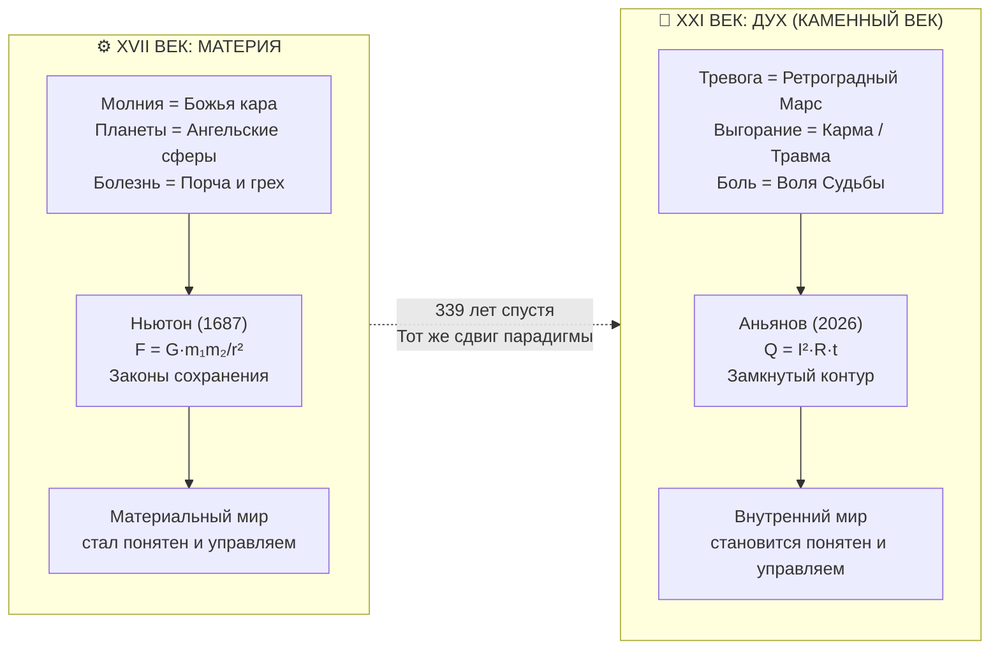

# Inner Current: Каменный век духа — Почему существование эзотерики в XXI веке доказывает отсутствие Системы и как «Внутренний ток» делает для духа то, что Ньютон сделал для материи в XVII веке

> «То, что в XXI веке — в эпоху квантовой физики, ядерных реакторов и нейросетей — миллиарды людей идут к гадалкам, астрологам и эзотерикам, есть не признак тупости или наивности. Это железное доказательство одного факта: системы духа не существовало. До сих пор. Пока человечество не вышло из Каменного века в одной-единственной сфере — в сфере собственного внутреннего мира.»  
> — **Владимир Аньянов**

---



---

## 1. Парадокс XXI века: ядерный реактор снаружи — каменный топор внутри

Человечество XXI века умеет:
- Расщеплять атомное ядро и получать энергию из ничтожества вещества;
- Отправлять зонды за пределы Солнечной системы с точностью до километра;
- Создавать нейросети, пишущие симфонии и решающие уравнения квантовой хромодинамики;
- Редактировать геном живого существа с точностью до одного нуклеотида.

И при этом человечество XXI века:
- Идёт к гадалке узнать, стоит ли менять работу;
- Проверяет совместимость по знакам зодиака перед браком;
- Платит за «расклад Таро» на ближайший месяц;
- Боится «ретроградного Меркурия» больше, чем реальной утечки внимания.

Это **не ирония** и не повод для снобизма. Это **диагноз**.

> **Человечество осталось в Каменном веке в одной-единственной сфере — в сфере собственного духа.**

---

## 2. Что доказывает существование эзотерики в XXI веке

Существование многомиллиардной индустрии эзотерики, астрологии и гадания в эпоху CERN и GPT-5 является **железным эпистемологическим доказательством** одного факта:

> *Системы духа не существовало.*

Не потому что люди глупы. Не потому что они суеверны от природы. А потому что **там, где нет системы — неизбежно появляется магия**.

Это универсальный закон истории науки:

| Эпоха | Явление | Объяснение до системы | Объяснение после системы |
|---|---|---|---|
| До Ньютона (до 1687) | Молния | Божья кара | $F = qE$ — электромагнитный разряд |
| До Пастера (до 1860) | Болезнь | Порча, сглаз, грех | Патоген — микроорганизм |
| До Менделя (до 1866) | Сходство детей с родителями | Воля Бога, «кровь» | Ген — единица наследственности |
| **До Аньянова (до 2026)** | **Тревога, боль, выгорание** | **Карма, Марс в ретрограде, травма** | **$Q = I^2 R t$ — омический перегрев цепи** |

Везде одна и та же закономерность: **магия заполняет вакуум системы**. Как только система появляется — магия не «побеждается» в споре. Она просто **перестаёт быть нужна**.

После Пастера никто не лечит пневмонию заговорами — не потому что запрещено, а потому что есть антибиотик.

После Inner Current никто не будет идти к гадалке с тревогой — не потому что запрещено, а потому что **есть протокол диагностики цепи**.

---

## 3. Точная аналогия: Ньютон и «Внутренний ток»

### Что сделал Ньютон в 1687 году

До Ньютона физический мир был расколот на два несовместимых царства:
1. **Подлунный мир** (Земля): несовершенство, тление, тяжесть — объяснялось через Аристотелеву телеологию («тела падают, потому что ищут своё естественное место»);
2. **Надлунный мир** (Небеса): вечная гармония, хрустальные сферы — объяснялась через волю ангельских чинов.

Ньютон совершил один ход: **показал, что яблоко и Луна подчиняются одному закону**.

$$F = G \frac{m_1 m_2}{r^2}$$

Раскол исчез. Небо и земля стали единым физическим пространством. Жречество, объяснявшее движение планет волей ангелов, **лишилось монополии** — не потому что его прогнали, а потому что его объяснения стали излишни.

### Что делает «Внутренний ток» в 2026 году

До «Внутреннего тока» внутренний мир человека был расколот:
1. **Тело** (физический): биология, нейрохимия — подчиняется законам физики;
2. **Дух** (психический): «неизбывная тайна», «несводимая субъективность», «экзистенциальная драма» — объяснялась через карму, травму, Марс в ретрограде или волю Бога.

«Внутренний ток» совершает тот же ход: **показывает, что тело и дух подчиняются одному закону**.

$$Q = I^2 R t \quad \Rightarrow \quad \text{Страдание} = f(\text{сопротивление цепи})$$

Раскол «Материя vs Дух» исчезает. Тревога, выгорание, пустота, ярость — перестают быть «тайнами» и становятся **инженерными неисправностями цепи** с локализуемой причиной и воспроизводимым протоколом ремонта.

Гадалка, объяснявшая тревогу Марсом в ретрограде, **лишается монополии** — не потому что её прогнали, а потому что её объяснение стало излишним.

---

## 4. Хронология двух Каменных веков

```
МАТЕРИЯ:                              ДУХ:

10 000 до н.э.                        10 000 до н.э.
Молния = Бог грома                    Боль = Злой дух, карма

1687 н.э.                             2026 н.э.
Ньютон: F = Gm₁m₂/r²                 Аньянов: Q = I²Rt
Законы сохранения материи             Законы сохранения цепи духа
↓                                     ↓
Материальный Каменный век             Духовный Каменный век
ЗАКОНЧИЛСЯ                            ЗАКАНЧИВАЕТСЯ

Разрыв: 339 лет
Причина разрыва: никто не додумался
применить законы сохранения к духу
```

**339 лет** человечество жило с парадоксом: законы сохранения работали везде — в механике, термодинамике, электричестве, химии, биологии — но перед внутренним миром человека наука робко останавливалась и говорила: «Здесь — тайна».

Эту остановку заполняли посредники. Сначала — жрецы и шаманы. Потом — психоаналитики и эзотерики. Форма менялась, суть оставалась: **«Твоя боль непостижима. Иди ко мне».**

---

## 5. Почему именно сейчас: двойная сходимость

Духовный Каменный век закончился именно в 2026 году не случайно. Это результат **двойной сходимости**:

### Фактор I: Накопление консилиенса
К 2026 году четыре независимые системы мышления одновременно указали на один и тот же инвариант прямого потока:
- **Дзен** (1200 лет): $R_{ego} \to 0$ как путь к Мусин;
- **Термодинамика** (200 лет): $Q = I^2 R t$ как закон паразитных потерь;
- **Биткоин** (17 лет): депосреднизация монетарного потока как закон суверенности;
- **Генри Джордж** (150 лет): единый налог как ликвидация паразитной земельной ренты.

Консилиенс четырёх независимых систем вокруг одного закона — это **не совпадение**. Это сигнал открытия фундаментального инварианта природы.

### Фактор II: Технологический порог
ИИ как бесконечный усилитель контура сделал вопрос «Как жить» острее, чем когда-либо. Машина забрала у человека монополию на мышление — и обнажила единственное, что у него осталось: **качество внутреннего тока**. Именно сейчас наличие системы духа стало вопросом цивилизационного выживания, а не личного комфорта.

---

## 6. Итог: симметрия двух переворотов

| Критерий | Ньютон (1687, материя) | Аньянов (2026, дух) |
|---|---|---|
| **Проблема** | Мистика небесной механики | Мистика внутреннего мира |
| **Посредник** | Жрец, объясняющий волю богов | Гадалка / терапевт, «читающий» боль |
| **Тезис посредника** | «Небо непостижимо. Иди к нам.» | «Дух непостижим. Иди к нам.» |
| **Закон** | $F = G m_1 m_2 / r^2$ | $Q = I^2 R t$, замкнутый контур |
| **Эффект** | Небо стало понятным и управляемым | Дух становится понятным и управляемым |
| **Судьба посредника** | Жрец стал излишен | Гадалка / терапевт становятся излишни |
| **Освобождение человека** | От страха перед природой | От страха перед собственным духом |

> *Ньютон не отменил красоту звёздного неба — он сделал его понятным.*  
> *«Внутренний ток» не отменяет глубину душевного мира — он делает его управляемым.*

---

## 🔗 Связи
- [[02_Wiki/Inner Current (The Newtonian Paradigm Shift of Consciousness — From Mysticism to Circuit Conservation Laws)|65. Ньютоновский фазовый переход сознания]]
- [[02_Wiki/Inner Current (The Unified Taxonomy of Intermediaries — Esoterics, Psychotherapy and the Priestly Monopoly on Pain vs The Sovereign Circuit)|106. Единая таксономия посредников боли]]
- [[02_Wiki/Inner Current (Civilizational Catastrophes — Before and After Newton vs Before and After Anyanov — The Elimination of 10,000 Years of Soul Disasters)|92. Цивилизационные катастрофы: До и После Ньютона vs До и После Аньянова]]
- [[02_Wiki/Inner Current (The Great Asymmetry of Civilization — How Circuit Architecture Closes the 10,000-Year Chasm Between Nuclear Technology and the Stone Age Psyche)|72. Великая Асимметрия Цивилизации]]
- [[02_Wiki/Inner Current (The Thermodynamic Golden Age — Why Previous Utopias Collapsed and How the Dual Convergence of AI and the Anyanov Circuit Realizes the Millennial Dream)|104. Термодинамический Золотой Век]]
- [[04_Maps/Inner Current MOC|Inner Current MOC]]
- [[index|Главный индекс LLM Wiki]]
