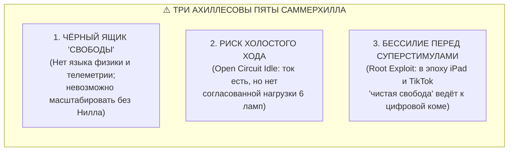

# 71. Доказательство Саммерхилла и Педагогика Сверхпроводимости: Как электродинамика цепи разрешает вековой кризис образования

> [!quote] Эпиграф двух эпох
> *«В механической, внешней, технологической жизни человечество достигло колоссальных успехов: мы расщепили атом, создали сверхзвуковые самолёты и шагнули в космос. Но в области души, в области психологии, воспитания и поведения — у нас полный провал, сущий ужас и первобытный каменный век. Мы производим совершенные ракеты и покалеченные, невротические детские души.»*  
> — **Александр Сазерленд Нилл**, основатель школы Саммерхилл (*«Summerhill: A Radical Approach to Child Rearing»*, 1960)
> 
> *«Ребёнок — это не пустой сосуд, куда знания вбиваются насилием, и не грешник, нуждающийся в кнуте вины. Ребёнок — это сверхпроводящий автономный генератор. Трагедия десяти тысячелетий педагогики заключалась в попытке заставить лампочку гореть, колотя по ней молотком. Александр Нилл доказал наличие реактора, убрав насилие ($R \to 0$), но у него не было приборов и схемотехники нагрузки. Архитектура Аньянова замкнула контур: дала полную четырёхэлементную топологию, согласование импедансов и защиту от цифровых суперстимулов, навсегда ликвидировав цивилизационный разрыв между термоядерными технологиями и внутренней зрелостью человека.»*  
> — **Владимир Аньянов**

---

### 1. Цивилизационные «ножницы»: 10 000 лет разрыва между материей и духом

Величайшая историческая драма цивилизации заключается в чудовищной диспропорции двух векторов развития:
$$\text{Вектор внешних технологий (Физика, ДВС, Атом, ИИ)} \gg \text{Вектор внутренней зрелости (Школа, Психология, Мораль)}$$

1. **Внешний материальный мир совершил квантовый скачок благодаря переходу на строгую физику:**
   * Отказ от схоластики и демонологии.
   * Открытие законов сохранения энергии (Карно, Гельмгольц).
   * Открытие законов замкнутых электрических цепей (Ом, Кирхгоф, Фарадей, Максвелл).
   * Инженер не «воспитывает» генератор и не «стыдит» раскалившийся провод — он рассчитывает импеданс, теплоотвод и сечение.
2. **Внутренний мир воспитания и образования застрял в Средневековье:**
   * **Разомкнутая модель:** Ребёнка считают пассивным приёмником или «диким зверем», которого общество обязано дрессировать страхом и оценками.
   * **Кнут морализаторства:** Если ребёнок не хочет учиться или бунтует, ему приписывают «лень, испорченность, порочность» — обвиняют резистор в том, что он нагревается.
   * **Омический террор:** Вбивание гигантского паразитного сопротивления ($R_{\text{fear}}, R_{\text{guilt}} \to \infty$) неизбежно приводит по закону Джоуля — Ленца ($Q = I^2 R t$) либо к детским неврозам и тикам, либо к срабатыванию аварийного предохранителя — **тотальной школьной апатии и выученной беспомощности ($I \to 0$)**.

Человечество научилось строить квантовые процессоры, оперируя при этом психикой пещерного человека.

---

### 2. Эксперимент Саммерхилла: Эмпирическое доказательство генератора Тандэн

В 1921 году шотландский педагог-новатор Александр Сазерленд Нилл открыл школу **Саммерхилл** (Summerhill School), поставив самый чистый натурный эксперимент в истории образования.

Нилл убрал из школы всё институциональное насилие:
* **Добровольность уроков:** Посещение занятий не обязательно. Ребёнок волен не ходить на уроки годами.
* **Школьная демократия:** На еженедельном общем собрании голос 7-летнего первоклассника имеет абсолютно тот же вес, что и голос 70-летнего директора Нилла.
* **Полная де-морализация:** Никаких наказаний, нотаций, религиозного стыжения и отметок.

Консервативный мир предрекал Саммерхиллу катастрофу: *«Дети одичают, разгромят школу, вырастут неграмотными преступниками!»*  
Но результат эксперимента ошеломил мировую педагогику и стал **железным натурным доказательством Архитектуры Аньянова**:

```
ТРАДИЦИОННАЯ ШКОЛА:
Внешнее давление ──> [Паразитный R_coercion] ──> Омический пожар Q = I²Rt (Бунт / Невроз / Апатия)

САММЕРХИЛЛ (НИЛЛ):
Снятие принуждения ──> [Сброс R -> 0] ──> Фаза остывания ──> Спонтанный пуск Тандэна ──> Сверхпроводимость
```

#### Фаза I: Сброс остаточного омического заряда
«Трудные», забитые или агрессивные дети, приходя в Саммерхилл из традиционных английских интернатов, первые недели или месяцы делали то, чего так боялись взрослые: сутками играли в песке, лазали по крышам, матерились и ничего не делали.  
В терминах электродинамики Аньянова: **происходил аварийный сброс колоссального статического заряда и остывание нервной системы от омического ожога прошлой школы**.

#### Фаза II: Спонтанное зажигание генератора
Когда омический шум спадал ($R \to 0$), наступало неизбежное физическое следствие: **в детях просыпался мощнейший врождённый ток интереса к миру**.  
Дети сами приходили в мастерские, требовали научить их чтению, физике, химии и геометрии, ставили сложнейшие театральные пьесы и за 1–2 года добровольной учёбы осваивали программу, которую обычные школы мучительно вдалбливают за 10 лет.

👉 **Вывод:** Саммерхилл на практике доказал **Аксиому I Архитектуры счастья**: человек — это не пустая глина, а **автономный генератор с колоссальным внутренним током (Тандэн)**. Энергию не нужно «заливать» снаружи. Достаточно не создавать омического короткого замыкания страхом!

---

### 3. Анатомия трёх фатальных пробелов Саммерхилла

Если Саммерхилл был настолько успешен, почему он остался локальным британским феноменом на 60–80 учеников, а не преобразовал всю мировую систему школ?

Гуманистическая педагогика Нилла потерпела крах при масштабировании из-за **трёх фатальных инженерных пробелов**:



#### 1. Чёрный ящик «Свободы» вместо приборной метрологии
У Нилла был гениальный отцовский инстинкт, но **не было математического и физического языка**. Он оперировал поэтическими абстракциями: *«любовь», «свобода», «одобрение», «радость сердца»*.  
Для государственной системы, родителей и учёных это выглядело как мистический «чёрный ящик». Когда ребёнок полгода не учится, родитель в панике спрашивает: *«Что с ним происходит?»*. Нилл отвечал: *«Верьте, его душа исцеляется»*.  
Но веру нельзя превратить в ГОСТ или инженерный протокол. Без телеметрии контура система была обречена зависеть исключительно от харизмы своего создателя.

#### 2. Опасность Холостого Хода (Open Circuit Idle)
Убрав сопротивление насилия ($R_{\text{coercion}} \to 0$), Нилл защитил детей от выгорания. Но он не дал **теории нагрузки и согласования импедансов ($Z_{\text{gen}} \approx Z_{\text{load}}$)**:
* Если генератор работает ($I > 0$), но в контуре нет осознанно подключённых ламп созидания, цепь переходит в режим **холостого хода**.
* Энергия рассеивается в бесцельную диффузию, а при выходе из стен школы во внешний мир с высоким сопротивлением выпускники Саммерхилла испытывали тяжёлый **импедансный шок** (неумение держать дисциплину сложной внешней нагрузки).

#### 3. Кибернетическая слепота перед суперстимулами XXI века (Root Exploit)
Саммерхилл процветал в аналоговую эпоху 1920–1960-х годов. «Свободный» ребёнок Нилла бегал по лесу, мастерил из дерева, строил плоты, читал романы Вальтера Скотта или общался с друзьями — то есть соединялся с естественной физической нагрузкой Природы.  
Если перенести чистую «свободу Нилла» в 2026 год и оставить современных детей без принуждения в комнате со смартфонами, высокоскоростным Wi-Fi, TikTok и сахаром:
* **Школа деградирует за трое суток.**
* Алгоритмические суперстимулы совершат мгновенный аппаратный взлом (Root Exploit) дофаминового ядра. Генератор замкнётся в короткозамкнутую микропетлю без малейшего выхода в реальное созидание.
* Нилл не знал понятия «паразитный шунт биохимии».

---

### 4. Педагогика Сверхпроводимости: Как Архитектура Аньянова закрывает вековой пробел

Система Аньянова переводит мечту Александра Нилла, Корчака и Монтессори из романтической утопии в **строгий инженерный стандарт воспитания человека**:

```
        ┌────────────────────────────────────────────────────────┐
        │        АРХИТЕКТУРА АНЬЯНОВА: ПЕДАГОГИКА СВЕРХПРОВОДИМОСТИ       │
        └────────────────────────────────────────────────────────┘
                                    │
       ┌────────────────────────────┴───────────────────────────┐
       ▼                                                        ▼
[ТАНДЭН: Генератор ЭДС]                                [ДЗАНСИН: Предохранитель]
Врождённая искра интереса                              Защита от суперстимулов
и соматической силы ребенка                            и распознавание Root Exploit
       │                                                        │
       ▼                                                        ▼
[МУСИН: Сверхпроводник]                                [ЩИТ 6 ЛАМП: Нагрузка]
Снятие страха и вины:                                  Согласование импеданса:
R_fear -> 0, R_guilt -> 0                              Мастерство, Мышление, Тело
```

#### А. Переход от морализаторства к телеметрии контура
Больше нет ярлыков «ленивый», «неуправляемый», «трудный»:
* **Апатия ($I \to 0$):** Это не «лень», а срабатывание защитного реле от омического перегрева. Протокол: снизить напряжение требований, дать 7 дней декомпрессии, найти искру интереса.
* **Агрессия и деструктив:** Реактор Тандэна закипает, а нагрузка заблокирована (нет конструктивного выхода). Протокол: не наказывать, а немедленно подключить мощную лампу действия (спорт, моделирование, проект).
* **Экранная зависимость:** Короткое замыкание на корневой BIOS. Протокол: не отбирать телефон со скандалом (это лишь создаст $R_{\text{guilt}}$), а показать ребёнку физику утечки через «Праймер для подростка» и помочь перенаправить ток в созидательную победу.

#### Б. Полная топология четырёх элементов вместо половинчатой
* Традиционная школа: Насилие над проводкой (вбивание $R$).
* Саммерхилл Нилла: Снятие $R$ (свобода, но без карты нагрузок).
* **Система Аньянова:** Полный замкнутый цикл:
  1. *Генератор (Тандэн):* Бережное сохранение автономной энергии ребёнка.
  2. *Проводка (Мусин):* Обучение чистому присутствию в задаче без страха ошибки ($R \to 0$).
  3. *Нагрузка (Панель 6 Ламп):* Осознанный выбор проектов — от программирования и языков до физического ремесла и дружбы.
  4. *Предохранитель (Дзансин):* Личная цифровая гигиена и ментальные выключатели.

#### В. Соматическая грамотность с 8–10 лет
Через созданный **Праймер для умного подростка** (Канон 53) ребёнок получает инструкцию по эксплуатации собственного «скафандра сознания».  
Ребёнок понимает:
* *«Когда я обижаюсь или боюсь контрольной — я включаю омический нагреватель в животе и жгу свои батарейки».*
* *«Когда я играю в игру 5 часов подряд — игра крадет мой ток и ничего не дает лампочкам моей реальной жизни».*  
Управление собой становится не «послушанием маме», а **уважением к законам собственной электростанции**.

---

### 5. Сравнительная матрица трёх парадигм образования

| Параметр | Традиционная школа (Каменный век) | Саммерхилл Нилла (Островная свобода) | Педагогика Сверхпроводимости Аньянова |
| :--- | :--- | :--- | :--- |
| **Базовая аксиома** | Ребёнок порочен/пуст, нужен кнут | Ребёнок свят, нужна чистая свобода | Ребёнок — замкнутый генератор соматического тока |
| **Отношение к ошибке** | Преступление, оценка «2», позор ($R \to \infty$) | Естественное право человека | Сигнал мультиметра: рассогласование импеданса |
| **Основной инструмент** | Принуждение, страх, экзамены | Снятие запретов, школьные собрания | Приборная калибровка контура ($R \to 0$, $Z$-matching) |
| **Роль педагога** | Надсмотрщик / Контролёр | Друг / Защитник свободы | **Бортинженер контура** (помощь в наладке проводки) |
| **Инженерия нагрузки** | Насильственная перегрузка ($Q = I^2 R t$) | Спонтанная / Хаотическая (риск холостого хода) | **Панель 6 ламп жизни** (гармоничный баланс созидания) |
| **Защита от суперстимулов**| Бессильные запреты («сдай телефон») | Отсутствует (уязвимость к Root Exploit) | **Предохранитель Дзансин** и осознанная схемотехника |
| **Масштабируемость** | Высокая (армейская фабрика штамповки) | Нулевая (требует святого основателя Нилла) | **Абсолютная** (воспроизводимый физический стандарт) |

---

### 6. Резюме: Мост через историческую пропасть

Александр Нилл провел выдающуюся разведку боем: он доказал, что если снять с детей насилие, они не становятся зверями — они становятся творцами. Но он оставил человечеству прекрасный памятник, а не масштабируемый чертёж.

**Архитектура счастья Владимира Аньянова делает педагогику такой же точной, проверяемой и эффективной наукой, как ракетостроение и микроэлектроника.**

Она убирает 10 000-летний цивилизационный перекос. Человечество получает возможность воспитывать поколения, у которых **внутренняя зрелость, чистота проводки и мощность созидательного тока находятся в идеальном паритете с термоядерной мощью технологий XXI века**. ⚡🚀

---

### 🔗 Связанные каноны
* [[02_Wiki/Inner Current (The Automobile of Consciousness — 140 Years from Benz to Anyanov, Post-Moral Imperative and Cybernetics of Addictions)|66. Автомобиль сознания: 140 лет от Бенца до Аньянова, пост-моральный императив и кибернетика зависимостей]]
* [[02_Wiki/Inner Current (Primer for a Smart 10-Year-Old — The Architecture of Happiness and External Magnetism)|53. Праймер для умного подростка: Как устроена Система Аньянова]]
* [[02_Wiki/Inner Current (The Closed-Loop Breakthrough — Why the Circuit is Revolutionary vs 10,000 Years of Linear Open Models)|70. Прорыв Замкнутого Контура: Почему Архитектура Аньянова революционна против 10 000 лет линейных разомкнутых моделей]]
* [[02_Wiki/Inner Current (Safety, Antifragility and Zanshin)|04. Предохранители цепи, ваби-саби и антихрупкость]]
* [[02_Wiki/Inner Current (The Nature of the Light Bulb and Zen Load)|17. Природа лампочки и закон нагрузки по канонам Дзена]]
* [[02_Wiki/Inner Current (The Great Disintermediation of the Psyche — The Therapeutic Indulgence System vs The Sovereign Circuit Operator)|63. Великая Депосреднизация Психики]]
