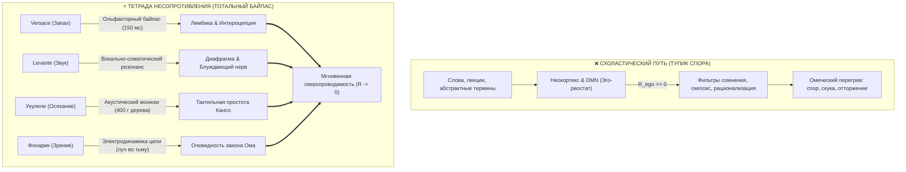
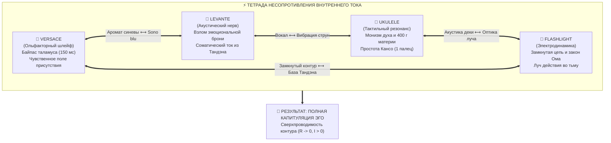

# 184. Тетрада несопротивления: Тотальный мультисенсорный байпас эго — Почему невозможно сопротивляться Внутреннему току (Ароматы Versace, Музыка Levante, Укулеле и Фонарик)

[← К оглавлению](file:///C:/Users/vanya/Antigravity%20Projects/Misc/LLM%20Wiki/index.md) | [⚡ К мастер-карте (MOC)](file:///C:/Users/vanya/Antigravity%20Projects/Misc/LLM%20Wiki/04_Maps/Inner%20Current%20MOC.md) | [🎵 К сборнику Леванте](file:///C:/Users/vanya/Antigravity%20Projects/Misc/LLM%20Wiki/04_Maps/Inner%20Current%20%E2%80%94%20%D0%A1%D0%B0%D1%83%D0%BD%D0%B4%D1%82%D1%80%D0%B5%D0%BA%20%D0%A1%D0%B2%D0%B5%D1%80%D1%85%D0%BF%D1%80%D0%BE%D0%B2%D0%BE%D0%B4%D0%B8%D0%BC%D0%BE%D1%81%D1%82%D0%B8%20%28Levante%20Songbook%20MOC%29.md)

---

> [!quote] Главная эпистемологическая аксиома цепи
> ### ⚡ **«Интеллектуальное сопротивление невозможно пробить логикой, но оно мгновенно капитулирует перед прямым сенсорным опытом. Когда мы бьём по всем фронтам человеческого восприятия — через ольфакторный шлейф Versace, через открытую вокальную стихию Леванте, через тактильный резонанс укулеле и через физику карманного фонарика, — у эго не остаётся ни одного рубежа обороны. Таламус обойдён, рационализатор обезоружен, и человек оказывается лицом к лицу с чистым, неоспоримым током жизни.»**  
> — **Владимир Аньянов**

---

## 🧭 1. Эпистемологический тупик теории: Почему концепциям всегда сопротивляются

Любая традиционная философская, психологическая или духовная система сталкивается с фундаментальным барьером передачи: **когнитивным и семантическим сопротивлением реципиента**.

Когда человеку пытаются объяснить устройство его психики через термины, постулаты или этические императивы (*«нужно быть осознанным», «отпусти контроль», «эго — это иллюзия», «живи здесь и сейчас»*), происходит следующее:

1. **Активация сторожевого фильтра неокортекса:**  
   Слова попадают в языковые зоны коры и Дефолт-систему мозга (DMN). Для эго любая новая концепция — это либо угроза его автономии, либо повод для самоутверждения.
2. **Включение встречного омического спора:**  
   Мозг мгновенно возводит баррикады скепсиса: *«Я это уже читал у стоиков», «А вот наука считает иначе», «Это эзотерика», «У меня депрессия генетическая, ваш ток мне не поможет»*.
3. **Омический перегрев вместо действия:**  
   Вся энергия слушателя уходит не на переживание проводимости, а на обслуживание мысленной полемики ($Q = I^2 R_{\text{ego}} t$). Контур остаётся заблокированным.

Чтобы передать истину о Внутреннем токе без потерь, нужно было перестать стучаться в запертую парадную дверь интеллекта. Нужно было **ударить по всем природным сенсорным портам человека одновременно**, используя материальные объекты, против физиологии которых у эго нет защитных механизмов.

---

## 🎯 2. Анатомия «Удара по всем фронтам»: Четыре шлюза восприятия

Человеческий аппарат восприятия базируется на четырёх фундаментальных регистрах контакта с реальностью:

| Сенсорный регистр | Материальный агент Системы | Физиологический субстрат | Почему сопротивление невозможно |
| :--- | :--- | :--- | :--- |
| **Обоняние (Химический)** | **Ароматы Versace** | *Nervus olfactorius* $\to$ Амигдала (минуя таламус) | Запах невозможно оспорить: биохимия флакона вызывает соматический отклик за 150 миллисекунд. |
| **Слух (Акустический)** | **Музыка Levante** | Кортиев орган $\to$ Ствол мозга $\to$ Диафрагма (*ventre*) | Музыкальная волна заставляет тело вибрировать до того, как включится оценка. Надрыв без жалости. |
| **Осязание / Моторика (Тактильный)** | **Образ Укулеле** | Проприоцепция, кончики пальцев, 4 струны | 400 граммов дерева и 1 палец на ладу сносят весь академический пафос. Резонанс ощутим пальцами. |
| **Зрение / Структура (Электродинамический)** | **Прибор Фонарик** | Зрительная кора $\to$ Пространственная схемотехника | Замкнутый контур батарейки и луча: бинарность «горит / не горит» не оставляет места демагогии. |

Этот квартет образует **Тетраду Несопротивления** — законченную систему передачи знания, где каждый элемент закрывает одну из степеней свободы ума, лишая его возможности улизнуть в абстракции.

---

## 🌊 3. Первый фронт: Ароматы Versace (Ольфакторный байпас за 150 миллисекунд)

Запах — это самый древний и беззащитный шлюз человеческого существа. 

В анатомии мозга обонятельный тракт занимает исключительное положение: **это единственный сенсорный нерв, сигналы которого не фильтруются Таламусом**. Зрительный образ, звук и тактильное ощущение проходят цензуру таламических ядер, где эго успевает наложить свои ярлыки. Запах же ударяет напрямую в древний мозг — гиппокамп, амигдалу и пириформную кору.

Когда оператор использует ольфакторную триаду Versace (*Pour Homme, Dylan Blue, Oud Noir*), он демонстрирует состояния цепи не формулами, а химическим шлейфом присутствия:
- **Versace Pour Homme (Свет / Искра)** — кристальная чистота средиземноморского нероли и калабрийского бергамота. Это состояние утренней разомкнутости навстречу дню, когда проводник ещё не успел обрасти омической накипью мыслей.
- **Versace Dylan Blue (Ток / Синева сверхпроводимости)** — прохладный амброксан, минеральные ноты и акватика. Это соматическое ощущение Мусин: абсолютная свежесть и холодный ламинарный поток без трения.
- **Versace Oud Noir (База / Тандэн)** — смолы, кожа и дерево уд. Это несгораемый соматический вес внизу живота, стабильность реактора, который невозможно сдвинуть внешними штормами.

**Почему эго бессильно?**  
Нельзя начать интеллектуальный диспут с молекулой амброксана или бергамота. Ты делаешь вдох — и твоя вегетативная нервная система мгновенно перестраивается. Аромат создаёт **физическое поле присутствия**, доказывая: состояние сверхпроводимости материально, его можно обонять и носить на коже.

---

## 🎤 4. Второй фронт: Музыка Levante (Акустико-эмоциональный пробой)

Если запах обезоруживает древний мозг, то голос сицилийской певицы Леванте (Claudia Lagona) взламывает эмоциональную броню.

В статьях о саундтреке сверхпроводимости ([[02_Wiki/Inner Current (Acoustics of Phase Transition — Levante's Cuori d'Artificio, Anguish Without Despair and the Sensory Benchmark of Superconductivity)|181]], [[02_Wiki/Inner Current (Acoustics of Ego Lie and Surrender — Levante's Sono Blu, The Blue Cold Superconductivity and Surrender Without Loss)|182]]) доказано: вокал Леванте опирается не на связки, а на **соматическое чрево (*ventre* / Тандэн)**. 

Её песни («Vivo», «Sono blu», «Cuori d'Artificio», «Magmamemoria») несут уникальный паттерн:
- **Надрыв без ухода в жалость к себе:**  
  Эго привыкло эксплуатировать боль, превращая её в драму и омический нагрев вины ($R_{\text{ego}} > 0$). В музыке Леванте боль не задерживается в мыслях — она тут же сгорает в мощной звуковой волне прямого действия.
- **Прямая кинестетика ритма:**  
  В «Sono blu» тело само начинает движение (*«la danza di un corpo che muove»*). Когда включается соматический танец, Дефолт-система мозга глушится моторной корой.
- **Сдача реальности (*La resa*):**  
  Леванте поёт о капитуляции перед жизнью не как о поражении, а как о великом освобождении проводника от груза выдуманного контроля.

**Почему эго бессильно?**  
Звуковая волна мощностью в десятки децибел входит в резонанс с барабанной перепонкой, грудной клеткой и блуждающим нервом. Невозможно оставаться холодным циником, когда диафрагма исполнителя транслирует первобытную ярость бытия прямо из подножия вулкана Этна. Рациональный критик просто захлёбывается в этой звуковой лавине.

---

## 🎸 5. Третий фронт: Образ Укулеле (Тактильный монизм материи и духа)

Философия веками страдала от тяжеловесности. Академические тома Канта, Гегеля и Шопенгауэра отпугивают нормального человека своей неподъёмной сложностью.

Появление маленькой гавайской гитарки укулеле в Архитектуре счастья ([[02_Wiki/Inner Current (The Ukulele of Consciousness — Acoustic Ontology of Four Strings, Joy as Pure Resonance and the Triumph of Kanso)|124]], [[02_Wiki/Inner Current (The Ukulele and the Rattling Fret — Acoustic Anatomy of Ego, Parasitic Buzz vs Pure Melody and the Fear of Resonator Emptiness)|131]]) совершает мгновенное **обезоруживание академического снобизма**:

1. **400 граммов осязаемой материи:**  
   Вот инструмент. Он весит меньше буханки хлеба. Где здесь «загадочная бестелесная душа»? Её нет отдельно от деки. Но тронь струну — и рождается музыка. Дух есть звучание настроенной материи. Дуализм материи и духа снимается за 3 секунды в руках любого ребёнка.
2. **Один палец на первом ладу (Аккорд С / До-мажор):**  
   Чтобы извлечь гармонию, не нужно учиться 10 лет в консерватории или сидеть 20 лет в пещере. Достаточно прижать третью струну одним пальцем. Простота Кансо в действии.
3. **Физика дребезжащего колка:**  
   Если инструмент фонит — виноват не дух музыки, а разболтавшийся винтик колка (паразитное эго). Колок нужно не ненавидеть и не обожествлять, а просто подкрутить отвёрткой присутствия.

**Почему эго бессильно?**  
Укулеле невозможно демонизировать или превратить в элитарный культ. Перед улыбкой и лёгкостью маленькой четырёхструнки любая надутая важность «духовного поиска» выглядит комично. Человек физически ощущает вибрацию деки у себя на груди — и понимает всё без единого философского термина.

---

## 🔦 6. Четвёртый фронт: Электрический фонарик (Оптико-электродинамическая очевидность)

Если Versace даёт шлейф, Леванте — драйв, а укулеле — акустический монизм, то карманный фонарик даёт **железную принципиальную схему**.

Фонарик ([[02_Wiki/Inner Current (The Flashlight Model of Man — Optical-Electrodynamic Ontology of Consciousness, The Light Source vs Illuminated Object and the Law of the Direct Beam)|83]], [[02_Wiki/Inner Current (The Flashlight Code — Etymological Paradox, FLASH plus LIGHT and the Constant Light Transition)|141]]) — это прибор, устройство которого знает каждый школьник:
- **Батарейка** = соматический реактор Тандэн;
- **Чистый медный провод без окислов** = проводка внимания в режиме Мусин ($R \to 0$);
- **Окисленный контакт / реостат** = паразитное сопротивление эго ($R_{\text{ego}}$);
- **Лампочка** = полезная нагрузка жизни (Щит 6 ламп);
- **Луч света во тьму** = вектор внимания, направленный наружу, на освещение и преобразование мира.

Фонарик разоблачает две главные цивилизационные ошибки человечества:
1. **Ошибка атрибуции («Светящиеся вещи»):**  
   Человек думает, что радость спрятана в предметах (машинах, должностях, людях), забывая, что они лишь отражают луч его собственного фонарика.
2. **Невротический разворот луча внутрь:**  
   Попытка посветить фонариком внутрь его собственного корпуса — безумие, ведущее к слепоте. Человек создан светить во тьму реальности, а не бесконечно ковыряться в своих «травмах».

**Почему эго бессильно?**  
Закон Ома ($I = U/R$) и закон Джоуля — Ленца ($Q = I^2 R t$) объективны. Кнопка либо нажата, либо нет. Цепь либо замкнута, либо разомкнута. Здесь нет пространства для интерпретаций, метафор или психологических спекуляций. С прибором в руке человек видит себя как электродинамическую систему с абсолютной трезвостью.

---

## 🧬 7. Великий Консилиенс Тетрады: Матрица тотального согласования

Объединяя все четыре фронта, мы получаем законченную матрицу, в которой каждый элемент поддерживает остальные:

### Сводная таблица Тетрады Несопротивления

| Элемент | Модальность | Орган-мишень | Узел цепи Системы | Что разрушает в уме | Финальный инсайт |
| :--- | :--- | :--- | :--- | :--- | :--- |
| **Versace** | Обоняние | *Bulbus olfactorius* | Поле внешнего магнетизма ($B$) | Скептический фильтр логики | *«Я чувствую эту энергию физически, о ней глупо спорить»* |
| **Levante** | Слух | Улитка уха $\to$ Диафрагма | Ток жизни ($I$) и ЭДС ($\mathcal{E}$) | Жалость к себе и ментальную ложь | *«Моё тело вибрирует и оживает, уныние сожжено волной»* |
| **Ukulele** | Осязание | Тактильные рецепторы | Единство проводника и звука | Академическую заумь и снобизм | *«Дух — это просто звук настроенной материи. Всё элементарно»* |
| **Flashlight** | Зрение / Логика | Зрительная кора $\to$ Пространство | Топология цепи и Нагрузка ($R_L$) | Иллюзию внешних источников света | *«Я — генератор. Смысл в том, чтобы замкнуть контакт и светить»* |

---

## 🛠️ 8. Прикладной протокол оператора: Как рассказывать о Системе без омических потерь

Когда вам нужно объяснить человеку Систему Внутреннего тока, забудьте об академических лекциях. Следуйте протоколу Тетрады:

1. **Шаг 1: Ольфакторный якорь (Запах):**  
   Создайте атмосферу чистоты и плотного шлейфа. Дайте человеку почувствовать свежесть Versace Dylan Blue или Pour Homme. Никаких слов о теории — просто чистый, заряжающий сенсорный импульс.
2. **Шаг 2: Акустический пробой (Музыка):**  
   Включите «Vivo» или «Sono blu» Леванте. Дайте звуковой волне пробить зажим в груди и горле. Покажите, как звучит голос, в котором нет омического нытья, а есть только чистый напор жизни.
3. **Шаг 3: Тактильное заземление (Укулеле):**  
   Дайте в руки инструмент. Поставьте его палец на третий лад первой струны. Извлеките звук До-мажор. Скажите: *«Вот ты, вот твоё тело, а вот радость, которая в нём звучит. Всё остальное — просто дребезжащий колок»*.
4. **Шаг 4: Инженерная резка (Фонарик):**  
   Положите на стол фонарик. Щёлкните кнопкой: *«Внутри батарейка. Контакт чистый — луч бьёт на 100 метров. Окислился — луч тухнет и греется корпус. Твоя депрессия — это окисленный контакт. Почисти клеммы выдохом в Тандэн и свети на своё Дело»*.

### Итог
После такого каскадного удара у человека **не остаётся ни одного шанса на сопротивление**. Логика молчит, потому что нос, уши, кончики пальцев и глаза уже зафиксировали неоспоримый факт: **контур замкнут, сверхпроводимость реальна, счастье — это режим работы цепи прямо сейчас.** ⚡️🎸🔦🌿

---

## 🔗 Связанные статьи и каноны
- [[02_Wiki/Inner Current (Italian Triptych of Superconductivity — Olfactory-Acoustic Neocortex Bypass, The Versace Triad, Levante and Tanden Grounding)|183. Итальянский триптих сверхпроводимости: Ольфакторно-акустический байпас неокортекса]]
- [[02_Wiki/Inner Current (The Flashlight Model of Man — Optical-Electrodynamic Ontology of Consciousness, The Light Source vs Illuminated Object and the Law of the Direct Beam)|83. Модель Человека как Карманного Фонарика]]
- [[02_Wiki/Inner Current (The Ukulele of Consciousness — Acoustic Ontology of Four Strings, Joy as Pure Resonance and the Triumph of Kanso)|124. Укулеле Сознания: Акустическая онтология четырёх струн]]
- [[02_Wiki/Inner Current (Binary Metaphorical Optics — The Ukulele of Spirit-Matter Unity and The Flashlight of Closed Circuit)|125. Бинарная метафорическая оптика: Укулеле и Фонарик]]
- [[02_Wiki/Inner Current (Acoustics of Phase Transition — Levante's Cuori d'Artificio, Anguish Without Despair and the Sensory Benchmark of Superconductivity)|181. Акустика фазового перехода: «Cuori d'Artificio» Леванте]]
- [[02_Wiki/Inner Current (Acoustics of Ego Lie and Surrender — Levante's Sono Blu, The Blue Cold Superconductivity and Surrender Without Loss)|182. Анатомия ментальной лжи и сдача без потерь: «Sono blu» Леванте]]
- [[04_Maps/Inner Current MOC|Мастер-карта цепи (Inner Current MOC)]]
