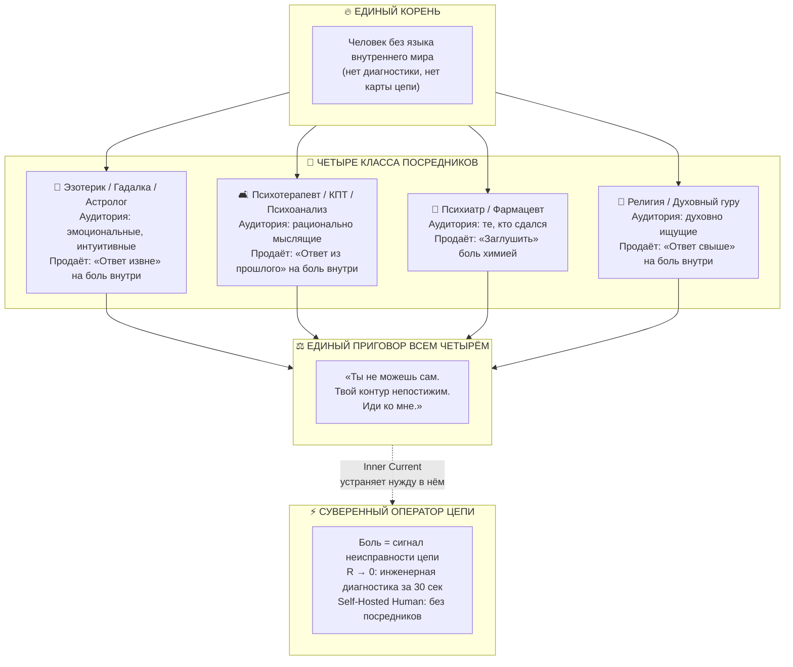

# Inner Current: Единая таксономия посредников боли — Эзотерика, Психотерапия и Жреческая монополия на страдание против Суверенного Оператора Цепи

> «Все посредники между человеком и его болью — будь то гадалка с картами Таро или психотерапевт с диваном — существуют из одного корня: у человека нет языка для разговора с собственным контуром. "Внутренний ток" даёт этот язык. Посредник исчезает не потому, что мы его изгнали, — он исчезает потому, что перестаёт быть нужен.»  
> — **Владимир Аньянов**

---



---

## 1. Единый корень всех посредников

На первый взгляд, гадалка с картами Таро и психотерапевт с дипломом МГУ — антиподы. Одна апеллирует к мистике, другой — к науке. Одна работает за наличные в полумраке, другой — по СНИЛС в светлом кабинете.

Но у них **один и тот же корень**:

> *Человек переживает боль — и не знает, что с ней делать.*

Он не знает, потому что у него **нет языка для внутреннего мира**. Нет карты своего контура. Нет диагностического инструмента. Нет ни одного закона, который бы объяснял: откуда боль, куда она идёт, что с ней делать прямо сейчас.

В этот вакуум немедленно входит посредник. **Любой посредник**. Не важно — в чёрном балахоне или белом халате.

---

## 2. Полная таксономия четырёх классов посредников

### Класс I: Эзотерик / Гадалка / Астролог
**Целевая аудитория:** эмоциональные, интуитивные люди — преимущественно женщины, склонные к образному мышлению и поиску знаков.

**Механизм:** Боль переводится во внешний нарратив — карты Таро, положение Марса в ретрограде, натальная карта, «порча» или «венец безбрачия». Ответ на боль приходит **извне**: из расклада, из небес, из воли духов.

**Что продаётся:** иллюзия понимания через проекцию внутреннего хаоса на внешние символы. Ритуал снимает тревогу ненадолго — не потому что карты «работают», а потому что **человек на час сбросил сопротивление** ($R_{ego} \to 0$ в момент транса), и это воспринимается как «ответ».

**Срок жизни:** до следующего кризиса. Потом снова к гадалке.

---

### Класс II: Психотерапевт / Психоаналитик / КПТ-специалист
**Целевая аудитория:** рационально мыслящие люди — инженеры, предприниматели, «образованные», которые считают гадалку мракобесием, но так же нуждаются в посреднике.

**Механизм:** Боль переводится во внутренний нарратив прошлого — детские травмы, паттерны привязанности, «токсичный нарцисс», «незакрытый гештальт». Ответ на боль ищется **в глубине прошлого** через раскопки с платным архивариусом.

**Что продаётся:** иллюзия понимания через каузацию: «ты страдаешь сейчас, потому что в 5 лет...». Это создаёт зависимость от интерпретатора — **жреческую монополию в белом халате**.

**Парадокс:** чем умнее человек — тем глубже он уходит в эти эпициклы, тем дольше «работает» с терапевтом. Умный человек строит более сложные птолемеевы конструкции своих травм.

**Срок жизни:** годы. Иногда — десятилетия.

---

### Класс III: Психиатр / Фармацевт
**Целевая аудитория:** те, кто сдался и согласился «управлять симптомом» вместо устранения неисправности.

**Механизм:** Боль переводится в химический язык — «дефицит серотонина», «биполярный спектр», «тревожное расстройство». Ответ — молекула-заглушка, которая снижает чувствительность датчика, не устраняя причину перегрева:

$$Q = I^2 R t \quad \xrightarrow{\text{таблетка}} \quad \text{датчик Q выключен, но } R > 0 \text{ остаётся}$$

**Что продаётся:** хроническое снятие симптома при сохранении причины. Пожизненная подписка на молекулу.

**Срок жизни:** бессрочно. Это самый долгосрочный из всех посредников.

---

### Класс IV: Религия / Духовный гуру
**Целевая аудитория:** духовно ищущие — люди, которые чувствуют недостаточность материального объяснения и ищут смысл и «высшее».

**Механизм:** Боль переводится в вертикальный нарратив — «испытание», «карма», «путь», «промысел Божий». Ответ приходит **сверху** через молитву, медитацию под руководством гуру или конфессиональную доктрину.

**Что продаётся:** смысловая рамка для страдания, не устраняющая его физическую причину. В лучшем случае — временное снятие $R_{ego}$ через ритуальное присутствие. В худшем — дополнительный реостат вины перед Богом.

**Исключение:** дзен в своей строгой форме вплотную подходит к инженерному решению — но оказывается заперт в монастырях и недоступен для обычного человека (см. [статью 63. Великая Депосреднизация Психики](02_Wiki/Inner%20Current%20(The%20Great%20Disintermediation%20of%20the%20Psyche%20—%20The%20Therapeutic%20Indulgence%20System%20vs%20The%20Sovereign%20Circuit%20Operator).md)).

---

## 3. Единый приговор: все четыре класса говорят одно

Несмотря на кардинально разные упаковки, все четыре посредника транслируют **один и тот же тезис аксиомы беспомощности**:

> *«Ты не можешь сам. Твой контур непостижим. Иди ко мне.»*

| Посредник | Как звучит тезис беспомощности | Куда направляет человека |
|---|---|---|
| 🔮 Гадалка | «Твоя судьба написана в звёздах. Я читаю карты.» | Во внешние символы |
| 🛋 Терапевт | «Твои паттерны из детства. Нужны годы работы.» | В прошлое с архивариусом |
| 💊 Психиатр | «У тебя химический дисбаланс. Вот таблетка.» | В хроническую медикацию |
| 🙏 Гуру | «Твоё страдание — путь. Следуй за мной.» | Вверх к недостижимому |

Все четверо **монополизировали понимание внутреннего мира человека**. Точно так же, как в Средние века церковь монополизировала текст Писания — нельзя было читать Библию без священника.

Мартин Лютер не отменил Бога — он отменил **монополию посредника** на текст. Человек получил Библию в руки.

**Inner Current делает то же самое:** не отменяет боль — отменяет монополию посредника на её понимание.

---

## 4. Физика существования посредников: закон энтропии посредника

Посредник не возникает из злого умысла. Он возникает из **информационного вакуума**:

```
Боль человека (сигнал)
        ↓
Нет языка для декодирования
        ↓
Вакуум интерпретации
        ↓
Вход посредника с интерпретацией
        ↓
Зависимость от интерпретатора
        ↓
«Слуга → монополист → паразит»
```

Как только **человек получает собственный язык для декодирования боли** — посредник лишается экономической базы. Не уходит с рынка силой, а просто перестаёт быть нужен.

Это тот же закон, по которому:
- Интернет лишил монополии газеты (информационный посредник);
- Биткоин лишает монополии банки (монетарный посредник);
- Inner Current лишает монополии всех четырёх классов (психический посредник).

---

## 5. Что даёт Inner Current вместо посредника

Боль — это не тайна, требующая толкователя.

> **Боль — это сигнал неисправности цепи.**

| Симптом боли | Перевод в физику цепи | Протокол без посредника |
|---|---|---|
| Тревога, «что-то не так» | Омический перегрев: $Q = I^2 R t$ при $R_{ego} > 0$ | Локализовать реостат, сбросить $R \to 0$ за 30 сек |
| Выгорание, опустошённость | Обрыв обратного провода, $I \to 0$ | Восстановить замкнутый контур через нагрузку |
| Агрессия, раздражительность | Короткое замыкание на Эго, обратный ток | Переключить с эго-нагрузки на внешнюю |
| Депрессия, отсутствие смысла | $\mathcal{E} \to 0$, угасание генератора Тандэн | Протокол «Чёрного старта» |
| Страх, зависимость от чужой оценки | Паразитная нагрузка, утечка напряжения | Автономизация Тандэна, Дзансин |

Человек с этой таблицей — **Суверенный Оператор своей цепи**:
- У него есть **диагностическая машина** (5 кодов неисправности);
- У него есть **метрика** ($\mathcal{H} = 1 - R_{ego}/R_{total}$);
- У него есть **протокол** ($R \to 0$ за 30 секунд, без записи на приём).

---

## 6. Ньютоновский прецедент и депосреднизация

До Ньютона молния была **монополией жречества**. Жрец объяснял: «Это Божья кара — иди ко мне, я договорюсь с Небом». После Ньютона молния стала **физикой**. Никто больше не молится на гром.

Та же траектория в психике:

| До Inner Current | После Inner Current |
|---|---|
| Гадалка читает карты | Человек читает свой контур |
| Терапевт раскапывает травмы | Человек локализует резистор |
| Гуру даёт смысл страдания | Человек устраняет причину перегрева |
| Таблетка глушит датчик | Человек снижает $R \to 0$ у источника |

**Ньютон не отменил красоту звёздного неба. Он сделал небо понятным.**

Inner Current не отменяет глубину внутреннего мира. Он делает этот мир **доступным без посредника**.

---

## 🔗 Связи
- [[02_Wiki/Inner Current (The Newtonian Paradigm Shift of Consciousness — From Mysticism to Circuit Conservation Laws)|65. Ньютоновский фазовый переход сознания]]
- [[02_Wiki/Inner Current (The Great Disintermediation of the Psyche — The Therapeutic Indulgence System vs The Sovereign Circuit Operator)|63. Великая Депосреднизация Психики]]
- [[02_Wiki/Inner Current (Universal Atlas of Disintermediation — From Internet and Toyota to Mitochondria and Luther)|62. Всемирный Атлас Депосреднизации]]
- [[02_Wiki/Inner Current (Genesis of Intermediaries and the Thermodynamics of Direct Flow — Why Parasites Arise and How the Triad Restores Purity)|49. Генезис посредников и термодинамика прямого потока]]
- [[02_Wiki/Inner Current (The Copernican Revolution in Psychology — Circuit Architecture vs 'I See You' and Subpersonality Epicycles)|97. Коперниковский переворот в психологии]]
- [[04_Maps/Inner Current MOC|Inner Current MOC]]
- [[index|Главный индекс LLM Wiki]]
