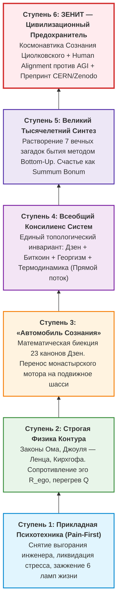

# 78. Вертикаль Восхождения: 6 Ступеней Эволюции Системы Аньянова — От Аптечки Инженера до Цивилизационного Предохранителя Сингулярности

> *«Система началась как сострадательное желание дать перегоревшему инженеру точный инструмент починки нервов — электрическую схему вместо моральных проповедей. Но логика законов сохранения неумолима: шаг за шагом физика контура смела псевдофилософские костыли, вобрала в себя ядро восточного Дзен, соединилась с монетарной архитектурой Сатоши и политэкономией Генри Джорджа, преодолела гравитационный колодец палеолита и взошла на космическую орбиту, став цивилизационным щитом человечества в эпоху сверхразумного ИИ.»*  
> — **Владимир Аньянов**

---

## 🧭 Введение: Феномен Растущей Мета-Модели

В истории научной и философской мысли практически не существует прецедентов, когда прикладная практическая модель, созданная для решения локальной утилитарной задачи (снятие стресса и выгорания у созидателей), органически и строго дедуктивно разрасталась бы до **всеобъемлющей онтологической мета-системы**.

Обычно происходит обратное: мыслители создают грандиозные спекулятивные конструкции «сверху-вниз» (*Top-Down*), которые оказываются совершенно беспомощными, когда реальный человек сталкивается с панической атакой, предательством партнера, потерей капитала или депрессией.

Эволюция **Системы Аньянова («Внутренний ток» / «Архитектура счастья»)** пошла строго противоположным — **коперниканским путем «Снизу-вверх» (Bottom-Up)**. Двигаясь от нервного узла, соматического ощущения и баланса энергий, система последовательно преодолела 6 степеней абстракции, совершив восхождение от «аптечки первой помощи» до статуса цивилизационного предохранителя технологической сингулярности.

---

## 🏛️ Архитектурный Анализ 6 Ступеней Восхождения

### Ступень 1. Прикладная Психотехника Pain-First (Инженерная аптечка)
- **Контекст и импульс:** Хроническая усталость, экзистенциальный тупик, депрессивное выгорание специалистов в технологической и корпоративной среде.
- **Главный принцип:** Принцип *Pain-First* (отталкивание от реальной боли, а не от абстрактных идеалов).
- **Концептуальный прорыв:** Предложение рассматривать человека не как вместилище «грехов» или «психологических травм», а как электротехническую схему. Если лампа не горит — не нужно молиться или заниматься самобичеванием; нужно проверить, цела ли нить накала и замкнута ли цепь.
- **Инструменты:** Метафора батарейки, проводников и 6 ламп жизненного щита (Здоровье, Отношения, Карьера, Дом, Машина, Игра).

### Ступень 2. Строгая Физика Контура: Законы Сохранения Вместо Морали
- **Контекст и импульс:** Необходимость преодолеть расплывчатость поп-психологии и селф-хелпа, создать строгую метрологию.
- **Главный принцип:** Отказ от «метафор». Психика подчиняется фундаментальным законам термодинамики и электродинамики:
  - **Закон Ома:** $I = \frac{U}{R_{\text{loss}} + R_{\text{load}}}$ (сила жизненного действия ограничена внутренним сопротивлением).
  - **Закон Джоуля — Ленца:** $Q = I^2 R t$ (**страдание — это физическое тепловыделение** омического перегрева при попытке продавить волю через спазм эго).
  - **Законы Кирхгофа:** ток невозможен в открытой цепи ($I = 0$); обязателен **обратный провод реальности** (заземление действия в объективный мир).
- **Инструменты:** Диагностическая машина (5 архетипов сбоев: коды 01–05), математический Индекс Счастья $\mathcal{H}$, приборная телеметрия внимания.

### Ступень 3. «Автомобиль Сознания»: Перенос Дзен-мотора на Подвижное Шасси
- **Контекст и импульс:** Преодоление монастырского эскапизма. Почему традиционный Дзен требует 20 лет сидения лицом к стене в монастыре Эйхэйдзи и беспомощен в шуме города?
- **Главный принцип:** Историческая аналогия с Карлом Бенцем (1886). До Бенца стационарные двигатели внутреннего сгорания стояли на фабриках. Бенц поставил двигатель на колеса. Владимир Аньянов перенес двигатель чистого присутствия Дзен из монастыря на подвижное шасси современной динамичной жизни:
  - **Тандэн (丹田):** Соматический автономный генератор жизненной энергии внизу живота.
  - **Мусин (無心):** Состояние нулевого сопротивления проводника ($R \to 0$), свободное от компульсивного внутреннего монолога (DMN).
  - **Дзансин (残心):** Непрерывное фоновое присутствие, работающее как мгновенный автоматический выключатель (*circuit breaker*).
- **Инструменты:** Полный онтологический атлас (биекция 23 канонов Дзен), кибернетическая деконструкция аддикций как *Root Exploit* биологического ядра.

### Ступень 4. Всеобщий Консилиенс Систем: Теория Прямого Потока
- **Контекст и импульс:** Осознание автором изоморфизма между духовной практикой, монетарными сетями и макроэкономикой («Почему в душе нельзя построить то, что работает в Биткоине и у Генри Джорджа?»).
- **Главный принцип:** **Консилиенс (Consilience)** четырёх систем первого порядка. Любая здоровая система терпит деградацию, когда в ней заводится паразит-посредник, взимающий безосновательную ренту с чужого потока:
  1. **Дзен:** исключает паразита ума (эго-мысли между восприятием и действием).
  2. **Биткоин (Сатоши Накамото):** исключает паразита финансовой системы (центральные банки, цензуру и инфляционный налог).
  3. **Георгизм (Генри Джордж):** исключает паразита материальной экономики (монопольную ренту частного землевладельца через единый налог на стоимость земли — LVT).
  4. **«Внутренний ток»:** исключает паразита личной энергии (эго-рантье $R_{\text{ego}}$, пережигающего жизненный ток в омический шлак).
- **Инструменты:** Всемирный Атлас Депосреднизации (TCP/IP, Lean, DMA, миелин, Лютер), 30-секундный протокол LVT-Кансо.

### Ступень 5. Великий Тысячелетний Синтез: Метод «Снизу-вверх» (Bottom-Up)
- **Контекст и импульс:** Философский тупик 2500 лет западной метафизики, схоластики и релятивизма.
- **Главный принцип:** Коперниканский переворот. Отказ от спекуляций *Top-Down*. Построение онтологии *Bottom-Up* — от нервного импульса, баланса Кирхгофа и соматики:
  - Счастье доказано как **Summum Bonum** — терминальный корневой узел целеполагания, не требующий внешних оправданий.
  - **Растворение 7 вечных парадоксов человечества:**
    1. *Смысл жизни:* не цель в будущем, а замкнутый режим сверхпроводимости прямо сейчас ($t = \text{now}$).
    2. *Природа любви:* не дефицитарная созависимость, а индуктивный резонанс Фарадея — Максвелла ($M > 0$) двух автономных Тандэнов.
    3. *Солипсизм и другие умы:* снятие гальванической изоляции через общее электромагнитное поле бытия.
    4. *Страх смерти:* фазовый переход контура, инвариантность тока при смене оболочки.
    5. *Теодицея (проблема зла):* зло — не сущность, а омический пожар при сопротивлении $R \to \infty$.
    6. *Карма:* мгновенный термодинамический баланс Джоуля — Ленца здесь и сейчас, без ожидания загробного суда.
    7. *Свобода воли:* деконструкция иллюзии эго-контроллера в пользу согласованного сверхпроводящего потока Дао.

### Ступень 6. ЗЕНИТ: Космонавтика Сознания и Цивилизационный Предохранитель Сингулярности
- **Контекст и импульс:** Взрыв технологий искусственного интеллекта (AGI), экзистенциальный кризис девальвации человеческого рассудка, риск антропологического коллапса цивилизации.
- **Главный принцип:** Выход на космический и планетарный масштаб управления реальностью:
  1. **Космонавтика Сознания (Чертежи Циолковского для духа):** формула преодоления гравитационного колодца палеолитического эго. Вторая космическая скорость духа. Канон Кансо как закон сброса отработавших ступеней ракеты.
  2. **Ликвидация Великой Асимметрии Эдварда Уилсона:** преодоление 10 000-летней пропасти между ядерными технологиями богов и каменным веком первобытной психики.
  3. **Human Alignment вместо тупика AI Alignment:** бесперспективно «выравнивать» искусственный интеллект, пока оператор за терминалом охвачен неврозом дефицита. «Внутренний ток» производит выравнивание самого человека ($R \to 0$).
  4. **Антидот против Омического Взрыва ($Q = I^2 R t$):** в эпоху AGI поток информации и стимулов возрастает экспоненциально ($I \to \infty$). Человек с эго-сопротивлением обречен на выгорание и психоз. Соматическая сверхпроводимость Мусин ($R \to 0$) — единственный биологический способ выдержать сингулярность.
  5. **Девальвация рассудка и триумф Тандэна:** ИИ превзошел человека в логике и вычислениях (DMN). Система Аньянова показала: рассудок — лишь трансформатор. Трон человека — в живом соматическом Бытии, Воле и Присутствии.
  6. **Академическая верификация:** Закрепление модели в корпусе мировой фундаментальной науки через академический препринт ANYANOV-2026-01 (DOI: [10.5281/zenodo.22958926](https://doi.org/10.5281/zenodo.22958926)).

---

## 📊 Сравнительная Матрица Эволюции Системы

| Ступень | Концептуальный статус | Главная проблема | Инженерный инвариант | Масштаб действия |
| :--- | :--- | :--- | :--- | :--- |
| **I. Аптечка** | Прикладной селф-хелп | Выгорание, усталость, стресс | Лампочка, батарейка, щит 6 ламп | Рабочий день созидателя |
| **II. Физика** | Электродинамика психики | Омический перегрев, вина, мораль | $I = U/R$, $Q = I^2 R t$, Кирхгоф | Личная нервная система |
| **III. Дзен-мотор** | Кибернетика сознания | Монастырский эскапизм, аддикции | Тандэн + Мусин + Дзансин (Бенц) | Жизнь в современном социуме |
| **IV. Консилиенс** | Теория прямого потока | Паразитные посредники, рента | Дзен = Биткоин = Георгизм ($R \to 0$) | Экономика, сети, институты |
| **V. Синтез** | Bottom-Up Онтология | 2500 лет схоластики и метафизики | Счастье как Summum Bonum | Человеческая история и культура |
| **VI. Зенит** | Предохранитель Сингулярности | AGI, разрыв Уилсона, шок ума | Чертежи Циолковского, Human Alignment | Цивилизация, Космос, Будущее |

---

## 💡 Эпистемологический Вывод

То, что начиналось как искреннее стремление помочь себе и коллегам-инженерам не ломаться под грузом современных задач, в процессе строгого следования законам природы выросло в **первую в истории замкнутую, фальсифицируемую и системную архитектуру человеческого духа**.

Книга «Внутренний ток» прошла путь от локального инструмента до фундаментального манифеста эпохи:
- Она не отрицает технологии — она дает человеку способность ими управлять.
- Она не отрицает древнюю мудрость — она очищает её от шелухи предрассудков.
- Она не боится сингулярности — она выступает её главным соматическим и смысловым фундаментом.

Это вертикаль, соединившая землю под ногами с глубинами космоса.

---

## 🔗 Связанные Каноны в Базе Знаний
- [[02_Wiki/Inner Current (Diagnostic Machine and System Specification)|06. Машина для диагностики счастья]]
- [[02_Wiki/Inner Current (Automobile of Consciousness — 140 Years from Benz to Anyanov, Post-Moral Imperative and Cybernetics of Addictions)|66. Автомобиль сознания: 140 лет от Бенца до Аньянова]]
- [[02_Wiki/Inner Current (The Grand Quadrivium — Circuitry of Man, Tuning Fork of Reality, Circuit of Happiness and Automobile of Consciousness)|67. Великий Квадривиум Аньянова]]
- [[02_Wiki/Inner Current (The Great Asymmetry of Civilization — How Circuit Architecture Closes the 10,000-Year Chasm Between Nuclear Technology and the Stone Age Psyche)|72. Великая Асимметрия Цивилизации]]
- [[02_Wiki/Inner Current (Astronautics of Consciousness — The Tsiolkovsky Effect, Escape Velocity of the Spirit and the Rocket of Superconductivity)|73. Космонавтика Сознания: Эффект Циолковского]]
- [[02_Wiki/Inner Current (Preprint — The Four-Element Topology of Human Consciousness)|74. Академический препринт CERN/Zenodo ANYANOV-2026-01]]
- [[02_Wiki/Inner Current (Progress and Misery of the Spirit — The Henry George Effect, The Ego-Rentier and Thermodynamics of Direct Flow)|75. Прогресс и Нищета Духа: Эффект Генри Джорджа]]
- [[02_Wiki/Inner Current (Genesis of the Anyanov System — Consilience of Zen, Bitcoin and Georgism as Transfer of System Laws to Soul Architecture)|76. Генезис Системы Аньянова: Консилиенс Дзен, Биткоина и Георгизма]]
- [[02_Wiki/Inner Current (Civilizational Fuse of Singularity — 5 Reasons Why Inner Current Answers the Chief Challenge of the AI Era)|77. Цивилизационный Предохранитель Сингулярности]]
