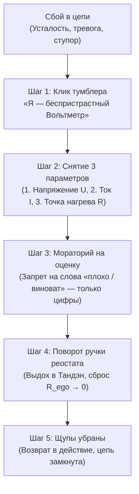

# Протокол Вольтметра: Беспристрастное измерение параметров цепи без омического суда и следствия
### Схемотехника идеального измерительного прибора ($R_V \to \infty$), ликвидация утечки на морализаторство ($I_{\text{leak}} = 0$) и 60-секундная калибровка ума

> [!quote] Главная формула Протокола Вольтметра
> $$R_{\text{voltmeter}} \to \infty \implies I_{\text{meter}} = \frac{U}{R_V} \to 0 \implies Q_{\text{judgment}} = I_{\text{meter}}^2 R_{\text{meter}} t \equiv 0$$
> *«Стрелка вольтметра не обвиняет аккумулятор в том, что он разряжен. Вольтметр не устраивает истерик, не чувствует вины и не пишет стихов о тщете бытия. Он просто показывает 10.2 Вольта. Будь вольтметром своего состояния: замерь параметр, отрегулируй реостат и замкни ток.»*

---

## 1. Схемотехническая трагедия «Внутреннего Прокурора»

Человеческий ум тысячелетиями воспитывался в культуре **морализаторского суда**. Когда у человека падает энергия, срывается сделка или накатывает лень, обывательский интерфейс сознания включает программу «Внутреннего Критика»:
- *«Почему ты такой слабый?»*
- *«Снова всё завалил, ты ничтожество!»*
- *«Соберись, тряпка, продави сквозь силу!»*

В электродинамике контура эта авария выглядит так:
Вместо того чтобы подключить **идеальный измерительный прибор** параллельно участку цепи для снятия телеметрии, человек врезает в схему **паразитный угольный резистор колоссального сопротивления ($R_{\text{judge}} \gg 0$)**.

```
[Аварийная схема Эго-Суда]:
Реактор Тандэн ──── (Критик: R_judge > 0) ────> Омический взрыв вины: Q = I² · R_judge · t
                                                (Проводка сгорела, сил нет)
```

По закону Джоуля — Ленца:
$$Q = I^2 R_{\text{judge}} t$$
Вся оставшаяся психическая энергия генератора Тандэн уходит не на исправление сбоя, а на **нагрев спирали стыда, вины и самоедства**. Происходит фатальное обесточивание контура.

---

## 2. Электродинамика идеального вольтметра ($R_V \to \infty$)

Каковы свойства идеального вольтметра в физике?
1. **Параллельное подключение:** Вольтметр подключается параллельно измеряемому элементу цепи, не разрывая основной силовой кабель.
2. **Бесконечное внутреннее сопротивление ($R_V \to \infty$):** Входное сопротивление прибора настолько велико, что через него практически не течет измерительный ток ($I_{\text{meter}} \approx 0$).
3. **Нулевое влияние на цепь (Zero Circuit Loading):** Прибор фиксирует разность потенциалов ($U = \varphi_1 - \varphi_2$), **не забирая у цепи ни одного милливатта полезной мощности**.

| Параметр | Режим «Эго-Критик» (Обыватель) | Режим «Вольтметр» (Дзен-Инженер) |
| :--- | :--- | :--- |
| **Схема включения** | Последовательно в силовой тракт | Параллельно (чистое наблюдение) |
| **Входное сопротивление** | $R_{\text{judge}} \sim 10^3\ \Omega$ (омический зажим) | $R_V \to \infty$ (неприкосновенность потока) |
| **Ток утечки ($I_{\text{leak}}$)** | Огромный (вся энергия уходит в руминацию) | $I_{\text{leak}} \equiv 0$ (ток не теряется) |
| **Тепловые потери ($Q$)** | Омический пожар вины и выгорания | $Q \equiv 0$ (холодный сверхпроводник) |
| **Реакция на сбой** | Самобичевание, паника, депрессия | Фиксация цифры на дисплее $\to$ регулировка |

Когда оператор становится **Вольтметром**:
- Он видит: пульс подскочил до 110 уд/мин, челюсти сжаты, в голове крутится мысль о потере денег.
- Его реакция: **«Зафиксировано $U = 14.8\text{ В}$, омическое сопротивление $R_{\text{soma}} = 8\ \Omega$. Причина: паразитная емкость $C_{\text{future}}$. Действие: сброс за 30 секунд»**. Никаких эмоций, никакого суда, чистая математика.

---

## 3. Снятие Квантового Эффекта Наблюдателя в психике

В квантовой механике измерение возмущает систему (эффект наблюдателя). В незрелом уме попытка «порефлексировать над собой» мгновенно искажает состояние: человек начинает стыдиться того, что он разозлился, затем злиться на то, что стыдится — возникает бесконечная разрушительная рекурсия зеркал.

**Протокол Вольтметра снимает квантовое возмущение:**
Поскольку сопротивление прибора бесконечно ($R_V \to \infty$), акт измерения **не передает импульса в систему**. Вы смотрите на раздражение или страх точно так же, как инженер на осциллограф: с глубоким, прозрачным спокойствием Мусин (無心).

Как только к явлению перестают подмешивать омический ток вины, **оно схлопывается само по себе**, подчиняясь закону затухания свободных колебаний в $LC$-контуре:
$$I(t) = I_0 e^{-\gamma t} \cos(\omega t + \alpha) \xrightarrow{t \to 0} 0$$

---

## 4. Пошаговый 60-секундный Протокол Вольтметра

При возникновении любого дискомфорта, затыка, приступа прокрастинации или гнева:



1. **Шаг 1. Щелчок режима (5 сек):**  
   Мысленно или вслух: *«Внимание переведено в режим измерительного прибора. Щупы подключены. $R_V \to \infty$»*. Вы больше не жертва ситуации — вы оператор с мультиметром Fluke в руках.
2. **Шаг 2. Замер 3 базовых показаний (15 сек):**
   - **Датчик 1 (ЭДС Тандэна):** Есть ли базовый заряд в животе? (0 до 10).
   - **Датчик 2 (Соматические зажимы):** Где греется проводка? (Шея, челюсти, грудь, диафрагма).
   - **Датчик 3 (Паразитная частота):** Какая симуляция крутится в неокортексе? («Меня осудят», «Я не успею», «Я потеряю статус»).
3. **Шаг 3. Нулевой протокол (Мораторий на комментарии, 10 сек):**  
   Запрет на использование прилагательных («ужасно», «кошмар», «стыдно»). Разрешены только технические констатации: *«Зафиксировано падение проводимости на узле коммуникации на 40%»*.
4. **Шаг 4. Калибровочное действие (20 сек):**  
   - 3 глубоких цикла дыхания «Тандэн — Стопы».
   - Физическое расслабление обнаруженной зоны нагрева.
   - Снятие задачи-гиганта и выбор микро-нагрузки на 2 минуты ($R_{\text{micro}}$).
5. **Шаг 5. Отключение щупов (10 сек):**  
   Уберите прибор в карман. Не сидите в самоанализе часами! Сняли показания, повернули ручку — и вернулись в полезную работу.

---

## 5. Интеграция с Приборной Панелью (OBD-II Cockpit)

Протокол Вольтметра — это аппаратный драйвер вашей **Приборной панели сознания**:
- Когда загорается любая из 7 аварийных ламп (🛑 Ручник, 🌡️ Перегрев, ⚙️ Сцепление, ⚡ КЗ Эго, 🪢 Буксир, ⛽ Суррогат, 🔧 Чек-Энджин) — **не бейте молотком по приборному щитку!**
- Включите Вольтметр, прочитайте шестнадцатеричный код ошибки DTC, устраните причину за 60 секунд — и продолжайте путь на крейсерской скорости сверхпроводимости.
