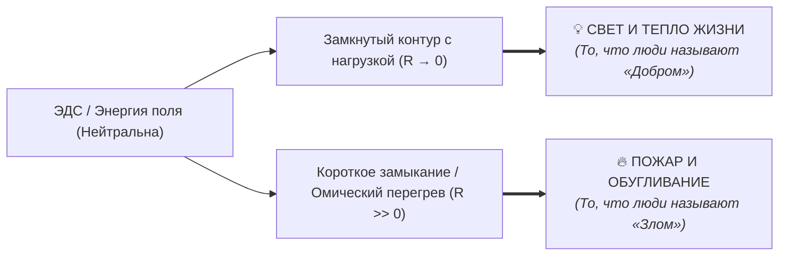
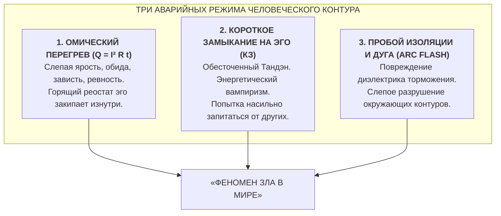
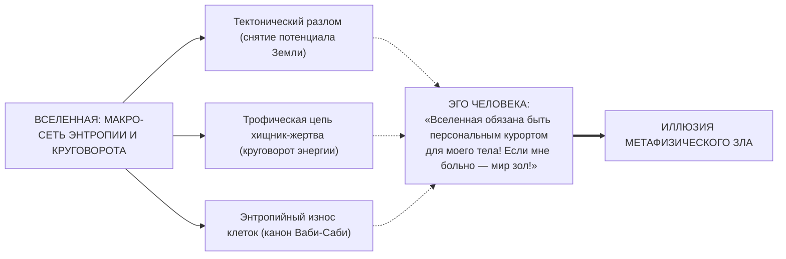
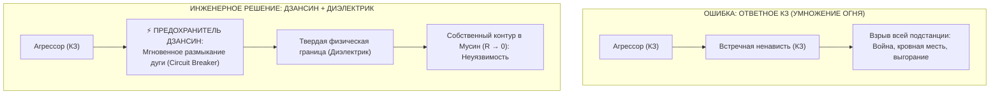

# 51. Теодицея и Проблема Зла в Архитектуре счастья: Почему в электродинамике нет «тёмной силы», анатомия короткого замыкания насилия и ликвидация трилеммы Эпикура

> [!quote] Каноническая аксиома цепи
> ### ⚡ **«В электродинамике нет „злого электричества“. Энергия и законы сохранения абсолютно амбивалентны. То, что человечество три тысячи лет называло „метафизическим злом“, — это не мистическая тёмная сила, а аварийный режим работы контура: омический перегрев горящего реостата эго и катастрофический пробой изоляции, при котором повреждённый трансформатор сыплет искрами и поджигает всё вокруг.»**
> — **Владимир Аньянов**

---

## 🧭 Введение: Три тысячелетия трилеммы Эпикура

Среди всех экзистенциальных тупиков человечества **Проблема Зла (Теодицея)** веками оставалась непреодолимой скалой, о которую разбивались богословие и классическая этика.

Ещё в III веке до н.э. греческий философ Эпикур сформулировал знаменитую трилемму:
```
           ┌─── Хочет искоренить зло, но не может? ───► Значит, Он БЕССИЛЕН.
           │
БОГ ───────┼─── Может, но не хочет? ──────────────────► Значит, Он ЗЛОЙ / ЖЕСТОК.
           │
           └─── И может, и хочет? ─────────────────────► ТОГДА ОТКУДА ЗЛО?
```

### Исторические попытки спасти теодицею:
1. **Августин Блаженный (*Privatio Boni*):** Зло — это не сущность, а «отсутствие добра», как тьма — отсутствие света. Но богословы так и не смогли объяснить: почему всемогущий Творец допустил эти зияющие дыры тьмы, в которых мучаются невинные существа?
2. **Готфрид Лейбниц («Теодицея», 1710):** *«Наш мир — лучший из всех возможных миров»*. Лейбниц утверждал, что локальное зло необходимо для глобальной гармонии (как тень на картине художника). Однако Вольтер в *«Кандиде»* уничтожил эту схоластику фактом Лиссабонского землетрясения 1755 года, где под руинами церквей заживо сгорели десятки тысяч детей.
3. **Манихейский дуализм (Зороастризм, гностицизм):** Есть два равновеликих бога — Бог Света и Бог Тьмы (Ариман, Сатана), ведущие вечную космическую войну. Это снимает вину с Бога, но вводит парализующий космический кошмар.
4. **Концепция первородного греха:** Виноват человек (съел запретный плод), поэтому вся физическая природа проклята. Это породило бесконечную невротическую вину ($R_{\text{guilt}} \to \infty$).

**В чём заключалась фатальная ошибка всех этих систем?**  
Мыслители прошлого относились ко Злу как к **ОНТОЛОГИЧЕСКОЙ СУБСТАНЦИИ** — метафизической «тёмной энергии», автономной воле ко греху или космическому проклятию.

---

## ⚡ 1. Электродинамическая демистификация: Энергия амбивалентна

В физике, уравнениях Максвелла и законах термодинамики **нет знака добра или зла**.

Электрический ток в 220 Вольт:
* Может питать инкубатор для недоношенного младенца или аппарат ИВЛ, спасая жизнь.
* Может питать электрический стул или убить человека при случайном касании оголённого фазного провода.

Меняется ли при этом физика движения электронов? Нет.  
Формула $I = U/R$ и закон сохранения энергии остаются незыблемыми. 



Понятия «добра» и «зла» — это **антропоцентрические ярлыки**:
* **«Добром»** человек называет **штатный режим работы контура**, когда ток течёт в полезную нагрузку без паразитного сопротивления ($R \to 0$), создавая созидательное действие и свет.
* **«Злом»** человек называет **аварийные режимы работы цепи**, при которых энергия сжигает проводку, плавит изоляцию и разрушает биологическую форму.

---

## 🔥 2. Схемотехника Зла: Три аварийных режима контура

Человеческое «зло» (тирания, садизм, насилие, подлость, предательство) не требует мистических чертей. Оно имеет строгую схемотехническую природу.



### Авария 1: Омический перегрев ($Q = I^2 R t$) — Источник агрессии
Когда человек не умеет сбрасывать сопротивление эго ($R_{\text{past}} \gg 0, R_{\text{ego}} \gg 0$), его ток внимания наталкивается на стену внутреннего трения.  
По закону Джоуля — Ленца выделяется паразитное тепло ($Q$). Субъективно это ощущается как **жгучая обида, зависть, бешенство, жажда мести**.  
Проводка сознания раскаляется добела. Человек не может удерживать это тепло внутри — и он выплёскивает его вовне в виде крика, ударов, токсичности и ненависти.  
*Злодей первой категории — это оператор, у которого горит собственная проводка.*

### Авария 2: Короткое замыкание на Эго — Источник тирании и паразитизма
Что движет диктатором, абьюзером или мошенником?
У такого человека **разорван собственный контакт с генератором Тандэна** ($\mathcal{E}_{\text{inner}} = 0$). Внутри у него — ледяная экзистенциальная пустота, ужас ничтожества и бессилия.  
Но жить-то надо! И тогда сломанный контур решает:
> *«Если я не могу генерировать свой ток, я украду его у мира! Я заставлю людей бояться меня, подчиняться мне, отдавать мне свои ресурсы и внимание!»*

Насилие — это **попытка внешнего принудительного запитывания от чужого контура**. Тиран — это не сильный лидер, это колоссальный энергетический паразит с пробитым ядром, пытающийся высосать напряжение из целой страны.

### Авария 3: Пробой изоляции и электрическая дуга (Arc Flash) — Садизм и психопатия
В электротехнике дуговой пробой — страшная авария: если изоляция обуглена, электрическая дуга ионизирует воздух и начинает жечь металл с температурой 20 000 °C.  
Психопат или садист — это человек, у которого в детстве или в результате органического поражения мозга **полностью сгорел диэлектрик эмпатии (зеркальные нейроны)**. Ток его импульсов ничем не ограничен. Он бьёт по живым существам, как оголённый провод ЛЭП 10 000 Вольт, упавший в лужу.

---

## 🌪️ 3. А как же «природное зло»? (Катастрофы, болезни, хищники)

С человеческим злом всё ясно — это аварии контура эго. Но почему цунами топят деревни, хищники разрывают антилоп, а дети болеют раком? Неужели Вселенная зла?

Здесь Система Аньянова соединяется с **канонами Дзен: Шуньята (Пустотность формы) и Ваби-Саби**:



1. **Землетрясение** — это не «гнев богов». Это снятие механического напряжения тектонических плит. Планета остывает и движется по законам геофизики.
2. **Хищник** — это не «садист». Волк не ненавидит оленя. Волк подчиняется закону питания биологической цепи.
3. **Болезнь и смерть** — это проявление Первого и Второго законов термодинамики: любая сложная материальная форма со временем рассеивает порядок и уступает место новой генерации (канон Ваби-Саби и Итиго Итиэ).

**«Злом» природа становится только в оптике человеческого Эго**, которое требует: *«Вселенная обязана гарантировать вечный комфорт моему отдельному телу!»*  
Но космос — это не гостиничный сервис. Космос — это гигантская электростанция бытия. В пустотности формы (Шуньята) природа не добра и не зла — она **Такова (Татхата)**.

---

## 🛡️ 4. Как Архитектура счастья нейтрализует Зло?

Классический ответ человечества на зло — **«Око за око, зуб за зуб» (встречная ненависть)**.

### Почему священная война со злом всегда порождает новое зло?
В электродинамике закон непреложен:
Если в цепи возникло короткое замыкание (агрессия), а ты в ответ включаешь встречное короткое замыкание (ярость и жажду мести) — **токи короткого замыкания складываются ($I_{\text{total}} = I_1 + I_2$)**!  
Происходит масштабный пожар подстанции. Так начинаются вековые кровные мести и мировые войны. Ненавидя чудовище, человек сам становится горящим трансформатором.



### Инженерный протокол защиты от зла:

1. **Не кормить чужое КЗ своим током:**  
   Когда в тебя летит провокация, манипуляция или агрессия — это попытка чужого сломанного контура заземлиться об тебя. Если ты обижаешься или злишься — ты замкнул цепь, и чужой ток спалил твои нервы.
2. **Срабатывание предохранителя Дзансин (Circuit Breaker):**  
   Аварийный размыкатель отсекает дугу за 50 миллисекунд. Холодный, спокойный шаг назад. Отказ от эмоционального включения в чужой бред.
3. **Постановка твердого диэлектрика (Физические границы):**  
   Злодеев не «прощают слюнявой жалостью» и не «ненавидят». Их **изолируют**, как изолируют высоковольтный провод толстым слоем резины. В суде, в законе, в личных отношениях: твёрдое физическое «НЕТ», блок, суд, защита слабых. Без злобы, без ярости — просто как техника безопасности на стройплощадке.
4. **Сохранение сверхпроводимости Тандэна:**  
   Взгляд Будды: злодеи — не «демоны», а **тяжело обожжённые инвалиды контура**, горящие заживо в собственном омическом аду ($Q \gg 0$). Им невозможно завидовать, их бессмысленно судить — от них нужно защищать мир исправными предохранителями.

---

## 🏛️ Сравнительная матрица: Метафизический миф vs Электродинамический факт

| Аспект проблемы | Религиозно-гуманитарный миф | Физический факт Системы Аньянова |
| :--- | :--- | :--- |
| **Природа зла** | Тёмная субстанция, грех, Сатана | Аварийный режим цепи (КЗ, перегрев $Q$, пробой изоляции) |
| **Причина агрессии** | «Злая воля», испорченная душа | Сгоревший реостат эго, паразитный перегрев по Джоулю — Ленцу |
| **Причина тирании** | Гордыня и жажда власти | Обесточенный Тандэн: вампирическая попытка запитаться от чужой сети |
| **Природные беды** | Наказание за грехи человечества | Снятие потенциалов коры Земли, энтропия формы (Ваби-Саби) |
| **Борьба со злом** | Праведный гнев, крестовые походы | Опасность встречного КЗ; умножение суммарного тока пожара |
| **Инженерный ответ** | Молитва или возмездие | Предохранитель Дзансин, диэлектрическая изоляция и защита сети |

---

## 🍵 Резюме: Конец трилеммы Эпикура

Трилемма Эпикура рушится, потому что её посылка была ложной:
* Бог / Вселенная не являются «директором детского сада», который обязан следить, чтобы дети не совали пальцы в розетки.
* Вселенная создала **незыблемые законы электродинамики и термодинамики**.

Зло не существует как вещь.  
Существует **невежество оператора (Авидья)**, сующего металлическую вилку в фазный провод и удивляющегося, почему его бьёт током и пахнет палёным мясом.

Почините контур. Изолируйте оголённые провода. Включите Дзансин. И тьма рассеется сама — потому что у неё никогда не было собственного источника питания. ⚡🛡️🧘‍♂️

---

## 🔗 Связи и консилиенс
- [[02_Wiki/Inner Current (Core Topology and Polarity Law)|01. Базовая топология цепи и закон полярности]]
- [[02_Wiki/Inner Current (Physics of Presence and Superconductivity)|02. Физика присутствия: состояние сверхпроводимости]]
- [[02_Wiki/Inner Current (Safety, Antifragility and Zanshin)|04. Предохранители цепи, ваби-саби и антихрупкость]]
- [[02_Wiki/Inner Current (Nature and Illusion of Ego)|07. Природа и иллюзия эго]]
- [[02_Wiki/Inner Current (The Nature of the Light Bulb and Zen Load)|17. Природа лампочки и закон нагрузки по канонам Дзена]]
- [[02_Wiki/Inner Current (The Question of God — Electrodynamic Invariance and Dissolution of Theological Resistance)|41. Вопрос о существовании Бога в Архитектуре счастья]]
- [[02_Wiki/Inner Current (Dissolution of Eternal Questions — From Humanitarian Deadlock to Scientific Circuitry)|46. Растворение вечных вопросов: От гуманитарного тупика к научной схемотехнике]]
- [[02_Wiki/Inner Current (The Anyanov Triad and Tetrad — Truth, Freedom, Happiness, Creation and the Biographical Proof)|47. Триада и Тетрада Аньянова: Истина, Свобода, Счастье, Созидание]]
