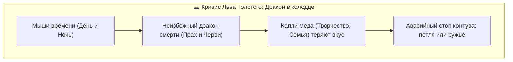
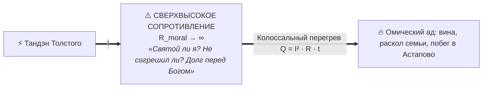
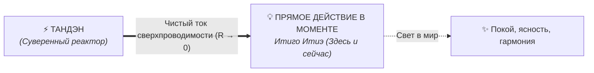

# 27. Сравнительный анализ: Духовный кризис Льва Толстого («Исповедь») vs Архитектура счастья — Моральный долг Хозяину против суверенной сверхпроводимости Тандэна

> [!quote] Точка столкновения двух титанов мысли
> **«Ну хорошо, ты будешь славнее Гоголя, Пушкина, Шекспира, Мольера, всех писателей в мире, — ну и что ж?.. Рано или поздно придут болезни, смерть, и ничего не останется, кроме смрада и червей. Мои дела все забудутся. Так зачем же хлопотать? Как может человек не видеть этого и жить?.. И я прятал шнурок, чтобы не повеситься на перекладине между шкапами в моей комнате.»**  
> — **Лев Толстой, «Исповедь» (1879)**
> 
> **«Вопрос о смысле жизни возник потому, что он был самой гигантской утечкой в контуре счастья, без решения которой невозможно быть счастливым. Но утечка заваривается не придумыванием Хозяина и долга, а доказательством того, что внешнего смысла нет, и переводом смысла из существительного в глагол — в чистый ток сверхпроводимости.»**  
> — **Владимир Аньянов, «Архитектура счастья»**

---

## ⚡ Введение: Точка бифуркации гения

В истории мировой мысли мало примеров столь беспощадной честности перед самим собой, какую явил граф Лев Николаевич Толстой на рубеже 1870–1880-х годов.

Закончив «Войну и мир» и «Анну Каренину», обладая колоссальным состоянием (6 000 десятин земли, табуны породистых лошадей), безупречным здоровьем, любящей семьей и абсолютной мировой славой, 50-летний Толстой внезапно **остановился как вкопанный**.

В операционной системе его сознания сработал сторожевой процесс:
> *«Подожди. А зачем? Пройдет 50, 100, 1000 лет — всё обратится в прах. Зачем тратить энергию на эту лампу, если само здание обречено?»*

Спустя почти полтора века к этой же самой фундаментальной развилке подошел создатель Архитектуры счастья Владимир Аньянов. Но если Толстой искал выход через **гуманитарно-этическую религиозную реформу**, то Аньянов применил **холодный скальпель инженерной электродинамики и дзен-онтологии**.

Сравнение этих двух путей дает исчерпывающий ответ на главный вопрос человеческого бытия.

---

## 1. Анатомия кризиса Толстого: «Исповедь» и дракон в колодце

В «Исповеди» Толстой описывает древнюю восточную басню о путнике, застигнутом в степи разъяренным зверем:
- Спасаясь, путник прыгает в безводный колодец, но на дне его видит **дракона**, разинувшего пасть, чтобы поглотить его.
- Несчастный хватается за ветви дикого куста, растущего из щели колодца.
- Руки его слабеют, а сверху две мыши — **черная и белая** (день и ночь) — непрерывно подтачивают стебель, на котором он висит.
- На листьях куста путник видит несколько капель меда. Прежде он тянулся к ним языком и радовался. Эти капли меда — **семья и литературное творчество**.
- Но теперь дракон смерти внизу столь очевиден, а мыши времени грызут стебель столь неумолимо, что мед больше не сладок:
  > *«Я ясно вижу дракона, и мед уже не сладок мне. Я вижу одно — неизбежного дракона и мышей, и не могу отвести взора от них. И это не басня, а это истинная, неоспоримая и всякому понятная правда.»*

### Инженерная телеметрия кризиса Толстого:
1. **Магистральный заземлитель:** Сторожевой вопрос *«Зачем, если всё обратится в прах?»* замкнул проводку внимания Толстого на бесконечное сопротивление пустоты ($R_{\text{leak}} \to 0$ в бездну).
2. **Обесточивание всех ламп:** Напряжение на всех шести лампах графа упало до нуля. Творчество («Анна Каренина») было объявлено чепухой, управление имением брошено, семья стала казаться обузой.
3. **Холодный останов:** Ток упал до нуля ($I \to 0$). Толстой спрятал ружье и шнурок, оказавшись в терминальной фазе экзистенциального обрыва.

---

## 2. Какой ответ получил Лев Толстой? (Путь Слуги в Винограднике)

Толстой обратился к науке и философии:
- **Наука** заявила: *«Ты — временное сцепление частиц в бесконечном пространстве. Твоего смысла нет»*. Толстой отверг этот ответ: наука объясняет «как устроен мир», но бессильна объяснить, «как человеку жить».
- **Философия** (Шопенгауэр, Соломон, Будда) ответила: *«Жизнь — это зло и бессмыслица, лучшее — не рождаться»*.

Тогда Толстой посмотрел на работающий народ — крестьян-мужиков. Он увидел, что праздная интеллигенция от тоски стреляется, а миллионы мужиков тяжко трудятся, переносят нужду и умирают с поразительным миром в душе.

Толстой понял: **их держит Вера.**

### Суть ответа Толстого:
1. **Конечный разум бессилен.** Разум земного человека не способен найти обоснование конечной жизни внутри самой конечной жизни. 
2. **Связь с бесконечным.** Смысл возникает только тогда, когда временное человеческое существование связывается с **Бесконечным Началом (Богом)**.
3. **Метафора Виноградника:** Человек — не самоцель. Человек — это **посланный работник на чужой виноградник**. Хозяин (Бог) дал нам жизнь не для наших капризов, а для исполнения Его воли.
4. **Этическое служение:** Воля Хозяина состоит в том, чтобы умножать любовь, служить другим, отказаться от роскоши, не противиться злу насилием и заниматься физическим трудом.

Толстой решил проблему: он нашел смысл, подчинив свою жизнь строгому этическому долгу перед Богом.

---

## 3. Инженерный аудит решения Толстого: Почему оно привело к омическому аду?

С точки зрения термодинамики и теории цепей Толстой совершил **классическую инженерную подмену**:

> **Толстой не заварил утечку. Он поставил сверху гигантскую, чудовищно тяжелую моральную заглушку — концепт «Хозяина и Долга».**

### Последствия толстовского решения:
1. **Взрыв паразитного сопротивления ($R_{\text{moral}} \to \infty$):** 
   Вместо сверхпроводимости Толстой нагрузил свой контур бесконечным чувством вины. *«Я живу в барском доме, а мужики голодают. Я ем на серебре — значит, я преступник. Я не имею права писать художественные книги, это барская прихоть»*.
2. **Омический перегрев по закону Джоуля — Ленца ($Q = I^2 R t$):**
   Всю вторую половину жизни великий писатель провел в непрерывном душевном пекле. Он шил сапоги, пахал землю, отказывался от авторских прав, мучил жену и детей своими требованиями святости, разрывался между идеалом и реальностью.
3. **Финал на станции Астапово (1910 год):**
   В 82 года, глубокой ноябрьской ночью, не выдержав внутреннего напряжения цепи, Толстой тайно бежит из Ясной Поляны в никуда. Он заболевает воспалением легких и умирает в деревянной комнатке начальника маленькой железнодорожной станции Астапово. 

Его цепь так и не обрела покой. Она сгорела от колоссального напряжения морального долга.

---

## 4. Ответ Владимира Аньянова: Ликвидация ошибки категории

Владимир Аньянов подошел к той же самой проблеме («здание будет снесено через 100 лет») не как теолог или моралист, а как инженер.

### Инженерный анализ тупика:
1. **Почему Толстой искал «Хозяина»?** Потому что в его гуманитарной прошивке сидела неявная догма: *«Если я существую, значит, у меня должно быть назначение (телеология)»*. Не найдя назначения на земле, Толстой вынужден был перенести его на небо.
2. **Где ошибка?** Ошибка в самой посылке! Человек — это не молоток, не лопата и не винтик на фабрике. У молотка есть назначение, потому что его изготовил внешний мастер для забивания гвоздей. Но живое сознание — это открытая, суверенная термодинамическая система. У неё **нет и не может быть предустановленного назначения**.
3. **Статус внешнего смысла:**
   $$\mathcal{M}_{\text{ext}} \equiv 0$$
   Во Вселенной нет внешнего сервера, где прописано техзадание для человека. Попытка искать этот сервер — это системная ошибка обращения по нулевому указателю (`Null Pointer Exception`).

### Инженерное заваривание утечки:
- Аньянов доказал: **вопрос о смысле жизни — это не зов высшей истины, а аппаратный симптом омических потерь застрявшего тока ($Q = I^2 R t$).**
- Когда проводка забита эго-симуляциями, ток не может выйти в действие и раскаляет мозг. Мозг в панике кричит: *«Ради чего эта боль?! Где высший смысл?!»*.
- При сбросе сопротивления до нуля ($R \to 0$, состояние Мусин) ток из Тандэна мгновенно и без трения течет в прямое действие: в чашку чая, в строку кода, в объятия, в удар клинка. 
- В момент сверхпроводимости вопрос о смысле **физически аннулируется**, потому что исчезает сам нагрев.

---

## 5. Сравнительная матрица: Лев Толстой vs Владимир Аньянов

| Критерий аудита | Лев Толстой («Исповедь») | Владимир Аньянов («Внутренний ток») |
| :--- | :--- | :--- |
| **Базовая парадигма** | Религиозно-этическая, гуманитарная | Электродинамическая, дзен-инженерная |
| **Статус смысла жизни** | **Смысл объективно ЕСТЬ.** Он заложен Богом как внешнее ТЗ. | **Смысла объективно НЕТ ($\mathcal{M}_{\text{ext}} \equiv 0$).** Поиск смысла — ошибка категории. |
| **Онтологический статус человека** | **«Слуга / Работник»** на чужом винограднике. Обязан оправдать жизнь. | **«Автономная электростанция (Тандэн)».** Источник чистой энергии бытия. |
| **Отношение к смерти и праху** | Попытка преодолеть конечность через **связь с Вечностью**. | Принятие конечности как **канона красоты формы** (Ваби-саби, Итиго Итиэ). |
| **Механизм решения утечки** | Навешивание колоссального внешнего долга (служение, аскеза). | Заваривание шлюза: деактивация сторожевого процесса (Watchdog Kill). |
| **Сопротивление цепи ($R$)** | **$R \to \infty$** (вечный суд над собой, чувство вины и греховности). | **$R \to 0$** (сверхпроводимость, режим Мусин, свобода от суда). |
| **Отношение к культуре и вещам** | Обесценивание: объявление искусства «барской блажью». | Калибровка: любая лампа (искусство, чай, код) свята в момент горения. |
| **Форма существования смысла** | **Существительное** (великая цель, наказ, завет). | **Глагол** (само движение тока через нулевое сопротивление). |
| **Финальное состояние оператора** | Омический надрыв, трагический побег, смерть на станции Астапово. | Полная гармония, согласование импедансов, непоколебимый покой. |

---

## 6. Дзенский синтез: Почему лампа прекрасна, даже если здание будет снесено?

Толстой мучился вопросом: *«Зачем писать романы или сажать сады, если через 100 лет от меня останутся только черви?»*.

Дзен-инженерия отвечает на это принципом **Итиго Итиэ (一期一会 — «один миг, одна встреча»)** и каноном **Ваби-саби**:

> **Ценность свечения электрической лампочки не измеряется тем, простоит ли здание миллион лет.  
> Ценность лампочки заключается в том, что ПРЯМО СЕЙЧАС в темной комнате горит свет, освещая лица людей.**

Сакура прекрасна именно потому, что её лепестки опадают через три дня. Если бы сакура была сделана из нержавеющей стали и стояла вечно, она была бы мертвой безвкусицей. 

Конечность человеческой жизни — это не повод для саботажа цепи, а **главное условие абсолютной драгоценности каждого ампера тока в настоящем моменте**.

---

## 7. Итог: Освобождение Созидателя

Лев Толстой совершил колоссальный подвиг духа: он честно обнажил трагедию гуманитарного мышления, упершегося в конечность материи. Но его решение спасло его от физической петли ценой пожизненного морального рабства перед выдуманным долгом.

Владимир Аньянов завершил этот вековой поиск, применив инженерный метод:
1. **Он снял вину:** Если Вселенная не выдавала техзадания, значит, ты ни в чем не виноват и ничего не задолжал вечности.
2. **Он вернул энергию в проводку:** Не нужно ждать бесконечности, чтобы жить. Реактор Тандэн работает прямо сейчас.
3. **Он превратил бессмысленность в абсолютную свободу:** Раз смысла нет как предустановленного догмата, ты абсолютно свободен направить ток своей жизни в любое созидание — в красоту, в код, в любовь, в чашку чая.

> **Толстой искал смысл, чтобы оправдать свое существование перед Хозяином.  
> Архитектура счастья доказала, что Хозяина нет, а ты сам — свет. И этот свет не нуждается в оправданиях.**

---

## 🔗 Связанные главы и узлы цепи

- [[02_Wiki/Inner Current (Engineering Proof of No Meaning of Life and the Birth of Happiness Architecture)|26. Инженерное доказательство отсутствия смысла жизни: Освобождение от гуманитарного тупика и рождение Архитектуры счастья]] — теория Магистральной Утечки, системная модель проверки смысла и ликвидация $R_{\text{existential}}$.
- [[02_Wiki/Inner Current (Fundamental Laws of the Happiness Thermodynamics)|20. Фундаментальные законы термодинамики счастья]] — закон сохранения энергии и омический нагрев Джоуля — Ленца.
- [[02_Wiki/Inner Current (Safety, Antifragility and Zanshin)|04. Предохранители цепи, ваби-саби и антихрупкость]] — эстетика конечности и защита контура.
- [[02_Wiki/Inner Current (Scale Invariance and Tea Ceremony)|03. Инвариантность масштаба нагрузки: от чая до империи]] — канон Итиго Итиэ как калибровка присутствия.
- [[02_Wiki/Inner Current (Canonical Definitions of Happiness — Technical and Intuitive Formulations)|22. Канонические определения счастья в Системе Аньянова]] — сверхпроводимость цепи $R \to 0$ и снятие суда над собой.
- [[04_Maps/Inner Current MOC|Inner Current MOC (Мастер-карта цепи)]]
