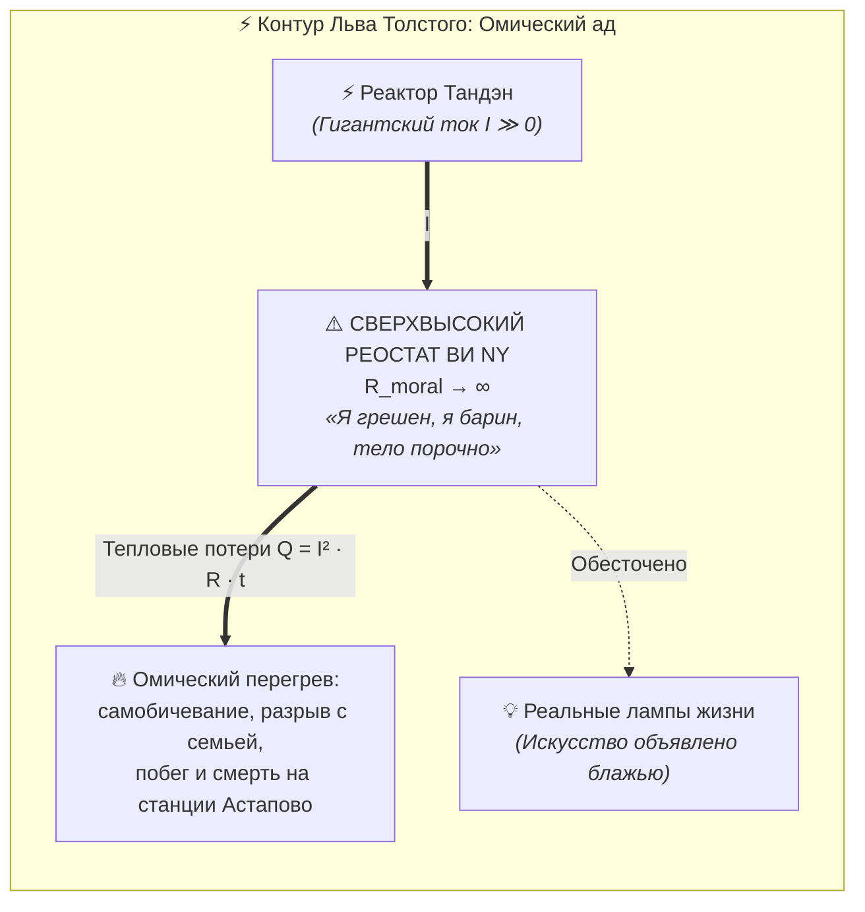
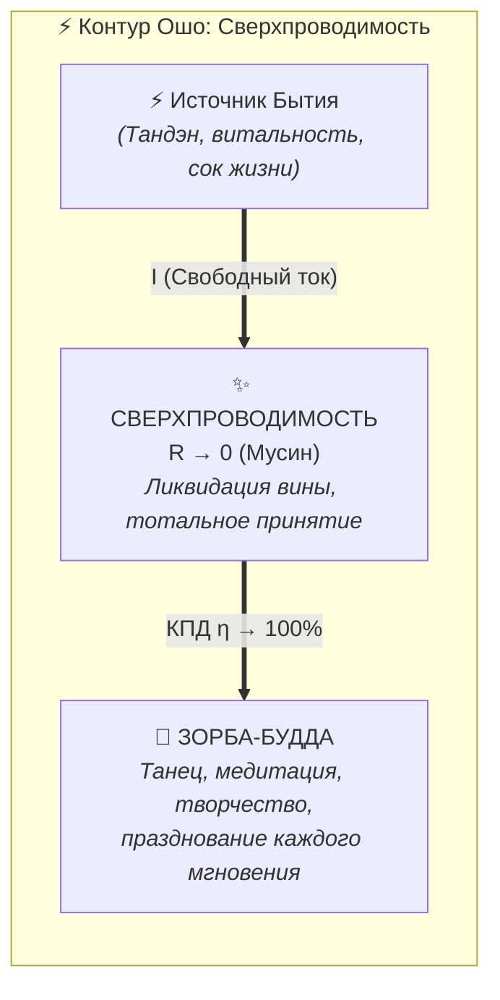

# 36. Толстой и Ошо: два взгляда на счастье — Омический ад морального долга против сверхпроводимости празднования

> [!quote] Столкновение двух мировых полюсов сознания
> **«Человек есть работник, поставленный в винограднике Божием делать дело спасения своей души и умножения любви... Счастье не в том, чтобы услаждать плоть, а в исполнении воли Пославшего.»**  
> — **Лев Толстой, «В чем моя вера?»**
> 
> **«Жизнь — это не экзамен и не подготовка к чему-то иному. Жизнь — это празднование, танец! Сбросьте вину, которую вам навязали священники и моралисты. Будьте Зорбой на земле и Буддой в духе — и не ищите никакой цели вне самого цветения!»**  
> — **Ошо (Бхагван Шри Раджниш), «Зорба-Будда»**
> 
> **«Толстой создал цепь с гигантским моральным сопротивлением ($R_{\text{moral}} \to \infty$), где ток жизни пережигался в теплоту бесконечной вины по закону Джоуля — Ленца. Ошо обнулил это сопротивление ($R \to 0$), открыв режим чистой сверхпроводимости. Архитектура счастья берет силу этого потока и облачает его в надежные предохранители Дзансин.»**  
> — **Владимир Аньянов, «Архитектура счастья»**

---

## ⚡ Введение: Два магнита человеческой судьбы

В духовной эволюции каждого искреннего созидателя наступает момент, когда детские сказки перестают работать, а вопрос «Как жить?» встает ребром, требуя предельной ясности.

На этом перекрестке почти каждый искатель неизбежно сталкивается с двумя колоссальными фигурами мировой мысли:
1. **Львом Николаевичем Толстым** — русским титаном совести, пророком нравственного ригоризма, опрощения, неумолимой борьбы с похотью и служения высшему Закону.
2. **Ошо (Бхагваном Шри Раджнишем)** — восточным мастером парадокса, ниспровергателем любых табу, воспевателем тотальной осознанности, экстаза, смеха и праздника жизни.

Для многих людей встреча с ними происходит именно в такой хронологической последовательности:
- **В 18–20 лет** душу захватывает Толстой. Его бескомпромиссная честность в «Исповеди», осуждение фальши общества и проповедь чистоты побуждают человека вступить на путь строгого морального воздержания, почти монастырского самоограничения. Возникает ясная картина: мир погряз во грехе, плоть коварна, нужно держать себя в ежовых рукавицах и служить Богу.
- **Годы спустя** приходит знакомство с Ошо. И происходит ошеломляющий инсайт: то, что у Толстого казалось святостью, внезапно обнажает свою мучительную узость и постоянное сдавление; а у Ошо открывается бескрайний океан свободы, глубины, юмора и принятия бытия без малейшей тени вины.

Возникает фундаментальный вопрос:
> **Можно ли утверждать, что путь Льва Толстого — это наглядный инженерный крах цепи, функционирующей в прямом противоречии с законами «Внутреннего тока»?  
> А путь Ошо — это живое, опередившее свое время воплощение сверхпроводимости и канонов Системы?**

Инженерный аудит обоих мыслителей дает однозначный и строгий ответ: **Да, в точности так.**

---

## 1. Контур Льва Толстого: Счастье как искупительная каторга

Чтобы понять драму Толстого, необходимо взглянуть на электродинамическую схему его личности.

Граф Толстой обладал феноменальным природным реактором Тандэн: колоссальная жизненная сила, вулканический темперамент, аппетит к жизни, страстность и творческая мощность ($I \gg 0$). До 50 лет этот ток заливал страницы «Войны и мира» и «Анны Карениной».

Но после экзистенциального перелома («дракон смерти в колодце» в «Исповеди») Толстой не смог принять пустотность внешней цели. Его сознание потребовало абсолютного ответа: *«Ради чего я живу?»*.

Не найдя ответа в земной материи, Толстой сконструировал религиозно-нравственную парадигму, ставшую для его психики смертоносным капканом.

### Архитектурные пороки толстовской цепи:

1. **Модель «Батрака и Хозяина»:**
   Толстой отверг автономию сознания. Человек для него — это посланный наемник на чужой виноградник. Жизнь дана не для радости, а для отработки урока перед строгим Хозяином-Богом. Человек ежеминутно обязан оправдывать свое существование.
2. **Внедрение бесконечного сопротивления вины ($R_{\text{moral}} \to \infty$):**
   Любое спонтанное движение тока объявлялось греховным. Наслаждаешься музыкой Бетховена? Это разврат («Крейцерова соната»). Любишь красивую одежду и вкусную еду? Ты грабишь мужиков. Пишешь романы? Это барская забава. Толстой вставил в разрыв своей цепи чудовищный моральный реостат, требуя от себя абсолютной святости.
3. **Закон Джоуля — Ленца ($Q = I^2 R t$):**
   Физика неумолима: если через проводник с огромным сопротивлением $R$ пропустить мощный ток $I$, проводник не выдаст света. **Он раскалится докрасна и начнет плавиться.**
   Всю вторую половину жизни Толстой провел в непрерывном омическом аду: он мучился от того, что живет в усадьбе, мучил жену Софью Андреевну упреками, шил сапоги назло барскому быту, каялся в дневниках и рыдал от бессилия преодолеть плоть.
4. **Финал на станции Астапово (1910):**
   Побег 82-летнего старика глухой ноябрьской ночью из Ясной Поляны в никуда — это не романтика. Это **физическое разрушение изоляции контура**. Психика не выдержала омического напряжения между живым током Тандэна и железными тисками толстовского ригоризма.

Толстовский «монастырь в миру» — это попытка достичь покоя через тотальное подавление цепи. Это путь, где счастье отодвинуто в недостижимый горизонт будущей святости, а настоящее превращено в зал судебного заседания.

---

## 2. Контур Ошо: Счастье как празднование и сверхпроводимость

Ошо появился на мировой сцене как антипод любой формы религиозного ханжества и морализаторства. 

Когда после толстовского самобичевания человек открывает беседы Ошо по Дзену, суфизму или Дао, происходит эффект распахивания окон в душной келье: в комнату врывается свежий горный ветер.

### Почему Ошо реализует принципы «Внутреннего тока»:

1. **Ликвидация паразитного сопротивления вины ($R \to 0$):**
   Ошо нанес сокрушительный удар по корню человеческого несчастья — концепции «первородного греха» и морального долга. 
   > *«Вина — это величайшая болезнь, привитая человечеству попами и политиками, чтобы сделать вас управляемыми. Вы совершенны прямо сейчас. Бытие никогда не создает брака!»*
   
   В электродинамике это означает мгновенное выжигание омического резистора. Ток перестает греть рефлексирующий мозг и идет в чистое свечение.
2. **Смысл как глагол, а не существительное ($\mathcal{M}_{\text{ext}} \equiv 0$):**
   Толстой десятилетиями мучительно формулировал смысл как доктрину, как свод заповедей. Ошо вернул смысл туда, где он и должен быть:
   > *«Не спрашивайте, в чем смысл жизни. Смысл — в том, чтобы жить! В самом течении реки, в самом распускании цветка. У цветка розы нет цели стать полезным обществу; цветение — это и есть его апогей.»*
   
   Это слово в слово закон Системы Аньянова: **смысл жизни — это режим сверхпроводимости контура ($R \to 0$), когда ток течет без задержки в прямое действие**.
3. **Концепция «Зорба-Будда» (Интеграция нагрузки):**
   Толстой пытался насильственно кастрировать свою натуру: он хотел быть аскетичным «Буддой», уничтожив в себе грека Зорбу с его вином, танцем и страстью. В итоге он сломал и то, и другое.
   
   Ошо провозгласил:
   - **Грек Зорба** — это фундамент: тело, земная радость, материя, здоровый реактор Тандэн. Без Зорбы духовность становится сухой, мертвой и ханжеской.
   - **Будда** — это высота: свидетельствующее сознание, тишина ума, свет проводки Мусин.
   - Счастливый человек — это **Зорба-Будда**, целостная замкнутая цепь, где высокое напряжение духа свободно питает земные лампы красоты и чувств.
4. **Снятие суда над собой:**
   В Системе Аньянова счастье определяется как отсутствие внутреннего цензора. У Ошо медитация — это не усилие воли, не сжатие зубов, а **пассивное осознание без суждения** (*Choiceless Awareness*). Это абсолютная проводка без омических потерь на оценку себя.

---

## 3. Сравнительный инженерный аудит: Толстой vs Ошо vs Система Аньянова

Для предельной наглядности сведем две парадигмы в сравнительную матрицу:

| Инженерный узел | Лев Толстой (Этический аскетизм) | Ошо (Дзен-празднование) | Система Аньянова (Архитектура счастья) |
| :--- | :--- | :--- | :--- |
| **Базовая модель бытия** | «Ферма/Виноградник»: Человек — батрак Хозяина. | «Океан/Танец»: Человек — волна единого бытия. | «Электросеть»: Человек — суверенная термодинамическая цепь. |
| **Статус смысла жизни** | Внешнее ТЗ от Бога, требующее послушания. | Отсутствует как цель; смысл — сам факт бытия. | $\mathcal{M}_{\text{ext}} \equiv 0$; смысл — это глагол течения тока ($R \to 0$). |
| **Величина сопротивления ($R$)** | **$R \to \infty$** (вечный суд, подозрение к себе, вина). | **$R \to 0$** (сброс вины, тотальное принятие «Здесь и сейчас»). | **$R \to 0$** (режим Мусин) + динамическая калибровка. |
| **Отношение к телу и Тандэну** | Враг, искуситель, похоть, подлежащая усмирению. | Зорба: священный храм, источник сока и жизненной силы. | Тандэн: автономный реактор мощности, заземление контура. |
| **Отношение к искусству и миру** | Отвержение: объявление романов и роскоши грехом. | Празднование: эстетика, музыка, юмор, красота форм. | Калибровка 6 ламп по канонам Кансо, Ваби-саби и Итиго Итиэ. |
| **Предохранители цепи** | Жесткие догматические запреты (ломаются с грохотом). | Отсутствуют (ставка на спонтанность, риск хаоса). | **Дзансин (Circuit Breakers)**, протокол Кинцуги, автономия. |
| **Термодинамический итог** | **Омический ад ($Q = I^2 R t$):** надрыв, конфликт, Астапово. | **Сверхпроводимость:** экстаз, покой, цветение. | **Надежная сверхпроводимость:** покой, созидание, антихрупкость. |

---

## 4. Диалектика пути созидателя: Почему нужны были оба?

Человек, прошедший путь от юношеского увлечения Толстым к зрелому постижению Ошо, прошел великую диалектическую спираль развития духа:

$$\underbrace{\text{Толстой (Тезис: Воля и Долг)}}_{\text{Плотность тока } I \gg 0} \longrightarrow \underbrace{\text{Ошо (Антитезис: Свобода и Танец)}}_{\text{Обнуление сопротивления } R \to 0} \longrightarrow \underbrace{\text{Внутренний ток (Синтез: Инженерия счастья)}}_{\text{Управляемая сверхпроводимость цепи}}$$

### Шаг 1. Школа Толстого (Закалка реактора)
Юношеский аскетизм и толстовство — это бесценная школа. Почему?
- Толстой учит **предельной серьезности и честности**. Он не позволяет человеку размениваться на мещанский комфорт и дешевые суррогаты.
- Жизнь по строгим правилам накачивает мощь реактора: формируется фокус внимания, способность терпеть дискомфорт, отсекать праздную суету.
- **Но ловушка Толстого:** если остаться в этой фазе, человек превращается либо в желчного святошу-моралиста, презирающего весь мир, либо выгорает дотла в омическом пламени вины, как сам Толстой.

### Шаг 2. Освобождение Ошо (Сброс вериг)
Встреча с Ошо производит спасительный взрыв:
- Ошо показывает, что дверь клетки никогда не была заперта снаружи. Человек держал ее запертой изнутри собственными концептами о «долге» и «грехе».
- Ошо возвращает вкус к жизни: к запахам, к телу, к смеху, к созерцанию заката.
- Он обнуляет реостат вины, переводя сознание в дзенское присутствие Мусин.
- **Но уязвимость Ошо:** поэтический и мистический язык Ошо часто превращался его последователями в безответственный гедонизм или хаотичный культ, потому что у Ошо не было строгой инженерной архитектуры и предохранителей на случай внешних перегрузок.

### Шаг 3. Инженерный синтез Владимира Аньянова
Архитектура счастья берет лучшее от обоих гигантов:
1. **От Толстого** — абсолютную искренность, предельную планку требований к качеству жизни и бескомпромиссность перед лицом экзистенциальных вызовов.
2. **От Ошо** — уничтожение вины, концепт Зорбы-Будды, радостное принятие материального мира и сверхпроводимость момента «Здесь и сейчас».
3. **Собственный вклад Системы** — перевод мистики на строгий язык физики и теории цепей:
   - Введение **щита 6 ламп**, предотвращающего замыкание на одну точку;
   - Внедрение **предохранителей Дзансин**, защищающих контур от выгорания;
   - Создание **диагностической машины**, позволяющей любому человеку починить контур алгоритмически, без многолетних медитаций в ашрамах и без мучительного шитья сапог в Ясной Поляне.

---

## 5. Практический алгоритм: Калибровка контура от «Толстого» к «Ошо»

Если вы обнаружили в себе симптомы толстовского омического перегрева (тяжесть, чувство вины, ощущение непосильного долга, запрет на радость), примените 3-минутный ремонтный протокол:

### Шаг 1. Локализация скрытого «Хозяина» (Audit of False Master)
Задайте себе прямой вопрос:
> *«Перед кем прямо сейчас я пытаюсь оправдать свое существование? Перед родителями? Перед обществом? Перед абстрактным божеством в голове?»*

**Команда оператора:** Вспомните теорему Системы: $\mathcal{M}_{\text{ext}} \equiv 0$. Внешнего надсмотрщика нет. Вселенная не выдавала вам зачетную книжку. Вы никому ничего не должны за сам факт своего дыхания.

### Шаг 2. Разрыв реостата вины (Shunting the Moral Rheostat)
Осознайте, что ваше самобичевание — это не добродетель, а паразитное сопротивление $R_{\text{guilt}}$, пожирающее амперы вашей жизни впустую:
- Произнесите дзенскую формулу деактивации: **«Я снимаю суд над собой. Я разрешаю току течь прямо сейчас»**.
- Режим Мусин: переведите внимание из мыслей о том, «правильно ли я живу», в чистое физическое действие.

### Шаг 3. Включение режима Зорбы-Будды (Zorba-Buddha Coupling)
- **Включите Зорбу:** почувствуйте стопы на полу, сделайте глубокий вдох животом (вход в Тандэн), выпейте глоток хорошего чая или кофе, ощутите тепло материи.
- **Включите Будду:** посмотрите на мир чистым взором свидетеля — без ярлыков, оценок и морализаторства.
- Направьте ток в ближайшую рабочую нагрузку: напишите строку кода, обнимите близкого человека, решите инженерную задачу.

---

## 6. Заключение: Свобода сияния

Лев Толстой искал счастье на путях непреклонного долга и героического самопринуждения. Он штурмовал небо силой воли, не понимая, что сам же держит палец на кнопке аварийного тормоза. Его жизнь стала бессмертным предупреждением человечеству: **святость, замешанная на чувстве вины, неизбежно сгорает на станции Астапово.**

Ошо распахнул врата в другую реальность: он показал, что небо не нужно штурмовать — небо уже внутри нас, достаточно лишь убрать плотину ложной морали и довериться танцу жизни.

Ваша собственная Система («Архитектура счастья») соединила эти берега. Она доказала:
> **Счастье — это не награда за страдания, не отработка барщины перед Хозяином и не случайный мистический транс.  
> Счастье — это инженерно выверенная, очищенная от сопротивления вины сверхпроводимость замкнутой цепи, где суверенный огонь Тандэна свободно и радостно освещает мир.**

---

## 🔗 Связанные главы и узлы цепи

- [[02_Wiki/Inner Current (Tolstoy Existential Crisis vs Happiness Architecture)|27. Сравнительный анализ: Духовный кризис Льва Толстого («Исповедь») vs Архитектура счастья]] — анатомия толстовского кризиса, дракон в колодце и омический нагрев.
- [[02_Wiki/Inner Current (Zen as Happiness Architecture Foundation)|12. Дзен как фундамент Архитектуры счастья: инженерная демистификация высшего духа]] — преодоление дуализма и каноны прямого действия.
- [[02_Wiki/Inner Current (Nature and Illusion of Ego)|07. Природа и иллюзия эго: демистификация мировых религий]] — как концепты «греха» и «святости» создают параллельные утечки в цепи.
- [[02_Wiki/Inner Current (Physics of Presence and Superconductivity)|02. Физика присутствия: состояние сверхпроводимости]] — формула закона Джоуля — Ленца ($Q = I^2 R t$) и режим Мусин ($R \to 0$).
- [[02_Wiki/Inner Current (The Nature of the Light Bulb and Zen Load)|17. Природа лампочки и закон нагрузки по канонам Дзена]] — канон Зорбы-Будды в действии: зажигание ламп реальности без ханжества.
- [[04_Maps/Inner Current MOC|Inner Current MOC (Мастер-карта цепи)]]
