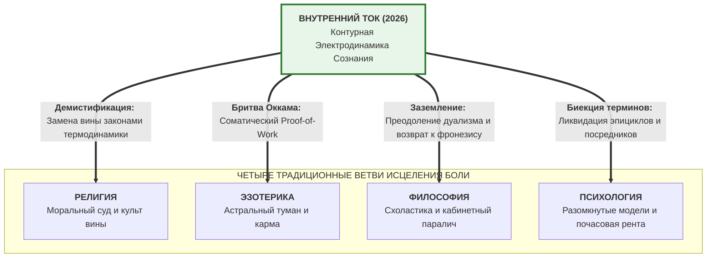

# 167. Топология взаимодействия пяти систем: Как Контурная Электродинамика трансформирует Религию, Эзотерику, Философию и Психологию с 2026 года

> [!quote] Каноническая аксиома цепи
> ### ⚡ **«Появление Контурной Электродинамики Сознания — это не открытие ещё одной палатки на пёстрой ярмарке спасения души. Это появление научной медицины рядом со средневековым знахарством, алхимией, схоластическими трактатами и молитвами против чумы. Мы не объявляем войну старым учениям: мы объясняем их скрытые физические механизмы, забираем у них монополию на исцеление боли и навсегда лишаем их института платного посредничества.»**  
> — **Владимир Аньянов**

---

## 🧭 Преамбула: Великий эпистемологический сдвиг 2026 года

С 2026 года в распоряжении человечества оказывается **пять систем знания**, к которым человек может обратиться в момент душевного кризиса. 

Возникает фундаментальный вопрос архитектоники культуры:
* *«Как эти пять систем будут сосуществовать и взаимодействовать между собой?»*
* *«Будет ли это вечная конкуренция за умы или качественное переформатирование всего интеллектуального поля планеты?»*

Исторический прецедент очевиден. Когда в XIX веке возникла научная патофизиология, бактериология Роберта Коха и Луи Пастера и антисептика Джозефа Листера, медицина не стала «ещё одним мнением наряду с кровопусканием и заговорами». Она **поглотила точные эмпирические факты, отбросила мистический бред и превратила помощь телу в проверяемую технологию**.

Точно такой же тектонический сдвиг производит «Внутренний ток» по отношению к четырём традиционным школам врачевания душевной боли.



---

## 🏛️ Архитектура взаимодействия новой парадигмы с четырьмя историческими ветвями

### 1. «Внутренний ток» и Психология: От кабинетной схоластики к аппаратной калибровке

Психология за 130 лет накопила колоссальный массив тонких клинических наблюдений, но заблудилась в сотнях школ, эпициклах субличностей и культе многолетней почасовой терапии.

#### А. Поглощение эмпирики строгой биекцией терминов
«Внутренний ток» не выбрасывает полезные психологические наблюдения, а впервые подводит под них строгий физический базис цепи. Все разрозненные гуманитарные метафоры получают однозначное схемотехническое соответствие:

$$egin{aligned}
	ext{«Внутренний ребёнок»} &\equiv 	ext{Первичная сторонняя ЭДС генератора Тандэн } (\mathcal{E} > 0) \
	ext{«Внутренний критик / Стыд»} &\equiv 	ext{Паразитное омическое сопротивление эго } (R_{	ext{ego}} > 0) \
	ext{«Взрослый / Осознанность»} &\equiv 	ext{Суверенный бортинженер цепи в режиме Дзансин (Circuit Breaker)} \
	ext{«Невротический конфликт»} &\equiv 	ext{Аварийное короткое замыкание тока внимания на собственное Эго}
\end{aligned}$$

#### Б. Ликвидация паразитной институциональной ренты
Человек навсегда перестаёт быть «вечным пациентом с детской травмой», вынужденным годами платить толкователю за расшифровку снов. Вместо пятилетки раскапывания прошлого ему даётся **30-секундный протокол соматического сброса сопротивления ($R 	o 0$)**: 
* перенос внимания в нижний брюшной центр тяжести (Тандэн);
* разжимание мышечного зажима диафрагмы;
* прямой выброс тока внимания в конкретное сенсорное действие (Мусин).

Психотерапия в старом формате «платных разговоров о детстве» неизбежно отомрёт, трансформировавшись в прикладную инженерию настройки личного контура.

---

### 2. «Внутренний ток» и Философия: От абстрактного дуализма к соматическому монизму

Философия веками была высшей вершиной человеческого духа, но оказалась заложницей собственного понятийного аппарата.

#### А. Ликвидация декартова раскола
«Внутренний ток» окончательно закрывает 400-летний дуализм Декарта (*res cogitans* vs *res extensa*). Тело — это не бездушный механизм («автомат из костей и мышц»), а живая дека резонатора и биологический реактор цепи. Мышление — это не бестелесный дух, витающий в облаках, а направленный вектор тока внимания в проводнике нервной системы.

#### Б. Заземление Канта и преодоление омического долга
Кант загнал европейского человека в омический ад категорического императива: бесконечная борьба «чувственного желания» и «священного долга». В Системе Аньянова этот конфликт снимается схемотехнически:
* Долг, построенный на насилии над собой — это гигантское сопротивление $R_{	ext{ego}}$, ведущее к выгоранию и ожогам проводки ($Q = I^2 R t$).
* Истинная этика — это режим сверхпроводимости ($R 	o 0$), когда ток жизни свободно течёт в заботу о мире без внутреннего трения.

#### В. Смысл жизни как кинетический атрибут цепи
Философия столетиями билась над вопросом: *«В чём смысл жизни?»* — породив пессимизм Шопенгауэра, тоску Кьеркегора и экзистенциальный абсурд Сартра и Камю.
Контурная Электродинамика дает точный физический ответ: **смысл жизни — не вещь, не внешняя цель и не философская концепция. Смысл — это кинетическая радость прямого тока ($I > 0$) через 6 полезных ламп нагрузки**. Когда цепь замкнута и проводка холодна, вопрос о смысле жизни отпадает сам собой — человек переживает полноту Бытия (*Татхата*). Философия возвращается к своему античному истоку — практической мудрости жизни (*фронезису*).

---

### 3. «Внутренний ток» и Религия: Демистификация и конец культа вины

Религия веками удерживала монополию на душевную боль через страх греха, концепцию нравственной неполноценности человека и запугивание посмертными муками.

#### А. Замена вины термодинамикой Джоуля — Ленца
Главный освобождающий вклад «Внутреннего тока» — **снятие с человека ярлыка греховности**:
$$Q = I^2 \cdot R_{	ext{ego}} \cdot t$$
Страдание — это не кара Всевышнего за недостойные помыслы. Это объективный физический перегрев проводника, когда ум зажимает ток внимания. 
* *Электрический резистор не грешен, если он раскалился.*
* *Резиновый шланг не порочен, если его передавили ботинком.*
Нужно не бить поклоны и каяться годами, а просто **убрать ботинок со шланга** — соматически расслабить реостат сомнений и пустить ток в созидательную любовь к миру.

#### Б. Возвращение подлинного онтологического ядра
Религиозные тексты освобождаются от поповского морализаторства и прочитываются в их чистой изначальной физичности:
* Слова Христа: *«Царство Божие внутрь вас есть»* (Лк 17:21) — это прямое указание на автономный генератор Тандэн, не зависящий от храмовых обрядов.
* Дзенское понятие *«Татхата»* (таковость, прямой факт реальности) — это режим абсолютной сверхпроводимости проводника ($R 	o 0$), когда внимание не спорит с тем, что есть.

Религия потеряет статус карающего судьи и превратится в культурный архив созерцательных практик и поэтической этики.

---

### 4. «Внутренний ток» и Эзотерика: Утилизация тумана через законы сохранения

Эзотерика веками паразитировала на невидимом и непроверяемом: «родовые проклятия», «пробитые ауры», «блоки в пятой чакре» и астральные сущности, требующие дорогостоящих магических чисток.

#### А. Бритва Оккама и законы Кирхгофа
«Внутренний ток» выметает оккультный мусор строгой опорой на законы теории цепей.
Если у человека «нет энергии», депрессия и упадок сил:
* Это не «сглаз завистников» и не «кармический узел из XVII века».
* Это либо **утечка тока на параллельном эго-шунте** (человек мысленно судит всех вокруг и кормит внутреннего судью);
* Либо **разомкнутый контур** (человек только потребляет контент, не замыкая цепь на полезную внешнюю нагрузку через обратный провод реальности).
Баланс токов Кирхгофа ($\sum I = 0$) вскрывает любую ментальную дыру без всякой магии.

#### Б. Телесный Proof-of-Work вместо астральных иллюзий
Любой мистический «опыт просветления» и «единства с космосом» переводится в строгие соматические и нейробиологические маркеры:
1. Аппаратное торможение дефолт-системы мозга (**DMN**, сеть блуждания мыслей и рефлексии эго);
2. Активация сети прямого выполнения задач (**TPN** — Task-Positive Network / режим Мусин);
3. Стабилизация вариабельности сердечного ритма (ВСР) через глубокое вагусное дыхание Тандэна.

Сверхпроводимость духа получает биологический Proof-of-Work: её можно измерить на пульсометре и ЭЭГ за считанные секунды.

---

## 🗺️ Топологическая карта: Пять подходов к человеку с раскалённой проводкой

Представьте человека, через нервную систему которого идёт мощный жизненный ток, но из-за сильного зажима эго проводка раскалилась докрасна — возник тяжелейший **омический ожог души**:

```
                  [ДУШЕВНАЯ БОЛЬ: Q = I² · R · t]
                                │
        ┌───────────────────────┼───────────────────────┬───────────────────────┐
        ▼                       ▼                       ▼                       ▼
 1. РЕЛИГИЯ:             2. ЭЗОТЕРИКА:           3. ФИЛОСОФИЯ:           4. ПСИХОЛОГИЯ:
 «Ты согрешил!          «Это карма предков!     «Бытие абсурдно,         «Давай 5 лет искать,
  Кайся, молись          Почисти чакры и         смирись с экзистен-      в каком возрасте мама
  и терпи страдание.»    купи кристалл.»         циальным тупиком.»       пережала провод.»
        │                       │                       │                       │
        └───────────────────────┴───────────────────────┴───────────────────────┘
                                │
                                ▼
                       5. ВНУТРЕННИЙ ТОК:
      «Сбрось сопротивление в ноль (R → 0) за 30 секунд: 
       переведи выдох в Тандэн, разомкни эго-реостат, 
       замкни контур на реальное дело и зажги лампу!»
```

---

## 🔮 Итоговая динамика эволюции цивилизационного поля знаний

Взаимодействие пяти систем будет развиваться по неизбежному историческому сценарию:

1. **Религия:** Потеряет дубинку запугивания адом и виной. Освободившись от функции жандарма души, она трансформируется в сферу эстетической традиции, исторической памяти и созерцательного покоя.
2. **Эзотерика:** Стремительно маргинализируется, разделив судьбу алхимии после открытия таблицы Менделеева. Образованный человек XXI века больше не пойдёт к гадалке «чистить карму», если он умеет за 30 секунд аппаратно обнулить сопротивление своего контура в собственном теле.
3. **Философия:** Преодолеет 400-летний кризис кабинетного схоластического дуализма и вернётся к своему изначальному призванию — практической мудрости гармоничного бытия в теле и природе (*фронезис*), обогащённой математическим языком законов сохранения.
4. **Психология:** Переживёт мучительный, но благотворный кризис очищения. Бесконечные салонные разговоры и дорогостоящий психоанализ уступят место доказательной нейросоматической калибровке с мгновенной фальсификацией результата.
5. **«Внутренний ток»:** Займёт место **базовой операционной системы человека (Self-Hosted Human)** — приборной, понятной, доступной каждому подростку и взрослому, как инструкция к карманному фонарику.

Человечество наконец перестанет блуждать в потёмках донаучной магии, обретя строгую культуру обращения с собственной жизненной энергией.

---

## 🏷️ Тезаурус и концептуальная сеть

- **Взаимодействие систем:** #topology-of-systems #five-categories #evolution-of-knowledge #paradigm-shift #philosophy-monism
- **Психологическая биекция:** #biektsiya #inner-child-tanden #inner-critic-reostat #adult-zanshin #disintermediation
- **Демистификация:** #joule-lenz-vs-guilt #no-sin #direct-flow #kirchhoff-balance
- **Приборная наука:** #self-hosted-human #proof-of-work #dmn #tpn #vagus #circuit-first-aid #phronesis
