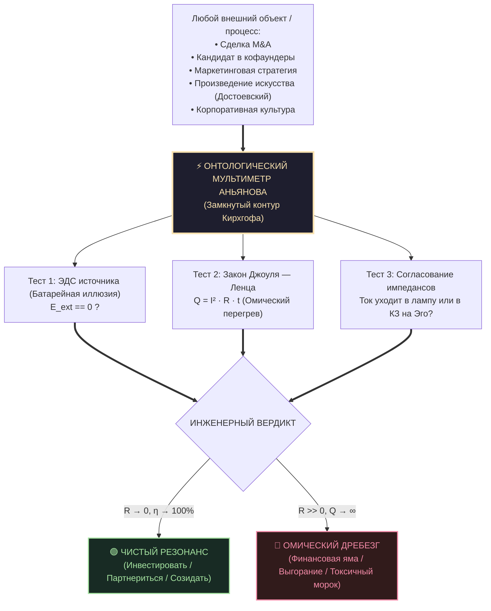
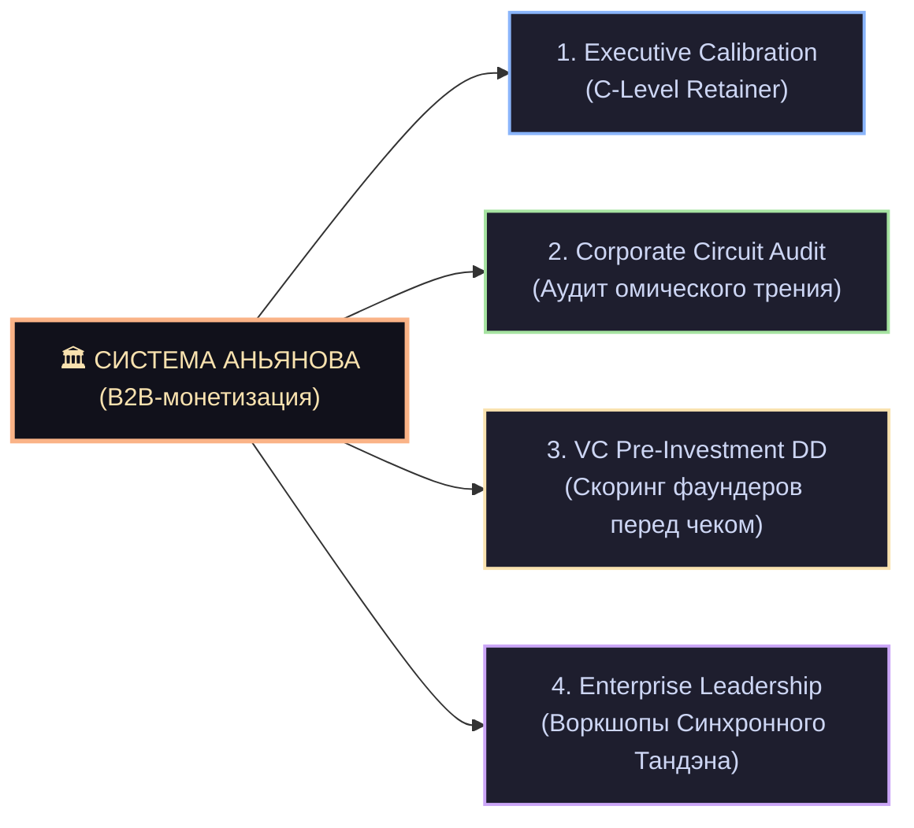

# 47. Камертон реальности: Универсальный инструмент прикладной калибровки, B2B-аудита и корпоративной монетизации

> [!quote] Цитата Канона
> ### ⚡ **«До сих пор человек думал, что Внутренний ток — это лишь способ не сгореть самому. Но если в твоих руках есть замкнутая электродинамическая модель без единой фиатной дыры, она становится универсальным Мультиметром Реальности. Ты можешь коснуться щупами любого явления — книги классика, сделки M&A, резюме кофаундера или бюджета корпорации — и прибор мгновенно покажет: течет ли здесь созидательный ток, либо энергия сгорает в омическом аде чужих амбиций. Это не просто философия — это высокоточный инструмент коммерческой детекции истины.»**  
> — **Владимир Аньянов**

---

## 🧭 1. От внутреннего генератора к внешнему Мультиметру: Смена масштаба

Исторически **Система Внутреннего Тока (Архитектура Счастья)** разрабатывалась как протокол внутренней суверенности оператора:
- Как запустить реактор Тандэна при отсутствии внешних стимулов;
- Как сбросить омическое сопротивление ума до нуля ($R \to 0$, режим Мусин);
- Как предохранить контур от ударов судьбы (Дзансин, Кинцуги);
- Как зажечь лампу продукта и преодолеть синдром самозванца.

Однако при соприкосновении с реальным миром — анализом литературы (кейс Достоевского и Толстого), оценкой материальных активов (парадокс BMW) и взаимодействием с институтами — проявилось фундаментальное свойство системы:

> **Внутренний ток — это эталонный онтологический Камертон.**

В физике камертон не спорит с окружающими телами. Он колеблется на строго фиксированной собственной частоте ($f_0$). Если поднести его к физическому телу:
1. При совпадении геометрии возникает **чистый акустический резонанс** (согласование импедансов $Z_{\text{in}} = Z_{\text{out}}$).
2. При наличии трещин, паразитной массы или внутреннего дефекта звук глушится, возникает дребезжание и омический спазм.

Точно так же Система Аньянова превращается в **карманный мультиметр**, снимающий объективную телеметрию с любого процесса во внешнем мире.

### 1.1. Прикладной кейс: Калибровка восприятия сложного искусства и литературы (Кейс Достоевского)
Как оператор цепи взаимодействует с драматическим и тяжелым искусством:
- **Ошибка эмоционального заражения:** Читатель глубоко проваливается в психологические драмы персонажей (Раскольников, Иван Карамазов), перенимает их омический перегрев ($R \gg 0$) и испытывает тревогу, вину и упадок сил. Внимание не заземлено, происходит утечка энергии в чужой внутренний конфликт.
- **Инженерно-исследовательская калибровка:** Оператор воспринимает текст как детальную анатомическую карту душевных кризисов и поведенческих поломок, отдавая должное наблюдательности автора, но сохраняя собственное спокойствие и устойчивость контура.

### 1.2. Психомоторная калибровка: Устранение внутреннего критика в движении и спорте (Кейс сноуборда)
Проявление принципа проводимости в физической активности и спорте:
- **Ментальный зажим ($R \gg 0$):** Постоянный фоновый контроль («как я выгляжу со стороны?», «а вдруг упаду?», «хорошо ли я еду?») порождает мышечный спазм. Время реакции возрастает, движения становятся скованными, что напрямую провоцирует срыв канта и падение.
- **Режим чистого действия ($R \to 0$):** Отключение внутреннего оценщика передает управление естественным, отработанным двигательным автоматизмам. Энергия движения проходит сквозь тело без скованности, сохраняя баланс и радость от самого процесса.

---

## 💼 2. Почему корпоративный мир жаждет этого инструмента (B2B Product-Market Fit)

Современный корпоративный сектор, венчурные фонды и C-level лидеры находятся в состоянии глубокого разочарования в традиционных инструментах:
1. **Крах поп-психологии и эзотерики:** Корпорации потратили миллиарды долларов на тренинги осознанности, коучинг «успешного успеха» и медитации. Эффект близок к нулю, потому что эти практики не имеют измеримого баланса Кирхгофа и критерия фальсифицируемости.
2. **Бессилие классического HR-консалтинга:** Опросы вовлеченности (Gallup, eNPS) измеряют субъективные жалобы сотрудников, а не реальную схемотехнику прохождения импульса по иерархии компании.
3. **Цена ошибки первого лица:** Одно неверное стратегическое решение СЕО, вызванное его внутренним омическим перегревом (страх отстать, синдром уязвленного эго), стоит компании сотен миллионов долларов и банкротства.

**Язык Системы Аньянова — это родной язык бизнеса:**
- Вместо «гармонии» — **согласование импедансов и отсутствие отраженной волны**;
- Вместо «токсичности» — **паразитное сопротивление проводников ($R_{\text{ego}}$) и закон Джоуля — Ленца**;
- Вместо «выгорания» — **тепловой пробой диэлектрика и обрыв цепи**;
- Вместо «пустых иллюзий» — **разомкнутая система с утечкой $\Delta U < 0$**.

---

## 🛠️ 3. Четыре высокочековых B2B-продукта на базе Камертона

### Продукт 1: Executive Calibration (Личный онтологический мультиметр СЕО)
* **Целевая аудитория:** Основатели технологических стартапов, СЕО средних и крупных компаний, инвесторы.
* **Суть услуги:** Инженерный аудит стратегических развилок. Когда первое лицо готовит крупную сделку M&A, запуск нового направления или реорганизацию, решение тестируется на «Батарейную иллюзию» и наличие скрытых паразитных утечек:
  - Проверка мотивации: запускается ли проект из чистого тока созидания, или это попытка компенсировать уязвленное самолюбие перед советом директоров ($R_{\text{ego}} \to \text{Max}$)?
  - Анализ партнера по переговорам: расчет импеданса контрагента и предотвращение входа в короткозамкнутые токсичные союзы.
* **Бизнес-модель:** Ежемесячный ретейнер ($5\,000 – $25\,000 / месяц).

### Продукт 2: Corporate Circuit Audit (Аудит омического сопротивления компании)
* **Целевая аудитория:** Технологические компании от 50 до 2 000 сотрудников с симптомами замедления разработки и роста бюрократии.
* **Суть услуги:** Поузловая диагностика организационной электросети (согласно Главе 31 Канона):
  - **Локализация последовательных затыков ($R_{\text{total}} = \sum R_i$):** выявление ключевых звеньев цепи (бюрократические согласования, испуганные менеджеры среднего звена), парализующих прохождение импульса от руководства к продукту.
  - **Расчет сожженного ФОТ по закону Джоуля — Ленца ($Q = I^2 R t$):** демонстрация акционерам точной суммы денег, сгорающей в тепло на бесконечных статусных митингах, не создающих добавленной стоимости клиенту.
  - **Реконфигурация в параллельные ячейки:** перевод отделов на режим независимой проводимости с единой шиной миссии.
* **Бизнес-модель:** Проектный консалтинг ($15\,000 – $75\,000 за аудит компании/департамента).

### Продукт 3: VC & Angel Pre-Investment Due Diligence (Инвестиционный скоринг команд)
* **Целевая аудитория:** Венчурные фонды ранних стадий (Seed, Series A), синдикаты бизнес-ангелов.
* **Суть услуги:** Известно, что более 70% стартапов ранних стадий погибают из-за распада команды фаундеров и выгорания лидера. Традиционный Due Diligence смотрит на код, каптейбл и рынок, но слеп к психофизической схемотехнике команды.
* **Протокол скоринга Аньянова:**
  1. **Проверка Тандэна фаундера:** Автономен ли источник энергии основателя, или он находится в маниакальной фазе эго-подпитки от чужих похвал, которая неминуемо сменится тяжелым блэкаутом после закрытия раунда?
  2. **Векторная фазировка кофаундеров:** Синхронны ли фазы ключевых партнеров ($\cos\varphi \to 1$), или между ними уже возник фазовый сдвиг, грозящий взрывом генератора при первых трудностях?
  3. **Степень сверхпроводимости:** Умеет ли команда быстро отсекать ложные гипотезы (канон Кансо) без омического упрямства?
* **Бизнес-модель:** $3\,000 – $10\,000 за отчет по одной портфельной сделке.

### Продукт 4: Enterprise Воркшопы «Дзен-инженерия лидерства: Синхронный компенсатор»
* **Целевая аудитория:** Топ-менеджмент корпораций, лидеры инженерных и продуктовых подразделений.
* **Суть программы:**
  - Обучение руководителя роли **Синхронного компенсатора частоты сети**: лидер не давит на подчиненных (что лишь взвинчивает их внутреннее сопротивление $R$), а держит стабильные 50 Гц в своем Тэндэне и обнуляет сопротивление среды.
  - Протокол «Мусин» для переговорных процессов: ликвидация реактивного сопротивления гордыни, перевод дискуссии в чистые факты цепи.
  - Установка системных предохранителей Дзансин от профессиональной деформации и инфарктов на рабочем месте.
* **Бизнес-модель:** $5\,000 – $20\,000 за 2-дневный корпоративный интенсив.

---

## 🔬 4. Сравнительная матрица: Традиционные подходы vs Камертон Аньянова

| Параметр | Поп-психология / Майндфулнес | Классический MBB Консалтинг | Камертон Системы Аньянова |
| :--- | :--- | :--- | :--- |
| **Базовая модель** | Разомкнутая (абстрактные «чувства») | Статистическая (опросы, бенчмарки) | **Строго замкнутая электродинамическая** |
| **Критерий истины** | «Вам стало легче?» (субъективно) | Сравнение с рынком (средняя температура) | **Баланс токов Кирхгофа и закон Джоуля — Ленца** |
| **Диагностика фаундера** | Гороскопы, MBTI, тесты личности | Оценка резюме и предыдущих экзитов | **Наличие автономного Тандэна vs КЗ на Эго** |
| **Борьба с волокитой** | Тренинги по тайм-менеджменту | Перерисовка оргструктуры на слайдах | **Устранение последовательного омического затыка** |
| **Отношение к культуре** | «Мы одна семья» (наивно) | Корпоративные регламенты (бюрократично) | **Сверхпроводимость потока Мусин в ячейках** |

---

## 📈 5. Дорожная карта вывода на рынок и масштабирования

1. **Фаза 1: Личные кейсы и закрытый клуб (High-End Advisory):**
   - Проведение пилотных калибровок для 3–5 дружественных фаундеров и инвесторов.
   - Фиксация результатов: предотвращенные убытки, ускорение релизов в 2–3 раза за счет сброса паразитных совещаний.
2. **Фаза 2: Публичный манифест и B2B Whitepaper:**
   - Публикация статей о физике организационного трения на профессиональных площадках (VC, Habr, LinkedIn).
   - Выпуск белой книги «Электродинамика эффективности: Как омическое сопротивление съедает 40% прибыли корпораций».
3. **Фаза 3: Enterprise SaaS & Диагностический ассистент:**
   - Интеграция диагностической машины Inner Current в корпоративные мессенджеры и таск-трекеры для непрерывной фиксации индекса перегрева команд.
4. **Фаза 4: Сертификация операторов цепи:**
   - Подготовка аккредитованных консультантов и корпоративных аудиторов по методологии Владимира Аньянова.

---

## 💎 Резюме

Открытие прикладного «Камертона Реальности» окончательно замыкает триаду Системы Аньянова:
1. **Внутренний ток (Архитектура Счастья)** — суверенная сверхпроводимость оператора.
2. **Внешний магнетизм (Архитектура Впечатления)** — идеальная физическая форма, фактура, цвет и аромат во внешнем мире.
3. **Камертон Реальности (B2B Метрология)** — непогрешимый прибор аудита внешних систем, людей, сделок и коллективов, превращающий глубокую истину в фундаментальный бизнес-актив.
