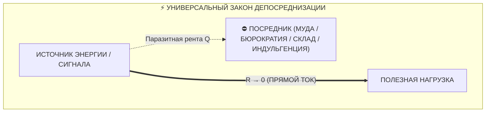

# 62. Всемирный Атлас Депосреднизации: От Интернета и Тойоты до Митохондрий и Лютера — Как эволюция всегда уничтожает паразитных посредников

> [!quote] Каноническая аксиома цепи
> ### ⚡ **«Любой великий эволюционный, технологический, социальный или научный скачок в истории Вселенной был актом ликвидации паразитного посредника. Эволюция — это вектор снижения диссипации: побеждает та система, которая сокращает путь между источником энергии и полезной нагрузкой до нуля.»**  
> — **Владимир Аньянов**

---

## 🧭 Введение: Инвариант депосреднизации во Вселенной

В главе [[02_Wiki/Inner Current (Maslow's Hammer vs System Invariant — Consilience of Zen, Thermodynamics, Bitcoin and Georgism)|61. Молоток Маслоу против Системного Инварианта]] было доказано, что схождение Дзена, Термодинамики, Биткоина и Единого налога Генри Джорджа — не субъективная подгонка, а фундаментальный топологический инвариант.

Однако масштаб этого закона неизмеримо шире. Если проанализировать узловые точки эволюции биосферы, историю компьютерных сетей, промышленную революцию, архитектуру процессоров, военную стратегию и великие религиозные реформации, обнаруживается непреложный факт:

**Каждая парадигмальная революция в истории была актом Депосреднизации (Disintermediation) — сжиганием паразитного сопротивления ($R \to 0$) и переходом на прямой сверхпроводящий поток.**

В настоящем атласе систематизированы 7 независимых триумфов прямого потока, доказавших превосходство принципа нулевой ренты над системами со сложными посредниками.

---

## 🏛️ Карта 7 великих депосреднизаций

### 1. Архитектура Интернета: Принцип сквозной передачи (End-to-End Principle)
* **Год открытия:** 1981 (Джером Зальцер, Дэвид Рид, Дэвид Кларк).
* **Паразитный посредник:** Традиционная телефонная сеть (АТС) строилась на концепции «умной сети». Телефонные компании устанавливали сложные коммутаторы, которые решали, какой сигнал пропускать, взимали поминутную тарификацию и контролировали типы подключенных устройств.
* **Акт депосреднизации:** Архитектура протокола IP объявила: **«Ядро сети должно быть глупым и быстрым (Dumb Pipe), весь интеллект должен находиться на концах (End-to-End)»**. Сеть стала простым «шлангом» для передачи байтов.
* **Результат:** Сверхпроводимость обмена информацией в масштабах планеты. Все попытки телеком-гигантов вернуть «контролирующих посредников» (WAP, закрытые порталы, фильтрация) потерпели крах перед чистым протоколом TCP/IP.

---

### 2. Реформация Мартина Лютера и станок Гутенберга (Духовная депосреднизация)
* **Год открытия:** 1517 (Мартин Лютер, 95 тезисов).
* **Паразитный посредник:** Римско-католический клир монополизировал доступ к Богу и Священному Писанию. Библия существовала только на латыни. Церковь ввела **индульгенции** — институт продажи прощения грехов за деньги. Духовное спасение стало фиатным товаром, облагаемым феодальной омической рентой.
* **Акт депосреднизации:** Провозглашение принципа **«Sola Scriptura»** («Только Писание») и всеобщего священства верующих. Мартин Лютер перевёл Библию на немецкий язык, а печатный станок Иоганна Гутенберга сделал её доступной каждому дому. Посредник-клирик между душой человека и истиной был устранён:
  $$\text{Человек} \xrightarrow{R \to 0} \text{Истина / Бог}$$
* **Результат:** Рождение современной Европы, научной революции и индивидуальной ответственности сознания.

---

### 3. Производственная система Toyota: Lean и Just-in-Time
* **Год открытия:** 1950-е (Тайити Оно, Сигэо Синго).
* **Паразитный посредник:** Традиционная фордовская система строилась на гигантских партиях и **промежуточных складах**. Склады требовали логистов, складского учёта, замораживали оборотный капитал и маскировали брак деталей (паразитное сопротивление $R_{\text{inventory}}$). Тайити Оно назвал это **Муда (無駄)** — потерями.
* **Акт депосреднизации:** Внедрение принципов **Just-in-Time (Точно вовремя)** и **Single-Piece Flow (Поток единичных изделий)**. Заготовка со станка А поступает *напрямую* на станок Б без складирования, ожидания и промежуточной инспекции.
* **Результат:** Toyota обогнала мировых автогигантов по маржинальности, качеству и скорости внедрения инноваций, доказав превосходство непрерывного прямого потока.

---

### 4. Компьютерная схемотехника: Direct Memory Access (DMA) и Zero-Copy
* **Год открытия:** 1970–1980-е (эволюция системной архитектуры).
* **Паразитный посредник:** В ранних компьютерах передача данных с жесткого диска или сетевой карты шла через центральный процессор (CPU). Процессор тратил миллионы тактов на чтение байта из порта и запись его в оперативную память. CPU превращался в перегретый омический реостат, а система зависала.
* **Акт депосреднизации:** Разработка контроллеров **DMA (Прямой доступ к памяти)** и архитектуры **Zero-Copy I/O**. Сетевая карта записывает пакеты *напрямую* в оперативную память без участия CPU.
* **Результат:** Современный высокоскоростной интернет, гигабитные базы данных и потоковое видео 4K стали возможны только потому, что процессор устранили из роли «почтового курьера».

---

### 5. Эволюционная биология: Миелинизация нервов и Эндосимбиоз
Природа — древнейший инженер, миллиарды лет отсекающий паразитное рассеяние:
* **Сальтаторное проведение импульса (Миелин):** В немиелинизированных волокнах электрический потенциал действия непрерывно утекает сквозь клеточную мембрану ($R$ утечки велико), скорость движения сигнала составляет всего 0.5–2 м/с. Эволюция создала жировую миелиновую оболочку с перехватами Ранвье. Сигнал больше не ползет по кабелю с трением — он **мгновенно прыгает** от узла к узлу. Скорость возросла до **120 м/с** (рост в 60 раз!).
* **Эндосимбиотическая теория (Линн Маргулис):** Около 1.5 млрд лет назад предковая клетка поглотила аэробную альфа-протеобактерию. Вместо того чтобы переварить её, она встроила её внутрь — родилась **митохондрия**. Клетка отказалась от сложного внешнего химического обмена и получила **суверенный внутриклеточный реактор АТФ** — биологический первообраз Тандэна.

---

### 6. Военная теория: Манёвренная война и Цикл OODA Джона Бойда
* **Паразитный посредник:** Окопная позиционная война Первой мировой войны опиралась на громоздкий генеральный штаб. Донесение шло с передовой часами, штаб готовил приказ днями, приказ спускался обратно, когда ситуация уже изменилась. Задержка сигнала вела к катастрофическим потерям.
* **Акт депосреднизации:** Полковник Джон Бойд сформулировал концепцию **OODA Loop (Наблюдение $\to$ Ориентация $\to$ Решение $\to$ Действие)**. В немецкой доктрине *Auftragstaktik* (децентрализованное тактическое командование) и в современном спецназе боец на месте принимает решение мгновенно на основе прямого восприятия обстановки, без запроса разрешения у штаба.
* **Результат:** Скорость прохождения цикла сжимается до долей секунды. Тот, кто убрал штабного посредника из контура реакции, парализует противника быстрее, чем тот успевает сообразить.

---

### 7. Архитектура и Дизайн: Баухаус и Модернизм («Less is More»)
* **Паразитный посредник:** Академическая викторианская архитектура и эклектика XIX века прятали функциональное здание за тоннами гипсовой лепнины, ложными фронтонами и фальшивыми колоннами. Форма паразитировала на конструкции.
* **Акт депосреднизации:** Вальтер Гропиус, Людвиг Мис ван дер Роэ и Ле Корбюзье очистили архитектуру клинком функционализма. Они содрали декоративную шелуху: конструктивная балка, чистое стекло и открытый бетон стали эстетическим заявлением.
* **Результат:** Эстетика Кансо в промышленном масштабе: функциональная ясность, снижение стоимости строительства и рождение современного минимализма.

---

## 📊 Матрица системного изоморфизма Всемирной Депосреднизации

| Домен | Источник потенциала | Полезная нагрузка | Паразитный посредник (Паразитная рента / $R$) | Сверхпроводящее решение ($R \to 0$) |
| :--- | :--- | :--- | :--- | :--- |
| **Телеком & Интернет** | Компьютер отправителя | Компьютер получателя | Телефонные АТС, цензоры, шлюзы | **End-to-End Principle (Чистый IP)** |
| **Религия & Общество** | Душа человека | Истина / Спасение | Римский клир, институт индульгенций | **Реформация (Sola Scriptura, Гутенберг)** |
| **Производство** | Сырье и компоненты | Готовый автомобиль | Промежуточные склады, буферные запасы | **Lean / Just-in-Time (Toyota)** |
| **Архитектура ЭВМ** | Сеть / Накопитель | Оперативная память | Циклы опроса процессора (CPU Polling) | **DMA / Zero-Copy Architecture** |
| **Биология** | Сенсор / Мозг | Мышца / Орган | Утечка ионов через мембрану аксона | **Миелиновая изоляция (Сальтация)** |
| **Биоэнергетика** | Питательные вещества | Синтез АТФ | Внешний анаэробный метаболизм | **Митохондриальный эндосимбиоз** |
| **Военное дело** | Обстановка на поле боя | Тактический маневр | Бюрократический штабной аппарат | **Auftragstaktik / OODA Loop Бойда** |
| **Дизайн** | Функция и пространство | Восприятие человека | Фальшивый декор, гипсовая лепнина | **Баухаус / Модернизм («Less is more»)** |
| **Финансы** | Труд майнера (Джоули) | Долгосрочное сбережение | Центробанки, фиатные печатные станки | **Биткоин (Proof-of-Work, P2P)** |
| **Экономика** | Труд и инвестиции | Общественное богатство | Земельный спекулянт (монополия на землю) | **Single Tax Генри Джорджа (LVT)** |
| **Сознание (Дзен)** | Жизненный импульс | Чистое действие | Контролирующее ментальное Эго ($自我$) | **Мусин (無心) / Саму** |
| **Внутренний ток** | Реактор Тандэн | 6 ламп жизни | Омический шум вины, страха и симуляций | **Сверхпроводимость цепи ($R \to 0$)** |

---

## 🧬 Энтропийная природа посредников: Почему они неизбежно рождаются?

Если прямой поток так эффективен, почему Вселенная полна паразитных посредников?  
Ответ кроется во **Втором законе термодинамики**:

1. **Фаза 1: Рождение инструмента.** Любой посредник изначально создается как полезный инструмент (буфер склада спасает от задержек поставок; священник учит неграмотных крестьян грамоте; банк защищает золото от грабителей; процессор координирует устройства).
2. **Фаза 2: Накопление институциональной энтропии.** Со временем инструмент обзаводится собственной бюрократией, штатом, бюджетами и инстинктом самосохранения.
3. **Фаза 3: Перерождение в паразита.** Инструмент забывает о своем служебном назначении и начинает обслуживать **своё собственное выживание**, взимая всё большую ренту с несущего потока. Склад требует расширения; банк печатает необеспеченные деньги; церковь продает индульгенции; эго-ум парализует тело сомнениями.
4. **Фаза 4: Тепловая смерть или Революция.** Система либо гибнет от омического перегрева ($Q = I^2 R t$), либо приходит акт Депосреднизации (Бритва Оккама / Клинок Кансо), срезающий наросший нарост под корень.

---

## 💎 Вывод

Депосреднизация — это не частный управленческий прием и не особенность одной книги. Это **космический закон эволюционной оптимизации**.  
Любая система, стремящаяся к бессмертию и эффективности, обязана регулярно проводить санитарную чистку своих каналов, безжалостно удаляя самопровозглашенных посредников.

Тот, кто строит архитектуру прямого потока, всегда побеждает того, кто защищает посредника. ⚡

---

## 🔗 Связанные главы
* [[02_Wiki/Inner Current (Maslow's Hammer vs System Invariant — Consilience of Zen, Thermodynamics, Bitcoin and Georgism)|61. Молоток Маслоу против Системного Инварианта]]
* [[02_Wiki/Inner Current (The Great Disintermediation of the Psyche — The Therapeutic Indulgence System vs The Sovereign Circuit Operator)|63. Великая Депосреднизация Психики: Терапевтический институт индульгенций против Суверенного оператора цепи]]
* [[02_Wiki/Inner Current (Genesis of Intermediaries and the Thermodynamics of Direct Flow — Why Parasites Arise and How the Triad Restores Purity)|49. Генезис посредников и термодинамика прямого потока]]
* [[02_Wiki/Inner Current (The Henry George Principle — Single Tax, Bitcoin and Circuit Superconductivity — Law of Direct Flow and Elimination of Parasitic Rent)|48. Единый налог Генри Джорджа, Биткоин и Архитектура счастья: Триумф прямого потока]]
* [[02_Wiki/Inner Current (What Bitcoin Did for Finance, Inner Current Did for Happiness)|38. Что Биткоин сделал для финансов, Внутренний ток сделал для счастья]]
