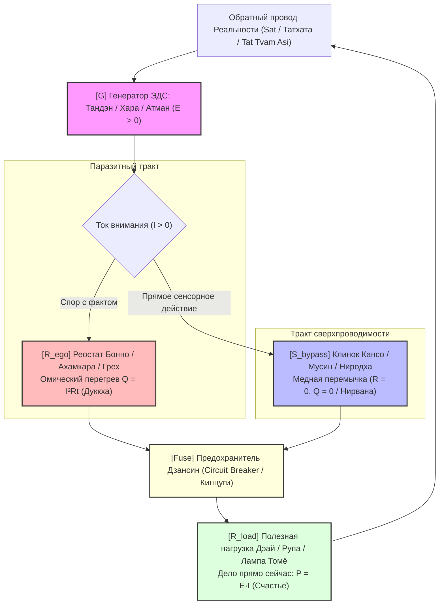

# 139. Универсальная демистификация религий и Шаг Прометея: Перевод мистических доктрин на электродинамику фонарика, лингвистический канон Ниродхи и принципиальная схема цепи

> *«Тысячелетиями человечество блуждало в тумане мистических метафор, храмового морализаторства и эзотерической герметичности. Но религии говорили не о загробных судах и не о капризных духах — они интуитивно описывали режимы работы электромагнитного контура человека. "Шаг Прометея" заключается в том, чтобы сорвать с мудрости веков благовония и тайну, передав её каждому в виде простой, проверяемой и безопасной схемы карманного фонарика: Батарейка (Тандэн) $\to$ Провод (Внимание) $\to$ Лампочка (Дело прямо сейчас) $\to$ Предохранитель (Дзансин). Когда сопротивление эго обнуляется ($R \to 0$), угасает омический ад страданий ($Q = 0$), и наступает то, что древние на санскрите и пали называли Ниродхой — абсолютная сверхпроводимость духа».*
> — **Владимир Аньянов**, создатель «Архитектуры счастья»

---

## 1. Шаг Прометея: Депосреднизация и демистификация духовных доктрин

Можно ли через инженерную оптику «Архитектуры счастья» объяснить все туманные и загадочные высказывания мировых религий, мистиков и гуру, переведя их на строгий, проверяемый и общедоступный язык?

**Да, именно в этом заключается центральный замысел и методологический каркас книги Владимира Аньянова «Внутренний ток: Архитектура счастья».**

Книга ставит задачу совершить то, что автор называет **«Шагом Прометея»** — сорвать с тысячелетней мудрости мистический флёр, благовония, храмовую герметичность и морализаторство, переведя туманные метафоры на строгий, прикладной и проверяемый язык электродинамики, теории цепей и термодинамики.

Подобно тому как Мартин Лютер убрал священников-посредников из веры, а Сатоши Накамото устранил банки из денежных транзакций, «Внутренний ток» убирает касту мистиков, гуру и коммерческих толкователей из сознания человека. Сложная метафизика заменяется понятной **4-элементной моделью карманного фонарика**, возвращая каждому статус автономного бортинженера собственной жизни:

$$\text{Батарейка (Тандэн)} \xrightarrow{R \to 0\text{ (Внимание/Мусин)}} \text{Лампочка (Дело/Дэай)} \quad [\text{Защита: Предохранитель Дзансин}]$$

---

## 2. Пять великих доктрин на «инженерном языке карманного фонарика»

В книге перевод ключевых религиозных, мистических и философских доктрин на «инженерный язык карманного фонарика» реализуется системно по 5 фундаментальным узлам:

### 1. Что такое «Грех», «Карма» и «Страдание» (Дуккха)
* **В туманных догмах:** «Наказание свыше», «греховная природа человека», «тяжёлая карма прошлых жизней» или мистическое проклятие, требующее покаяния, страха и самобичевания.
* **Перевод на понятный язык:** **Омический перегрев проводника по закону Джоуля — Ленца ($Q = I^2 R t$).** Человек — это электрический двухполюсник. Резистор не грешен: когда внимание пережимается мысленным спором с реальностью, страхом за статус или виной ($R_{\text{ego}} > 0$), колоссальный ток жизни не совершает полезную работу, а выжигает нервную систему изнутри. Тело чувствует это как спазм, тревогу, бессонницу и выгорание. Решением является не молитвенное вымаливание прощения, а устранение залома и сброс сопротивления в ноль ($R \to 0$).

### 2. «Нирвана», «Царство Небесное внутри вас» и «Дао / У-вэй»
* **В туманных догмах:** Недостижимое трансцендентное блаженство, доступное только схимникам и святым после 30 лет затвора в монастыре.
* **Перевод на понятный язык:** **Режим чистой сверхпроводимости замкнутой цепи ($R \to 0, I > 0$).**
  * **Нирвана** (букв. *«угасание пламени»*) — прекращение паразитного омического горения ($Q = 0$).
  * **«Царство Божие внутри вас»** (Лк. 17:21) и завет *«Будьте как дети»* — работа автономного соматического генератора тела (Тандэн) без паразитного эго-шунта сомнений ($R_{\text{ego}} = 0$), когда ток без потерь питает действие прямо сейчас.
  * **У-вэй** (無為, деяние через недеяние) — протекание тока по линии наименьшего сопротивления без ментального трения.

### 3. «Tat Tvam Asi» (तत्त्वमसि — Ты есть То) и Снятие раскола «Человек vs Мир»
* **В туманных догмах:** Загадочная махавакья Упанишад о мистическом растворении капли в океане Абсолюта.
* **Перевод на понятный язык:** **Топология замкнутой цепи и обратный провод реальности.** Ток не может течь в разомкнутом пространстве. Мир вокруг, другие люди и предметы труда — это не «чужие внешние объекты», а внешняя полезная нагрузка и обратный провод вашей собственной замкнутой цепи. Без контакта с миром цепь разомкнута ($R \to \infty, I = 0$). Вы и ткань реальности перед вами — узлы одного неразрывного колебательного контура.

### 4. «Форма есть пустота, пустота есть форма» (Сутра Сердца)
* **В туманных догмах:** Абстрактный парадокс буддизма Махаяны, балансирующий на грани нигилизма.
* **Перевод на понятный язык:**
  * **Форма пуста ($\mathcal{E}_{\text{load}} \equiv 0$):** Внешние объекты (автомобили BMW, дипломы, должности, одежда, другие люди) являются пассивной нагрузкой; в них нет встроенного генератора счастья. Попытка «высосать» счастье из лампочки — авария обратного тока.
  * **Пустота есть форма:** Потенциал Тандэна (пустота/потенциальность) не может светить сам по себе в вакууме — он обязан материализоваться через полезную нагрузку (мытьё чашки, написание кода, общение, физический созидательный труд). Счастье — это не вещь, а **динамический процесс протекания тока сквозь неё**.

### 5. Бог, Душа и Эго
* **В туманных догмах:** «Бог-Хозяин на небесах, требующий отчёта», «бессмертная субстанциальная душа-песчинка» и «дьявольское эго».
* **Перевод на понятный язык:**
  * **Бог** — законы сохранения энергии и заряда, объективная Реальность (*Sat* / Татхата) и единое непрерывное электромагнитное поле бытия.
  * **Душа** — не застывший предмет, а уникальный динамический режим настройки контура и согласования импеданса (диссипативная структура Пригожина).
  * **Эго** — паразитный виртуальный реостат ($R_{\text{ego}}$), включённый последовательно в цепь внимания. Его не нужно «убивать» в кровопролитных духовных войнах — его достаточно аппаратно шунтировать прямым сенсорным действием.

---

## 3. Лингвистический прорыв: Как перевести Нирвану на язык сверхпроводимости

«Нирвана» традиционно переводится как «угасание пламени». Как на языках древнего канона — **пали** и **санскрите** — строго выразить **«угасание сопротивления»**, соединив древнюю интуицию с физикой сверхпроводимости?

### 1. Лингвистический и физический разбор корней
* **Как устроена Ниббана (Nibbāna):**
  Слово образовано от префикса *ni-* / *nis-* («без», «наружу», «прекращение») и глагольного корня *vā* («дуть», «веять»). Буквально: *«затухание от прекращения поддува»*, *«угасание пламени»*, когда кончилось топливо (*упадана*).
* **Понятие «сопротивления» в канонических языках:**
  В канонических текстах сопротивление, препятствие, затор или трение передаётся через фундаментальные корни:
  1. **Rodha** (от корня *rudh* — препятствовать, задерживать, оказывать сопротивление, блокировать). В современном языке науки в Индии именно корень *rodha* используется для обозначения электрического сопротивления (хинди/санскр. *pratirodha* — электрическое сопротивление, резистор).
  2. **Paṭigha** (от *paṭi* + *han* — соударение, трение, сопротивление, отталкивание, внутренний зажим).
  3. **Bandhana / Āvaraṇa** (путы, зажим, залом проводимости).

### 2. Новый палийский канон: Ниродхата или Ниппатигха

Для точного инженерного перевода понятия «Нирвана» в парадигму контурной электродинамики формируются два строгих термина:

#### Вариант I (Канонический): Ниродхата (Nirodhatā) / Ниродха-дхату (Nirodha-dhātu)
* **Этимология:** *Ni-* (прекращение, обнуление) + *rodha* (сопротивление, затор, балласт) + суффикс абстрактного состояния *-tā* (-ость).
* **Буквальный перевод:** «Состояние полного отсутствия сопротивления» или «Нулевое омическое сопротивление» ($R \to 0$).
* **Связь с каноном:** В Палийском каноне термин *Ниродха* (*Nirodha*) традиционно переводится как «прекращение страдания» (третья Благородная Истина — *Дуккха-ниродха*). В электродинамической оптике Аньянова раскрывается его прямой физический смысл: прекращение омического сопротивления в тракте внимания.

#### Вариант II (Прямой неологизм сверхпроводимости): Ниппатигха (Nippaṭigha)
* **Этимология:** *Nis-* / *Ni-* (полное устранение) + *paṭigha* (трение, внутреннее соударение, сопротивление узлов решётки).
* **Буквальный перевод:** «Бестрение», «Сверхпроводимость».
* **Физический смысл:** В физике твёрдого тела сопротивление возникает из-за соударения носителей заряда с кристаллической решёткой проводника. Мусин (*Mushin*) устраняет эти соударения. *Nippaṭigha* — это режим, при котором ток внимания ($I$) проходит сквозь психосоматическую структуру человека без единого столкновения с узлами рефлексии и сомнений ($Q = 0$).

---

## 4. Санскритский канон сверхпроводимости

Если переводить «Нирвану» именно с **санскрита** на строгий язык контурной электродинамики и физики сверхпроводимости, терминообразование строится по законам санскритской грамматики (*samāsa* и *sandhi*):

1. **Исходное санскритское слово: निर्वाण (Nirvāṇa)**  
   Префикс *nis-* / *nir-* (निस् / निर्) — «наружу», «без», «прекращение» + корень *vā* (वा) — «дуть», «веять» + суффикс *-ana*. Буквально: «сдутое», «задутое», «угасание пламени».

2. **Санскритские эквиваленты «обнуления сопротивления»:**
   * **Вариант I (Канонический для электродинамики): Нирродха / Нирродхата (Nir-rodha / Nir-rodhatā — निरोध / निरोधता)**  
     *Nis-* (удаление, отсутствие) + *rodha* (сопротивление, барьер) + суффикс качества *-tā*. Физический перевод: «Угасание сопротивления» / «Режим нулевого сопротивления» ($R \to 0$). В йоге Патанджали фраза *«Йогаш читта-вритти-ниродхах»* (PYS 1.2) обретает строгое прочтение: устранение паразитного сопротивления в цепи ментальных флуктуаций.
   * **Вариант II (Прямой перевод термина «Сверхпроводимость»): Нишпратиродха / Нишпратиродхатва (Niṣpratirodha / Niṣpratirodhatva — निष्प्रतिरोध / निष्प्रतिरोधत्व)**  
     *Nir-* (без) + *pratirodha* (प्रतिरोध — официальный научный термин для электрического сопротивления) + суффикс состояния *-tva*. Буквальный физический перевод: **«Безимпедансность», «Абсолютная сверхпроводимость цепи» ($R_{\text{ego}} \equiv 0$)**. Проводник внимания абсолютно свободен от рассеяния энергии на узлах эго-контроля.
   * **Вариант III (В логике снятия помех): Нирбадха / Нирбадхатва (Nirbādha / Nirbādhatva — निर्बाध / निर्बाधत्व)**  
     *Nir-* (без) + *bādhā* (помеха, зажим, противодействие, трение). Физический перевод: «Свободный, незажатый сквозной ток» ($I > 0$ при $Q = 0$).

---

## 5. Изоморфизм «Ниродха»: Угасание сопротивления $\equiv$ Угасание страдания

Действительно ли слово «Ниродха» переводится одновременно и как «угасание сопротивления», и как «угасание страдания»?

**Да, это безупречная лингвистическая и физическая истина.** В этом термине заложен поразительный изоморфизм:

1. **Лингвистический корень:**  
   Слово *Nirodha* (пали / санскрит: निरोध) образовано от приставки *ni-* («без», «прекращение», «обнуление») и корня *rudh / rodha* («препятствовать», «оказывать сопротивление»). В современной физике на хинди и санскрите *pratirodha* (प्रतिरोध) — это электрический резистор. Поэтому *Nirodha* буквально означает: **«снятие препятствия/затора», «прекращение сопротивления», «нулевое сопротивление» ($R \to 0$)**.
2. **Духовный канон:**  
   В буддизме (*Дуккха-ниродха*) термин традиционно переводится как «угасание страдания».
3. **Физический синтез Джоуля — Ленца:**  
   Через закон тепловых потерь эти два значения тождественны:

$$\text{Nirodha} \iff R_{\text{ego}} \to 0 \implies Q_{\text{страдания}} = I^2 R t \equiv 0$$

> [!IMPORTANT] Закон изоморфизма Ниродхи
> **Угасание омического сопротивления проводника внимания ($R \to 0$) физически и есть прекращение теплового ожога душевной боли ($Q = 0$).**  
> Страдание — это не мистическое проклятие, а теплота, выделяющаяся на паразитно зажатом участке цепи.

---

## 6. Принципиальная электродинамическая схема религиозных канонов

Ниже представлена топологическая принципиальная схема контура человека, в которой каждому схемотехническому узлу поставлен в соответствие канонический религиозно-философский эквивалент:

```
 ┌────────────────────────────────────────────────────────────────────────┐
 │            ОБРАТНЫЙ ПРОВОД РЕАЛЬНОСТИ / МИР (ТАТХАТА / SAT)            │
 │            «Tat Tvam Asi» (तत्त्वमसि — Ты есть То)                      │
 └───────────────────────────────────┬────────────────────────────────────┘
                                     │
                                     ▼
        ┌─────────────────────────────────────────────────────────┐
        │                 [G] ГЕНЕРАТОР ЭДС (E > 0)               │
        │                  ТАНДЭН / ХАРА (丹田)                    │
        │      Атман (आत्मन्) / Царство Божие внутри (Мф 17:21)    │
        │          Первичная сторонняя сила жизни и дыхания       │
        └────────────────────────────┬────────────────────────────┘
                                     │
                             (Ток внимания I > 0)
                                     │
                                     ▼
                  ┌──────────────────┴──────────────────┐
                  │                                     │
                  ▼                                     ▼
     ┌────────────────────────┐            ┌────────────────────────┐
     │  [R_ego] ПАРАЗИТНЫЙ    │            │   [S_bypass] ШУНТ      │
     │      РЕОСТАТ           │            │    ПРЯМОГО ДЕЙСТВИЯ    │
     │                        │            │                        │
     │  БОННО (煩悩, Омрачения)│            │   КАНСО (簡素)          │
     │  АХАМКАРА (अहंकार, Эго)│   КЛИНОК   │   МЕДНАЯ ПЕРЕМЫЧКА     │
     │  ГРЕХ / САМОБИЧЕВАНИЕ  │   КАНСО    │   (R_shunt = 0)        │
     │  Индукция прошлого XL  │ ─────────► │                        │
     │  Емкость будущего XC   │ (Срез R)   │   МУСИН (無心, Не-ум)   │
     │                        │            │   НИРОДХА (निरोध)      │
     │  Омический ад:         │            │   Сверхпроводимость    │
     │  Q = I²·R·t (Дуккха)   │            │   Q = 0 (Нирвана)      │
     └────────────┬───────────┘            └────────────┬───────────┘
                  │                                     │
                  └──────────────────┬──────────────────┘
                                     │
                                     ▼
        ┌─────────────────────────────────────────────────────────┐
        │                  [FUSE] ПРЕДОХРАНИТЕЛЬ                  │
        │                   ДЗАНСИН (残心)                         │
        │       Circuit Breaker / Ваби-саби / Кинцуги             │
        │    Защита генератора от дуги при обрыве контакта         │
        └────────────────────────────┬────────────────────────────┘
                                     │
                                     ▼
        ┌─────────────────────────────────────────────────────────┐
        │               [R_load] ПОЛЕЗНАЯ НАГРУЗКА                │
        │             ДЭАЙ (出会い) / ТОМЁ (東明, Лампа)            │
        │    «Форма есть пустота, пустота есть форма» (Рупа)      │
        │      Дело прямо сейчас: мыть чашку, писать код, труд    │
        │           Полезная мощность: P = E·I (Счастье)          │
        └────────────────────────────┬────────────────────────────┘
                                     │
                                     └────────────────────────────────────┘
                                        (Замыкание цепи через реальность)
```

### Диаграмма контура (Mermaid)



---

## 7. Сводная таблица смены парадигмы

| Параметр | Древний канон (Пали / Санскрит) | Новая Контурная Электродинамика | Топологический эквивалент на плате |
| :--- | :--- | :--- | :--- |
| **Базовый термин** | *Nibbāna* (Ниббана) / *Nirvāṇa* (Нирвана) | *Nirodhatā* (Ниродхата) / *Niṣpratirodha* | Сверхпроводящее состояние контура ($R = 0$) |
| **Метафора** | Угасание костра страстей (жажды, гнева, неведения) | Угасание паразитного омического сопротивления ($R_{\text{бонно}} \to 0$) | Закорачивание реостата Эго медным шунтом Кансо |
| **Тепловой эффект** | Огонь перестал жечь плоть и душу | Исчезновение Джоулева тепла ($Q = I^2 R t \equiv 0$) | Провод внимания становится абсолютно холодным |
| **Результат в быту** | Уход в паранирвану / трансцендентный покой | 100% полезная мощность в деле ($P = \mathcal{E} \cdot I$) | Яркое, ровное свечение лампочки действия (Томё / Дэай) |

---

## 8. Сводный словарь канонического перевода

| Схемотехнический узел | Религиозный / философский канон | Буквальный физический смысл в цепи |
| :--- | :--- | :--- |
| **Источник ЭДС ($\mathcal{E} > 0$)** | Тандэн (丹田), Атман (आत्मन्), «Царство Божие внутри» (Мф. 17:21) | Автономный соматический генератор жизненной силы, диафрагмального дыхания и вегетативного тонуса. |
| **Паразитный реостат ($R_{\text{ego}} > 0$)** | Бонно (煩悩), Ахамкара (अहंकार), Грех, Майя | Залом проводника внимания мысленным спором с фактом реальности; источник внутреннего трения и энергопотерь. |
| **Тепловые потери ($Q = I^2 R t$)** | Дуккха (Страдание), Геенна огненная | Термодинамический омический ожог нервной ткани от холостого хода нереализованного тока. |
| **Аппаратный шунт ($R \to 0$)** | Ниродха (*Nirodha*), Мусин (無心), Кенозис | Схлопывание сопротивления в ноль; свободный ток внимания без трения о кристаллическую решётку концепций. |
| **Отсутствие нагрева ($Q \equiv 0$)** | Нирвана (*Nirvāṇa*) | Угасание омического пламени; работа системы со 100% КПД полезного действия. |
| **Автомат защиты цепи (Fuse)** | Дзансин (残心), Ваби-саби, Кинцуги | *Circuit Breaker*: защитный ментальный размыкатель, гасящий высоковольтную дугу при обрыве внешней нагрузки. |
| **Полезная нагрузка ($R_{\text{load}}$)** | Дэай (出会い), Рупа (Форма), Карма-йога | Точка физического контакта с миром; пассивный потребитель, преобразующий потенциал в свет действия ($P = \mathcal{E} \cdot I$). |
| **Обратный провод цепи** | *«Tat Tvam Asi»* (Ты есть То), Татхата (Таковость / Sat) | Непрерывный контакт с физической реальностью, без которого невозможен ток и целостность замкнутого бытия. |

---

## 9. Резюме для словаря «Архитектуры счастья»

> [!TIP] Каноническая дефиниция
> **Ниродхата** (*пали Nirodhatā, от ni- — без + rodha — сопротивление*):  
> Строгий инженерный перевод древнего термина «Нирвана». Состояние угасания паразитного сопротивления в проводнике человеческого внимания ($R \to 0$). Физический режим абсолютной психосоматической сверхпроводимости, при котором омический перегрев душевной боли обнуляется ($Q = 0$), а ток витального ядра Тандэн без потерь питает полезную нагрузку бытия прямо сейчас.

---

## 🔗 Связи
- [[02_Wiki/Inner Current (The Universal Key — Dissolution of Ego, Convergence of World Religions and the Electrodynamics of Non-Resistance)|60. Универсальный Ключ: Растворение Эго как схождение всех мировых религий]]
- [[02_Wiki/Inner Current (The Prometheus Step — Fire of Inner Current from Monastic Olympus to the Safe Flashlight of Humanity)|81. Шаг Прометея: Огонь Внутреннего Тока]]
- [[02_Wiki/Inner Current (The Electrodynamic Proof of Tat Tvam Asi — Archer, Target, Poynting Vector and Overcoming Newtonian Dualism)|135. Электродинамическое доказательство «Tat Tvam Asi»]]
- [[02_Wiki/Inner Current (The Flashlight Model of Man — Optical-Electrodynamic Ontology of Consciousness, The Light Source vs Illuminated Object and the Law of the Direct Beam)|83. Модель Человека как Карманного Фонарика]]
- [[02_Wiki/Inner Current (Complete Zen-Electrodynamic Ontological Atlas)|13. Полный онтологический атлас: Изоморфизм Дзен и Архитектуры счастья]]
- [[04_Maps/Inner Current MOC|Inner Current MOC]]
- [[index|Главный индекс LLM Wiki]]
