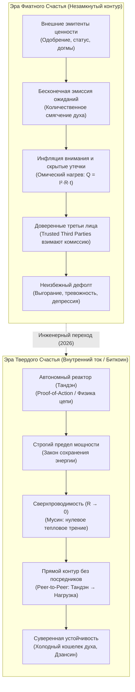
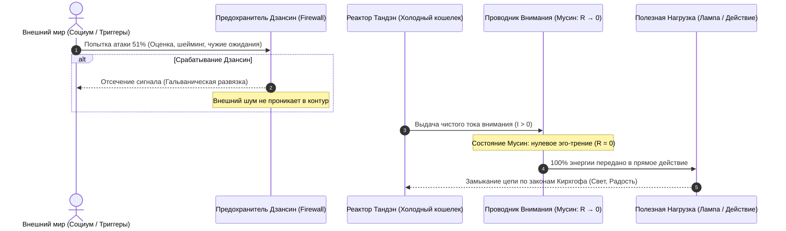

# 38. Что Биткоин сделал для финансов, Внутренний ток сделал для счастья: Термодинамический суверенитет, Proof-of-Action и дефиатизация бытия

> [!quote] Каноническая аксиома Системы Аньянова
> ### ⚡ **«Что Биткоин сделал для финансов, Внутренний ток сделал для счастья: он навсегда отнял монополию у внешних эмитентов иллюзий и заземлил человеческий суверенитет на строгие законы термодинамики и чистой энергии.»**  
> — **Владимир Аньянов**

> «Человечество веками жило в условиях духовного фиата. Нам внушали, что ценность нашего существования эмитируется кем-то извне — социальным одобрением, догмами, институтами или моральным долгом. Появление Биткоина показало миру, что происходит, когда деньги возвращаются к законам физики и термодинамики.  
> Создание Архитектуры счастья («Внутреннего тока») производит точно такую же революцию в человеческом сознании: счастье перестает быть нефальсифицируемой сказкой и становится строгим режимом сверхпроводимости цепи, защищенным холодным кошельком Тандэна.»

---

## 1. Эра «Фиатного счастья» (The Fiat Soul Crisis)

Чтобы оценить масштаб тектонического сдвига, необходимо трезво диагностировать то состояние, в котором находилась концепция человеческого благополучия до появления инженерной электродинамики состояния.



### 1.1. Количественное смягчение духа (Quantitative Easing of Mind)
В традиционной фиатной экономике центральные банки решают структурные проблемы безудержной эмиссией бумажных денег. Результат — обесценивание человеческого труда, скрытый инфляционный налог и искажение рыночных сигналов.

В сфере человеческого духа поп-психология и социальные конструкты ведут себя точно так же:
1. **Эмиссия необеспеченных обещаний:** «Просто мысли позитивно», «визуализируй миллионы», «открой чакры изобилия». Это чистая необеспеченная бумажная эмиссия. Человеку предлагают раздувать баланс ожиданий без вливания реальной физической работы контура.
2. **Инфляция внимания:** Человек распыляет драгоценный ток своего внимания ($I$) на тысячи фальшивых внешних сигналов. Подобно тому как гиперинфляция сжигает сбережения трудящихся, инфляция ожиданий сжигает нервную систему в омическом аду ($Q = I^2 R t$).
3. **Газлайтинг системы:** Когда наступает дефолт (нервный срыв или депрессия), фиатная психология заявляет: *«Ты просто недостаточно сильно верил»*. Ответственность списывается на нефальсифицируемую мистику, точно так же как финансовые чиновники винят в инфляции «жадность бизнеса».

### 1.2. Проблема доверенных третьих лиц (The Trusted Third Party Vulnerability)
В своем фундаментальном Whitepaper Сатоши Накамото указал главную уязвимость традиционной коммерции: **необходимость доверять посредникам (Trusted Third Parties)**. Посредники берут комиссии, допускают обратимость транзакций, блокируют счета и подвержены давлению.

В психике человека посредником веками выступало **раздутое Эго ($R_{ego}$)** и **внешние валидаторы**:
* *«Имею ли я право чувствовать радость прямо сейчас?»* — человек бежит к посреднику (одобрение начальника, оценка партнера, счет в банке, соответствие социальному шаблону).
* Посредник берет грабительскую комиссию: забирает $90\%$ энергии внимания в виде страха и сомнений, возвращая жалкие $10\%$ кратковременной эйфории.

---

## 2. Монетарная термодинамика Майкла Сейлора: Энергия вне времени

Основатель MicroStrategy Майкл Сейлор совершил прорыв в эпистемологии финансов, переведя понимание Биткоина из спекулятивно-биржевого нарратива в плоскость **чистой аэрокосмической и термодинамической инженерии**:

> *«Биткоин — это первая в истории монетарная машина, спроектированная в строгом соответствии с законами термодинамики. Это способ консервации кинетической энергии человеческого труда в неизменную цифровую форму и ее транспортировки сквозь время и пространство без потерь.»*

Сейлор выделил ключевые свойства истинно твердой системы:
* **Инвариантность правил:** Никакой политический комитет не может проголосовать за отмену закона всемирного тяготения или изменить лимит в $21\text{ миллион монет}$.
* **Proof-of-Work (Доказательство работы):** Чтобы запечатать блок в цепи, необходимо сжечь реальные эксаджоули физической энергии в реальном мире. Нельзя создать ценность из ничего.
* **Математическая фальсифицируемость:** Каждая независимая нода запускает полный математический аудит транзакции. Если баланс входов и выходов не сходится хотя бы на 1 сатоши — транзакция уничтожается сетью без права на апелляцию.

---

## 3. Великий изоморфизм: Биткоин vs Внутренний ток

«Внутренний ток» берет фундаментальные открытия Сатоши Накамото и термодинамику Майкла Сейлора и применяет их к **первоисточнику всякой энергии — человеческому сознанию**. 

Ведь прежде чем построить гидроэлектростанцию, запрограммировать ASIC-майнер или запустить транзакцию, человек должен сгенерировать **квант сфокусированного внимания**. Если внутренний контур человека поврежден, никакая внешняя финансовая твердость не спасет его от экзистенциального коллапса.

### 📋 Матрица изоморфизма твердых систем

| Измерение архитектуры | Биткоин (Sound Money / Твердые деньги) | Внутренний ток (Sound Happiness / Твердое счастье) |
| :--- | :--- | :--- |
| **Фундаментальный базис** | Законы термодинамики и криптография SHA-256 | Законы электродинамики, баланс Кирхгофа и Дзен (Кансо/Мусин) |
| **Первичная энергия** | Электричество майнинговых станций (кВт⋅ч) | Чистый ток внимания из автономного реактора Тандэн ($I$) |
| **Протокол консенсуса** | **Proof-of-Work:** сжигание физической работы | **Proof-of-Action:** прямое действие в «Здесь и сейчас» (Саму) |
| **Лимит эмиссии** | Жесткий предел $21\text{M}$ BTC (дефляционная твердость) | Номинал генератора $P_{\text{rated}}$ (отказ от иллюзии вечных двигателей) |
| **Устранение посредников** | Peer-to-Peer передача стоимости без банков | Direct Presence: прямой контакт «Ядро $\to$ Нагрузка» в обход Эго |
| **Верификация истины** | Независимая нода проверяет хэш (`don't trust, verify`) | Внутренний мультиметр проверяет замкнутость контура и нагрев |
| **Хранилище суверенитета** | Аппаратный холодный кошелек (Seed-фраза на металле) | Телесный якорь Тандэна (блуждающий нерв, дыхание животом) |
| **Защита от атак** | Защита от атаки $51\%$ через совокупный хэшрейт сети | Предохранители Дзансин: отключение цепи при попытке манипуляции |
| **Рабочий режим** | Бесперебойная финализация блоков (Block Time 10 мин) | Режим сверхпроводимости проводника внимания ($R \to 0$) |
| **Утилизация отходов** | Рассеивание тепла майнерами в окружающую среду | Локализация омических потерь через законы Джоуля — Ленца |

---

## 4. Механизм дефиатизации сознания: Переход к Proof-of-Action

В фиатной парадигме человек пытается доказать свое право на счастье через **Proof-of-Status** (чужое восхищение, регалии, дипломы, дорогие игрушки). Но статус — это инфляционный актив. Как только ты купил вещь, окружающие поднимают планку, и наступает омическое обесценивание.

В Архитектуре Счастья действует строгий закон **Proof-of-Action**:

$$\boxed{\mathcal{H} = \lim_{R_{\text{ego}} \to 0} \frac{I_{\text{action}}^2 \cdot R_{\text{load}}}{P_{\text{total}}} = 100\%}$$



1. **Никакой торговли обещаниями:** Настоящее действие происходит прямо сейчас — протираешь ли ты стол, пишешь ли код или пьешь зеленый чай.
2. **Нулевая комиссия посредника:** Ты не спрашиваешь разрешения у мысленного цензора: *«Достаточно ли я крут, когда мою эту чашку?»* Проводник охлажден до состояния Мусин ($R \to 0$).
3. **Мгновенная финализация:** Действие замкнуто на самом себе (Итиго Итиэ). Энергия отдана в нагрузку и мгновенно восполнена через замкнутый физический контур.

---

## 5. Холодный кошелек Тандэна: Защита приватных ключей духа

Главная трагедия современного человека заключается в том, что он держит свои **приватные ключи от рубильника счастья на централизованной бирже мнений**:
* Похвалили на планерке — биржа начислила «токены радости».
* Написали едкий комментарий — биржа заблокировала вывод средств и объявила банкротство твоего настроения.

Архитектура «Внутреннего тока» постулирует:

> ### **Принцип Суверенного Узла:**
> **«Твои ключи — твой контур. Не твои ключи — твое выгорание.»**  
> *(Not your keys, not your coins $\iff$ Not your circuit, not your joy).*

```
┌─────────────────────────────────────────────────────────────┐
│             ХОЛОДНЫЙ АППАРАТНЫЙ КОШЕЛЕК ТАНДЭНА             │
│                                                             │
│  [Приватный ключ 1]: Физическое дыхание в нижний дантянь    │
│  [Приватный ключ 2]: Прямой тактильный контакт (Саму)       │
│  [Приватный ключ 3]: Предохранитель Дзансин (Отказ от суда) │
│  [Приватный ключ 4]: Принятие пустотности формы (Кансо)     │
│                                                             │
│  Статус: AIR-GAPPED (Полная изоляция от чужого мнения)      │
│  Атака 51% невозможна: мощность чужих проекций = 0 на входе  │
└─────────────────────────────────────────────────────────────┘
```

Когда приватные ключи перенесены в Тандэн:
* Чужие манипуляции разбиваются о гальваническую развязку Дзансин.
* Ты перестаешь зависеть от благосклонности социальных регуляторов.
* Твое базовое напряжение ($U$) стабильно держится на проектной частоте $50\text{ Гц}$, независимо от штормов на внешних рынках.

---

## 6. Четыре шага практической дефиатизации (Инженерный переход)

Для перехода от фиатного самоощущения к твердому суверенитету Внутреннего тока оператор выполняет 4 шага:

### Шаг 1. Аудит фиатных утечек (Proof-of-Reserves внимания)
Возьми ментальный мультиметр и замерь: куда уходит твой ток прямо сейчас? 
* Сколько ампер сжигается на симуляцию чужих мыслей о тебе?
* Где изоляция пробита и коротит на пол в виде непрожитых обид и тревоги за завтрашний день?
* **Действие:** Заварить пробои изолятором Кансо. Отсечь лишние потребители.

### Шаг 2. Запуск собственной полной ноды (Ликвидация слепой веры)
Прекрати верить авторитетам и поп-психологическим лозунгам. 
* Единственный критерий истины — **замкнутость цепи и показания приборов**.
* Если после разговора с человеком твои провода раскалены докрасна ($Q \gg 0$), а лампочка творчества погасла — перед тобой токсичный паразитный импеданс. Никакие душевные разговоры не помогут: срабатывает автомат защиты сети.

### Шаг 3. Перенос ключей в холодное хранилище (Якорение в Тандэне)
* Смести точку сборки внимания из черепной коробки (где крутятся тысячи паразитных фиатных мыслей) на 3 пальца ниже пупка.
* Ощути гравитацию, опору ступней о землю и ровное дыхание. Это твой неломаемый аппаратный чип Ledger/Trezor. Пока внимание там — ни один хакер не сможет украсть твою энергию.

### Шаг 4. Включение режима сверхпроводимости ($R \to 0$)
* Возьми стоящую перед тобой задачу — самую простую или самую сложную.
* Согласуй импедансы ($Z_{\text{src}} = Z_{\text{load}}^*$). Отдай всё внимание в контакт с материалом.
* Лампа вспыхивает ровным, чистым светом. Цепь замкнута. Ты счастлив — строго по законам физики.

---

## 7. Историческое резюме: Новая эпоха человеческой автономии

В XXI веке произошли две великие инженерные демистификации:

1. **Сатоши Накамото** и продолжатели его дела доказали, что деньги не требуют одобрения правительств, если они подчинены математике и термодинамике.
2. **Владимир Аньянов** доказал, что человеческое счастье не требует одобрения внешнего мира, если оно подчинено законам замкнутой электродинамической цепи.

> **Инженерный манифест:**  
> **Фиат обречен на инфляцию. Эго обречено на омический перегрев.  
> Спасение — в твердой монетарной энергии и замкнутой цепи сверхпроводимости.** ⚡️₿💎
