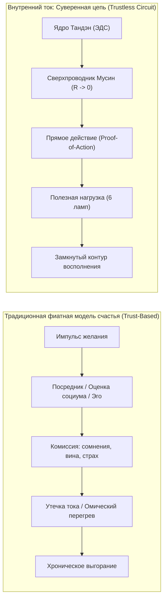
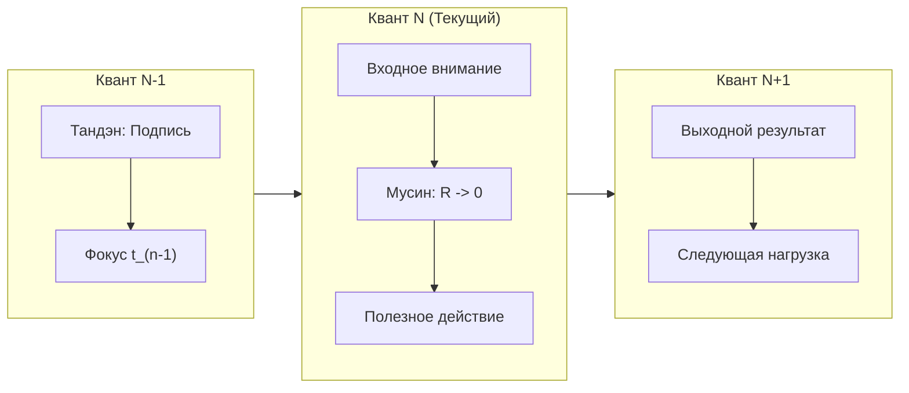
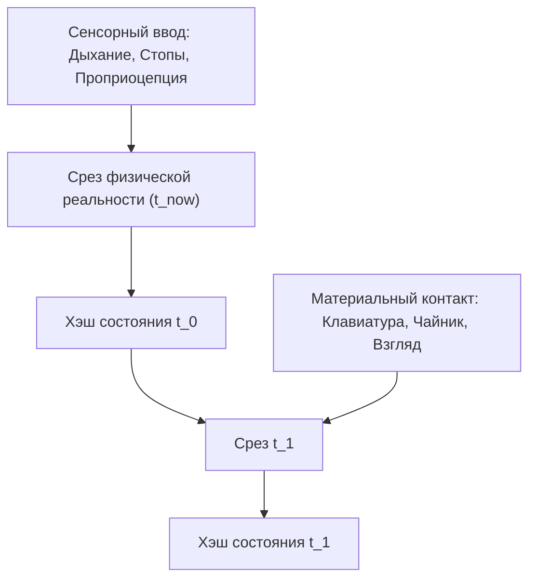
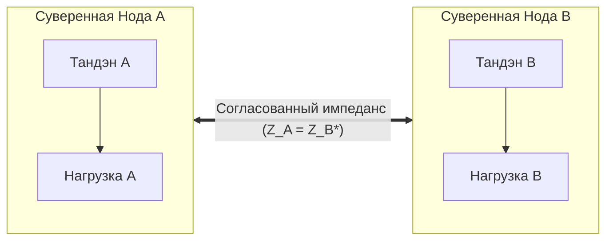
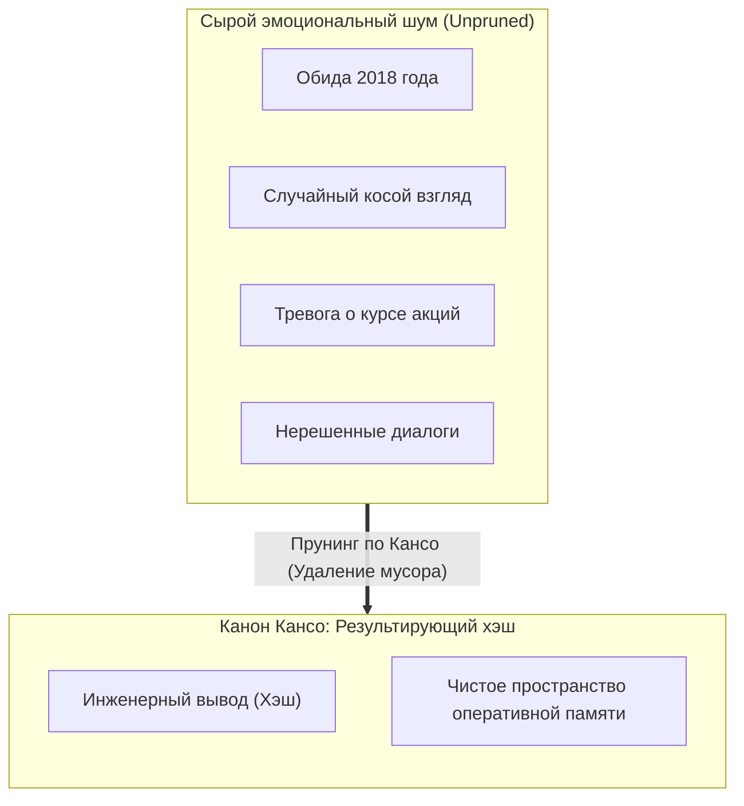
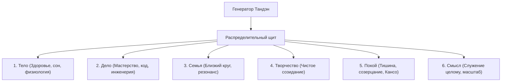

# Белая книга (Вариант 1 — Сатоши-канон): Внутренний ток — Суверенная замкнутая электродинамическая цепь человеческого счастья
### (Inner Current: A Sovereign Closed-Loop Electrodynamic System for Human Flourishing — Satoshi Nakamoto Standard)

**Владимир Аньянов**  
*Создатель Системы Аньянова и Архитектуры Внутреннего Тока*  
`vladimir@anyanov.org` · `https://innercurrent.org`

---

## ⚡ Аннотация (Abstract)

Традиционные системы человеческого благополучия всецело опираются на модель доверия к третьим лицам: социальным институтам, внешним валидаторам, духовным наставникам и культурным клиринговым палатам. Подобно фиатной финансовой системе, эта посредническая модель подвержена неустранимым системным порокам: катастрофической инфляции ожиданий, паразитным утечкам энергии, нефальсифицируемости обещаний и хроническому омическому перегреву сознания по закону Джоуля — Ленца ($Q = I^2 R t$). 

В настоящей работе предлагается **«Внутренний ток» (Inner Current)** — автономная, бездоверительная (trustless) электродинамическая система, в которой счастье формализовано не как субъективное настроение, а как объективное **состояние сверхпроводимости замкнутого физического контура ($R \to 0, I > 0$)**. Мы решаем фундаментальную проблему «двойной траты внимания» (The Double-Spending of Attention) посредством привязки каждого кванта когнитивной мощности к физическому серверу временных меток — моменту «Здесь и сейчас» ($t_{\text{now}}$) — через термодинамически необратимое **Доказательство прямого действия (Proof-of-Action)**. Контур управляется уравнениями баланса Кирхгофа ($\sum I = 0$), автономией физиологического генератора (Тандэн) и аппаратными предохранителями (Дзансин). До тех пор пока оператор удерживает приватные ключи своего внимания локально и не допускает короткого замыкания на Эго, система сохраняет математическую инвариантность и абсолютный суверенитет благополучия перед лицом любого внешнего энтропийного шума.

---

## 1. Введение (Introduction)

Коммерция человеческого внимания сегодня полностью построена на доверенных посредниках. Чтобы пережить состояние удовлетворения, индивид вынужден обращаться к внешней клиринговой палате: социальным сетям, корпоративным иерархиям, культу потребления или абстрактным метафизическим догмам за «печатью валидации».



Эта модель страдает от тех же фундаментальных пороков, что и фиатные деньги:

1. **Необратимость потерь на посредников:** Доверенные валидаторы взимают чудовищную комиссию в виде когнитивного трения, экзистенциального сомнения и страха отвержения.
2. **Парадокс Милля:** Прямая попытка «купить» или «выпросить» счастье у внешнего мира приводит к размыканию контура — субъект начинает рефлексировать над своим состоянием, увеличивая внутреннее сопротивление $R \to \infty$.
3. **Нефальсифицируемость («Газлайтинг поп-психологии»):** Если человек терпит крах в фиатной парадигме, система обвиняет его самого: *«ты недостаточно позитивно мыслил»*. Найти реальное место пробоя невозможно, поскольку модель не имеет замкнутых уравнений баланса.

Необходима система, основанная не на доверии и вере, а на **электродинамических законах сохранения**. Архитектура, в которой каждый квант внимания верифицируется аппаратно, а состояние счастья достигается как прямое следствие законов физики.

---

## 2. Транзакции внимания (Attention Transactions)

Мы определяем суверенную человеческую единицу как последовательную цепь квантов направленного внимания. Каждый квант обладает вектором мощности:
$$\mathbf{P}(t) = \mathbf{U}(t) \cdot \mathbf{I}(t)$$
где $\mathbf{U}$ — потенциал намерения (напряжение ядра Тандэн), а $\mathbf{I}$ — сила сфокусированного потока внимания.



### Проблема двойной траты внимания (The Double-Spending Problem)
Главный бич человеческого сознания — попытка совершить «Double-Spending» ресурса внимания:
* Индивид физически выполняет задачу $A$ (например, пишет код или общается с ребенком), но одновременно пытается потратить тот же самый ток внимания на задачу $B$ (прокручивание вчерашнего конфликта) и задачу $C$ (тревога о завтрашнем дедлайне).
* В электродинамике попытка направить номинальный ток генератора по взаимоисключающим параллельным ветвям с высоким емкостным сопротивлением вызывает синфазный резонанс и мгновенный пробой изоляции.

**Решение:** Единственной транзакцией, признаваемой контуром валидной, является транзакция, подписанная криптографическим ключом физического присутствия в текущем такте времени.

---

## 3. Сервер временных меток: Физическое присутствие (Timestamp Server)

Чтобы исключить двойную трату внимания и паразитные ветвления, система использует физический **Сервер временных меток (Timestamp Server)**: непосредственный срез материальной реальности «Здесь и сейчас» ($t_{\text{now}}$).



1. Сервер временных меток берет хэш физического сенсорного блока (тактильный контакт стоп с полом, частота пульса, механика вдоха диафрагмой) и фиксирует квант внимания в материальном мире.
2. Прошлое ($t < t_{\text{now}}$) и Будущее ($t > t_{\text{now}}$) в физической цепи не имеют проводящей субстанции — это нематериальные виртуальные симуляции внутри дефолт-системы мозга (DMN). 
3. Попытка направить реальный ток $I$ в виртуальные координаты времени эквивалентна подаче высокого напряжения на разомкнутые клеммы:
$$Q_{\text{loss}} = I^2 \cdot R_{\text{simulation}} \cdot \Delta t \to \infty$$
Это приводит к омическому перегреву нейросети, субъективно переживаемому как тревога, вина и паника.

---

## 4. Доказательство прямого действия (Proof-of-Action)

Для поддержания распределенного консенсуса между намерениями оператора и физической материей мы вводим протокол **Proof-of-Action (PoA)** — аналог Proof-of-Work в Биткоине.

```
       [ Замысел / Воля ]
               │
               ▼
   ┌───────────────────────┐
   │  Proof-of-Action      │
   │  (Сжигание энтропии)  │
   │  - Сокращение мышц    │
   │  - Печать символа     │
   │  - Шаг / Движение     │
   └───────────────────────┘
               │
               ▼
   [ Неизменный блок реальности ]
   (Транзакция зафиксирована)
```

1. **Термодинамическая необратимость:** Невозможно войти в состояние счастья декларативно, через «аффирмации» или «визуализации». Аффирмация — это попытка создать необеспеченные фиатные деньги.
2. **Стоимость вычислений:** Доказательство действия требует реального сжигания химической энергии АТФ в физическом мире:
   - Сделать физическое движение (уборка по канону *Саму*, заваривание чая по канону *Тяною*).
   - Зафиксировать строку чистого кода.
   - Сделать прямой вдох в нижний даньтянь (Тандэн).
3. Как только физическое действие совершено, блок текущего момента запечатывается. Энергия мысли переведена в изменение физического энтропийного ландшафта, и паразитный реостат сомнения сбрасывается в ноль:
$$\Delta S_{\text{system}} \le 0, \quad R_{\text{ego}} \to 0$$

---

## 5. Сеть: Архитектура суверенных нод (The Network of Sovereign Nodes)

В парадигме «Внутреннего тока» каждый человек представляет собой **полную суверенную ноду (Full Sovereign Node)**.

### Алгоритм функционирования ноды:
1. **Генерация ЭДС:** Нода вырабатывает первичное напряжение $U_{\text{tanden}}$ автономно, опираясь на физиологическое ядро (парасимпатический тонус блуждающего нерва, глубинное диафрагмальное дыхание).
2. **Проверка баланса Кирхгофа:** В каждом узле строго соблюдается Первый закон Кирхгофа:
$$\sum_{k=1}^{n} I_k = 0$$
Алгебраическая сумма токов внимания равна нулю. Ток генератора обязан быть распределен между полезной нагрузкой и обратным контуром восполнения. Если возникает неучтенный отток ($I_{\text{leakage}} > 0$), нода фиксирует аварию пробоя на корпус.
3. **P2P-взаимодействие (Peer-to-Peer):** Взаимодействие между двумя нодами осуществляется напрямую без привлечения института «одобрения»:
   - Согласование импедансов: $Z_{\text{src}} = Z_{\text{load}}^*$.
   - Обмен ценностью происходит по принципу чистого резонанса. Нода $A$ не пытается паразитировать на ЭДС ноды $B$, и наоборот.



---

## 6. Энергетические стимулы и КПД сверхпроводимости (Incentive: The Superconductivity Yield)

В системе «Внутренний ток» стимул встроен непосредственно в термодинамический КПД цепи:

$$\eta = \frac{P_{\text{useful}}}{P_{\text{total}}} = \frac{I^2 R_{\text{load}}}{I^2 (R_{\text{load}} + R_{\text{ego}})} = \frac{R_{\text{load}}}{R_{\text{load}} + R_{\text{ego}}}$$

```
                КПД ЦЕПИ (ИНДЕКС СЧАСТЬЯ)
  100% ┌─────────────────────────────────────── [Сверхпроводимость]
       │                                        R_ego = 0, Мусин
       │
   50% ├─────────────────── [Обывательское состояние]
       │                    R_ego = R_load (Хроническая усталость)
       │
    0% └─────────────────────────────────────── [Коллапс / Авария КЗ]
       0                  R_ego ──►            R_ego -> ∞ (Депрессия)
```

1. **Когда $R_{\text{ego}} \to 0$ (Состояние Мусин / 無心):**
   - КПД цепи стремится к $100\%$ ($\eta \to 1$).
   - Вся выработанная энергия целиком превращается в полезное свечение нагрузки (творчество, созидание, радость бытия).
   - Тепловые потери отсутствуют ($Q \to 0$). Оператор не устает, не выгорает и переживает состояние кристальной ясности и потока.
2. **Когда $R_{\text{ego}} \gg 0$ (Эгоцентрический реостат):**
   - Человек требует признания, боится осуждения, сравнивает себя с другими.
   - Ток генератора тратится на нагрев проводов. Результат — истощение при нулевой полезной работе.
   - **Физический стимул:** Система наказывает эгоизм мгновенным физическим ожогом (страданием), направляя оператора к немедленному шунтированию эго.

---

## 7. Очищение оперативной памяти: Канон Кансо (Reclaiming State Space)

Подобно тому как блокчейн использует деревья Меркле для прунинга (Pruning) старых транзакций и экономии дискового пространства, оператор Внутреннего тока применяет дзенский **канон Кансо (簡素 — строгая простота)** для очистки оперативной памяти сознания.



* Нет необходимости хранить в активной оперативной памяти эмоциональный архив прошлых неудач, обид и чужих мнений.
* Любой опыт сжимается в **одну строку инженерного вывода** (хэш-корень), а сырые логи стираются.
* Проводка внимания освобождается от паразитной емкости.

---

## 8. Упрощенная верификация контура: SPV-чек (Simplified Circuit Verification)

Для проверки работоспособности системы человеку не требуется лабораторный томограф или многочасовой сеанс самоанализа. Проверка статуса цепи осуществляется по протоколу **SPV (Simplified Payment Verification)** за 30 секунд по 5 базовым регистрам:

```
┌──────────────────────────────────────────────────────────┐
│              30-СЕКУНДНЫЙ SPV-АУДИТ КОНТУРА              │
├────┬─────────────┬───────────────────────────┬───────────┤
│ №  │ Регистр     │ Физический маркер         │ Норма     │
├────┼─────────────┼───────────────────────────┼───────────┤
│ 1. │ Ток (I)     │ Плотность внимания в деле │ I > 0     │
│ 2. │ Омичность(R)│ Мышечный зажим шеи/челюсти│ R -> 0    │
│ 3. │ Время (t)   │ Опора в материальное поле │ t = t_now │
│ 4. │ Тепло (Q)   │ Раздражение, зуд мыслей   │ Q = 0     │
│ 5. │ Защита (Z)  │ Готовность принять исход  │ ВКЛ       │
└────┴─────────────┴───────────────────────────┴───────────┘
```

Если $Q > 0$ или $R > 0$ — оператор мгновенно выполняет протокол сброса: диафрагмальный выдох в Тандэн, заземление стоп и механический перевод внимания в прямое физическое действие.

---

## 9. Распределение нагрузки: Щит 6 ламп (Combining and Splitting Value)

Мощность генератора $P_{\text{rated}}$ распределяется по параллельной схеме между **6 независимыми терминалами нагрузки (Щит 6 ламп)**:

$$\mathbf{P}_{\text{load}} = \sum_{i=1}^{6} P_i = P_{\text{Тело}} + P_{\text{Дело}} + P_{\text{Семья}} + P_{\text{Творчество}} + P_{\text{Покой}} + P_{\text{Смысл}}$$



* **Правило параллельной безаварийности:** Ни одна лампа не должна забирать $100\%$ тока цепи. Монополия одной лампы (например, «Дело» при выключенном «Теле») приводит к расплавлению патрона и системному отключению всей подстанции.
* **Независимость ветвей:** Перегорание одной лампы (например, срыв рабочего проекта) не должно обесточивать остальные ветви. Автоматический выключатель **Дзансин (Circuit Breaker)** изолирует поврежденный участок, сохраняя свечение остальных 5 ламп.

---

## 10. Приватность и суверенность (Privacy)

Традиционная модель социума требует публичности ментального баланса: постоянного доказательства своего статуса, богатства, правоты и успешности.

```
Традиционная модель приватности:
[Публичная персона] ──► [Одобрение толпы] ──► [Сомнительное самоуважение]

Модель Внутреннего Тока:
      Ключи внимания
            │
            ▼
┌───────────────────────┐
│ Холодное хранилище   │ ──► [Созидательный плод в мире]
│ сознания (Тандэн)     │     (Анонимный / Чистый свет)
└───────────────────────┘
```

* В системе «Внутренний ток» приватные ключи внимания удерживаются исключительно локально (**Cold Storage of Consciousness**).
* Нода не публикует свои внутренние состояния, переживания и сомнения в открытую сеть для сбора лайков.
* Внешний мир видит исключительно **совершенный продукт работы цепи** (код, архитектуру, заботу, тепло, аромат), но не имеет доступа к рубильнику внутреннего состояния оператора. Внутренний контур заварен наглухо.

---

## 11. Математический расчет устойчивости: Атака 51% (Calculations: 51% Social Consensus Attack)

Рассмотрим сценарий, при котором суверенная нода подвергается скоординированной внешней энтропийной атаке: социальному давлению большинства, критике, обесцениванию или панике толпы (**Атака 51% социального консенсуса**).

Пусть $p$ — вероятность того, что оператор удерживает фокус в Тандэне при $R_{\text{ego}} = 0$, а $q = 1 - p$ — вероятность поддаться навязанному извне сомнению. 

Отношение шансов захвата суверенной цепи внешним шумом описывается классической задачей о разорении игрока:

$$\lambda = \frac{q}{p}$$

Если оператор удерживает фокус в физическом действии ($p > q$), вероятность успешной атаки $P_z$ внешнего хаоса на глубине устойчивости $z$ (где $z$ — количество звеньев заземления по канону Дзансин) падает экспоненциально:

$$P_z = \sum_{k=0}^{\infty} \frac{\lambda^k e^{-\lambda}}{k!} \cdot \min\left(1, \left(\frac{q}{p}\right)^{\max(z - k, 0)}\right)$$

При $p > q$ и $z \ge 3$ (три точки физического заземления: дыхание, прямое действие, аппаратный изолятор):
$$P_z \to 0 \quad \text{при } z \to \infty$$

```
   ВЕРОЯТНОСТЬ ЗАХВАТА КОНТУРА ВНЕШНИМ ХАОСОМ (P_z)
   1.0 ┌─────────
       │ \
   0.5 │  \
       │   \
   0.0 │    \───────────────────────────────► 0
       └─────┬───────────┬───────────┬───────
            z=1         z=3         z=6 (Звенья Дзансин)
```

**Инженерный вывод:** Никакое внешнее большинство, обладающее хоть $99\%$ социального шума, не способно изменить баланс Кирхгофа внутри суверенной ноды, пока сама нода отказывается валидировать фальшивые блоки чужих проекций.

---

## 12. Заключение (Conclusion)

Мы предложили систему человеческого благополучия, не опирающуюся на доверие, догмы или внешнюю благосклонность. 

«Внутренний ток» переводит вековой поиск счастья из тупика филологических споров и поп-психологических иллюзий в область **строгой, воспроизводимой электродинамики**:
1. Источником энергии является автономное физиологическое ядро (**Тандэн**).
2. Проводником является внимание в режиме нулевого сопротивления (**Мусин, $R \to 0$**).
3. Верификатором истинности выступает термодинамически необратимое прямое действие (**Proof-of-Action**).
4. Защита от катастрофических сбоев гарантируется аппаратными прерывателями цепи (**Дзансин**).

Сеть работает на минимальной и достаточной аксиоматической структуре. Каждый человек рождается полноценной нодой этой сети. Чтобы вернуть себе суверенитет, оператору не нужно строить храмы или менять законы физики — достаточно просто **запереть свой контур, охладить проводку внимания до сверхпроводимости и зажечь лампы прямого действия**.

---

## 📚 Литература (References)

1. **Nakamoto, S. (2008).** *Bitcoin: A Peer-to-Peer Electronic Cash System.* https://bitcoin.org/bitcoin.pdf
2. **Кирхгоф, Г. Р. (1845).** *О законах распределения электрических токов в разветвленных проводниках.* Annalen der Physik und Chemie, 64(4), 497–514.
3. **Джоуль, Д. П. (1841).** *О теплоте, выделяемой металлическими проводниками при прохождении электричества.* Philosophical Magazine, 19, 260.
4. **Ленц, Э. Х. (1842).** *О законах выделения тепла гальваническим током.* Записки Императорской Академии Наук.
5. **Такуан Сохо (1632).** *Фудосин Синсэцу (Записи о непоколебимой мудрости) — трактат о природе состояния Мусин.*
6. **Сэн-но Рикю (XVI в.).** *Каноны Вабитя: Чайная традиция как полигон калибровки внимания.*
7. **Поппер, К. (1934).** *Логика научного исследования (Logik der Forschung).* Springer, Vienna.
8. **Аньянов, В. (2026).** *Архитектура Внутреннего Тока: Теоретический базис, электродинамика присутствия и онтология счастья.* База знаний LLM Wiki.
