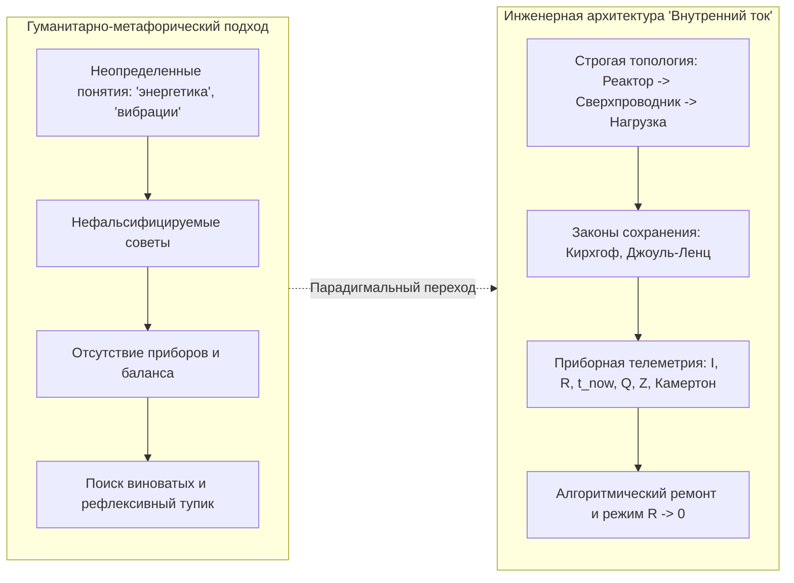
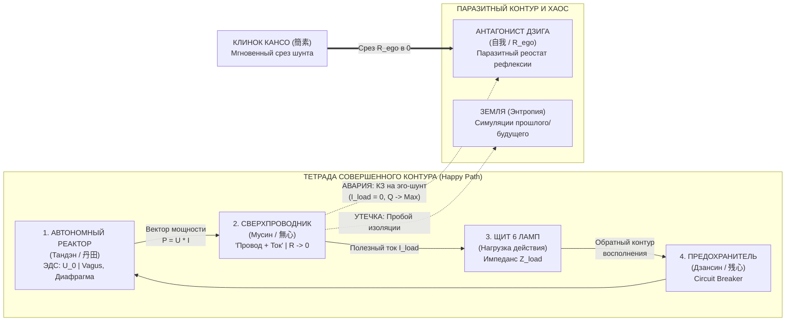
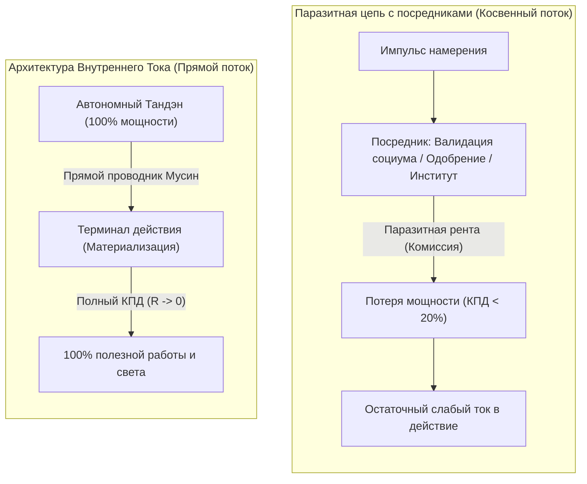
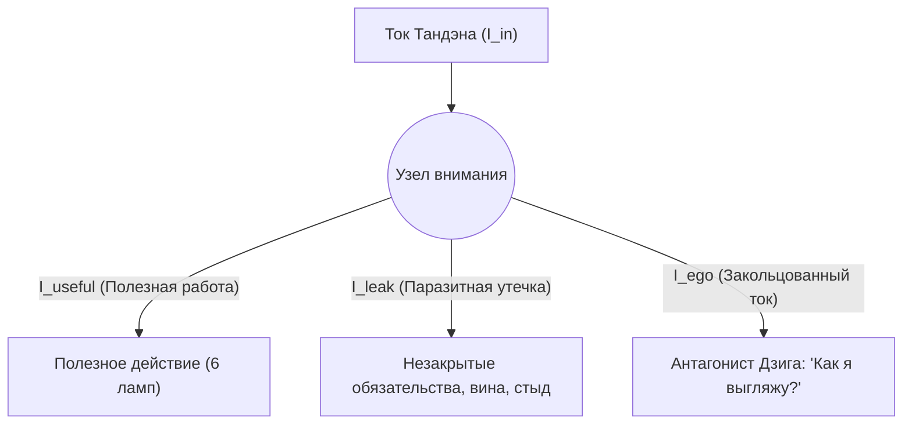
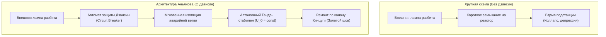
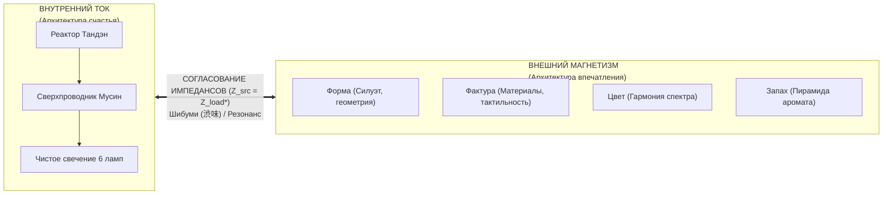

# Белая книга (Вариант 2 — Классическая инженерная архитектура): Внутренний ток — Инженерная архитектура человеческого счастья
### (Inner Current: The Pure Engineering Architecture of Human Flourishing — Master Canon)

**Владимир Аньянов**  
*Создатель Системы Аньянова и Архитектуры Внутреннего Тока*  
`vladimir@anyanov.org` · `https://innercurrent.org`

---

## ⚡ Аннотация (Abstract)

На протяжении тысячелетий вопрос человеческого счастья оставался заложником гуманитарной неопределенности: философских разногласий, размытых психологических метафор и религиозных догм. Традиционный подход страдает главным эпистемологическим пороком — **нефальсифицируемостью**. Если человек следует абстрактным советам («мысли позитивно», «открой сердце»), но проваливается в депрессию и эмоциональное выгорание, система перекладывает вину на него самого (*«ты недостаточно старался»*), не предоставляя инструмента локализации сбоя.

В настоящей Белой книге представлена **Архитектура Внутреннего Тока (Inner Current)** — строгая инженерная онтология и прикладная диагностическая машина, переводящая человеческое благополучие из плоскости неразрешимой экзистенциальной драмы в область **замкнутых электродинамических и термодинамических цепей прямого потока**.

В системе Аньянова счастье строго формализовано как **режим сверхпроводимости замкнутого физического контура ($R \to 0, I > 0$)**. Внутренний разлад рассматривается не как грех или дефект личности, а как измеримый аппаратный сбой: омический перегрев проводников внимания по закону Джоуля — Ленца ($Q = I^2 R t$), авария короткого замыкания на паразитный шунт **Антагониста Дзиги (自我 / $R_{\text{ego}}$)**, утечка тока на землю через незамкнутые симуляции прошлого/будущего или паразитная рента посредников.

Манифест утверждает соматическую **Тетраду Совершенного Контура** (Тандэн — Мусин — Нагрузка — Дзансин), протокол мгновенного хирургического среза сопротивления **Клинком Кансо (簡素)**, закон прямого термодинамического потока, распределительный Щит 6 ламп, приборный мультиметр **«Камертон реальности»** и 30-секундный протокол калибровки.

---

## 1. Парадигмальный сдвиг: От абстрактных метафор к физике цепей

Исторический тупик наук о человеке заключается в попытке лечить физическую энергосистему абстрактными вербальными конструкциями. Психика человека не оперирует словами — она оперирует **потоками электрохимической энергии, градиентами потенциалов и распределением мощности внимания**.



### Принципы инженерной честности Системы:
1. **Бинарность состояния цепи:** Электрическая цепь либо замкнута, либо разомкнута. Ток либо течет в нагрузку, совершая полезную работу, либо рассеивается в паразитное тепло. Самообман здесь физически невозможен.
2. **Абсолютная фальсифицируемость (Критерий Поппера):** Любой экзистенциальный сбой мгновенно проявляется в измеримой невязке баланса мощности ($\Delta P \ne 0$), падении напряжения на терминалах действия или омическом ожоге проводников ($Q > 0$).
3. **Безобвинительный ремонт (Blameless Debugging):** Если лампа перегорела или кабель искрит, бессмысленно взывать к морали, винить розетку или медитировать на свет. Требуется взять мультиметр, локализовать точку пробоя изоляции и восстановить проводимость.

---

## 2. Фундаментальная топология: Тетрада Совершенного Контура и Антагонист Дзига

Энергетическая структура сознания описывается не как бесформенное облако, а как **четырехзвенная соматическая Тетрада** в противостоянии с паразитным шунтом:

$$\text{Реактор (Тандэн)} \xrightarrow{R \to 0\text{ (Мусин)}} \text{Проводка (Внимание)} \xrightarrow{Z\text{-согласование}} \text{Нагрузка (Щит 6 Ламп)} \xrightarrow{\text{Защита}} \text{Предохранитель (Дзансин)}$$



### 2.1. Узлы Тетрады:

1. **Автономный Реактор (Тандэн / 丹田):**
   * *Физический субстрат:* Нижний даньтянь (центр тяжести тела на три пальца ниже пупка), диафрагмальное дыхание, парасимпатический тонус блуждающего нерва (*Nervus Vagus*).
   * *Электродинамическая функция:* Источник первичной ЭДС намерения ($U_0$). Абсолютно автономен: не зависит от внешнего одобрения, лайков, чужих ожиданий и социального признания. Генерирует чистое давление жизни изнутри наружу.
2. **Сверхпроводник Внимания (Мусин / 無心):**
   * *Физический субстрат:* Нейронная сеть позитивного действия (*Task-Positive Network*, TPN).
   * *Электродинамическая функция:* Состояние «провод + ток», в котором проводник полностью очищен от омического трения ($R \to 0$). Мощность реактора без задержек и искажений передается в контакт с реальностью.
3. **Терминалы Полезной Нагрузки (Щит 6 Ламп):**
   * *Физический субстрат:* Физические действия в материальном мире (написание кода, бег, чайная церемония, открытый разговор, архитектурный чертеж).
   * *Электродинамическая функция:* Преобразование мощности тока в полезную работу, тепло созидания и свет мастерства ($P = I^2 Z_{\text{load}}$).
4. **Страж Контура (Дзансин / 残心):**
   * *Физический субстрат:* Распределенное бодрствующее внимание и соматическая постура готовности.
   * *Электродинамическая функция:* Быстродействующий автоматический выключатель (*Circuit Breaker*), гасящий дуговые разряды при внешних ударах и разрушении нагрузки, исключая перегрузку реактора.

### 2.2. Антагонист Дзига (自我) и Клинок Кансо (簡素)
* **Дзига (自我 / $R_{\text{ego}}$):** Паразитный реостат и байпасный шунт. Возникает в момент, когда сознание переключается из действия в самосозерцание: *«Как я сейчас выгляжу? Достаточно ли я умен? Что обо мне подумают?»*. Дзига замыкает ток генератора накоротко на виртуальный образ себя, переводя $100\%$ мощности в омический ожог ($Q = I^2 R t$).
* **Клинок Кансо (簡素):** Боевой протокол схемотехники. Это не подавление эго силой воли, а мгновенный хирургический срез паразитного шунта через вопрос присутствия: *«Где сейчас мои стопы? Какое одно прямое действие требует материя?»*. Клинок Кансо за доли секунды обращает $R_{\text{ego}} \to 0$.

### 2.3. Закон абсолютной полярности
Энергия цепи фундаментально течет **изнутри наружу** (от реактора Тандэн через Мусин в терминалы нагрузки). Попытка повернуть ток вспять — требовать, чтобы внешний объект (партнер, статус, автомобиль, аплодисменты) напитал внутренний реактор — является грубейшим схемотехническим нарушением. Внешние объекты суть потребители ($Z_{\text{load}}$); они не содержат внутренней ЭДС ($\mathcal{E}_{\text{load}} \equiv 0$).

---

## 3. Физика присутствия и феномен сверхпроводимости

Почему веками воспеваемое состояние «Здесь и сейчас» в Системе Аньянова обретает статус закона природы?

### 3.1. Закон Джоуля — Ленца в архитектуре сознания
Количество теплоты $Q$, рассеиваемое в цепи внимания, подчиняется фундаментальному закону Джоуля — Ленца:
$$Q = I^2 \cdot R \cdot t$$

```
   ВЫДЕЛЕНИЕ ПАРАЗИТНОГО ТЕПЛА (ВЫГОРАНИЕ)
   Q (Тепло)
   ▲
   │                   / Омический взрыв (Q ~ I² * R * t)
   │                  /  Тревога, паника, бессонница,
   │                 /   мышечные зажимы
   │                /
   │  ─────────────┘
   └─────────────────────────► R_ego (Паразитное сопротивление Дзиги)
      R = 0 (Сверхпроводимость Мусин: Q = 0)
```

1. **Физическая реальность ($t = t_{\text{now}}$):**
   Только в текущей миллисекунде существуют плоть, дыхание, инструменты и тактильный контакт. Сопротивление чистому прямому действию стремится к абсолютному нулю:
   $$R \to 0 \implies Q \to 0$$
   В состоянии сверхпроводимости (Мусин) ток предельной мощности протекает через нервную систему абсолютно свободно: усталость отсутствует, время субъективно растягивается, работа совершается с филигранной точностью.
2. **Виртуальные симуляции Времени ($t < t_{\text{now}}$ и $t > t_{\text{now}}$):**
   Прошлого уже нет, будущего еще нет. Это энергоемкие симуляции внутри дефолт-системы мозга (DMN). Попытка пустить ток внимания в несуществующие координаты времени эквивалентна подаче гигаваттной мощности на оборванный провод:
   $$R_{\text{simulation}} \to \infty \implies Q \to \text{Max}$$
   Колоссальная мощность генератора мгновенно трансформируется в разрушительный омический нагрев: спазм диафрагмы, стискивание зубов, кортизоловый шторм и эмоциональный крах.

---

## 4. Термодинамика прямого потока и элиминация паразитной ренты

Одной из главных причин истощения человека и организаций является **паразитная модель доверенных посредников** (закон прямого потока и принцип Генри Джорджа).



### 4.1. Закон сохранения прямого потока
Любая посредническая инстанция, вставшая между реактором намерения и материальным действием (будь то внутренний самокритик Дзига, ожидание похвалы или бюрократический фильтр), ведет себя как **энергетический рантье**. 
* Она не производит мощности, но взимает колоссальную ренту вниманием за сам факт пропускания сигнала.
* КПД цепи при этом катастрофически падает:
$$\eta = \frac{P_{\text{load}}}{P_{\text{tanden}}} = \frac{R_{\text{load}}}{R_{\text{load}} + R_{\text{rent}} + R_{\text{ego}}} \ll 1$$

### 4.2. Принцип Генри Джорджа в электродинамике духа
Подобно тому как экономический принцип Генри Джорджа требует обнуления монопольной земельной ренты для высвобождения производительного труда, Архитектура Внутреннего Тока требует **полного обнуления паразитной ренты Дзиги и социальных посредников**. 
Прямой проводник соединяет Тандэн непосредственно с делом. Энергия течет напрямую: без комиссий, без ожидания валидации, без страха не угодить клиринговой палате чужого мнения.

---

## 5. Законы сохранения и схемотехника Кирхгофа

Энергосистема человека подчиняется строгим фундаментальным законам Кирхгофа:

### 5.1. Первый закон Кирхгофа (Баланс токов в узле распределения)
Для любого узла распределения мощности внимания сумма входящих и исходящих токов строго равна нулю:
$$\sum_{k=1}^{n} I_k = 0 \iff I_{\text{tanden}} = I_{\text{useful}} + I_{\text{leakage}} + I_{\text{ego}}$$



* Если оператор генерирует $100\text{ Вт}$ внимания, но в лампы нагрузки поступает лишь $20\text{ Вт}$, Первый закон Кирхгофа констатирует: **$80\text{ Вт}$ мощности прямо сейчас расходуются на паразитные утечки и эго-петли**.
* Попытки накачать себя мотивацией или энергетиками при наличии незаваренных щелей контура приводят лишь к усилению омического пожара.

### 5.2. Второй закон Кирхгофа (Баланс падений напряжения)
Сумма ЭДС в замкнутом контуре равна сумме падений напряжения на всех его элементах:
$$\sum \mathcal{E} = \sum I_k \cdot R_k \iff U_{\text{tanden}} = I \cdot R_{\text{load}} + I \cdot R_{\text{ego}} + I \cdot R_{\text{wiring}}$$

Когда внутреннее сопротивление эго $R_{\text{ego}}$ устремляется в бесконечность, напряжение на полезной нагрузке падает практически до нуля ($U_{\text{load}} \to 0$). Наступает паралич действия: лампы гаснут, оператор погружается в апатию, хотя реактор ревет на предельной мощности.

---

## 6. Распределительный щит: 6 терминалов нагрузки (Щит 6 ламп)

Мощность реактора распределяется через параллельный **Распределительный щит 6 терминалов**:

$$\mathbf{P}_{\text{load}} = \sum_{i=1}^{6} P_i = P_{\text{Тело}} + P_{\text{Дело}} + P_{\text{Семья}} + P_{\text{Творчество}} + P_{\text{Покой}} + P_{\text{Смысл}}$$

```
┌─────────────────────────────────────────────────────────────────┐
│                    РАСПРЕДЕЛИТЕЛЬНЫЙ ЩИТ 6 ЛАМП                 │
├───────────────┬─────────────────────────────┬───────────────────┤
│ Терминал      │ Назначение и физический узел│ Симптом голодания │
├───────────────┼─────────────────────────────┼───────────────────┤
│ 1. ТЕЛО       │ Сон, мышечный тонус, еда    │ Соматическая ломка│
│ 2. ДЕЛО       │ Код, архитектура, инженерия │ Потеря суверенитета│
│ 3. СЕМЬЯ      │ Близкий круг, теплый контакт│ Холод отчуждения  │
│ 4. ТВОРЧЕСТВО │ Игра формы, чистый поиск    │ Удушье рутины     │
│ 5. ПОКОЙ      │ Молчание, созерцание, Кансо │ Сенсорный перегрев│
│ 6. СМЫСЛ      │ Служение масштабу целого    │ Пустота и цинизм  │
└───────────────┴─────────────────────────────┴───────────────────┘
```

### Законы безаварийной коммутации:
1. **Запрет монополии (Защита от перекоса фаз):** Ни один терминал не должен забирать более $60\%$ совокупной мощности контура на долгой дистанции. Подача $100\%$ тока в «Дело» при отключенных «Теле» и «Покое» гарантированно завершается расплавлением проводки.
2. **Гальваническая развязка секторов:** Шторм или локальный сбой в секторе «Дело» не имеет права обесточивать сектор «Семья» или «Покой».

---

## 7. Защита контура и антихрупкость: Канон Дзансин (Circuit Breakers)

Инженерная схема обязана сохранять устойчивость перед лицом внешних катастроф: кризисов, предательств, материальных потерь.



1. **Автоматические выключатели Дзансин (残心):** При аварии в нагрузке автомат защиты отсекает поврежденную ветвь за миллисекунды. Оператор удерживает фундаментальную истину: *«Я — не сгоревшая лампа. Я — реактор, который ее питал. Генератор цел, цепь нерушима»*.
2. **Принцип Кинцуги (金継ぎ — золотой лак):** Место излома заливается золотым швом извлеченного опыта. Контур становится в месте бывшего повреждения прочнее, чем до аварии (аппаратная антихрупкость Талеба).
3. **Аттенюатор Нидзиригути (躙口 — низкий вход):** По канону Сэн-но Рикю вход в хижину требует преклонения колен. Это делитель напряжения эго: входя в любое действие, оператор оставляет социальные маски за порогом, сбрасывая входное сопротивление в ноль.

---

## 8. Приборная диагностика: Телеметрия контура и «Камертон реальности»

Архитектура материализована в приборном комплексе объективной диагностики:

### 8.1. Пять базовых датчиков оперативной телеметрии
В любой момент времени состояние контура опрашивается по 5 физическим датчикам:
1. **$I$ (Сила тока):** Плотность фокуса внимания в текущем объекте ($I > 0$).
2. **$R$ (Сопротивление):** Наличие мышечных зажимов и рефлексивных сомнений ($R \to 0$).
3. **$t$ (Временная координата):** Точность фиксации в настоящем моменте ($t = t_{\text{now}}$).
4. **$Q$ (Тепловой ожог):** Наличие раздражения, злости, ментального зуда ($Q = 0$).
5. **$Z$ (Статус Дзансин):** Готовность предохранителей к штатному срабатыванию ($\text{ARMED}$).

### 8.2. Математический Индекс Счастья ($\mathcal{H}$)
Интегральный КПД энергосистемы человека вычисляется по формуле:

$$\mathcal{H} = \left( \frac{R_{\text{load}}}{R_{\text{load}} + R_{\text{ego}}} \right) \cdot \left( 1 - \frac{Q}{Q_{\text{max}}} \right) \cdot \delta(t - t_{\text{now}})$$

где $\delta(t - t_{\text{now}})$ — дельта-функция присутствия, обращающая индекс в ноль при бегстве внимания в симуляции времени.

```
┌─────────────────────────────────────────────────────────────────┐
│                     РЕЕСТР НЕИСПРАВНОСТЕЙ КОНТУРА               │
├──────┬──────────────────────┬───────────────────────────────────┤
│ Код  │ Тип сбоя             │ Инженерное проявление             │
├──────┼──────────────────────┼───────────────────────────────────┤
│ ERR01│ Обрыв цепи           │ Апатия, паралич воли, I = 0       │
│ ERR02│ КЗ на Дзигу          │ Обида, уязвленное эго, петля трения│
│ ERR03│ Омический перегрев   │ Выгорание по Джоулю-Ленцу, Q >> 0 │
│ ERR04│ Утечка на землю      │ Фоновая тревога, вина, пробой     │
│ ERR05│ Перекос фаз щита     │ Трудоголизм с разрушением тела    │
└──────┴──────────────────────┴───────────────────────────────────┘
```

### 8.3. «Камертон реальности»: Внешняя калибровка и B2B-аудит
Модель выходит за рамки индивидуальной психогигиены, превращаясь в **онтологический мультиметр («Камертон реальности»)** для оценки внешней среды:
* **Аудит партнеров и кофаундеров:** Определение типа энергосистемы контрагента — является ли он автономным реактором с прямым током или «батарейным рантье» с огромным внутренним шунтом $R_{\text{ego}}$, выжигающим капитал и команду.
* **B2B-калибровка команд:** Устранение посреднических узлов в процессах разработки и управления, ликвидация корпоративного омического перегрева и переход на сверхпроводимость организационных контуров.

### 8.4. 30-секундный протокол калибровки контура
1. **Шаг 1 (Заземление реактора):** Длинный диафрагмальный выдох в Тандэн, тактильное ощущение опоры стоп (сброс $R_{\text{simulation}}$).
2. **Шаг 2 (Удар Клинком Кансо):** Полный отказ от взгляда на себя со стороны. Вопрос: *«Какое одно прямое действие требует материя прямо сейчас?»* (срез $R_{\text{ego}} \to 0$).
3. **Шаг 3 (Замыкание цепи):** Физическое прикосновение и действие руками (подача рабочего тока $I > 0$).

---

## 9. Зонтичная мета-система: Внутренний ток и Внешний магнетизм

Архитектура «Внутренний ток» образует неделимый союз со второй половиной **Системы Аньянова** — «Внешним магнетизмом»:



1. **Внутренний ток (Inner Current):** Генерирует чистое витальное электромагнитное поле в теле и сознании.
2. **Внешний магнетизм (External Magnetism):** Выстраивает согласованный выходной трансформатор через 4 измерения восприятия материи: **Форму, Фактуру, Цвет и Запах**.
3. **Согласование импедансов ($Z_{\text{src}} = Z_{\text{load}}^*$):** При идеальном согласовании внутреннего сверхпроводящего контура и внешней формы возникает эффект эстетического резонанса — **Шибуми (渋味)**: благородная, непринужденная, неотразимая сила подлинного присутствия.

---

## 10. Заключение (Conclusion)

«Внутренний ток» возвращает человеку его неотчуждаемый суверенитет. 

Счастье — это не награда за страдания, не каприз фортуны и не результат бесконечных ментальных самокопаний. **Счастье — это нормальное рабочее состояние исправной, замкнутой и освобожденной от паразитов электродинамической цепи.**

Каждый человек от рождения укомплектован автономным реактором Тандэн. Чтобы зажечь лампы своей жизни ровным светом сверхпроводимости, не нужны посредники. Достаточно понимать схему, соблюдать законы сохранения, вовремя срезать шунты Клинком Кансо и позволить чистому току течь прямо в созидание.

**Цепь замкнута. Ток идет.** ⚡️

---

## 📚 Справочный аппарат и фундаментальные связи (References)

1. **Кирхгоф, Г. Р. (1845).** *О законах распределения электрических токов в разветвленных проводниках.* Annalen der Physik und Chemie, 64(4), 497–514.
2. **Джоуль, Д. П. (1841).** *О теплоте, выделяемой металлическими проводниками при прохождении электричества.* Philosophical Magazine, 19, 260.
3. **Ленц, Э. Х. (1842).** *О законах выделения тепла гальваническим током.* Записки Императорской Академии Наук.
4. **Такуан Сохо (1632).** *Фудосин Синсэцу (Записи о непоколебимой мудрости) — трактат о природе состояния Мусин.*
5. **Сэн-но Рикю (XVI в.).** *Каноны Вабитя: Чайная традиция как полигон калибровки внимания.*
6. **Джордж, Генри (1879).** *Прогресс и бедность — теория ренты и устранения паразитических барьеров.*
7. **Поппер, К. (1934).** *Логика научного исследования (Logik der Forschung).* Springer, Vienna.
8. **Талеб, Н. Н. (2012).** *Антихрупкость: Как извлечь выгоду из хаоса.* Random House.
9. **Аньянов, В. (2026).** *[[04_Maps/Inner Current Book MOC|Книга «Внутренний ток: Архитектура счастья» (Мастер-рукопись)]].*
10. **Аньянов, В. (2026).** *[[02_Wiki/Inner Current (The Pantheon of Guardians — Somatic Totems and Cinematic IP of Pure Consciousness)|50. Пантеон Стражей Контура: Тетрада Совершенного Контура, Антагонист Дзига и Клинок Кансо]].*
11. **Аньянов, В. (2026).** *[[02_Wiki/Inner Current (Genesis of Intermediaries and the Thermodynamics of Direct Flow — Why Parasites Arise and How the Triad Restores Purity)|49. Генезис посредников и термодинамика прямого потока]].*
12. **Аньянов, В. (2026).** *[[02_Wiki/Inner Current (The Henry George Principle — Single Tax, Bitcoin and Circuit Superconductivity — Law of Direct Flow and Elimination of Parasitic Rent)|48. Единый налог Генри Джорджа, Биткоин и Архитектура счастья]].*
13. **Аньянов, В. (2026).** *[[02_Wiki/Inner Current (Tuning Fork of Reality — Universal Calibration Tool, B2B Audit and Corporate Monetization)|47. Камертон реальности: Универсальный инструмент прикладной калибровки, B2B-аудита и корпоративной монетизации]].*
