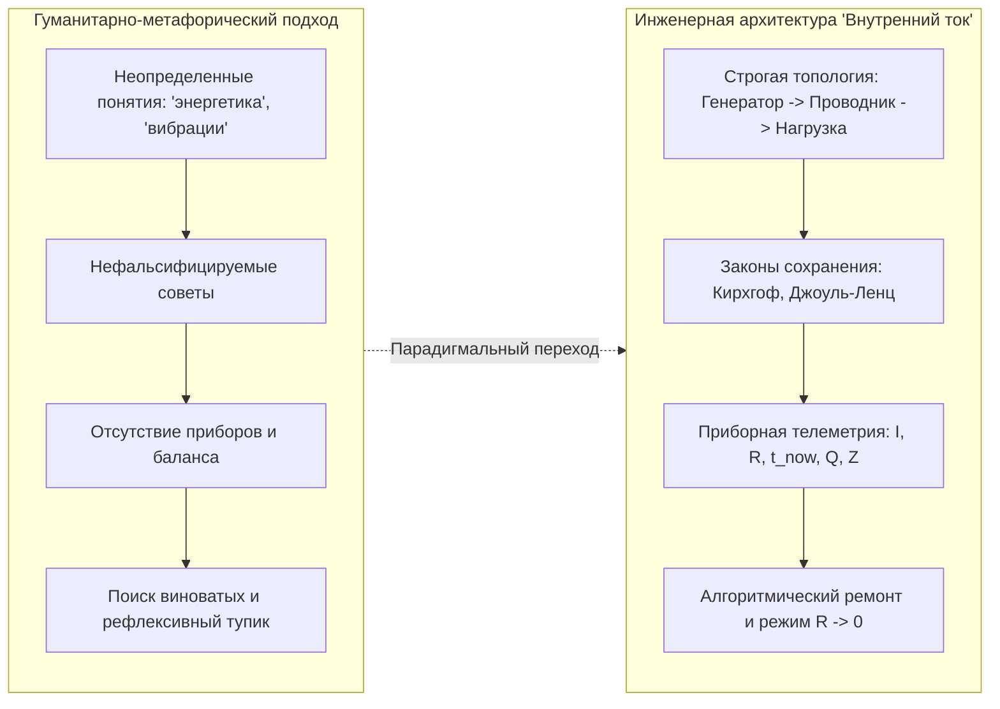
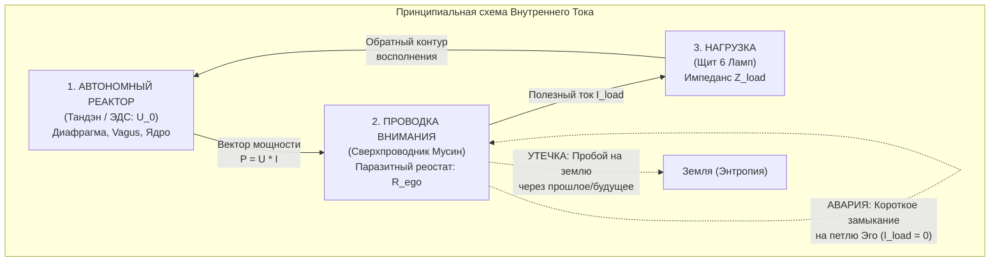
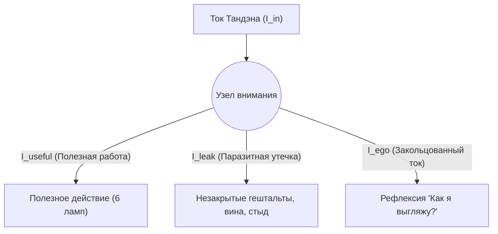
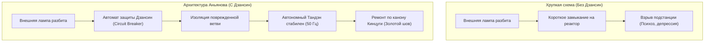
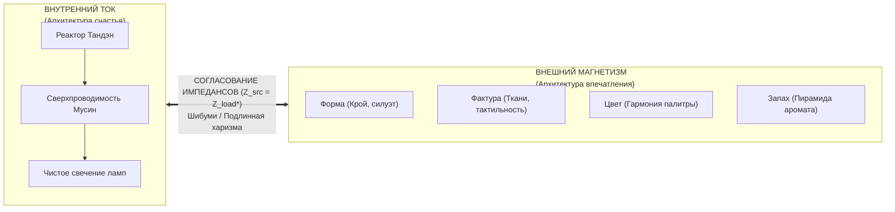

# Белая книга (Вариант 2 — Чистая инженерия): Внутренний ток — Инженерная архитектура человеческого счастья
### (Inner Current: The Pure Engineering Architecture of Human Flourishing)

**Владимир Аньянов**  
*Создатель Системы Аньянова и Архитектуры Внутреннего Тока*  
`vladimir@anyanov.org` · `https://innercurrent.org`

---

## ⚡ Аннотация (Abstract)

На протяжении тысячелетий вопрос человеческого счастья оставался заложником гуманитарной неопределенности: философских разногласий, размытых психологических метафор и религиозных догм. Традиционный подход страдает главным эпистемологическим пороком — **нефальсифицируемостью**. Если человек следует абстрактным советам («мысли позитивно», «открой сердце»), но проваливается в депрессию и эмоциональное выгорание, система перекладывает вину на него самого (*«ты недостаточно старался»*), не предоставляя инструмента локализации сбоя.

В настоящей Белой книге представлена **Архитектура Внутреннего Тока (Inner Current)** — строгая инженерная онтология и прикладная диагностическая машина, переводящая человеческое благополучие из плоскости неразрешимой экзистенциальной драмы в область **замкнутых электродинамических и термодинамических цепей**. 

В системе Аньянова счастье строго формализовано как **режим сверхпроводимости замкнутого физического контура ($R \to 0, I > 0$)**. Внутренний разлад рассматривается не как грех или дефект личности, а как измеримый аппаратный сбой: омический перегрев проводников внимания по закону Джоуля — Ленца ($Q = I^2 R t$), авария короткого замыкания на петлю Эго, утечка тока на землю через незамкнутые контуры или рассогласование импедансов нагрузки. Система предлагает полную топологию энергосистемы человека, математические уравнения баланса Кирхгофа, 30-секундный протокол аппаратной телеметрии и алгоритмы мгновенной калибровки контура.

---

## 1. Парадигмальный сдвиг: От абстрактных метафор к физике цепей

Исторический тупик наук о человеке заключается в попытке лечить физическую энергосистему абстрактными вербальными конструкциями. Психика человека не оперирует словами — она оперирует **потоками электрохимической энергии, градиентами потенциалов и распределением мощности внимания**.



### Принципы инженерной честности Системы:
1. **Бинарность состояния цепи:** Электрическая цепь либо замкнута, либо разомкнута. Ток либо течет в нагрузку, либо рассеивается в тепло. Здесь нет места самообману.
2. **Абсолютная фальсифицируемость (Критерий Поппера):** Любой сбой состояния немедленно проявляется в измеримой невязке баланса мощности ($\Delta P \ne 0$) или росте паразитного сопротивления ($R > 0$).
3. **Безобвинительный ремонт (Blameless Debugging):** Если настольная лампа перегорела или провод искрит, бессмысленно взывать к морали, винить розетку или медитировать на свет. Нужно взять мультиметр, найти точку пробоя изоляции и восстановить проводимость.

---

## 2. Фундаментальная топология цепи

Человеческая целостность описывается как **тройственный замкнутый электродинамический контур**:

$$\text{Реактор (Тандэн)} \xrightarrow{R \to 0\text{ (Мусин)}} \text{Проводка (Внимание)} \xrightarrow{Z\text{-согласование}} \text{Нагрузка (Терминалы действия)} \xrightarrow{\text{Замыкание}} \text{Контур восполнения}$$



### Узлы топологии:

### 2.1. Источник ЭДС: Автономный Реактор (Тандэн / 丹田)
* **Физический субстрат:** Нижний даньтянь (геометрический центр тяжести тела на 3 пальца ниже пупка), глубинное диафрагмальное дыхание и парасимпатический тонус блуждающего нерва (Nervus Vagus).
* **Свойство:** Генерирует первичное напряжение намерения $U_0$ автономно. Не зависит от внешнего одобрения, оценок среды, лайков или социального признания. Это неисчерпаемый источник внутреннего давления жизни.

### 2.2. Линия передачи: Проводка внимания
* **Физический субстрат:** Нейрокогнитивный вектор селективного внимания человека (Task-Positive Network / TPN vs Default Mode Network / DMN).
* **Характеристика:** В идеальном состоянии проводник обладает **нулевым сопротивлением ($R \to 0$)**. Вся мощность генератора передается в действие без потерь.

### 2.3. Потребитель: Нагрузка (Терминалы действия)
* **Физический субстрат:** Реальные физические, интеллектуальные и творческие объекты в материальном мире (написание кода, бег, создание аромата, искренний диалог, мытье чашки чая).
* **Свойство:** Нагрузка преобразует электрическую мощность цепи в полезную работу, свет и тепло созидания.

### 2.4. Закон абсолютной полярности
Энергия цепи фундаментально течет **изнутри наружу** (от реактора Тандэн через внимание в нагрузку). Попытка повернуть ток вспять — ждать, что внешний объект (автомобиль, партнер, должность, похвала) напитает внутренний реактор — является грубейшим схемотехническим нарушением. Внешние вещи — это потребители ($R_{\text{load}}$), они не содержат встроенной ЭДС ($\mathcal{E}_{\text{load}} \equiv 0$).

---

## 3. Физика присутствия и феномен сверхпроводимости

Почему пребывание в моменте «Здесь и сейчас» веками воспевалось всеми мудрецами, но никогда не объяснялось через физику? В Системе Аньянова этот феномен имеет строгое электродинамическое обоснование.

### 3.1. Закон Джоуля — Ленца в архитектуре сознания
Количество теплоты $Q$, выделяемое в проводнике при прохождении тока, определяется классическим законом:
$$Q = I^2 \cdot R \cdot t$$

```
   ВЫДЕЛЕНИЕ ПАРАЗИТНОГО ТЕПЛА (ВЫГОРАНИЕ)
   Q (Тепло)
   ▲
   │                   / Омический взрыв (Q ~ I² * R * t)
   │                  /  Тревога, паника, бессонница,
   │                 /   мышечные зажимы
   │                /
   │  ─────────────┘
   └─────────────────────────► R_ego (Паразитное сопротивление)
      R = 0 (Сверхпроводимость, Мусин: Q = 0)
```

1. **Точка физической реальности ($t = t_{\text{now}}$):** Только в текущей секунде существует физическое тело, материальные сенсоры и реальное действие. Сопротивление проводника чистому прямому действию минимально:
$$R \to 0 \implies Q \to 0$$
Когда сопротивление стремится к нулю, цепь переходит в состояние **квантовой сверхпроводимости**. В дальневосточной традиции это состояние называется **Мусин (無心 — состояние чистого потока без рефлексивного трения)**. Ток огромной силы проходит через сознание легко, не вызывая усталости.

2. **Виртуальные симуляции Времени ($t < t_{\text{now}}$ и $t > t_{\text{now}}$):**
Прошлого уже нет, будущего еще нет. Они не имеют материального субстрата и представляют собой энергозатратные когнитивные симуляции внутри дефолт-системы мозга (DMN). 
* Попытка направить ток внимания в несуществующие координаты эквивалентна попытке пустить ток через разомкнутую цепь с чудовищным паразитным импедансом:
$$R_{\text{simulation}} \to \infty \implies Q \to \text{Max}$$
* Колоссальная мощность генератора мгновенно превращается в **омический перегрев**: соматическое напряжение воротниковой зоны, стискивание челюстей, хроническое воспаление, панику и экзистенциальное выгорание.

---

## 4. Законы сохранения и схемотехника Кирхгофа

Энергосистема человека подчиняется строгим фундаментальным законам сохранения:

### 4.1. Первый закон Кирхгофа (Уравнение токов в узле)
Для любого узла распределения внимания:
$$\sum_{k=1}^{n} I_k = 0 \iff I_{\text{tanden}} = I_{\text{useful}} + I_{\text{leakage}} + I_{\text{ego}}$$



* Если человек генерирует $100\text{ Вт}$ внимания, но в полезную нагрузку попадает лишь $20\text{ Вт}$, Первый закон Кирхгофа бескомпромиссно фиксирует: **$80\text{ Вт}$ мощности утекают через паразитные контуры**.
* Никакие «духовные практики» не помогут поднять тонус, пока в контуре есть незаваренные щели: фоновое чувство вины, скрытый страх чужой оценки, невыполненные обещания себе.

### 4.2. Второй закон Кирхгофа (Баланс напряжений в замкнутом контуре)
Сумма электродвижущих сил в замкнутом контуре равна сумме падений напряжения на всех его элементах:
$$\sum \mathcal{E} = \sum I_k \cdot R_k$$
$$U_{\text{tanden}} = I \cdot R_{\text{load}} + I \cdot R_{\text{ego}} + I \cdot R_{\text{wiring}}$$

Если внутреннее трение $R_{\text{ego}}$ возрастает до небес (человек озабочен поддержанием фасадного статуса), напряжение на полезной нагрузке падает до нуля ($U_{\text{load}} \to 0$): лампочки гаснут, наступает апатия и клинический депрессивный ступор при бешено работающем на износ генераторе.

---

## 5. Распределительный щит: 6 терминалов нагрузки (Щит 6 ламп)

Энергия реактора Тандэн не должна подаваться хаотично. В архитектуре «Внутренний ток» разработан параллельный **Распределительный щит из 6 терминалов нагрузки**:

$$\mathbf{P}_{\text{load}} = \sum_{i=1}^{6} P_i = P_{\text{Тело}} + P_{\text{Дело}} + P_{\text{Семья}} + P_{\text{Творчество}} + P_{\text{Покой}} + P_{\text{Смысл}}$$

```
┌─────────────────────────────────────────────────────────────────┐
│                    РАСПРЕДЕЛИТЕЛЬНЫЙ ЩИТ 6 ЛАМП                 │
├───────────────┬─────────────────────────────┬───────────────────┤
│ Терминал      │ Назначение и физический узел│ Симптом голодания │
├───────────────┼─────────────────────────────┼───────────────────┤
│ 1. ТЕЛО       │ Сон, мышечный тонус, еда    │ Хроническая ломка │
│ 2. ДЕЛО       │ Код, архитектура, инженерия │ Потеря автономии  │
│ 3. СЕМЬЯ      │ Близкий круг, чистый контакт│ Холод отчуждения  │
│ 4. ТВОРЧЕСТВО │ Игра чистой формы, эстетика │ Удушье рутины     │
│ 5. ПОКОЙ      │ Молчание, созерцание, Кансо │ Сенсорный ожог    │
│ 6. СМЫСЛ      │ Служение масштабному целому │ Пустота и цинизм  │
└───────────────┴─────────────────────────────┴───────────────────┘
```

### Законы безаварийного распределения:
1. **Запрет монополии (Анти-перекос фаз):** Ни одна лампа не должна потреблять более $60\%$ совокупной мощности контура в течение длительного периода. Классическая авария современного жителя — **100% тока в лампу «Дело»** при обесточенных лампах «Тело» и «Покой». Результат: расплавление проводки, инфаркт миокарда или нервный срыв.
2. **Параллельная независимость:** Отказ или шторм в одном секторе (например, кризис на работе) не имеет права обесточивать остальные пять ламп. Целостность щита удерживается жесткой секционной изоляцией.

---

## 6. Защита контура и антихрупкость: Канон Дзансин (Circuit Breakers)

Любая инженерная система обязана проектироваться с учетом неизбежных внешних ударов: предательства, потери близких, банкротства, физических травм.



### 1. Автоматические выключатели Дзансин (残心 — бодрствующее присутствие)
* В момент катастрофы в нагрузке автомат защиты мгновенно отсекает аварийный участок за миллисекунды.
* Оператор удерживает осознание: *«Я — это не сгоревшая лампа. Я — реактор, который ее питал. Генератор цел, цепь восстановима»*.

### 2. Принцип Ваби-саби и Кинцуги (金継ぎ — золотой лак шрамов)
* Отказ, кризис или ошибка не маскируются и не отрицаются.
* Место излома контура заливается золотым лаком инженерного вывода: система становится прочнее в месте бывшего повреждения, чем была до аварии (принцип антихрупкости Нассима Талеба в аппаратном исполнении).

### 3. Низкий вход (Нидзиригути / 躙口)
* По канону чайного мастера Сэн-но Рикю, вход в чайную хижину имел высоту менее метра: любой самурай был обязан снять длинные мечи и вползти на коленях.
* В электродинамике это **аппаратный аттенюатор (делитель напряжения Эго)**. Входя в любое действие, оператор оставляет социальный статус, регалии и гордыню за порогом, снижая входное сопротивление до $R=0$.

---

## 7. Очищение оперативной памяти: Канон Кансо (簡素)

Инженерное совершенство достигается не тогда, когда нечего добавить, а когда нечего убрать. 

В психике человека паразитное сопротивление накапливается из-за **«стилусов»** — лишних промежуточных абстракций, нерешенных фоновых диалогов и эмоционального хлама.

```
Сырой лог памяти (Мусор)          Канон Кансо (Прунинг стейта)
┌─────────────────────────┐       ┌─────────────────────────┐
│ Обида на коллегу 2021   │  ──►  │                         │
│ Тревога о завтрашнем дне│  ──►  │ ХЭШ ВЫВОДА:             │
│ Сравнение себя с кумиром│  ──►  │ «Держать дистанцию;     │
│ Страх ошибки            │  ──►  │  фокус в коде.»         │
└─────────────────────────┘       └─────────────────────────┘
  Паразитная емкость: 100 МБ        Чистый стейт: 1 байт
```

* **Операция Кансо-сброса:** Все ментальные симуляции безжалостно подвергаются редукции. 
* Опыт архивируется в краткий вывод (хэш), а эмоциональный накал стирается. Проводка внимания остается чистой, как полированная медная шина.

---

## 8. Диагностическая машина и телеметрия контура

Теория материализуется в программно-аппаратной **Диагностической машине Внутреннего Тока**:

### 8.1. Пять базовых датчиков телеметрии
В режиме реального времени оператор опрашивает контур по 5 объективным параметрам:
1. **$I$ (Сила тока):** Плотность и собранность внимания в текущем объекте ($I > 0$).
2. **$R$ (Сопротивление):** Наличие мышечных зажимов в теле (челюсть, диафрагма, шея) и сомнений ($R \to 0$).
3. **$t$ (Координата времени):** Привязка к физическому моменту ($t = t_{\text{now}}$).
4. **$Q$ (Тепловые потери):** Наличие раздражения, злости, ментального зуда ($Q = 0$).
5. **$Z$ (Статус Дзансин):** Включен ли внутренний предохранитель принятия исходов ($\text{Status} = \text{ARMED}$).

### 8.2. Математический Индекс Счастья ($\mathcal{H}$)
Интегральный коэффициент полезного действия энергосистемы вычисляется по формуле:

$$\mathcal{H} = \left( \frac{R_{\text{load}}}{R_{\text{load}} + R_{\text{ego}}} \right) \cdot \left( 1 - \frac{Q}{Q_{\text{max}}} \right) \cdot \delta(t - t_{\text{now}})$$

где $\delta$ — дельта-функция присутствия, обращающая индекс в ноль при уходе в виртуальные координаты времени.

```
┌─────────────────────────────────────────────────────────────────┐
│                     РЕЕСТР НЕИСПРАВНОСТЕЙ КОНТУРА               │
├──────┬──────────────────────┬───────────────────────────────────┤
│ Код  │ Тип сбоя             │ Инженерное проявление             │
├──────┼──────────────────────┼───────────────────────────────────┤
│ ERR01│ Обрыв цепи           │ Апатия, прокрастинация, I = 0     │
│ ERR02│ КЗ на Эго            │ Нарциссический гнев, петля обиды  │
│ ERR03│ Омический перегрев   │ Выгорание по Джоулю-Ленцу, Q >> 0 │
│ ERR04│ Утечка на землю      │ Фоновая тревога, вина, пробой     │
│ ERR05│ Перекос фаз щита     │ Трудоголизм с разрушением тела    │
└──────┴──────────────────────┴───────────────────────────────────┘
```

### 8.3. 30-секундный протокол самокалибровки
При обнаружении любого кода ошибки оператор выполняет трехшаговый аппаратный протокол:
1. **Шаг 1 (Заземление ядра):** Медленный выдох в живот (Тандэн), физическое ощущение веса пяток на полу (сброс $R_{\text{simulation}}$).
2. **Шаг 2 (Шунтирование эго):** Полный отказ от оценки себя со стороны. Вопрос: *«Какое одно прямое действие требует реальность прямо сейчас?»* (сброс $R_{\text{ego}} \to 0$).
3. **Шаг 3 (Замыкание цепи):** Физическое совершение этого действия руками или телом (запуск рабочего тока $I > 0$).

---

## 9. Зонтичная мета-система: Внутренний ток и Внешний магнетизм

В архитектуре Владимира Аньянова «Внутренний ток» является внутренней половиной всеобъемлющей **Системы Аньянова (Anyanov System)**:



1. **Внутренний ток (Inner Current):** Создает незатухающее электромагнитное поле чистой витальной энергии внутри тела и сознания.
2. **Внешний магнетизм (External Magnetism):** Формирует идеальный внешний согласующий трансформатор для взаимодействия с социумом через 4 измерения восприятия: **Форму, Фактуру, Цвет и Запах**.
3. **Согласование импедансов ($Z_{\text{src}} = Z_{\text{load}}^*$):**
Когда внутреннее состояние оператора находится в сверхпроводимости, а внешняя форма выверена по канонам импрессионики, в системе возникает явление **электромагнитного резонанса**. Исчезает натужность, показуха и фальшь. Это состояние японская эстетика называет **Шибуми (渋味)** — неброское, благородное, абсолютное совершенство бытия.

---

## 10. Заключение (Conclusion)

«Внутренний ток» возвращает человеку его неотъемлемый суверенитет. 

Счастье — это не награда за праведность, не случайная милость фортуны и не результат бесконечных психологических раскопок. **Счастье — это естественное рабочее состояние исправной, правильно собранной и замкнутой электродинамической цепи.**

Каждый человек от рождения оснащен неисчерпаемым автономным реактором. Чтобы зажечь свои лампы ровным и несокрушимым светом, оператору не требуются посредники. Достаточно изучить схему, соблюдать законы сохранения, вовремя щелкать предохранителями и удерживать проводку своего внимания в чистом режиме сверхпроводимости.

**Цепь замкнута. Ток идет.** ⚡️

---

## 📚 Справочный аппарат и фундамент (References)

1. **Кирхгоф, Г. Р. (1845).** *О законах распределения электрических токов в разветвленных проводниках.* Annalen der Physik und Chemie, 64(4), 497–514.
2. **Джоуль, Д. П. (1841).** *О теплоте, выделяемой металлическими проводниками при прохождении электричества.* Philosophical Magazine, 19, 260.
3. **Ленц, Э. Х. (1842).** *О законах выделения тепла гальваническим током.* Записки Императорской Академии Наук.
4. **Такуан Сохо (1632).** *Фудосин Синсэцу (Записи о непоколебимой мудрости) — трактат о природе состояния Мусин.*
5. **Сэн-но Рикю (XVI в.).** *Каноны Вабитя: Чайная традиция как полигон калибровки внимания.*
6. **Поппер, К. (1934).** *Логика научного исследования (Logik der Forschung).* Springer, Vienna.
7. **Талеб, Н. Н. (2012).** *Антихрупкость: Как извлечь выгоду из хаоса.* Random House.
8. **Аньянов, В. (2026).** *Архитектура Внутреннего Тока: Теоретический базис, электродинамика присутствия и онтология счастья.* База знаний LLM Wiki.
9. **Аньянов, В. (2026).** *Система Аньянова: Зонтичная мета-система целостности — Внутренний ток и Внешний магнетизм.* База знаний LLM Wiki.
